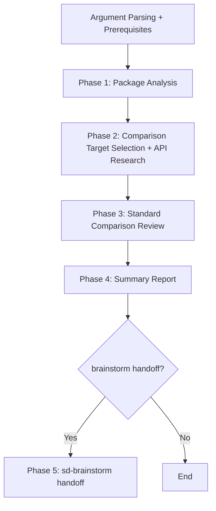

# sd-api-review

Compares a package's public API against well-known industry library conventions, produces a summary report of non-standard items, and hands off to sd-brainstorm for standard alignment design.

## Prerequisites

**Before** starting Phase 1, you must perform the following:

1. Parse the arguments:
   - First argument (required): `<package-name>` — the name of the package to review (e.g., `@simplysm/core-common`). Multiple packages can be specified by separating them with commas.
   - Second argument onward (optional): `<additional instructions>` — focusing on specific areas, specifying comparison targets, etc.
2. Argument validation:
   - If `<package-name>` is missing, confirm with `AskUserQuestion`. Do not guess and proceed.
   - If the package path cannot be found, confirm the correct path with `AskUserQuestion`.

## Overall Workflow



---

## Phase 1 — Package Analysis

### 1.1 Understand Package Structure

1. Read the package's `index.ts` (or entry point) to understand the export structure.
2. Collect all exported symbols:
   - Direct exports: `export class`, `export function`, `export type`, `export const`
   - Namespace exports: `export * as xxx from`
   - Re-exports: `export * from`, `export { xxx } from`
   - Side-effect imports: `import "./extensions/xxx"` — methods added through global prototype extensions or `declare global` blocks are also treated as public API

### 1.2 Identify Public API

Distinguish between public API and internal helpers based on the following criteria:

- **Public API**: Symbols exported directly or indirectly (via namespace) from `index.ts`
- **Internal helpers (excluded)**:
  - Symbols with `@internal` JSDoc tag
  - Symbols with `_` prefix
  - Module-internal functions not exported from index.ts

**`@internal` + namespace export conflict handling**: Symbols that have an `@internal` tag but are externally accessible through `export * as obj` are **excluded from the review**. However, they should be noted in the report's "Framework Conventions" section as "internal API exposure through namespace" to flag the encapsulation risk.

If there are any ambiguous symbols, always confirm with `AskUserQuestion`. Do not make arbitrary judgments.

### 1.3 Domain Classification

Analyze the package's main functionality and classify it into one or more of the following domains:

| Domain | Example Functionality |
|--------|----------|
| Utility | Array/object/string manipulation, type utils |
| Date/Time | DateTime, DateOnly, formatting |
| Service/RPC | Client-server communication, API calls |
| Filesystem | File read/write, path handling |
| Event | EventEmitter, event bus |
| ORM/DB | Database access, query builder |
| UI Framework | Components, state management |
| HTTP Server | Routing, middleware |
| Math | lerp, clamp, interpolation |
| Data Structures | Map/Set extensions, cache, queue, collections |
| Build Tools | Bundling, transpiling |

If the package spans multiple domains, list all applicable domains.

---

## Phase 2 — Comparison Target Selection

### 2.1 Domain Matching

Select comparison target libraries matching the domains classified in Phase 1. Use the mapping table below as the **default baseline**:

| Domain | Primary Comparison | Secondary Comparison |
|--------|---------------|---------------|
| Utility | lodash-es, Remeda | Ramda, ts-belt |
| Date/Time | Temporal API (TC39) | Luxon, Day.js |
| Service/RPC | tRPC | gRPC-web, Hono RPC |
| Filesystem | fs-extra | Node.js fs/promises |
| Event | Node.js EventEmitter | mitt, eventemitter3 |
| ORM/DB | Prisma | Drizzle, TypeORM |
| UI Framework | SolidJS (official) | React, Vue |
| HTTP Server | Fastify | Express, NestJS |
| Math | three.js MathUtils | glMatrix, Unity Mathf |
| Data Structures | ECMAScript Standard API | Immutable.js, immer |
| Build Tools | esbuild API | Vite API, webpack |

If the user specified comparison targets in `<additional instructions>`, prioritize those libraries.

### 2.2 Comparison Library API Research

**Before** starting Phase 3, research the latest APIs of the comparison target libraries. Do not rely solely on training data.

**Research methods** (in order of priority — fall back to the next method if the current one is unavailable or insufficient):

1. **context7 MCP**: Use `resolve-library-id` → `query-docs` to look up the library's latest documentation
2. **WebSearch**: Web search for the library's official API documentation
3. **WebFetch**: If the official documentation URL is known, fetch it directly

**Research scope**: Only research the comparison library APIs that functionally overlap with the target package's public API. Do not research the entire library.

**Record research results**: Internally organize the API patterns (method names, signatures, design patterns) per library for reference in Phase 3.

**Do not use unverified APIs as comparison evidence.** Only cite APIs confirmed through research. Exclude libraries from comparison if the relevant functionality was not found during research, and substitute with other confirmed libraries.

- Bad example: "lodash's `isEqual` probably works like this" (speculation)
- Good example: Citing actual API signatures confirmed from context7 or official documentation

---

## Phase 3 — Standard Comparison Review

This phase compares the target package's public API against industry conventions in 2 categories: **Naming** and **Signatures**. Other aspects (type safety, error handling, resource management) belong to the code review skill (sd-review) and are out of scope.

### 3.1 Review Categories

You must review **both** categories below. Do not skip either.

#### Category 1: Naming

- Whether function/method names accurately describe the behavior
- Whether boolean-returning functions have `is`/`has`/`can`/`should` prefixes
- Whether factory/creation methods have conventional prefixes like `create`/`from`/`of`/`parse`
- Whether immutable methods avoid names implying mutation (`set`, `add`, `remove`)
- What names comparison libraries use for the same functionality
- Whether naming is consistent within the package (same concept uses same pattern)

#### Category 2: Signatures

- Whether options objects are used when there are 3 or more parameters (math functions are exceptions — individual parameters are acceptable per domain convention)
- Whether standalone boolean parameters are avoided (the meaning of `fn(true)` is unclear at the call site)
- Whether 2 or more optional parameters are grouped into an options object
- Whether overloads are not excessive (review if 3 or more)
- Whether return type shapes match comparison library conventions (e.g., returning `T | undefined` vs throwing)
- Comparison with signature patterns from comparison libraries

### 3.2 Review Procedure

Follow the order below for each public API:

1. **Record current pattern**: Record the API's name, signature, and behavior
2. **Compare with industry conventions**: Check how comparison libraries provide the same functionality. Always specify **concrete library names and API names**
3. **Identify differences**: Identify differences between current patterns and industry conventions
4. **Suggest alternatives**: Provide concrete alternatives at the code level for non-standard items
5. **Classify severity**: Classify according to the criteria in 3.3 below

### 3.3 Severity Criteria

| Severity | Criteria | Examples |
|--------|------|------|
| **High** | Likely to cause immediate confusion or bugs for API users. Name-behavior mismatch, global pollution | Mutable method name but immutable behavior, global prototype extension, misleading naming |
| **Medium** | Increases learning cost or affects long-term maintainability. Non-standard naming, unnecessary complexity | Method names differing from industry standards, standalone boolean parameters, naming inconsistency |
| **Low** | Would be nice to improve but no major issues with current usage. Minor naming improvements, missing convenience methods | Verbose method names, missing `once` method, non-standard but understandable names |

All non-standard items must have a severity assigned. Do not report items without severity.

### 3.4 Framework Convention Handling

When discovering intentional framework design decisions (e.g., null→undefined conversion, prototype extension):

1. State the difference from industry standards
2. Label as **"Framework Convention"** to distinguish from regular non-standard items
3. Explain the trade-offs when changing (convenience vs standard compliance, breaking change scope)

- Bad example: "Prototype extension is not an industry standard, so remove it"
- Good example: "Prototype extension provides convenient chaining like `[1,2,3].distinct()`, but has trade-offs of global pollution and inability to tree-shake. Converting to standalone functions like lodash-es would enable tree-shaking, but requires changing all existing usage sites."

---

## Phase 4 — Summary Report

### 4.1 Report Format

Report results to the console in the format below. **Do not create files.**

```
## {package-name} API Review

Comparison targets: {domain}: {library1}, {library2}; ...
Non-standard items: {N} (High {H} / Medium {M} / Low {L})

If there are no non-standard items, state "No non-standard items found" and omit the table.

| Current | Recommended | Evidence | Severity |
|---------|-------------|----------|----------|
| `mapMany()` | `flatMap()` | ES2019 Array.prototype, lodash `flatMap` | High |
| `setYear()` | `withYear()` | Temporal API `with()`, Luxon `set()` | Medium |
| ... | ... | ... | ... |

### Framework Conventions
| Item | Current Behavior | Industry Standard | Trade-off |
|------|-----------------|-------------------|-----------|
| prototype extension | `[].distinct()` | standalone function | convenience vs tree-shaking |
```

**For multi-package reviews**: Repeat the format above for each package, and add the following section at the end:

```
### Cross-Package Consistency
| Concept | {PackageA} Pattern | {PackageB} Pattern | Recommended | Severity |
|---------|-------------------|-------------------|-------------|----------|
```

### 4.2 Reporting Principles

- **Exhaustive listing**: List all non-standard items without omission. Do not provide superficial summaries.
  - Bad example: "Here are 3 key differences in summary..."
  - Good example: List every non-standard API, one per line
- **State evidence**: For each item, specifically state **which library uses which pattern** in the Evidence column.
  - Bad example: "The industry uses a different name"
  - Good example: "`mapMany` → `flatMap` (Array.prototype.flatMap, lodash `flatMap`)"
- **Actionable alternatives**: The Recommended column must contain concrete code-level alternatives.
  - Bad example: "Use a better name"
  - Good example: "`withYear(year)` (Temporal API `with({ year })`)"

After reporting, proceed to Phase 5.

---

## Phase 5 — sd-brainstorm Handoff

### 5.1 Handoff Confirmation

After reporting, confirm whether to proceed with sd-brainstorm via `AskUserQuestion`.

- If the user selects **proceed** → Invoke `sd-brainstorm` via the Skill tool
- If the user selects **stop** → Finish the report and stop
- If **no non-standard items were found** → Report that no issues were found and skip the handoff prompt. Do not offer brainstorm for an empty result.

### 5.2 Handoff Args

When invoking sd-brainstorm, pass the following in the Skill tool's `args`:

```
{package-name} API standard alignment design.

Non-standard API list:
- [High] mapMany() → flatMap() (ES2019 Array.prototype)
- [Medium] setYear() → withYear() (Temporal API)
- [Low] toggle() naming (lodash)
...

Framework Conventions:
- prototype extension: convenience vs tree-shaking
...
```

Include **all** non-standard items (High, Medium, and Low) in the handoff args.

---

## Important Notes

- Do not modify code based on review results. This skill performs **analysis and reporting** only.
- This skill reviews only **Naming** and **Signatures**. Type safety, error handling, and resource management belong to the code review skill (sd-review).
- When citing comparison library APIs, use accurate library names and method names based on the latest documentation researched in Phase 2.3. Do not use APIs not confirmed through research as comparison evidence.
- When asking the user a question, always use the `AskUserQuestion` tool.
