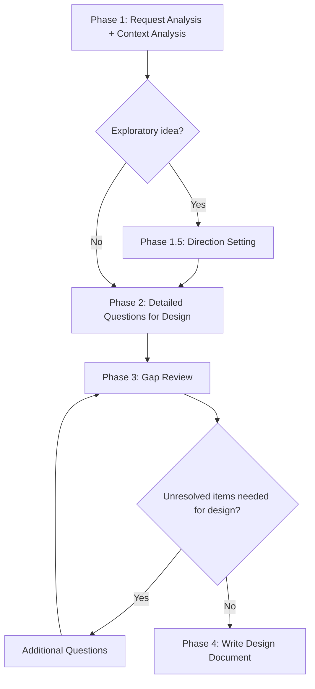

# sd-brainstorm

A skill that refines the user's idea through **detailed questions**, performs a **gap review**, and produces an accurate **design document**.

The ultimate goal is always **writing a design document**. Questions are a means to create a design document without ambiguity.

## Overall Flow

---

## Phase 1 — Request Analysis + Project Context Analysis

This Phase must be completed **before** starting Phase 2.

### 1.1 Request Analysis

Identify the design target from the user's request:

- **Topic**: What is being built or improved
- **Scope**: New feature / Existing feature improvement / Structural change
- **Request type classification**: Refer to the design document depth criteria table in Phase 4 to determine which type this request falls under (new feature addition / existing feature improvement / structural change/refactoring / exploratory idea). This classification is used for the Phase 1.5 branching and Phase 4 design document depth.

### 1.2 Context Analysis

Analyze the project context related to the request. To ask specific questions in Phase 2, the current code and structure must be understood first.

**Analysis targets:**

| Request type | Analysis target |
|-----------|-----------|
| Specific package/feature mentioned | Source, API, and dependencies of that package |
| Vague request | After understanding the overall project structure, explore code in areas that may be related to the request |
| Multiple packages involved | Core files of each package |

**Analysis depth criteria:**

| Target | Depth |
|------|------|
| Core files (main classes, type definitions) | Understand public API and main structure |
| Related files (tests, utilities) | Understand usage patterns and signatures only |
| Dependency packages | Check exported APIs only |

Internal implementation details are checked additionally when needed during Phase 2 question design. There is no need to read all code in full during Phase 1.

### 1.3 Analysis Completion Checklist

**All** items below must be satisfied for Phase 1 to be complete. If any are not met, perform additional analysis:

- [ ] Have the public APIs of core files related to the request been identified
- [ ] Can the current architecture/patterns be explained
- [ ] Is the code understood well enough to present specific options in Phase 2

Once all checklist items are met, report the analysis results to the user (3-5 sentences, including a summary of analyzed packages and key APIs). After reporting, proceed to the next Phase.

---

## Phase 1.5 — Direction Setting (only for exploratory ideas)

This Phase is performed only when the request type is classified as **exploratory idea** in Phase 1.1. For all other types, proceed directly to Phase 2.

When the user's request is at the level of "I want to improve ~" or "I want to build something" without a specific target:

1. Based on the context analysis results from Phase 1.2, propose **2-4 candidate directions**
2. Provide a brief description and expected benefits for each candidate
3. Use `AskUserQuestion` to have the user select a direction of interest
4. Reclassify the request type based on the selected direction and proceed to Phase 2

- Bad example: "What area are you interested in?" (open-ended question without options)
- Good example: "Based on the context analysis, the following directions are possible: (A) Add code generation command to sd-cli — boilerplate automation (B) Introduce build cache — incremental build speed improvement (C) Monorepo dependency visualization tool. Which direction interests you?"

---

## Phase 2 — Detailed Questions for Design

### Core Rule: One at a Time

**Ask only one question at a time.** Do not list multiple questions at once. Wait for the user's answer after each question. No exceptions.

Use `AskUserQuestion` for all questions.

### Purpose of Questions

Questions are for **confirming specific decisions that will go into the design document**. Ask about specific details that are directly reflected in the design, not abstract or conceptual questions.

- Bad example: "What area are you interested in?" (directional question — cannot be directly reflected in design)
- Bad example: "Is performance important?" (abstract — ends with Yes/No)
- Good example: "How should nested relationships in ORM results be handled? (A) Automatic flattening (B) User manually flattens with select() (C) Sheet separation"
- Good example: "Should we leverage the existing `ExcelWrapper`'s Zod schema pattern, or create a separate utility?"

### Question Area Guide

Cover the areas below in order, but only ask about areas relevant to the request type. Not all areas need to be covered — only ask about areas needed for the design document:

1. **Scope confirmation**: What to include/exclude (confirm first)
2. **Technical approach**: Architecture, API shape, technologies used
3. **Existing code integration**: How to interface with existing packages/APIs
4. **Detailed behavior**: Input/output, error handling, state management
5. **Non-functional requirements**: Performance, security, scalability (if needed)

### Question Design Principles

1. **Context-based**: Present specific options based on the code/structure analyzed in Phase 1
2. **Provide options**: Provide specific options whenever possible to help the user's judgment
3. **Design-reflectable**: Answers must be directly reflectable in a specific section of the design document
4. **Reflect previous answers**: Adjust the content and options of the next question based on answers to previous questions

### Contradiction Detection

When contradictions are found in the user's answers:

- **Do not interpret on your own** — do not make reasonable assumptions
- **Immediately confirm with the user**: Explain the contradiction specifically and request a choice

- Bad example: "A and B conflict, but interpreting reasonably, it appears to mean A"
- Good example: "'Deliver to all users immediately' and 'minimize server load' are in a trade-off relationship. Choosing A means ~, choosing B means ~. Which should take priority?"

### Phase 3 Transition Conditions

Transition to Phase 3 when **all** conditions below are met. Continue asking additional questions until conditions are met. No limit on number of questions. Never proceed to Phase 3 with insufficient information.

- [ ] Have all areas needed for the design been covered from the question area guide
- [ ] Are the answers to each question at a level that can be reflected in a specific section of the design document
- [ ] Are there no unresolved ambiguities

- Bad example: "I've asked 7 questions, so I'll proceed with the information gathered so far"
- Good example: "X and Y are still unclear. I'll confirm." → additional questions

---

## Phase 3 — Gap Review

Based on the information collected in Phase 2, systematically verify whether there are any unresolved items needed for writing the design document.

### Gap Review Checklist

Review the items below in order. Do not skip any:

- [ ] **Functional gaps**: Are there features mentioned in the requirements but not yet detailed
- [ ] **Technical gaps**: Are there undecided matters regarding implementation approach, technologies used, or architecture
- [ ] **Integration gaps**: Are there unconfirmed aspects in interfacing with existing systems/packages
- [ ] **Edge cases**: Were discussions about exceptional situations, error handling, or boundary values missed
- [ ] **Non-functional gaps**: Were non-functional requirements such as performance, security, or scalability omitted
- [ ] **Placement gaps** (monorepo): Has it been decided which package to place the new feature in (extend existing package vs. new package)
- [ ] **Contradictions between answers**: Are there conflicting items among the answers collected in Phase 2

### When Gaps Are Found

- If there are gaps → ask the user detailed questions (one at a time, applying Phase 2 rules)
- After additional questions, re-check the gap review checklist

### Gap Review Completion

Report the gap review results to the user:

> "All items needed for the design have been confirmed: [checklist results summary]. Are there any additional items you'd like to finalize?"

Confirm with `AskUserQuestion`. If the user says there are no additional items, proceed to Phase 4.

---

## Phase 4 — Write Design Document

### Document Language

The design document must be written in **English**. This includes all headings, descriptions, decision summaries, and implementation steps. Only user-facing strings (UI labels, i18n examples) may use other languages. Conversations with the user follow the system language setting, but the saved document file must be in English.

### Design Document Depth Criteria

| Request type | Depth | Included content |
|-----------|------|-----------|
| New feature addition | Detailed design | Architecture, core interfaces/types, file structure, implementation steps |
| Existing feature improvement | Change design | Current structure → post-change structure, impact scope, migration |
| Structural change/refactoring | Strategy design | Current problems, approach comparison, step-by-step execution plan |
| Exploratory idea | Concept design | Core idea, pros and cons, next step suggestions |

Apply the depth matching the request type classified in Phase 1.1. If the request spans two types, choose the more detailed one.

### Required Design Document Sections

All design documents must include the following sections:

1. **Overview**: What and why (2-3 sentences)
2. **Decision summary**: Organize major decisions confirmed in Phases 2-3 in a table
3. **Design body**: Write the detailed content corresponding to the "Included content" from the depth criteria table in this section
4. **Implementation steps**: List in order (reflecting dependencies)
5. **Open items**: Items requiring future decisions (if any)

### Design Document Location

Write as a `docs/plans/{YYYY-MM-DD}-{topic}-design.md` file. `{topic}` should be in English kebab-case (e.g., `csv-import`, `query-builder-refactor`).

### Completion Report

Report to the user after writing the design document:

1. Design document file path
2. 3-5 key decisions
3. Next step suggestions

Stop after reporting. Wait for the user's explicit instructions for additional work.
