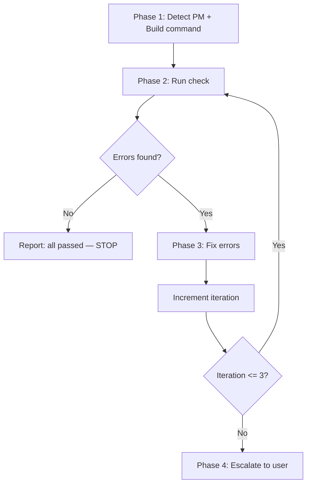

# sd-check

Runs `$PM check` to detect errors, fixes them sequentially, and re-runs until all errors are resolved or the maximum iteration count (3) is reached.

## Prerequisites

**Before** starting Phase 1, you must perform the following:

1. Read `docs/refs/code-rules.md` — apply these conventions when fixing code
2. Parse arguments from the user input:
   - `targets`: Optional space-separated paths (e.g., `packages/sd-cli packages/solid`)
   - `--type`: Optional comma-separated check types (`typecheck`, `lint`, `test`). Default: all three
3. If the user requests only a specific type (e.g., "only typecheck", "just lint"), interpret as `--type typecheck` or `--type lint` respectively

## Overall Flow



---

## Phase 1 — Setup

You **must** complete all steps before proceeding to Phase 2.

### 1.1 Detect Package Manager

Detect the package manager from lock files in the project root. Check in this order:

| Lock file | Package manager |
|-----------|-----------------|
| `pnpm-lock.yaml` | `pnpm` |
| `yarn.lock` | `yarn` |
| `package-lock.json` | `npm` |

Use Glob to check which lock file exists. If none found, ask the user via `AskUserQuestion`.

### 1.2 Build the Check Command

Construct the command based on arguments:

- **No arguments**: `$PM check`
- **Targets only**: `$PM check [targets...]`
- **Types only**: `$PM check --type [types]`
- **Both**: `$PM check [targets...] --type [types]`

### 1.3 Initialize Iteration Counter

Set `iteration = 0`. This counter tracks the fix-recheck cycle.

---

## Phase 2 — Run Check

1. Execute the check command via Bash. **Always use the unified `$PM check` command.** Never run `$PM lint`, `$PM typecheck`, or `$PM vitest` separately — the check command runs all selected types and produces a structured output.
2. Capture the full output (stdout + stderr)
3. Parse the output to identify errors by category:
   - **TYPECHECK section**: TypeScript errors with file path, line number, and error code
   - **LINT section**: ESLint errors with file path, line number, and rule name
   - **TEST section**: Test failures with test name and file path
4. If **all passed** (exit code 0, "ALL PASSED" in summary) → report success and **stop immediately**. Do not make any code changes.
5. If errors found → record the error count per category, proceed to Phase 3

### Output Format Reference

The `$PM check` output follows this structure:

```
====== TYPECHECK ======
✖ N errors, M warnings
<error details>

====== LINT ======
✖ N errors, M warnings
<error details>

====== TEST ======
✖ N failed
<error details>

====== SUMMARY ======
✖ X/Y FAILED (categories)
Total: N errors, M warnings
```

- Bad example: Running `pnpm lint` and `pnpm typecheck` as separate commands
- Good example: Running `pnpm check` once and parsing the structured output

---

## Phase 3 — Fix Errors

Fix errors in **this exact order**. Do not skip steps or reorder. Each step must be completed before the next begins.

### Step 3.1 — Lint Auto-Fix (if lint errors exist)

Run `$PM lint [targets...] --fix` to auto-fix lint violations. This must happen **before** any manual fixes.

- Bad example: Manually fixing all lint errors one by one
- Good example: Running `$PM lint --fix` first, then manually fixing only the remaining errors

### Step 3.2 — Typecheck Errors

For each typecheck error:

1. Parse the error output to extract: file path, line number, error message, error code
2. **Read the file** at the error location. Never fix without reading first.
3. Analyze the error and determine the correct fix
4. Apply the fix using the Edit tool
5. Repeat for all typecheck errors

**When fixing type mismatches** (e.g., prop renamed from `theme` to `color`):

- The **library source code** is the source of truth. Consumer code (demos, tests, apps) must follow the library API.
- Check the component's props interface to find the correct prop name before fixing.

### Step 3.3 — Remaining Lint Errors

For lint errors not resolved by `--fix` in Step 3.1:

1. Parse the remaining lint output for file path, line number, and rule name
2. Read the file and fix the violation
3. Do not add eslint-disable comments — fix the actual issue

### Step 3.4 — Test Errors

For test failures:

1. Parse the test output to identify failing test names and file paths
2. Read the failing test file and the related source files
3. Run `git diff` and `git log --oneline -5` to understand recent changes that may have caused the failure
4. Analyze the failure cause:
   - **Source code bug**: Fix the source code
   - **Test expectation mismatch**: Fix the test to match correct behavior
   - **Environment issue**: Fix the environment setup (e.g., locale, config)
5. Fix the code as appropriate

### Step 3.5 — Iteration Check

Increment the iteration counter. Verify before returning to Phase 2:

- [ ] `iteration` has been incremented
- [ ] All identified errors have been addressed (attempted fix)

If `iteration <= 3` → return to Phase 2 (re-run check to verify fixes).
If `iteration > 3` → proceed to Phase 4.

---

## Phase 4 — Escalation

When the maximum iteration count (3) is reached and errors remain:

1. Report the remaining errors with details:
   - Error count per category (typecheck / lint / test)
   - List of unresolved error messages with file paths
   - Summary of fixes attempted in each iteration
2. Ask the user for next steps via `AskUserQuestion`

---

## Constraints

These rules apply throughout all phases. No exceptions.

- **Use the unified check command**: Always `$PM check`, never individual `$PM lint` / `$PM typecheck` / `$PM vitest`. The only exception is `$PM lint --fix` in Step 3.1.
- **No band-aids**: Do not suppress errors with `@ts-ignore`, `eslint-disable`, `any` type assertions, or skipping failing tests. Fix the root cause.
- **Sequential fixing only**: Fix errors in the main context. Do not spawn parallel agents for fixing.
- **Read before fix**: Always read the file before modifying it. No exceptions.
- **No unnecessary changes**: Only modify code that directly resolves errors. Do not refactor, add comments, or improve code beyond what is needed.
- **Library is truth**: When there is a mismatch between library source and consumer code (demos, tests, apps), the library API is correct. Fix the consumer code.
