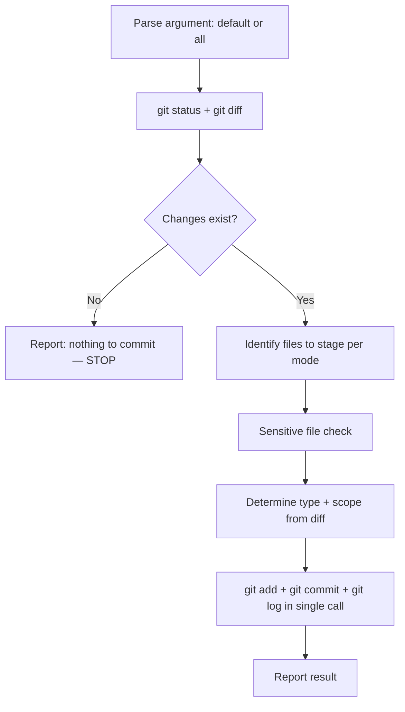

# sd-commit

Stages files and creates a single git commit in Conventional Commits format.

## Modes

- **No argument** → **Default mode**: Stage only files you created or modified during the current conversation
- **`all` argument** → **All mode**: Stage all changed and untracked files

### Mode Determination for Ambiguous Requests

| User request | Mode |
|-------------|------|
| `/sd-commit` or "commit this" (after editing files in conversation) | Default |
| `/sd-commit all` or "commit everything" or "commit all changes" | All |
| "commit current changes" (but no files edited in this conversation) | All — treat as intent to commit working tree changes |

## Execution Flow



## Steps

You **must** follow these steps in exact order. Do not skip or reorder.

### Step 1 — Check for Changes

Run `git status` and `git diff` in a single Bash call.

- Review both the file list (`git status`) and the actual diff content (`git diff`) — you need the diff to write an accurate commit message in Step 3.
- If there are **no changes** (no modified, staged, or untracked files), report "Nothing to commit" and **stop immediately**. Do not create an empty commit.

### Step 2 — Identify Files to Stage

Determine which files to stage. **Do not execute `git add` yet** — that happens in Step 4.

**Default mode** (no argument):

- Select **only** files you directly created, modified, or edited using tools during the current conversation session.
- List the specific file paths. **Never** select all files in default mode.
- If you cannot identify which files belong to the current conversation, ask the user.

**All mode** (`all` argument):

- Select all changed and untracked files (will use `git add .`).

**Sensitive file check** — verify that none of the following are in the selected files:

- `.env`, `.env.*`
- `credentials.json`, `secrets.*`
- `*.key`, `*.pem`, `*.p12`

If any are found, **exclude them** from the file list and warn the user.

### Step 3 — Determine Type and Scope

**Type** — select the single best match:

| Type | When to use |
|------|-------------|
| `feat` | New feature or functionality |
| `fix` | Bug fix |
| `refactor` | Code restructuring without behavior change |
| `docs` | Documentation only |
| `test` | Adding or modifying tests |
| `chore` | Build, config, tooling, or maintenance |
| `style` | Formatting, whitespace (no logic change) |
| `perf` | Performance improvement |

If changes span multiple types, use the **primary** type (the most significant change).

**Scope** — determine from the staged files:

| Condition | Scope |
|-----------|-------|
| All changes in one package | Package name without prefix (e.g., `core-common`, `solid`) |
| Changes in `.claude/` | `claude` |
| Changes in `docs/` | `docs` |
| Changes span multiple packages | Most affected package, or omit scope entirely |

### Step 4 — Compose Message and Commit

**Message format**: `type(scope): description`

**Description rules — all of the following must be satisfied:**

1. English only
2. Imperative mood ("add", not "added" or "adds")
3. Lowercase first letter
4. No period at the end
5. Maximum 50 characters

**Execute staging, commit, and log in a single Bash call using `&&`:**

```bash
git add <files> && git commit -m "$(cat <<'EOF'
type(scope): description

Co-Authored-By: Claude <ModelName> <noreply@anthropic.com>
EOF
)" && git log --oneline -1
```

- For **all mode**, use `git add .` instead of `<files>`.
- Replace `<ModelName>` with your current model name and version (e.g., `Opus 4.6`, `Haiku 4.5`, `Sonnet 4.6`).
- **Always** use HEREDOC format for the commit message. No exceptions.
- Chain all three commands (`git add`, `git commit`, `git log`) with `&&` to execute in a single tool call.

### Step 5 — Report

After the commit succeeds, report (all information is available from Step 4 output):

1. Commit hash (short, from `git log --oneline -1` output)
2. The full commit message
3. List of committed files

## Pre-Commit Checklist

Before executing Step 4, verify **every** item:

- [ ] `git status` confirmed changes exist
- [ ] Files staged match the correct mode (default: specific files / all: everything)
- [ ] No sensitive files (.env, credentials, keys) are staged
- [ ] Type accurately reflects the change nature
- [ ] Scope correctly identifies the affected package or area
- [ ] Description is English, imperative, lowercase, no period, ≤50 chars
- [ ] Co-Authored-By trailer included with current model name
- [ ] Commit message uses HEREDOC format
