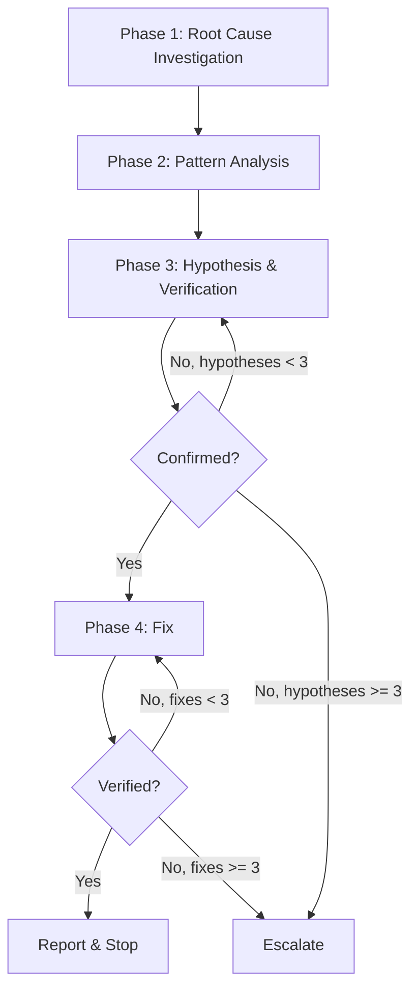

# sd-debug

A structured debugging skill based on the core principle: **"Never fix before finding the root cause."**

All debugging follows four mandatory phases in strict order. No phase may be skipped. No code may be modified before Phase 4.

## Prerequisites

**Before** starting Phase 1, you must perform the following:

1. Read `docs/refs/code-rules.md` — apply these conventions when writing fixes
2. Parse `$ARGUMENTS` as free text describing the bug (error messages, symptoms, file paths, reproduction steps)
3. If `$ARGUMENTS` is empty, ask the user via `AskUserQuestion` to describe the issue

## Overall Flow



---

## Forbidden Behaviors

These rules apply throughout **all phases**. No exceptions. Violating any of these invalidates the entire debugging session.

1. **"Fix first, investigate later"** — never modify code before completing Phase 1. Not even "quick fixes." Not even "obvious" ones.
2. **"Change random things and see what happens"** — never make multiple unrelated changes simultaneously. One change per attempt, always.
3. **"It's probably X, let me fix it"** — never skip hypothesis verification. Intuition is not evidence. Always confirm before fixing.
4. **"Check git log/status/diff to see what changed"** — only the current codebase is valid. Git history is not a debugging tool in this context.
5. **No arbitrary setTimeout/sleep** — when waiting for conditions, poll for actual condition fulfillment instead of fixed delays.
6. **No band-aids** — no `@ts-ignore`, `eslint-disable`, `any` type assertions, `catch { /* ignore */ }`, or error suppression to hide symptoms.
7. **No multi-fix shotgunning** — apply exactly one change per fix attempt. `replace_all` across many files is not "one change" — it is shotgunning.

- Bad example: "The user said 'quickly', so I'll skip investigation and fix it directly"
- Bad example: "There are 3 similar errors, so I'll fix all 3 at once with replace_all"
- Good example: "The user wants this fixed quickly, but I must complete Phase 1 first. Investigation will lead to a faster, correct fix."
- Good example: "There are 3 similar errors. I'll investigate whether they share a single root cause, then fix that one cause."

---

## Phase 1 — Root Cause Investigation

**You must complete all steps below before any code modification.** This is the most critical phase. Rushing past it causes all subsequent work to fail.

### 1.1 Problem Separation

If the input describes **multiple distinct problems**, separate them first:

1. List each distinct problem
2. Classify each by type (see bug type table below)
3. Set priority: build/typecheck errors first, then lint, then test failures, then runtime/logic, then UI/performance
4. Debug each problem through the full 4-phase cycle independently

- Bad example: "I'll fix the typecheck error and the performance issue together"
- Good example: "Two separate problems: (1) TS2322 at line 150, (2) slow rendering at 1000+ rows. I'll debug the typecheck error first through all 4 phases, then address the performance issue."

### 1.2 Error Message Analysis

Read the error message **in full**. Extract:

- File path and line number
- Error code (e.g., TS2345, ESLint rule name)
- Stack trace (if available)
- The exact values/types mentioned in the error

If the user provided a file path, verify it exists. If it does not exist, search for the correct file using Glob before proceeding.

### 1.3 Source Code Reading

Read the file and function where the error occurs. This is mandatory — never attempt to fix code you have not read.

### 1.4 Call Chain Tracing

Trace the call chain to understand context:

- **At least 1 level up**: Who calls this function/component? What arguments are passed?
- **At least 1 level down**: What does this function call? What dependencies does it have?

### 1.5 Bug Type Classification

Classify the bug using this table. The classification determines the verification strategy in Phase 4.

| Bug type | Examples | Primary verification |
|----------|----------|---------------------|
| Build/typecheck | TS errors, compilation failures | Run typecheck command |
| Lint | ESLint violations | Run lint command |
| Test failure | Failing vitest/jest tests | Run the specific test |
| Runtime error | Console errors, exceptions, crashes | Write a test or manual check |
| Logic bug | Wrong output, incorrect behavior | Write a failing test |
| UI bug | Rendering issues, layout problems | Manual verification checklist |
| Performance | Slow operations, memory leaks | Profiling or benchmarking |

### 1.6 Reproduction

Determine how to reproduce the error:

- **Build/typecheck/lint**: The check command itself reproduces it — run it to confirm
- **Test failure**: Run the specific failing test to confirm
- **Runtime/logic**: Attempt to write a minimal reproduction test
- **UI/performance**: Document reproduction steps for manual verification
- **If reproduction fails**: Do not abandon. Proceed with code analysis only, but note the limitation

### 1.7 Environment vs Code Distinction

Before concluding "the code is buggy," verify:

- Are dependencies installed? (`node_modules` exists, lock file matches)
- Is the build up to date?
- Is the correct branch/version being tested?

If the issue is environmental (missing dependencies, stale build), fix the environment first and re-verify. Do not modify source code for environment issues.

### Phase 1 Completion Checklist

**All items must be checked** before proceeding to Phase 2:

- [ ] Error message read in full (not skimmed)
- [ ] Source code at the error location read
- [ ] Call chain traced (at least 1 level up and 1 level down)
- [ ] Bug type classified
- [ ] Reproduction attempted or documented as infeasible
- [ ] Environment issues ruled out

---

## Phase 2 — Pattern Analysis

Search for similar code to compare working patterns against the broken code. Use **hierarchical search** — start narrow, expand only if needed:

### Level 1: Same File

Find similar functions, branches, or cases within the same file. Compare:

- Input/output types
- Error handling
- Control flow differences

### Level 2: Same Package

If Level 1 is insufficient, search the package using Grep/Glob for:

- Similar API usage patterns
- Same function/method calls
- Same type references

### Level 3: Project-wide

If Level 2 is insufficient, expand to the entire project:

- Similar patterns in other packages
- Usage examples of the same API

### Pattern Analysis Output

Produce a concrete list of differences between working code and broken code. This list feeds directly into hypothesis formation in Phase 3.

- Bad example: "The code looks similar to other files"
- Good example: "Working: `createSignal<string>('')` at line 20. Broken: `createSignal('')` at line 42 — missing type parameter causes inference to `string | undefined`"

---

## Phase 3 — Hypothesis & Verification

Form **one hypothesis at a time**. Never test multiple hypotheses simultaneously. Maximum 3 hypotheses before escalation.

### Hypothesis Cycle

For each hypothesis (max 3):

1. **State explicitly**: Write the hypothesis as a concrete, falsifiable statement
   - Bad example: "Something is wrong with the types"
   - Good example: "The error occurs because `processItem()` expects `number` but receives `string` from `parseInput()` which returns `string | number`"

2. **Predict**: State what you expect to observe if the hypothesis is correct
   - "If this hypothesis is correct, then changing the argument type at line 42 should resolve the TS2345 error"

3. **Verify minimally**: Design the smallest possible verification step
   - Read specific code to confirm/deny
   - Run a specific test
   - Check a specific type definition
   - **Do not modify code to verify a hypothesis** — verification is read-only

4. **Judge**: Is the hypothesis confirmed or refuted?
   - **Confirmed** → proceed to Phase 4
   - **Refuted** → form a new hypothesis (return to step 1) incorporating what was learned

### Escalation (3 hypotheses exhausted)

If 3 hypotheses are tested and none confirmed, **stop and report** to the user:

```
Investigation summary:
- Hypotheses tested: <list each with verification result>
- Current understanding: <what is known so far>
- Suggested next steps: <recommendations for the user>
```

Use `AskUserQuestion` to ask the user for additional context or direction.

---

## Phase 4 — Fix

Apply fixes based on the confirmed hypothesis. **One fix attempt at a time.** Maximum 3 fix attempts before escalation.

### Fix Cycle

For each attempt (max 3):

#### Step 1: Write a Failing Test (when possible)

| Bug type | Action |
|----------|--------|
| Testable (build, test, logic, runtime) | Write a test that reproduces the failure. Run it. Confirm it fails. |
| Not testable (UI, performance) | Create a manual verification checklist. Report it to the user. |

If a test already exists and is failing, skip writing a new one.

#### Step 2: Apply a Single, Minimal Fix

Change **only** what is necessary to address the confirmed root cause. One file, one logical change.

- Bad example: Using `replace_all` to rename a prop across 24 files in one shot
- Good example: Fixing the type definition at the source, then fixing each consumer one at a time with verification

#### Step 3: Verify

| Bug type | Verification method |
|----------|-------------------|
| Build/typecheck | Run typecheck on the affected package |
| Lint | Run lint on the affected package |
| Test failure | Run the specific test — it should now pass |
| Runtime/logic | Run the failing test written in Step 1 |
| UI/performance | Execute the manual verification checklist |

#### Step 4: Regression Check

Run related tests to ensure no regressions. If the project has a unified check command, use it on the affected package.

#### Step 5: Evaluate

- **Fix verified + no regressions** → proceed to Completion Report
- **Fix failed** → analyze why, adjust the fix (return to Step 2)
- **3 attempts exhausted** → escalate to user

---

## Completion Report

After a successful fix, report concisely:

```
Root cause: <1-sentence description>
Fix: <what was changed and where>
Verification: <how it was verified (test name / check command / manual)>
```

Stop after reporting. Do not proceed to additional work without explicit user instruction.

---

## Constraints

These rules apply across all phases:

- **Phase order is sacred**: 1 → 2 → 3 → 4. No skipping. No reordering. User urgency ("빨리", "quickly") does not override phase order.
- **Read before modify**: Never fix code you have not read. No exceptions.
- **One change at a time**: Each fix attempt is exactly one logical change. Verify after each change.
- **Escalate, don't guess**: When unsure, ask the user via `AskUserQuestion`. Never guess and proceed.
- **Current codebase only**: Do not use git history, `.back` folders, or past versions as debugging references.
