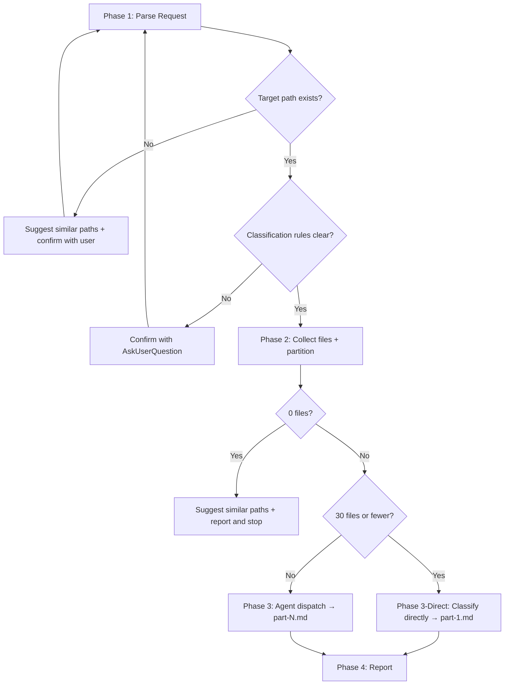

# sd-explore

A skill that classifies large codebases into caller-defined categories using parallel sub-agents.

## Prerequisites

**Before** starting Phase 1, you must:

1. Read all Phases of this skill and understand the entire workflow
2. Parse the following 2 items from the user's request:
   - **Target path/glob pattern**: which files to classify
   - **Classification rules**: categories to classify files into — one or more

## Overall Workflow



---

## Phase 1 — Parse Request

Extract the **target path** and **classification rules** from the user's request. Verify the target path first, then verify the classification rules.

### Target Path

- If a glob pattern is specified → use it as-is
- If only a directory is specified → apply the `{directory}/**/*.ts` pattern. If tsx is also needed, run a separate Glob in parallel
- For "entire project" requests → apply the `packages/**/src/**/*.ts` pattern
- If the package name is not exact → search with Glob using `packages/*{keyword}*`
  - 1 match → use that package
  - 2 or more matches → request selection via `AskUserQuestion` (also offer an "include all" option)
  - 0 matches → show the full `packages/*/` list and ask the user to select
- If not specified → confirm via `AskUserQuestion`

### Path Existence Verification

After determining the target path, you **must** verify file existence with Glob. If the path does not exist:

1. Search for similar packages with `packages/*{keyword}*`
2. If no similar packages found, retrieve the full `packages/*/` list
3. Confirm the correct path via `AskUserQuestion`
4. Do not proceed to Phase 2 until the path is confirmed

### Classification Rules

- If the user specifies explicitly → register each as a separate category. Each category has an ID and description.
- **For ambiguous requests, you must confirm via `AskUserQuestion`** — never guess and proceed.
  - Ambiguous examples: "classify this", "sort these files", "categorize the code"
  - Clear examples: "classify by logic/dx/convention/refactor", "group files by public API vs internal"
  - Bad example: "classify the code" → arbitrarily creating categories
  - Good example: "classify the code" → "What categories should I use? e.g., by role (controller/service/util), by concern (logic/dx/convention), etc."

---

## Phase 2 — Collect Files + Partition

### 2.1 File Collection

Collect target files using the Glob tool. The following directories are automatically excluded:

- `node_modules/`, `dist/`, `.tmp/`, `.worktrees/`, `.back/`

### 2.2 Pre-filtering (only for pattern search categories)

If a classification rule targets a **specific pattern** (e.g., "find @deprecated", "search for TODO/FIXME"), pre-filter with Grep:

1. Search for the target pattern using the Grep tool
2. If 0 matching files → report "No matches found across N files in search scope" and stop
3. If matching files exist → use only the matched files as subsequent classification targets

Do not apply this for categories that require reading entire files, such as structural classification or role-based grouping.

### 2.3 File Count Branching

- **0 files**: Report "No files match the given path" and suggest similar paths, then stop
- **1–30 files**: Classify directly without agents → Phase 3 Direct Classification procedure
- **31+ files**: Partition by directory → Phase 3 Agent Dispatch

### 2.4 Partition Rules (31+ files)

- Maximum files per agent: **30**
- Maximum concurrent agents: **10** (run in batches if exceeded)
- Files from the same directory are placed in the same group
- If a group exceeds 30, split into chunks of 30
- Groups with fewer than 30 are merged with adjacent directory groups

---

## Phase 3 — Classification Execution

### Output Directory Preparation

**Before** running the classification, you must generate the output directory name and create it.

Directory name format: `{YYYY-MM-DD}-{TOPIC}-{HASH}`

1. **`{YYYY-MM-DD}`**: Today's date
2. **`{TOPIC}`**: Extract from the classification rules — see **Topic Slug Rules** below
3. **`{HASH}`**: Generate a 6-digit random hex:

```bash
HASH=$(python -c "import secrets; print(secrets.token_hex(3))")
mkdir -p .tmp/explore/{YYYY-MM-DD}-{TOPIC}-${HASH}
```

Replace `{YYYY-MM-DD}` and `{TOPIC}` with actual values before execution.

#### Topic Slug Rules

- Extract 2–3 keywords from the classification rules and join with hyphens
- Must be English kebab-case regardless of the rules' language
- Examples:
  - "classify by logic/dx/convention/refactor" → `code-review-classify`
  - "group files by public API vs internal" → `public-internal-classify`
  - categories: "logic", "dx", "convention", "refactor" → `review-perspective-classify`

### Direct Classification (30 or fewer)

Classify directly without creating agents:

1. Read all files using the Read tool (in parallel where possible)
2. Classify each file into the given categories based on the classification rules (see **Classification Criteria** below)
3. Write the results to `.tmp/explore/{DATE}-{TOPIC}-{HASH}/part-1.md` following the **Output Format** section below
4. Proceed to Phase 4

### Agent Dispatch (31+)

- Create all agents **in parallel within a single message**. Never execute sequentially.
  - Bad example: Agent 1 completes → create Agent 2 → ...
  - Good example: Include all Agent tool calls in a single message for simultaneous creation
- Use the Agent tool. Do not use `isolation: "worktree"` (this is a read-only task).
- Each agent reads **only** its assigned files. Do not exceed the scope.

#### Agent Prompt

Pass the following prompt to each agent. Replace `{variables}` with actual values:

```
You are a file classification agent. Read the assigned files and classify them into the given categories.

## Assigned Files (read only these files)
{file list — absolute paths, one per line}

## Classification Rules
{category list — each category's ID and description}

## Procedure
1. Read all assigned files using the Read tool (in parallel where possible)
2. For each file, determine which categories it belongs to based on the classification rules
3. Write the results in the format below to `{output file path}` using the Write tool

## Output Format (you must follow this format exactly)

```markdown
# Part {N} Classification Results

## {categoryId}
- `{file relative path}` — {one-line reason for category membership}

## {next categoryId}
- `{file relative path}` — {one-line reason}
```

## Classification Criteria
- A file may belong to multiple categories
- Only include files that clearly match a category — do not force-fit
- Files matching no category are omitted entirely
- Categories with no matching files are omitted
- Reasons must be concrete and brief — not "general utility" but "object helpers: clone, equal, merge"

## Rules
- Never read files outside the assigned list
- Do not modify code — only read and write results
- Keep reasons to one line — classification depth, not analysis depth
```

---

## Phase 4 — Report

After all classifications are complete, report the following to the caller:

1. **Classification scale**: total file count, agent count
2. **Result file paths**: list of `.tmp/explore/{DATE}-{TOPIC}-{HASH}/part-{N}.md`

Stop after reporting. Wait for explicit instructions from the user before performing any additional work.

---

## Classification Criteria

Both direct classification and agent prompts apply these criteria:

- A file may belong to **multiple categories** — duplicate classification is allowed
- Only include files that **clearly match** a category — do not force-fit
- Files matching **no category** are omitted entirely — do not record them
- Categories with **no matching files** in a part are omitted
- Reasons must be **concrete and brief** — not "general utility" but "object helpers: clone, equal, merge"

---

## Output Format

Both direct classification and agent prompts follow this format. The same format is included in the agent prompt.

```markdown
# Part {N} Classification Results

## {categoryId}
- `{file relative path}` — {one-line reason for category membership}
- `{file relative path}` — {one-line reason}

## {next categoryId}
- `{file relative path}` — {one-line reason}
```

- Group by category, and list matching files under each category
- A file may appear under multiple categories
- Do not record files matching no category — omit them
- Reasons must be concrete — not "general utility" but "object helpers: clone, equal, merge"

---

## Notes

- This skill is a **read-only** classification skill. It does not modify source code. It only creates files in `.tmp/explore/`.
- Sub-agents read only their assigned files — exceeding scope is not allowed.
- All results are written to disk in markdown format — do not end with only a text report.
- Classification reasons must be **concrete**. Not abstract descriptions like "general utility file", but descriptions that include actual function names/class names/patterns.
