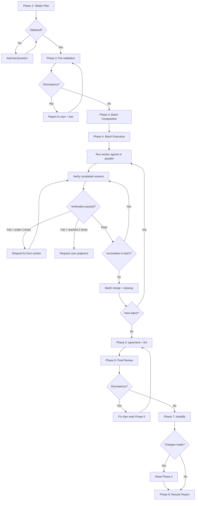

# sd-plan-dev

An orchestration skill that performs **batch-based parallel agent development** based on a plan document (sd-plan output).

## Prerequisites

Before starting Phase 1, you **must** perform the following:

1. Identify the plan source from the arguments (see Phase 1 below)

## Overall Flow



---

## Phase 1 — Obtain Plan

Obtain the plan document according to the following priority. If a higher-priority source exists, do not check lower ones:

1. **User arguments**: File path provided directly when invoking the skill
2. **Conversation context**: Plan document generated by sd-plan in the same conversation
3. **Ask**: If neither of the above sources exists, ask for the plan file path using `AskUserQuestion`

**Never start development without a plan document.** Do not arbitrarily guess and select from `docs/plans/`.

- Bad example: "I'll find and execute the most recent plan from docs/plans/"
- Good example: "No plan document was provided. Please provide the plan file path."

### Design Document Check

If the plan document specifies a design document path, read the design document as well. It will be used in Phase 6 Final Review.

---

## Phase 2 — Pre-validation

Cross-validate **all references** in the plan document against the actual project. This **must** be completed **before writing any code**.

### Validation Checklist

Check **all** of the following. Do not skip any:

- [ ] Do all files that the plan intends to **modify** actually exist?
- [ ] Do the referenced packages (`packages/{name}`) exist?
- [ ] Are the referenced APIs/types/functions actually exported?
- [ ] Do test file locations match the existing project's test directory patterns?
- [ ] Are the plan's features not already implemented in the existing code? (duplication check)

### Distinguishing New Creation vs Existing References

- **"create", "add", "make new"** → Non-existence is normal (not a discrepancy)
- **"modify", "use", "reference", "existing"** → Must exist

### When Discrepancies Are Found

**Do not resolve or work around discrepancies yourself. Never proceed with implementation while discrepancies exist.** Compile all discrepancies into a list, report them to the user, and ask for direction using `AskUserQuestion`.

- Bad example: "`packages/utils` doesn't exist, so I'll create it"
- Bad example: "`clamp` function doesn't exist, so I'll add it as well"
- Bad example: "This is for testing purposes, so I'll ignore the discrepancy and proceed"
- Good example: "I found the following discrepancies in the plan: (1) ... (2) ... How should I handle these?"

### Already Implemented Plan

If all changes in the plan are already reflected in the code, report this to the user and confirm whether to proceed using `AskUserQuestion`. Do not re-execute an already implemented plan.

**Proceed to Phase 3 only after all discrepancies have been resolved.**

---

## Phase 3 — Dependency Analysis and Batch Composition

### 3.1 Dependency Analysis

Iterate through all Tasks in the plan and identify dependency relationships:

1. **Explicit dependencies**: Relationships explicitly stated in the plan such as "depends on Task X", "after X is complete"
2. **Implicit dependencies**: Relationships where Task B imports files/APIs created by Task A

### 3.2 Batch Composition

Group Tasks into Batch units based on the dependency graph:

- **Batch 1**: All Tasks with no preceding dependencies
- **Batch 2**: Tasks that depend only on Batch 1 Tasks
- **Batch N**: Tasks that depend only on Tasks from Batches 1 through (N-1)

### 3.3 Batch Plan Report

Report the batch composition results to the user:

```
Batch 1 (parallel): Task 1, Task 2
Batch 2 (parallel): Task 3 (→Task 2), Task 4 (→Task 1)
Batch 3: Task 5 (→Task 1-4)
```

Proceed immediately to Phase 4 after reporting (no separate approval needed).

---

## Phase 4 — Batch Execution

Process each Batch in order. **Start the next Batch only after all Tasks in the previous Batch have been verified and merged.**

### 4.1 Worker Agent Execution

If there is **1 Task** in the Batch, the orchestrator implements it directly without creating a separate worker agent (without worktree). This is to avoid agent creation overhead.

If there are **2 or more Tasks** in the Batch, use the Agent tool to create worker agents **in parallel**. **Do not use `isolation: "worktree"`** — each agent manages its own using `sd-worktree.py`.

- Bad example: Running agents one by one sequentially
- Good example: Creating all agents simultaneously in a single message

### 4.2 Worker Agent Prompt

Replace `{root}`, `{task-number}`, and `{Task content}` with actual values:

````
You are a worker agent. Implement the following Task using TDD.

## Environment Setup (must run first)
```
cd {root}
python .claude/scripts/sd-worktree.py add plan-dev-{task-number}
```
Parse the worktree path and name from the last line of the output.
Format: `Worktree created: {worktree_dir} (branch: {name})`

Then:
```
cd {parsed worktree absolute path}
rm -rf .claude && cp -r {root}/.claude ./.claude
```

## Coding Rules
Read `.claude/rules/sd-refs-linker.md` and follow its instructions to read relevant reference documents.
Check and follow the project's existing code patterns (file locations, naming, #region structure, export style).

## Task
{Task content}

## TDD Order (must follow)
1. Write tests
2. Run tests — confirm failure
3. Implement
4. Run tests — confirm pass

## Plan Adherence
Implement only what is specified in the plan. Do not add extra features, extra tests, or change file locations.
If references in the plan (files, APIs, packages) do not exist, report them instead of creating them arbitrarily.

## After Completion
After completing the work, commit the changes within the worktree.

## Report (must use this format)

### Worktree Info
- Path: {worktree absolute path}
- Branch: {branch name}

### Changed Files
(File paths and change type: new/modified)

### Test Results
(Number of tests, pass/fail)

### Deviations from Plan
(Parts implemented differently. If none, "None")

## Note: Do not delete or merge the worktree
The orchestrator will merge and delete after verification.
````

### 4.3 Verification

As each worker agent completes, **immediately** run the following 2 verification agents **in parallel**:

#### Plan Cross-validation Agent

````
You are a plan cross-validation agent.

## Relevant Task from the Plan
{Task content}

## Worker's Report
{Worker agent's report content}

## Verification
Read the changed files in worktree `{worktree path}` and verify the following:

- [ ] Are all Todos from the plan implemented?
- [ ] Are there no additional changes not in the plan?
- [ ] Do file paths match the plan?
- [ ] Do tests accurately verify the plan's requirements?

## Results Report
- **Verdict**: OK or FAIL
- **Issue List** (if FAIL): Specific issues and suggested fixes
````

#### Code Quality Verification Agent

````
You are a code quality verification agent.

## Verification
Read the changed files in worktree `{worktree path}` and verify the following:

- [ ] Are there no logic bugs? (boundary values, null handling, type safety)
- [ ] Do tests make meaningful assertions? (verifying actual behavior, not mock behavior)
- [ ] Does the code follow project code conventions? (read `.claude/rules/sd-refs-linker.md` for reference documents)
- [ ] Is there no unnecessary code? (dead code, unused imports)

## Results Report
- **Verdict**: OK or FAIL
- **Issue List** (if FAIL): File name, line, specific issue, suggested fix
````

### 4.4 Verification Result Handling

- **Both verifications OK** → Task verification passed
- **Any FAIL** → **Resume** the worker agent to request fixes. Re-verify after fixes
  - Fix-verify iterations are limited to **2 times max**. If still failing after 2 times, ask the user for judgment using `AskUserQuestion`
  - When resuming, provide: Failed verification items + specific fix instructions

### 4.5 Batch Merge

After **all** Tasks in the Batch have passed verification:

1. Merge and clean up each worker's branch in order:
   ```
   cd {root}
   python .claude/scripts/sd-worktree.py merge {branch name}
   python .claude/scripts/sd-worktree.py remove {branch name}
   ```
2. If merge conflicts occur, resolve them manually to include all changes and commit. If conflicts in shared files (e.g., `index.ts`) are expected, it is recommended to separate those file modifications into an integration Task in the last Batch
3. If there is a next Batch, return to Phase 4.1

---

## Phase 5 — typecheck + lint

Run after all Batch merges are complete:

```
pnpm typecheck {relevant package path}
pnpm lint {relevant package path} --fix
```

If there are errors, fix them directly. Run again after fixing to confirm they pass.

---

## Phase 6 — Final Review

Re-read the plan document (and design document if one exists) and cross-validate by analyzing `git diff`.

### Verification Checklist

- [ ] Are all Tasks/Todos from the plan reflected in the implementation?
- [ ] Are the design document's requirements implemented without omissions?
- [ ] Are there no unnecessary changes not in the plan?

If discrepancies are found, fix them directly and redo from Phase 5 (typecheck + lint).

---

## Phase 7 — /simplify

Run the `simplify` skill using the Skill tool to tidy up the code. If the `simplify` skill is unavailable, directly review the changed code to clean up unnecessary duplication, unused imports, and convention violations.

If changes are made, redo Phase 5 (typecheck + lint).

---

## Phase 8 — Results Report

Report the following to the user:

1. **Execution Summary**: Total number of Batches, Tasks, and verification iterations
2. **Changed Files List**: All changed files and change types (new/modified)
3. **Test Results**: Total number of tests, pass/fail
4. **Verification Results**: Verification pass status for each Task
5. **Remaining Issues** (if any): Unresolved problems

Stop after reporting. Wait for explicit instructions from the user for additional work.
