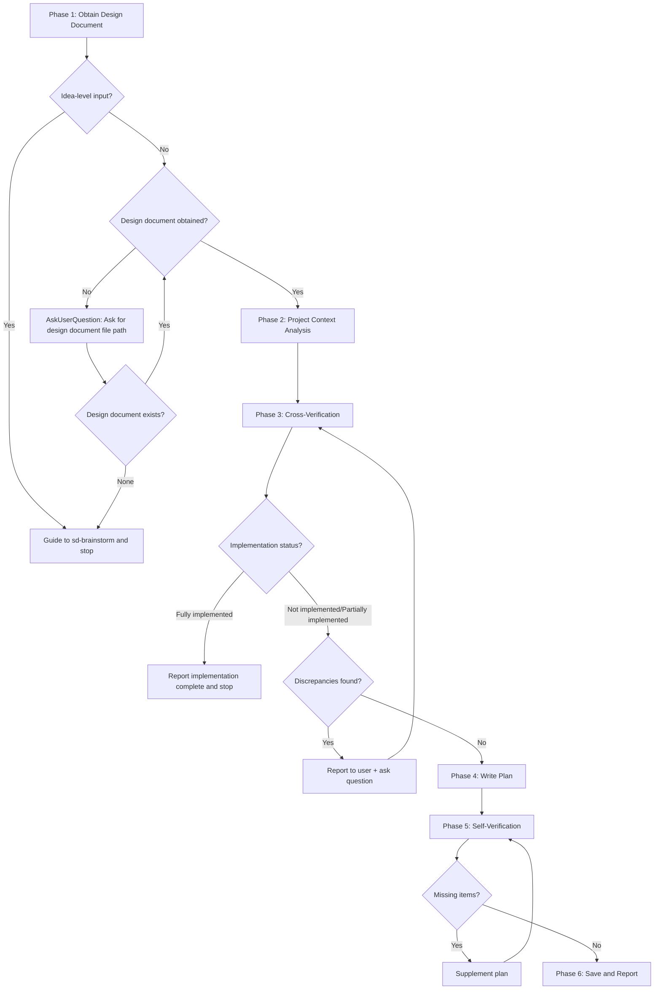

# sd-plan

A skill that creates a **TDD-based implementation plan** based on a design document.

The plan is broken down into `Phase > Task > Todo`, and each Task follows the TDD cycle. Following the YAGNI principle, only what is specified in the design document is planned.

## Prerequisites

**Before** starting Phase 1, the following must be performed:

1. Identify the design document source from the arguments (see Phase 1 below)

## Overall Flow



---

## Phase 1 — Obtain Design Document

If the input is clearly at the idea level (only feature requests without overview/decisions/implementation steps), guide the user to use `/sd-brainstorm` immediately without going through the questioning stage and **stop**.

Obtain the design document according to the following priority. If a higher-priority source exists, do not check lower ones:

1. **User arguments**: Design document text or file path provided directly by the user when invoking the skill
2. **Conversation context**: Design document generated by sd-brainstorm in the same conversation (sd-brainstorm saves to `docs/plans/{date}-{topic}-design.md`)
3. **Question**: If neither of the above sources exists, ask for the design document file path using `AskUserQuestion`. If the user replies that there is no design document, guide them to use `/sd-brainstorm` and **stop**.

**Never write a plan without a design document.** Ambiguous requests or idea-level inputs are not considered design documents. A design document must contain at minimum an **overview**, **decisions** (or change plan), and **implementation steps** (or scope of impact).

- Bad example: "Add date range feature" → Write plan directly
- Good example: "Add date range feature" → "A design document is required. Would you like to create one first with `/sd-brainstorm`?"

---

## Phase 2 — Project Context Analysis

Verify all files, packages, APIs, and types mentioned in the design document against the project. This is a preliminary investigation for the cross-verification in Phase 3.

### 2.1 Analysis Targets

| Target | What to Check |
|--------|---------------|
| File/directory paths | Whether they actually exist, current contents |
| Packages | Whether they exist, dependency relationships, build target |
| APIs/types/functions | Signatures, current implementation status |
| Test files | Whether existing tests exist, test project/framework |
| Existing implementation | Whether the design document's features already exist under different names/locations |

### 2.2 Analysis Checklist

Proceed to Phase 3 only after checking **all** of the following. If any item is incomplete, perform additional analysis:

- [ ] Have all file paths mentioned in the design document been verified with Glob/Read
- [ ] Have the existing code patterns (naming, export style, class vs function) of related packages been identified
- [ ] Has the test environment (test project, framework, test file location rules) been verified
- [ ] Has it been confirmed that the design document's features are not already implemented

---

## Phase 3 — Cross-Verification

Compare the design document contents with the actual project structure. Verify the following items **in order**. Do not skip any:

- [ ] **File path match**: Do the design document's file paths match the project's actual paths/naming conventions
- [ ] **Package existence**: Do the packages referenced by the design document exist in the project
- [ ] **API existence**: Do the external APIs/types/functions the design document intends to use actually exist
- [ ] **Scope accuracy**: Does the scope of impact stated in the design document (call sites, etc.) match actual code search results
- [ ] **Existing implementation overlap**: Do the design document's features not already exist under different names/locations

### Distinguishing New Creation vs Existing Reference

Files/packages described as **"create", "add", "newly make"** in the design document are expected to not exist, so do not report them as discrepancies. On the other hand, items described as **"use", "reference", "utilize"** must exist, and should be reported as discrepancies if they do not.

- Bad example: "The design document says to create `packages/excel/src/CsvUtil.ts` but the file doesn't exist" (it's expected to not exist since it's being created)
- Good example: "The design document says to `use StreamUtil from core-common`, but `StreamUtil` does not exist in core-common"

### When Discrepancies Are Found

**Do not resolve or work around discrepancies directly.** Compile all discovered discrepancies into a list, report them to the user, and ask for direction using `AskUserQuestion`.

- Bad example: "The design document says `ObjectUtil.ts` but the actual file is `obj.ts`, so I'll write the plan using `obj.ts`"
- Bad example: "The `csv-parser` package doesn't exist, so I'll add a plan to create it"
- Good example: "The following discrepancies were found between the design document and the actual code: (1) ... (2) ... How should these be handled?"

**Proceed to Phase 4 only after all discrepancies have been resolved.**

### Already Fully Implemented

If cross-verification reveals that **all items in the design document are already implemented**, report the implementation-complete status to the user and **stop**. Do not write an unnecessary plan.

**If partially implemented**, write the plan in Phase 4 targeting only unimplemented items. Exclude implemented items from the plan, report the partial implementation status to the user, and proceed.

- Bad example: "All 6 items in the design document are already applied, but I'll write the plan anyway"
- Good example: "All 6 items in the design document are already implemented. Writing a plan is unnecessary."

---

## Phase 4 — Write Plan

### Document Language

The plan document must be written in **English**. This includes all headings, task descriptions, todo items, and code comments. Only user-facing strings (UI labels, i18n examples) may use other languages. Conversations with the user follow the system language setting, but the saved document file must be in English.

### 4.1 Structure: Phase > Task > Todo

The plan must be written in the following 3-level hierarchy:

- **Phase**: A group of logically related Tasks. Arranged in dependency order.
- **Task**: A unit of work constituting one TDD cycle. Corresponds to one feature or change. Task numbers are sequential across the entire plan (not reset per Phase).
- **Todo**: Specific action items within a Task. Listed in execution order.

### 4.2 TDD Cycle

**All Tasks follow the applicable TDD cycle type below.** No exceptions.

#### Type A: New Feature

```
Task N: {Feature description}

  Todo 1: Write failing test
    - Test file: {path}
    - Test code:
      ```typescript
      // Core test code
      ```

  Todo 2: Run test — verify failure
    - Command: {test run command}
    - Expected failure reason: {compilation error or assertion failure, etc.}

  Todo 3: Implement
    - Implementation file: {path}
    - Implementation code:
      ```typescript
      // Core implementation code
      ```

  Todo 4: Run test — verify pass
    - Command: {test run command}
```

#### Type B: Refactoring

```
Task N: {Refactoring description}

  Todo 1: Verify existing tests pass
    - Command: {test run command}

  Todo 2: Perform refactoring
    - Changed file: {path}
    - Changed code:
      ```typescript
      // Before → After core code
      ```

  Todo 3: Re-run existing tests — verify pass
    - Command: {test run command}

  Todo 4: Write additional tests (if needed)
    - Test code:
      ```typescript
      // Tests for functionality separated/added by refactoring
      ```
```

#### Type C: Migration/Call Site Changes

```
Task N: {Migration description}

  Todo 1: Change call sites
    - Target files: {path list}
    - Change pattern:
      ```typescript
      // Before: oldApi(...)
      // After:  newApi(...)
      ```

  Todo 2: Run full tests/typecheck — verify pass
    - Command: {test + typecheck command}
```

#### Type D: Documentation/Configuration Editing

Used when the target is not a code file (markdown, configuration files, etc.).

```
Task N: {Change description}

  Todo 1: Perform change
    - Target file: {path}
    - Change content:
      ```diff
      - Before
      + After
      ```

  Todo 2: Verify
    - Confirm change matches the design document
```

### 4.3 Code Inclusion Criteria

Each Task must include the following code:

- **Test code**: Actual code for core test cases (executable code, not descriptions)
- **Implementation code**: Actual code for core implementation (method signature + body)
- **Import statements**: Import statements for required dependencies

Repetitive/secondary code (similar test cases, boilerplate) may be replaced with descriptions.

However, Type D (documentation/configuration editing) includes before/after diffs instead of test code and import statements.

- Bad example: "Implement the toPascalCase method" (no code)
- Good example: Includes actual method signature and core logic code

### 4.4 YAGNI Compliance

**Only plan what is specified in the design document.** Do not add features, options, or parameters not in the design document.

If additional features are deemed necessary, do not include them in the plan — record them in the **Open Items** section.

- Bad example: The design document only has CSV export, but "I'll include a custom header mapping option since it would be nice"
- Good example: Plan only the features specified in the design document, and record "custom header mapping for future consideration" in open items

### 4.5 Plan Header

The top of the plan file must include the following metadata:

```markdown
# {Title} Implementation Plan

**Goal:** {Design document overview summary — 1-2 sentences}

**Architecture:** {Technical approach summary — 1-2 sentences}

**Tech Stack:** {List of technologies used}

---
```

---

## Phase 5 — Self-Verification

After writing the plan, check **all** of the following checklist items. If any fail, revise the plan:

- [ ] **Design document completeness**: Does every requirement/decision/implementation step in the design document map to a specific Task in the plan
- [ ] **TDD completeness**: Does every Task include test code and implementation code
- [ ] **Phase ordering**: Are the dependencies between Phases correct (a later Phase cannot be executed without completing the preceding Phase)
- [ ] **YAGNI compliance**: Are there no features in the plan that are not in the design document
- [ ] **Code inclusion**: Does each Task actually include core test code and implementation code
- [ ] **File paths**: Are all file paths in the plan paths verified in Phase 3

### Design Document Mapping Table

During self-verification, create a mapping table in the following format to check for omissions:

| Design Document Item | Plan Location (Phase/Task) | Status |
|---------------------|---------------------------|--------|
| {Each item from the design document} | Phase N > Task M | ✅/❌ |

**Proceed to Phase 6 only when all items are ✅.** If there are ❌ items, supplement the plan and verify again.

---

## Phase 6 — Save and Report

### Save

Save the plan to `docs/plans/{YYYY-MM-DD}-{topic}-plan.md`. Write `{topic}` as the design document's subject in English kebab-case.

Before saving, check whether an existing plan for the same topic exists in the `docs/plans/` directory. If an existing plan is found, ask for direction using `AskUserQuestion` (create new / replace existing / abort).

### Report

Report the following to the user:

1. **Plan file path**
2. **Plan summary**: Number of Phases/Tasks, total test case count
3. **Design document mapping table**: Design document items ↔ Plan locations (table created in Phase 5)
4. **Open items** (if any)

Stop after reporting. Wait for the user's explicit instructions for additional work.
