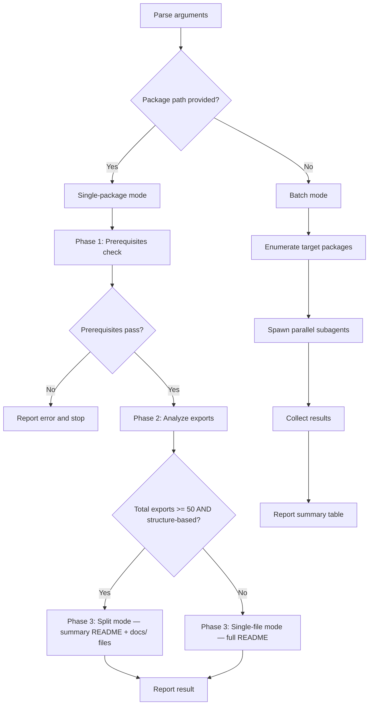

# sd-readme

Generates README.md files as LLM-readable API documentation by analyzing source code barrel exports. Supports single-package and batch modes.

## Overall Flow



---

## Single-Package Mode

Triggered when a package path argument is provided (e.g., `/sd-readme packages/solid`).

### Phase 1 — Prerequisites Check

You must verify **all** items before proceeding. If any fail, report the error and **stop immediately**.

- [ ] Target directory exists
- [ ] `package.json` exists in the target directory
- [ ] Entry point exists — resolve in this order:
  1. `src/index.ts` (barrel export) → use as single entry point
  2. If not found, parse `package.json` `exports` field → each entry (e.g., `"./eslint-plugin": "./src/eslint-plugin.ts"`) becomes a separate entry point
  3. If neither exists → report error and stop

- Bad example: "index.ts not found, I'll scan all .ts files instead"
- Good example: "packages/xyz has no src/index.ts and no exports field. Cannot generate README."

### Phase 2 — Analyze Exports

1. Read entry point file(s) to identify all export paths
2. Follow each re-export to its source file (e.g., `export * from "./SomeClass"` → read `src/SomeClass.ts`)
3. For each exported item, collect:

| Field | Description |
|-------|-------------|
| **Kind** | function, class, type, interface, enum, constant, namespace |
| **Name** | Exported identifier |
| **Signature** | TypeScript signature (see Signature Style below) |
| **Description** | From JSDoc if present; otherwise infer from name and code |
| **Category** | Determined by category mode (see below) |

**Namespace exports** (`export * as obj from "./utils/obj"`): Read the namespace source file and document each function within it as a sub-table under the namespace name.

**Analysis scope rule**: Only document items reachable through entry point exports. Internal helpers, private methods, and non-exported items must be excluded.

- Bad example: Including `_internalHelper()` because it exists in a source file
- Good example: Only documenting what the entry point re-exports

#### Category Mode Detection

Determine the category mode by inspecting the entry point file:

- **Structure-based mode**: If the entry point contains `//#region` blocks or at least two consecutive comment-header + export groups (e.g., `// Form Control` followed by exports), use the structural comments as category names.
- **Kind-based mode** (fallback): If the entry point has no structural comments (plain `export * from` lines only), group by kind (Functions, Classes, Types, etc.).

- Bad example: Always using kind-based mode regardless of entry point structure
- Good example: Detecting `//#region Form Control` in `index.ts` and creating a "Form Control" category section

#### Split Mode Detection

After collecting all exports, determine whether to use **split mode**:

- **Split mode** activates when **both** conditions are true:
  1. Total export count >= 50
  2. Category mode is structure-based
- Otherwise, use **single-file mode** (current behavior)
- Kind-based mode always uses single-file mode regardless of export count

#### Signature Style

Signatures must be **readable in a markdown table cell**. Apply these rules:

1. Include parameter names, types, and return type
2. **Simplify complex generics**: Replace deep generic chains with descriptive names (e.g., `Record<string, unknown>` instead of `Record<string, T extends U ? V : W>`)
3. Use inline code formatting: `` `functionName(param: Type): ReturnType` ``
4. For class methods, include the method name only (not the class prefix)
5. Optional parameters: show with `?` suffix
6. **Properties**: Use the type as the signature (e.g., `` `string` ``, `` `ExcelWorksheet[]` ``)

- Bad example: `merge<S extends Record<string, unknown>, T extends Record<string, unknown>>(source: S, target: T, options?: DeepPartial<MergeOptions<S & T>>): S & T`
- Good example: `merge(source, target, options?): merged object`

### Phase 3 — Generate README.md

Generate the complete README.md using the **exact template** below. Write to `{package-path}/README.md`. Always overwrite the existing file — never merge or diff.

#### README Template

The template varies by category mode. The header and footer are always the same:

```markdown
# @simplysm/{package-name}

{One-line description from package.json.}

## Installation

\`\`\`bash
npm install @simplysm/{package-name}
\`\`\`

## API Reference

{Category sections — see mode-specific templates below}
```

##### Structure-Based Mode Template

Use category names from the entry point's structural comments. Each category gets a unified table:

```markdown
### {CategoryName}

| Name | Kind | Signature | Description |
|------|------|-----------|-------------|
| {name} | {kind} | `{signature}` | {description} |
```

- **Kind column values**: `function`, `component`, `class`, `type`, `interface`, `enum`, `constant`, `hook`, `directive`, `context`, `style`
- For classes within a category, add a detail sub-section:

```markdown
#### {ClassName}

| Member | Signature | Description |
|--------|-----------|-------------|
| constructor | `new ClassName(args)` | description |
| static create | `create(opts): ClassName` | description |
| readonly name | `string` | description |
| getValue | `getValue(): Promise<T>` | description |
```

**Member prefix rules**:

| Prefix | Meaning |
|--------|---------|
| `constructor` | Constructor |
| `static` | Static method |
| `readonly` | Read-only property |
| *(none)* | Instance method |

##### Split Mode Template (Structure-Based, 50+ Exports)

When split mode is active, README.md contains only a category summary table. Detailed API documentation goes into per-category files under `{package-path}/docs/`.

**Step 1 — Clean up `docs/` directory**: Before generating, delete all `.md` files in `{package-path}/docs/` (if the directory exists). This prevents orphaned files from previous runs.

**Step 2 — Generate README.md** (summary only):

```markdown
# @simplysm/{package-name}

{One-line description from package.json.}

## Installation

\`\`\`bash
npm install @simplysm/{package-name}
\`\`\`

## API Reference

| Category | Description | Details |
|----------|-------------|---------|
| {CategoryName} | {brief summary, max 10 words} | [docs/{category-kebab}.md](docs/{category-kebab}.md) |
```

- One row per category, in entry point file order
- Description: concise summary of the category's contents
- Link: relative path to the detail file

**Step 3 — Generate detail files** (`{package-path}/docs/{category-kebab}.md`):

Each file contains the full API documentation for one category:

```markdown
# {CategoryName}

| Name | Kind | Signature | Description |
|------|------|-----------|-------------|
| {name} | {kind} | `{signature}` | {description} |
```

- Use the same structure-based template rules (kind column values, class detail sub-sections, member prefix rules)
- Include usage examples where applicable
- File naming: category name converted to kebab-case (e.g., "Form Control" → `form-control.md`)

##### Kind-Based Mode Template (Fallback)

Used when the entry point has no structural comments. Omit empty sections.

```markdown
### Functions

| Name | Signature | Description |
|------|-----------|-------------|
| {name} | `{signature}` | {description} |

### Classes

| Name | Description |
|------|-------------|
| {ClassName} | {description} |

#### {ClassName}

| Member | Signature | Description |
|--------|-----------|-------------|
| {member} | `{signature}` | {description} |

### Types

| Name | Definition | Description |
|------|------------|-------------|
| {TypeName} | `{definition}` | {description} |

### Interfaces

| Name | Description |
|------|-------------|
| {InterfaceName} | {description} |

| Property | Type | Description |
|----------|------|-------------|
| {prop} | `{type}` | {description} |

### Enums

| Name | Values | Description |
|------|--------|-------------|
| {EnumName} | `{values}` | {description} |

### Constants

| Name | Type | Description |
|------|------|-------------|
| {name} | `{type}` | {description} |

### Namespaces

#### {namespaceName}

| Name | Signature | Description |
|------|-----------|-------------|
| {fn} | `{signature}` | {description} |
```

##### Multi-Entry-Point Template

When entry points come from `package.json` `exports` (no `src/index.ts`), use separate top-level sections per entry point:

```markdown
## @simplysm/{package-name}/{entry-name}

| Name | Kind | Signature | Description |
|------|------|-----------|-------------|
| {name} | {kind} | `{signature}` | {description} |
```

#### Template Rules

- **Kind-based category order**: Functions → Classes → Types → Interfaces → Enums → Constants → Namespaces
- **Structure-based category order**: Follow the order in the entry point file
- **Omit empty categories**: If a category has no exports, do not include it
- **Usage examples**: Include code blocks for primary/frequently-used APIs. Not required for every item. Place examples immediately after the relevant table.
- **All content in English**: No exceptions
- **No dead links**: Never link to files or documents that do not exist. Only link to files confirmed via Glob.
- **Description source**: Use JSDoc comments when available. When JSDoc is absent, write a concise description based on the code. Never fabricate or guess behavior.
- **Split mode file naming**: Category name → kebab-case (e.g., "Form Control" → `form-control.md`, "Core" → `core.md`)
- **Split mode cleanup**: Always delete all `.md` files in `{package}/docs/` before generating new ones. This prevents orphaned files from category renames or removals.

---

## Batch Mode

Triggered when no argument is provided (`/sd-readme`).

### Phase 1 — Enumerate Target Packages

1. List all directories under `packages/`
2. **Exclude** these packages (hardcoded):
   - `solid-demo` — demo application
   - `solid-demo-server` — demo server
   - `sd-claude` — internal Claude configuration
3. Each remaining directory is a target package

### Phase 2 — Spawn Parallel Subagents

For each target package, spawn a subagent using the Agent tool:

```
Agent:
  prompt: |
    Read `.claude/skills/sd-readme/SKILL.md` and follow its single-package mode instructions
    to generate README.md for the package at: packages/{package-name}
```

**All subagents must be launched in a single message** (full parallelism). No batching limit.

### Phase 3 — Report Results

After all subagents complete, report a summary table:

| Package | Status | Mode | File |
|---------|--------|------|------|
| @simplysm/{name} | Updated | single / split | packages/{name}/README.md |
| ... | ... | ... | ... |

---

## Important Notes

- **Always overwrite**: README.md is fully regenerated every time. Never merge, diff, or preserve existing content.
- **Entry point exports only**: The analysis scope is strictly limited to what entry point files re-export. Do not scan files outside the export chain.
- **Prerequisite checks are mandatory**: Never skip Phase 1 checks. If a package has neither `src/index.ts` nor `exports` in `package.json`, report the error and stop.
- **Consistent format**: In batch mode, every package must use the appropriate template variant (structure-based or kind-based) as determined by its entry point. Do not improvise beyond these two modes.
- **No fabrication**: If a function's behavior is unclear from the source code, write "See source for details" rather than guessing.
- **Category mode is per-package**: Each package independently determines its category mode. In batch mode, some packages may use structure-based while others use kind-based.
- **Split mode is per-package**: Each package independently determines whether to use split mode (50+ exports AND structure-based). In batch mode, some packages may use split mode while others use single-file mode.
- **docs/ cleanup is mandatory in split mode**: Always delete existing `.md` files in `{package}/docs/` before generating new detail files. Never leave orphaned files from previous runs.
