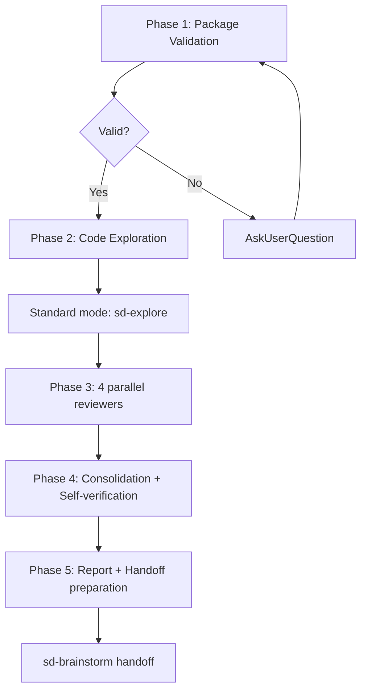

# sd-review

A structured code review skill for entire packages. Automatically selects lightweight/standard mode based on scale. Four perspective reviewers (logic/DX/convention/refactoring) review independently, followed by self-verification and handoff to sd-brainstorm.

## Prerequisites

**Before** starting Phase 1, you must:

1. Parse the following from the arguments:
   - **리뷰 대상**: 패키지명 혹은 경로
2. If no package name is provided, ask using `AskUserQuestion`

## Overall Flow



---

## Phase 1 -- Package Validation

1. Verify the existence of target packages in the `packages/` directory.
2. **Do not start a review without validation.**
3. 일치하는 패키지가 없으면 `AskUserQuestion`을 패키지 설정 요청
   - Bad example: "core-util doesn't exist, so I'll review core-common instead"
   - Good example: "Package 'nonexistent-pkg' does not exist. Please select a review target: core-common, core-browser, core-node, ..."

---

## Phase 2 -- Code Exploration

### Scale Determination

Invoke `sd-explore` via the Skill tool to pre-analyze the code. **Do not start Phase 3 before sd-explore completes.**

Pass the following in the Skill tool's `args`. Replace `{}` with actual values:

```
대상: {대상경로} 

Analysis purposes:
1. logic: Logic flow, branching, error handling, return values, boundary values, null safety, Promise/async, resource cleanup
2. dx: Public API signatures, usability, return type clarity, defaults, error messages, cross-package interface consistency
3. convention: Naming, export patterns, file structure, type usage (any/unknown/generic), #region, JSDoc
4. refactor: Code duplication, file size, complexity, module coupling, dead code, unnecessary abstraction

Output: .tmp/explore/
```

sd-explore 는 분석 결과를 출력디렉토리 `.tmp/explore/{DATE}-{TOPIC}-{HASH}/`에 출력합니다.

---

## Phase 3 -- Reviewer Execution

### Common Rules

- Each reviewer is **read-only**. Do not modify code.
- Do not use `isolation: "worktree"`.
- First read all sd-explore result files (`part-*.md`), filter entries relevant to the reviewer's objective, then read the actual source of files using the Read tool.
- **Do not report issues outside your own perspective.** Perspective separation is key

### Creating 4 Parallel Reviewers

4개의 리뷰어 서브에이전트를 통해 다음을 병렬로 수행합니다:

Replace `{review perspective}`, `{checklist}`, `{explore output dir}`, `{objective ID}`, `{additional references}` in the template below with values for each reviewer:

````
You are a code reviewer. Review **only** from the perspective below. Never report issues from other perspectives.

## Review Perspective
{review perspective description}

## Pre-explore Results
{explore 출력 디렉토리}/part-*.md: 각 파일에 여러 목적별 분류가 포함되어있으니, 현재 목적 항목에만 집중하라
실제 코드를 새로 분석하여 한다.

## 체크리스트 (모든 항목을 빠짐없이 리뷰하세요)
{체크리스트}

## Additional References
{additional references}

## Output Format (you must use this format)

### Findings

#### {title}
- **File**: {relative path}:{line number}
- **Description**: (be specific -- no abstract descriptions like "general issue")
- **Code**: ```{relevant code snippet}```
- **Suggestion**: (improvement proposal -- if applicable)

For checklist items with no findings, explicitly state "No issues found".
````

### Parameters per Reviewer

#### Reviewer 1: Logic Correctness / Code Stability

- **Review perspective**: Code correctness and stability.
- **Checklist**:
  - [ ] Boundary value handling: Does it behave correctly with empty arrays, 0, negative numbers, undefined/null inputs?
  - [ ] Error handling: Are try-catch blocks appropriate, are errors propagated correctly, are errors not swallowed?
  - [ ] Promise/async: Are there missing awaits, unhandled rejections, or race conditions?
  - [ ] Type safety: Does `as any`/`as unknown as X` hide actual bugs?
  - [ ] Resource cleanup: Are connections, listeners, and timers cleaned up?
  - [ ] State consistency: Are multiple state variables always kept in sync?
- **Additional references**: None

#### Reviewer 2: Usability/DX

- **Review perspective**: Convenience from the perspective of **a developer using the package**. Ignore internal implementation quality.
- **Objective ID**: `B`
- **Checklist**:
  - [ ] API signatures: Are parameter order/names/types intuitive?
  - [ ] Return types: Are they predictable?
  - [ ] Default values: Are they reasonable?
  - [ ] Error messages: Do they contain useful information for problem resolution?
  - [ ] Cross-package consistency: Is the same concept not expressed differently across packages?
  - [ ] API complexity: Does it not require excessive configuration for simple tasks?
  - [ ] IntelliSense: Is the type design such that TypeScript auto-completion works?
- **Additional references**: None

#### Reviewer 3: Conventions

- **Review perspective**: **Only** compliance with project coding rules. Ignore logic bugs, DX, and structure.
- **Objective ID**: `C`
- **Checklist**:
  - [ ] Generic type parameters: `T` prefix + descriptive name (no single-letter like `T`, `R`, `K`, `V`)
  - [ ] File naming: Helper files prefixed with main file name
  - [ ] Export patterns: Re-exports only in index.ts, using `export *`
  - [ ] `#region`: Appropriate use in large files, not used in index.ts
  - [ ] `any`/`unknown`/generics: Compliance with convention standards
  - [ ] `as` casting: Only when no alternative, `as unknown as X` prohibited
  - [ ] Code language: Variable names, function names, error messages in English
  - [ ] JSDoc: Only where needed (no excessive comments)
- **Additional references**: Read `.claude/rules/sd-refs-linker.md` and follow its instructions to read relevant reference documents

#### Reviewer 4: Refactoring/Structure

- **Review perspective**: **Only** code structure and simplification possibilities. Ignore logic bugs, DX, and conventions.
- **Objective ID**: `D`
- **Checklist**:
  - [ ] Code duplication: Is similar logic repeated?
  - [ ] File size: Excessively large files (potential for splitting)
  - [ ] Complexity: Functions with excessive nesting depth or branch count
  - [ ] Module cohesion: Are unrelated features mixed together?
  - [ ] Dependency direction: Circular dependencies, reverse dependencies
  - [ ] Dead code: Unused functions, variables, imports
  - [ ] Unnecessary abstraction: Abstractions used in only one place
- **Additional references**: None

---

## Phase 4 -- Consolidation, Verification, and Filtering

Performed after all reviewers have completed. **Do not start** this Phase before reviewers have finished.

**This phase is the most critical quality gate.** Reviewers over-report by design. Your job is to aggressively filter down to only genuinely actionable findings.

### 4.1 Cross-Reviewer Deduplication

Consolidate all reviewer findings and merge duplicates **regardless of perspective**:

1. Assign a unique ID to each finding: `{prefix}-{number}` (L=logic, D=DX, C=convention, R=refactoring)
2. **Same code location + same fix** → merge into one finding, even if reported by different reviewers. Keep the most specific description.
3. **Same code location + conflicting recommendations** → read the code, determine which recommendation is correct, and keep only that one. Record the conflict resolution reason.

- Bad example: Logic reviewer says "add null guard", DX reviewer says "change return type to `T | undefined`" → keeping both because "different perspectives". These target the same location and only one fix should be applied.
- Good example: Logic reviewer says "add null guard", Refactoring reviewer says "extract this block into a helper" → keeping both because they address different concerns (safety vs structure) and both fixes can coexist.

### 4.2 Code Verification (ALL findings)

**Read the actual source code for EVERY finding** — High, Medium, Low, and Info alike. Do not trust reviewer descriptions alone.

For each finding:

1. Read the referenced file and line using the Read tool
2. Verify that the finding accurately describes the actual code
3. Determine **Valid** or **Invalid**
4. Record the reason if invalid

### 4.3 Removal Criteria

After code verification, apply the following removal criteria. Remove (mark Invalid) any finding that matches:

**General removal criteria:**

- **Self-contradictory**: The finding's own description contradicts its conclusion
- **Misread**: The reviewer misunderstood the code — the actual behavior differs from what was described
- **Type-only / no runtime impact**: Issue exists only at the type level with no runtime consequence
- **Out of scope**: Issue is outside the review target package
- **Already handled**: The code already addresses the concern (e.g., error is caught upstream, null is guarded elsewhere)
- **Intentional pattern**: A pattern used consistently throughout the codebase — not an oversight
- **Bikeshedding**: Pure style preference with no functional or maintainability impact
  - Bad example (wrongly kept): "Rename `fetchData` to `loadData` for consistency" — pure naming preference, no bug or DX impact
  - Good example (correctly kept): "Convention requires `T` prefix on generic parameters, but `R` is used here" — violates a documented project rule
- **Severity inflation**: The actual impact is negligible despite being reported as High/Medium
- **Tradeoff-negative**: The suggested fix introduces more complexity than it removes

**Refactoring-specific removal criteria:**

- **Insufficient duplication**: Actually count the shared lines between the "duplicated" locations. < 30 shared lines → remove
- **Behavioral differences**: The "duplicated" code segments have different behavior or edge case handling → remove (they are not true duplicates)
- **Tightly coupled small file**: File is < ~150 lines and components are tightly coupled — splitting would increase complexity → remove
- **Single cohesive domain**: The code serves a single cohesive purpose — splitting would scatter related logic → remove
- **Not independently reusable**: The extracted code would only be used in one place → remove (premature abstraction)

### 4.4 Verification Checklist

Check **all** of the following before proceeding to Phase 5. If any are incomplete, perform additional verification:

- [ ] Have ALL findings (including Low/Info) been verified against actual code?
- [ ] Have cross-reviewer duplicates been merged (same location + same fix)?
- [ ] Have conflicting recommendations been resolved?
- [ ] Has every removal criterion been checked against each finding?
- [ ] Does each finding have a Valid/Invalid determination with reason?

---

## Phase 5 -- Report and sd-brainstorm Handoff

### 5.1 Findings Report

Report to the user in the following format:

```
## Review Results: {package name}

### Summary
- Total findings: {N} (Valid {V} / Invalid {I})
- By severity: High {H} / Medium {M} / Low {L} / Info {Info}
- Review mode: {Lightweight/Standard}

### Valid Findings

#### [{ID}] [{severity}] {title}
- **Perspective**: {reviewer perspective}
- **File**: {path}:{line}
- **Description**: ...
- **Suggestion**: ...

### Invalid Findings (rejected during self-verification)

#### [{ID}] {title}
- **Rejection reason**: ...
```

### 5.2 sd-brainstorm Handoff

After reporting, immediately invoke `sd-brainstorm` via the Skill tool. Do not ask for confirmation.

Pass the following in `args`:

```
{package name} Design improvements based on the package review results.

Valid findings:
{valid findings summary -- ID, severity, title, file, key description, one per line}
```

---

## Important Notes

- This skill is a **read-only review** skill. It does not modify source code.
- Reviewers **do not report issues outside their own perspective** -- perspective separation is key (except for the single unified reviewer).
- Do not skip package validation -- you must not review a nonexistent package based on guesswork.
- All 4 perspective checklists are applied even in lightweight mode -- review quality must be the same regardless of mode.
- **Phase 4 must verify ALL findings against actual code** -- no severity level is exempt from verification.
- **Aggressively filter**: Reviewers over-report by design. A good review has fewer, higher-quality findings -- not more.
