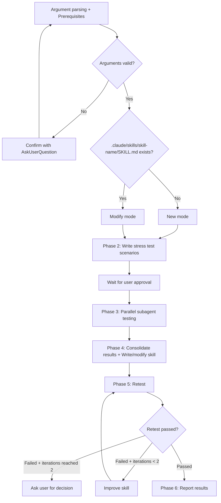

# sd-skill

This skill is a skill for writing/modifying skills based on stress testing.

## Prerequisites

**Before** starting Phase 1, you must perform the following:

1. Read `.claude/refs/sd-prompt-authoring-rules.md` — read it in advance to apply these principles when writing/modifying the skill in Phase 4
2. Parse arguments from `$ARGUMENTS` (`$ARGUMENTS` refers to the entire text the user entered after `/sd-skill`):
   - First word: `<skill-name>` — the target skill name
   - Everything after the second word: `<request description>` — a description of what to create or modify
   - Example: `sd-review Create a PR code review skill` → skill-name=`sd-review`, request description=`Create a PR code review skill`
3. Argument validation — if any of the following apply, confirm with `AskUserQuestion`. Do not proceed by guessing:
   - `<skill-name>` is missing
   - `<request description>` is missing or empty

## description frontmatter writing rules

The frontmatter `description` must be written in **a single line**. It must include both a brief description and when to use it.

**Format**: `Brief description. Trigger: when ~. Example: "do ~", "I want to ~"`

- Good example: `description: Refines the user's idea and produces a design document. Use this skill when requesting new feature design, existing feature improvement, idea refinement, or brainstorming.`
- Bad example: `description: Brainstorming skill` (cannot tell what the skill is or when to invoke it)

## Overall Workflow



---

## Phase 1 — Mode Determination

Check whether the file `.claude/skills/<skill-name>/SKILL.md` exists.

- **File does not exist** → **New mode**
- **File exists** → **Modify mode** (read the existing SKILL.md to understand its current content)

After determining the mode, proceed immediately to Phase 2.

---

## Phase 2 — Writing Stress Test Scenarios

Analyze the user's request and write **stress test scenarios**. Limit to a minimum of 3 and a maximum of 10. Include at least 1 of each of the 3 required types, and freely distribute the rest based on testing needs.

**Exception — Bug fix requests**: When the user requests a fix for a specific bug, write **only the minimum scenarios needed to reproduce that bug** (minimum 1). The 3 required types rule does not apply. Do not add unrelated happy-path or compound scenarios just to meet the count.

### Scenario Structure

Every scenario must include all of the fields below. None may be omitted:

| Field | Description                                                                                   |
|------|-----------------------------------------------------------------------------------------------|
| `id` | Scenario number (starting from 1)                                                             |
| `name` | Identifying name (keep it concise)                                                            |
| `description` | The situation this scenario tests                                                             |
| `user_prompt` | The prompt to deliver to the subagent (a natural sentence that a real user would likely type) |
| `success_criteria` | List of success criteria (must be objectively assessable)                                     |
| `stress_point` | The specific point this scenario stresses                                                     |

**Language rule**: All natural-language fields (`name`, `description`, `user_prompt`, `success_criteria`, `stress_point`) must be written in the **system-configured language** (Claude Code's language setting). Technical terms and code identifiers remain in their original form.

### Required Scenario Types

You must include at least 1 of each of the following 3 types:

1. **Happy Path** — The most common use case
2. **Edge Case** — Ambiguous input, incomplete information, exceptional situations
3. **Compound Request** — Cases that demand multiple features simultaneously

### Scenario Purpose by Mode

- **New mode**: The subagent performs the task without any skill. The purpose is to observe what guidance would have led to better performance.
- **Modify mode**: The subagent performs the task using the existing skill. The purpose is to better understand the request.
  - Bug fix request: Design **only** scenarios that reproduce the specific bug. One scenario per bug is sufficient — do not pad with extra scenarios
  - New feature request: Design scenarios where the feature is needed
  - Other (parameter changes, documentation improvements, structural refactoring, etc.): Design scenarios that verify overall skill quality. Specifically: identify ambiguous or missing guidance in each Phase, verify consistency with external rules referenced by the skill, and systematically derive edge cases (incorrect input, missing files, environment constraints)

### User Approval

Report the scenario list to the user. Request approval with `AskUserQuestion`. If the user requests modifications or additions, incorporate them and request approval again. **Do not proceed to Phase 3 without approval.**

---

## Phase 3 — Isolated Process Testing

Each scenario is run in an isolated worktree via `.claude/skills/sd-skill/test-runner.py`. The script handles the full lifecycle: worktree creation → `.claude/` copy → isolated Claude execution → worktree cleanup.

### 3.1 Write Prompt Files

Write **all** prompt files using the Write tool before launching agents. All files go in `.tmp/isolated/`.

**Path format:** `.tmp/isolated/{YYYY-MM-DD}-{skill-name}-{scenario-id}-prompt.md`

You **must** use the prompt template matching the mode determined in Phase 1. Confusing the modes will result in referencing a non-existent skill or ignoring an existing skill.

#### New Mode Prompt Template

```
You are a tester. Perform the user request below.
No special skills or guidelines are provided.

## User Request
{scenario.user_prompt}

## Reporting Requirements (you must report in this format)

### Actions Taken
(What you did, specifically)

### Difficulties Encountered
(Parts where judgment was difficult, decisions you were uncertain about)

### Guidance That Would Have Helped
(Guidelines or rules that would have led to better performance — be specific)
```

#### Modify Mode Prompt Template

```
You are a tester. Perform the user request below, referring to the skill provided.

## Skill File
Read `.claude/skills/{skill-name}/SKILL.md` and follow its instructions.

## User Request
{scenario.user_prompt}

## Reporting Requirements (you must report in this format)

### Actions Taken
(What you did, specifically)

### How the Skill Helped
(Which instructions from the skill were useful)

### Problems with the Skill
(Parts where the skill's instructions were inaccurate or insufficient)

### Skill Improvement Suggestions
(Specific instructions that need to be added or modified)
```

### 3.2 Run Tests (Parallel)

Launch **N Agent(Task) subagents in a single message**, one per scenario. Each agent runs `test-runner.py` via Bash.

**Base name convention:** `{skill-name}-{action}-{scenario-id}`

- `{skill-name}`: Target skill name (e.g., `sd-brainstorm`)
- `{action}`: `create` (new mode) or `modify` (modify mode)
- `{scenario-id}`: Scenario number

**Output path:** `.tmp/isolated/{YYYY-MM-DD}-{skill-name}-{scenario-id}-output.txt`

Each Agent prompt:

```
Run the following command and report the output file path when done:

python .claude/skills/sd-skill/test-runner.py \
  --prompt-file .tmp/isolated/{prompt-file-name} \
  --output .tmp/isolated/{output-file-name} \
  --base-name {base-name} \
  --model {current_session_model} \
  --effort {current_session_effort}

After the command completes, read the output file and report:
1. The output file path
2. Whether the result marker is `--- Result (success) ---` or `--- Result (error) ---`
3. The extracted result text (content after the result marker)
```

- `{current_session_model}`: The model powering this session (found in system context, e.g., `claude-opus-4-6`)
- `{current_session_effort}`: The reasoning effort level of this session (e.g., `low`, `medium`, `high`)

### 3.3 Collect Results

After all agents complete, read each output file and collect the results. The script handles worktree cleanup automatically (via try/finally), so no manual cleanup step is needed.

---

## Phase 4 — Result Consolidation and Skill Writing/Modification

### 4.1 Result Analysis

After collecting all subagent reports, analyze the following:

1. **Common patterns**: Difficulties commonly experienced by multiple subagents
2. **Required guidance list**: Consolidate and refine the guidelines that subagents wanted
3. **Success criteria achievement**: Evaluate actual results against each scenario's `success_criteria`

### 4.2 Skill Writing/Modification Checklist

**Check every item** in the checklist below before writing the skill. Do not skip any:

- [ ] YAML frontmatter (name, description) defined — description follows the **description writing rules** above
- [ ] All guidance derived from test results has been incorporated
- [ ] `.claude/refs/sd-prompt-authoring-rules.md` principles followed — verify at least 1 application each of Authority (imperative language), Commitment (checklists/sequential flow), and Scarcity (order dependencies)
- [ ] Verify the existence of all external files (refs, auxiliary files, etc.) referenced by the skill using Glob
- [ ] Skill body is within 500 lines (if exceeded, split into auxiliary files within the `.claude/skills/<skill-name>/` directory)

The skill file is written (or modified) at `.claude/skills/<skill-name>/SKILL.md` in the **root project**. This is so that the file gets copied during worktree initialization (`cp -r`) in Phase 5 retesting.

---

## Phase 5 — Retest

### 5.1 Scenario Selection

Select retest target scenarios based on the following criteria:

1. **Include only scenarios that failed in the previous test**:
   - 1st retest: Scenarios from Phase 3 that did not fully meet `success_criteria`
   - 2nd+ retest: Scenarios that still failed in the previous retest (Phase 5)
2. **Exclude already-passed scenarios** — do not re-run scenarios that have already passed
3. If **new scenarios** are needed to verify newly added guidance from Phase 4, write additional ones
4. The total of retest target scenarios (failed + new) must not exceed the maximum scenario count from Phase 2

- Bad example: "Re-run all scenarios to be safe"
- Good example: "Scenarios 2 and 4 failed in Phase 3, so only retest these 2"

### 5.2 Retest Execution

Follow the same procedure as Phase 3 (environment setup → test execution → environment cleanup). Use the **modify mode prompt**, with the skill content being the new version written/modified in Phase 4.

### 5.3 Pass Determination

Judge based on each scenario's `success_criteria`:

- **All passed** → Proceed to Phase 6
- **Partial failure + iterations < 2** → Analyze failure causes, improve the skill, then perform again from Phase 5.1 (based on scenarios that failed in the previous retest)
- **Still failing after reaching 2 iterations** → Report the current state to the user and request a decision via `AskUserQuestion` on whether to continue or stop

---

## Phase 6 — Result Report

Report the following to the user:

1. **Written/modified skill path**: `.claude/skills/<skill-name>/SKILL.md`
2. **Test result summary**: Pass/fail status for each scenario
3. **Key guidance incorporated into the skill**: Major rules derived from testing
4. **Remaining limitations** (if any): Edge cases that could not be resolved

Stop after reporting. Wait for the user's explicit instructions for any additional work.

---

## Important Notes

- **Do not use `isolation: "worktree"`** — worktree management is handled by `test-runner.py` internally
- **Do not include environment setup/cleanup blocks in test prompts** — the script handles the full lifecycle
- Test execution uses `.claude/skills/sd-skill/test-runner.py` invoked via Agent tool subagents — each agent runs a single Bash command
- All test agents **must** be launched in parallel within a single message — invoke as many Agent tools as there are scenarios
- If testing is deemed incomplete, scenarios can be modified or added at any time
- When asking the user a question, always use the `AskUserQuestion` tool
- **Root project absolute path** refers to the top-level path where the `.git` directory (the original, not a worktree) resides — not a worktree path
