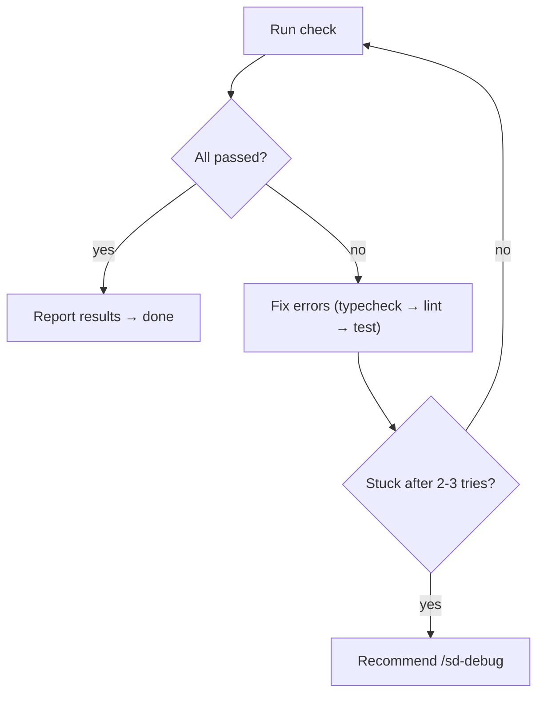

# sd-check

Run `$PM run check`, fix errors, repeat until clean.

## Package Manager Detection

Before running any commands, detect the package manager:
- If `pnpm-lock.yaml` exists in project root → use `pnpm`
- If `yarn.lock` exists in project root → use `yarn`
- Otherwise → use `npm`

`$PM` in all commands below refers to the detected package manager.

## Usage

```
$PM run check [path] [--type typecheck|lint|test]
```

| Example                               | Effect                    |
| ------------------------------------- | ------------------------- |
| `/sd-check`                           | Full project, all checks  |
| `/sd-check packages/core-common`      | Specific path, all checks |
| `/sd-check test`                      | Tests only, full project  |
| `/sd-check packages/core-common lint` | Specific path + type      |

Multiple types: `--type typecheck,lint`. No path = full project. No type = all checks.

## Workflow



**Run command:** `$PM run check [path] [--type type]` (timeout: 600000)

- **Output capture:** Bash truncates long output. Always redirect to a file and read it:
  ```bash
  mkdir -p .tmp && $PM run check [path] [--type type] > .tmp/check-output.txt 2>&1; echo "EXIT:$?"
  ```
  Then use the **Read** tool on `.tmp/check-output.txt` to see the full result. Check `EXIT:0` for success or non-zero for failure.

**Fixing errors:**
- **Before fixing any code**: Read `.claude/refs/sd-code-conventions.md` and check `.claude/rules/sd-refs-linker.md` for additional refs relevant to the affected code area (e.g., `sd-solid.md` for SolidJS, `sd-orm.md` for ORM). Fixing errors does NOT exempt you from following project conventions.
- Test failures: **MUST** run `git log` to decide — update test or fix source
- **E2E test failures**: use Playwright MCP to investigate before fixing
  1. `browser_navigate` to the target URL
  2. `browser_snapshot` / `browser_take_screenshot` (save to `.tmp/playwright/`) to see page state
  3. `browser_console_messages` for JS errors
  4. `browser_network_requests` for failed API calls
  5. Interact with the page following the test steps to reproduce the failure
  6. Fix based on observed evidence, not guesswork

## Rules

- **Always re-run ALL checks** after any fix — never assume other checks still pass
- **Report with evidence** — cite actual numbers (e.g., "0 errors, 47 tests passed"), not "should work"
- **No build, no dev server** — typecheck + lint + test only
- **Run Bash directly** — no Task/agent/team overhead
- **Never run in background** — always run Bash in foreground (do NOT set `run_in_background: true`), wait for result before proceeding
