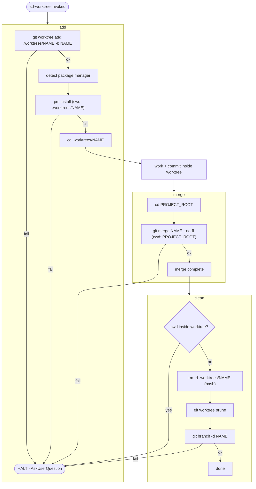

# sd-worktree

Branch-isolated workflow using git worktrees.

## Flow

## Rules

### HALT

When any step reaches **fail** or **HALT**:

1. Show the error message to the user as-is
2. Ask the user how to proceed via `AskUserQuestion`
3. Do **nothing** until the user responds

Manual git merge, git stash, git reset, git clean, or **any workaround is forbidden**. Yolo mode does NOT override HALT.

### Worktree location

All worktrees MUST be created under **`.worktrees/`** (project root).

### Package manager detection

| File | PM |
|---|---|
| `pnpm-lock.yaml` | pnpm |
| `yarn.lock` | yarn |
| `package-lock.json` | npm |
| `bun.lockb` / `bun.lock` | bun |

### clean: use rm -rf

`git worktree remove` almost always fails on Windows due to file locks. Use `rm -rf` (bash) + `git worktree prune` instead.
