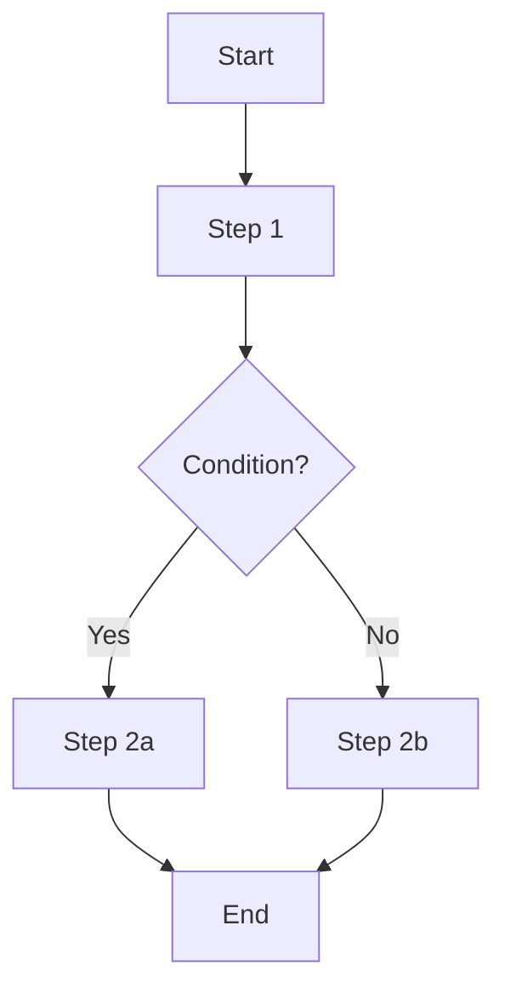

# Requirements Specification — Process / Workflow

Add the following sections when the task involves a workflow, state machine, or multi-step procedure.

## Process Flow Diagram

Provide a Mermaid flowchart or sequence diagram showing the overall flow.

Example:

## Step Descriptions

For each step in the flow diagram:

| Item | Description |
|------|-------------|
| **Step name** | Identifier matching the diagram |
| **Actor** | Who/what performs this step |
| **Action** | What happens in this step |
| **Input** | What this step receives |
| **Output** | What this step produces |
| **Success criteria** | How to determine this step succeeded |

## Branch Conditions

For each decision point in the flow:

| Item | Description |
|------|-------------|
| **Condition** | The decision being made |
| **Branches** | Each possible outcome and where it leads |
| **Default** | What happens if none of the conditions match |

## State Transitions (if stateful)

List all valid states and transitions between them. Use a Mermaid state diagram if helpful.
