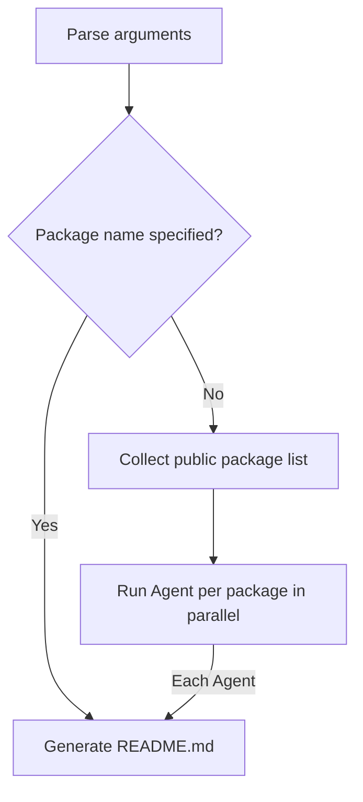

# SD Readme — Monorepo Package README Documentation Generator

Automatically generates README.md documentation for each package in the monorepo. Applies Progressive Disclosure principles by choosing either a single README.md or a README.md + docs/*.md structure depending on the package size.

ARGUMENTS: Package name (optional). If specified, only that package is processed; if omitted, all packages are processed in parallel.

## Workflow



### A. Parse Arguments

Extract the package name from the ARGUMENTS passed when invoking the skill.

- **Package name specified** → Find the corresponding directory under `packages/` and proceed directly to **C. Generate README.md**.
- **Package name not specified** → Proceed to **D. Collect public package list**.

### C. Generate README.md

Perform the following for a single target package.

#### C-1. Analyze package.json

Read `packages/<name>/package.json`:

1. Check the `name` and `description` fields.
2. If `"private": true`, **skip** this package.
3. Identify the package entry point source code.

#### C-2. Analyze Source Code

1. Recursively read the entry point file and all exports to collect every public API.
2. If JSDoc comments exist, use them as descriptions for each item.

#### C-3. Determine Document Structure and Generate

Examine the source code size and the number of logical categories, then **autonomously** decide which of the two structures below is appropriate:

- **Single README.md**: When the package is small, has few APIs, and category classification is unnecessary
- **README.md + docs/*.md**: When the package is large or has multiple logical categories

If an existing README.md or docs/ directory exists, **modify only the changed parts** based on the existing content. If no existing documentation exists, create it from scratch.
When updating existing documentation, verify each existing section against the current source code. **Preserve all content that has backing evidence in the source code** (behavioral descriptions, usage patterns, rendering mode distinctions, etc.), even if it does not directly correspond to an exported API name. Only remove content whose source code backing no longer exists. Existing descriptions may be refined for accuracy, but substantive content backed by code must not be deleted.
If the structure changes (B to A), delete the now-unnecessary `docs/` directory.
Write in **English**.

#### C-4. Manage package.json files Field

When creating or deleting the `docs/` directory, update the `files` array in `package.json` accordingly:

- **When applying Structure B**: If the `files` array does not contain `"docs"`, add it.
- **When applying Structure A**: If the `files` array contains `"docs"`, remove it.

---

##### Structure A: Single README.md (Small Packages)

Create the `packages/<name>/README.md` file:

```markdown
# <package-name from package.json>

> <description from package.json>

<Write a detailed description of the package's main features and purpose in English>

## API Reference

### <exportedName>

```typescript
<export signature code>
```

<Description of this API>

---

(... Repeat for all exported items ...)

## Usage Examples

```typescript
import { ... } from "<package-name>";

// Main usage example code
```
```

---

##### Structure B: README.md + docs/*.md (Large Packages)

**README.md** — Create the `packages/<name>/README.md` file:

```markdown
# <package-name from package.json>

> <description from package.json>

<Write a detailed description of the package's main features and purpose in English>

## Documentation

| Category | Description |
|----------|-------------|
| [<Category1>](docs/<category1>.md) | <Category description and list of key items> |
| [<Category2>](docs/<category2>.md) | <Category description and list of key items> |
| ... | ... |
```

**docs/*.md** — Create a `packages/<name>/docs/<category>.md` file for each category:

```markdown
# <Category Name>

## <exportedName>

```typescript
<export signature code>
```

<Description of this API>

---

(... Repeat for all exported items in this category ...)

## Usage Examples

```typescript
import { ... } from "<package-name>";

// Main usage example code for this category
```
```

Determine category names and classifications autonomously, considering the source code directory structure, functional similarity, etc.

---

### D. Collect Public Package List

Use Glob to search `packages/*/package.json`, excluding packages with `private: true`.

---

### E. Run Agent Per Package in Parallel

For each remaining package, use the Agent tool to pass the following prompt **in parallel**:
```
/sd-readme <package-name>
```

Terminate once all subagents have completed.
