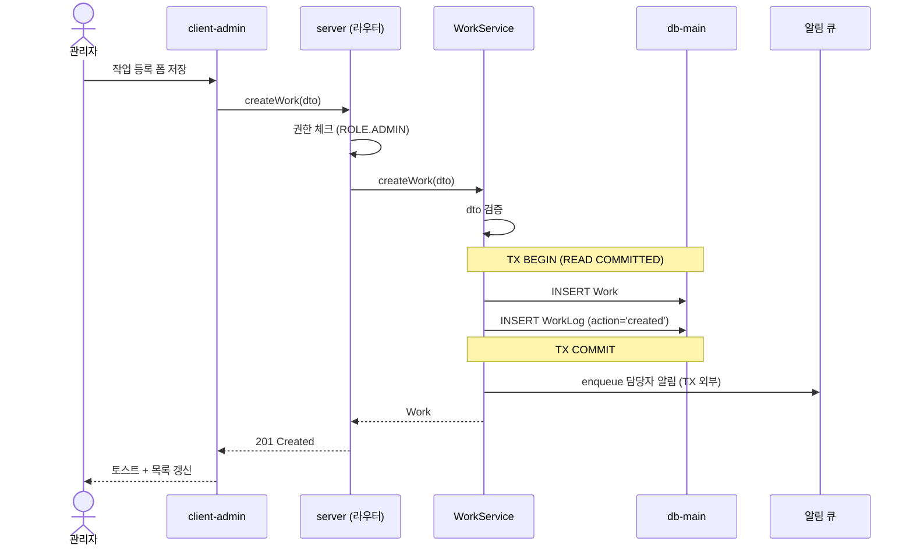

# 시퀀스 다이어그램 작성 가이드

구현 설계 시작(영향 범위 다음)에 작성. 모듈 간 호출 흐름을 mermaid `sequenceDiagram`으로 시각화한다.

## 작성 원칙

- 참여자(`participant`)는 패키지·모듈 단위로 정의 (예: `client-admin`, `server`, `WorkService`, `db-main`).
- 외부 사용자는 `actor`로 표시.
- 호출 화살표는 동기 `->>`, 응답 `-->>`. 비동기는 `->>` + `Note`로 명시.
- 트랜잭션·반복·분기는 `Note`/`alt`/`loop`로 표현.
- 권한 체크·검증·로그 같은 부수 동작도 메시지로 표시 (자주 누락되는 영역).
- 한 다이어그램의 메시지 수는 20개 이내. 넘으면 단계별로 분할.

## 좋은 예 (작업 등록)

## 무엇을 명시해야 하나

- **권한 체크 위치**: 어느 참여자에서? (API 진입? Service?)
- **트랜잭션 경계**: BEGIN ~ COMMIT을 `Note over`로 명시
- **외부 호출**: 알림·이메일·외부 API. TX 외부에 둘지 안에 둘지
- **에러 분기**: 실패 케이스가 핵심이면 `alt`/`else`로 표현
- **비동기 처리**: 반환을 기다리지 않으면 `Note`로 명시

## 나쁜 예

- `participant`에 클래스명만 (`WorkServiceImpl`) — 모듈/패키지 컨텍스트 누락
- 권한 체크 누락 (그냥 `SVC.createWork`만 호출하는 걸로 끝)
- 트랜잭션 경계 표시 없음 (어디서 BEGIN/COMMIT인지 모호)
- 외부 호출이 TX 안에 있는데 명시 안 됨 (락 길어짐 위험)
- 한 다이어그램에 모든 시나리오를 욱여넣어 메시지 30개 이상

## sd-wbs mermaid와의 차이

| 구분 | sd-wbs (사용자 시점) | sd-plan 시퀀스 (개발자 시점) |
|---|---|---|
| 노드 | 사용자가 인지하는 단계 | 패키지/모듈/클래스 |
| 동작 라벨 | "도서 검색", "대출 신청" | `findWork(id)`, `createWork(dto)` |
| 부수 동작 | (없음) | 트랜잭션, 권한 체크, 알림 큐 |

같은 정보를 양쪽에 중복하지 않는다.
