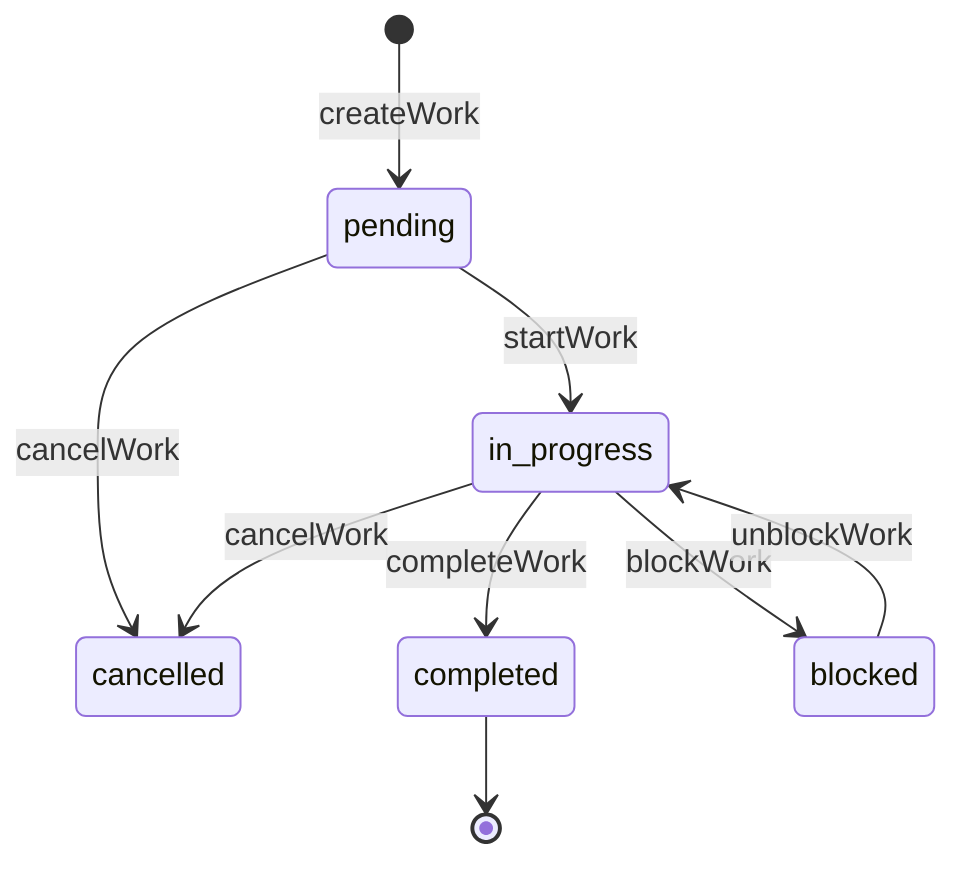

# 상태 전이도 (FSM) 작성 가이드

엔티티 섹션 인접에 작성. 도메인 객체의 내부 상태 머신을 mermaid `stateDiagram-v2` + 전이 표로 정리한다.

## 표현 형식

다이어그램과 표를 함께 작성한다.

### 다이어그램

```mermaid
stateDiagram-v2
  [*] --> {초기상태}: {생성 이벤트}
  {상태} --> {다음상태}: {전이 이벤트}
  {상태} --> [*]
```

### 전이 표

| 현재 상태 | 이벤트 | 다음 상태 | 가드 | 사이드 이펙트 |
|---|---|---|---|---|

## 작성 원칙

- 상태 라벨은 DB `status` 컬럼 값 그대로 사용 (`pending`, `in_progress` 등). 한글 라벨 금지.
- 전이 이벤트는 메서드명 또는 시스템 이벤트명.
- 가드: 권한 조건·데이터 조건·타이밍 조건. 비어있으면 `—`.
- 사이드 이펙트: 알림·로그·외부 호출·다른 컬럼 갱신. 자주 누락되는 영역이라 명시 강제.
- 모든 가능 전이를 빠짐없이 나열한다 (완전성).
- 종료 상태(`[*]`)로 가는 경로를 명시.

## 좋은 예 (작업 도메인)



| 현재 | 이벤트 | 다음 | 가드 | 사이드 이펙트 |
|---|---|---|---|---|
| (initial) | `createWork` | `pending` | — | 담당자 알림 |
| `pending` | `startWork` | `in_progress` | 호출자 = 담당자 | `startedAt` 기록 |
| `pending` | `cancelWork` | `cancelled` | 호출자 = `ADMIN` | 담당자 알림 |
| `in_progress` | `completeWork` | `completed` | 호출자 = 담당자 | 완료 알림 + 보고서 생성 |
| `in_progress` | `blockWork` | `blocked` | 사유 필수 | 관리자 알림 |
| `in_progress` | `cancelWork` | `cancelled` | 호출자 = `ADMIN` | 담당자 알림 |
| `blocked` | `unblockWork` | `in_progress` | 호출자 = 담당자/`ADMIN` | — |

## 검증 체크리스트

작성 후 다음을 확인한다.

- 모든 상태에서 가능한 모든 이벤트가 표에 있는가
- 종료 상태(`[*]`)로 가는 경로가 정의됐는가
- 가드 조건의 검증 위치가 명확한가 (Service 안? DB constraint?)
- 사이드 이펙트가 트랜잭션 내부인지 외부인지 (알림은 보통 TX 외부)
- 동시성 — 같은 객체에 두 이벤트가 동시에 오면? 락·낙관적 동시성 정책

## 나쁜 예

- 상태 라벨이 한글 (`진행중`) — DB `status` 값과 불일치, sd-wbs와 헷갈림
- 가드·사이드 이펙트 컬럼 빠진 단순 다이어그램 (전이만 그림)
- 일부 전이 누락 — 어떤 상태에서 `cancelWork`가 가능한지 모호
- 종료 상태로 가는 경로 누락
- 사이드 이펙트(알림·로그)를 트랜잭션 안에 두면서 명시 안 함

## sd-wbs stateDiagram과의 차이

| 구분 | sd-wbs (사용자 시점) | sd-plan FSM (개발자 시점) |
|---|---|---|
| 라벨 | "진행 중" (사용자 표시) | `in_progress` (DB 컬럼 값) |
| 트리거 | "완료 표시" (사용자 동작) | `completeWork` (메서드명) |
| 가드 | (없음 또는 단순 권한) | 권한·데이터·타이밍 조건 |
| 사이드 이펙트 | (없음) | 알림·로그·외부 호출 명시 |

같은 객체 상태라도 정보 깊이가 다르다. sd-wbs와 sd-plan에 같은 정보를 중복 작성하지 않는다.
