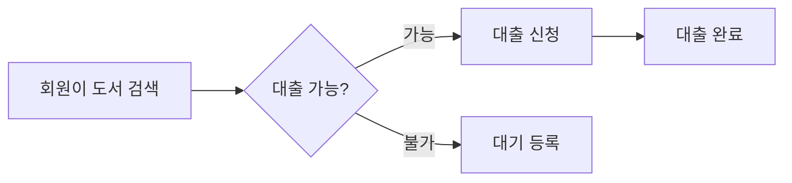
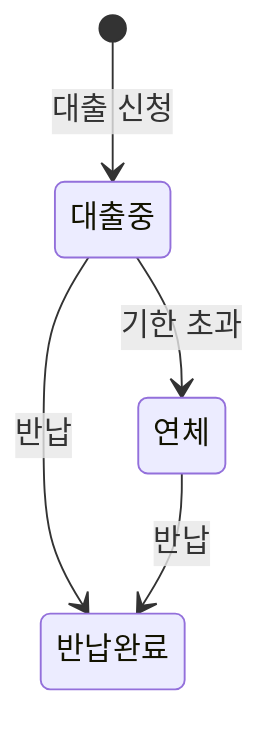

# 업무 플로우 (mermaid) 작성 가이드

Activity 헤더 직후에 작성. 사용자가 따라가는 시간 흐름·상태 전이를 시각화한다.

## 다이어그램 종류 선택

| 표현 대상 | 다이어그램 | 사용 시점 |
|---|---|---|
| 사용자 작업의 시간 흐름 | `flowchart` | 여러 단계를 순차 진행하는 Activity |
| 엔터티의 상태 변화 | `stateDiagram-v2` | 주문·요청·결재 등 상태 lifecycle이 핵심인 경우 |
| 사용자-시스템 간 주고받음 | `sequenceDiagram` | 외부 시스템 연동·승인 흐름 |

여러 다이어그램이 필요하면 분리해서 각각 작성한다.

## 작성 원칙

- 사용자 시점에서 보이는 단계만 노드로 둔다.
- 시스템 내부 함수·DB 호출·내부 큐 등은 노드로 두지 않는다.
- 분기는 의사결정 노드(`{}`)로 표현한다.
- 노드 라벨은 사용자 도메인 어휘로 작성한다 (시스템 식별자·테이블명 금지).
- 한 다이어그램의 노드 수는 12개 이내. 넘으면 하위 다이어그램으로 분할한다.

## flowchart 좋은 예

## stateDiagram 좋은 예

## 나쁜 예

- 노드 라벨에 `getBookById()`·`books 테이블` 같은 시스템 어휘 노출
- DB 트랜잭션 경계·캐시 무효화 같은 구현 상세 표현
- 한 다이어그램에 모든 Activity를 욱여넣어 노드 수가 30개를 넘김
- 분기 결과 라벨 누락 (`Yes`/`No`만 적고 무엇에 대한 판단인지 모호)

## 호환성

mermaid 코드블록은 `wbs.md`에서 GitHub·VS Code 미리보기로 렌더링된다. 호환성을 위해 다음을 지킨다.

- 노드 ID는 영문/숫자만 (한글 ID 금지, 라벨에는 한글 OK)
- 따옴표·괄호가 라벨에 들어가면 `[...]` 대신 `["..."]` 사용
- 색상·아이콘 등 확장 문법은 사용 금지 (호환성 우선)
