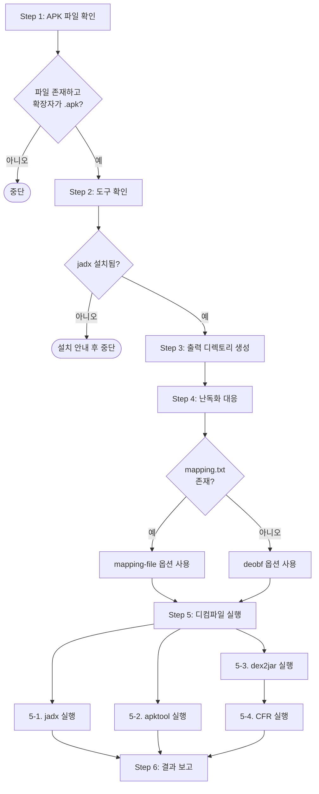

# sd-apk-decompile: APK 디컴파일

APK 파일을 3가지 도구(jadx, dex2jar+CFR, apktool)로 디컴파일하여 교차 분석 가능한 결과물을 생성한다.

## 도구

| 도구 | 제공 정보 | 위치 |
|------|------|------|
| **jadx** | Java 소스 + 디코딩된 리소스 | 시스템 설치 (`scoop install jadx`) |
| **dex2jar + CFR** | Java 소스 (다른 해석) | 번들: `tools/dex2jar/`, `tools/cfr.jar` |
| **apktool** | smali (바이트코드 1:1) + 리소스 | 번들: `tools/apktool.jar` |

번들 도구 기준 경로: `.claude/skills/sd-apk-decompile/tools/`

## 프로세스 흐름

아래 다이어그램이 전체 프로세스의 흐름이다. 각 노드의 상세 설명은 이후 섹션에서 기술한다.



## Step 1: APK 파일 확인

사용자가 제공한 APK 파일 경로를 확인한다.

- **파일이 없으면**: 존재하지 않음을 알리고 중단한다.
- **확장자가 `.apk`가 아니면**: APK 파일이 아님을 알리고 중단한다.

## Step 2: 도구 확인

jadx가 시스템에 설치되어 있는지 확인한다 (`command -v jadx`).

- **jadx 미설치**: 설치 방법(`scoop install jadx`)을 안내하고 중단한다. 자동 설치하지 않는다.
- **번들 도구**(apktool, dex2jar, cfr): `.claude/skills/sd-apk-decompile/tools/`에 포함되어 있으므로 체크 불필요.

## Step 3: 출력 디렉토리 생성

**TOOLS_DIR**은 `.claude/skills/sd-apk-decompile/tools`의 절대 경로이다.

APK 파일과 같은 경로에 `{APK파일명(확장자 제외)}_decompiled/` 디렉토리를 생성한다.

## Step 4: 난독화 대응 (mapping.txt 탐지)

APK 파일과 같은 디렉토리에서 `mapping.txt` 파일을 찾는다.
- **있으면**: jadx에 `--mapping-file mapping.txt` 옵션을 사용한다.
- **없으면**: jadx에 `--deobf --deobf-min 3` 옵션을 사용한다.

## Step 5: 디컴파일 실행

jadx, apktool, dex2jar는 서로 독립적이므로 병렬 실행이 가능하다.
CFR만 dex2jar 결과에 의존하므로 dex2jar 완료 후 실행한다.

### 5-1. jadx (시스템 설치)

```bash
jadx "<APK경로>" -d "<출력디렉토리>/jadx" \
  --show-bad-code \
  --threads-count 4 \
  <난독화 옵션>
```

### 5-2. apktool (번들)

```bash
java -jar "<TOOLS_DIR>/apktool.jar" d "<APK경로>" \
  -o "<출력디렉토리>/apktool" -f
```

### 5-3. dex2jar (번들)

```bash
_classpath="."
for k in "<TOOLS_DIR>/dex2jar/lib/"*.jar; do
  _classpath="${_classpath};${k}"
done
java -Xms512m -Xmx2048m -classpath "${_classpath}" \
  "com.googlecode.dex2jar.tools.Dex2jarCmd" "<APK경로>" \
  -o "<출력디렉토리>/app.jar" --force
```

### 5-4. CFR (번들, dex2jar 완료 후)

```bash
java -jar "<TOOLS_DIR>/cfr.jar" "<출력디렉토리>/app.jar" \
  --outputdir "<출력디렉토리>/cfr"
```

## Step 6: 결과 보고

디컴파일 완료 후 사용자에게 보여줄 내용:

- 출력 디렉토리 경로
- 각 도구별 실행 결과 (성공/실패)
- 실패한 도구가 있으면 에러 메시지

```
{APK파일명}_decompiled/
  jadx/        <- Java 소스 (해석 A) + 리소스
  apktool/     <- smali + 리소스 완벽 디코딩
  cfr/         <- Java 소스 (해석 B)
  app.jar      <- dex2jar 중간 산출물
```
