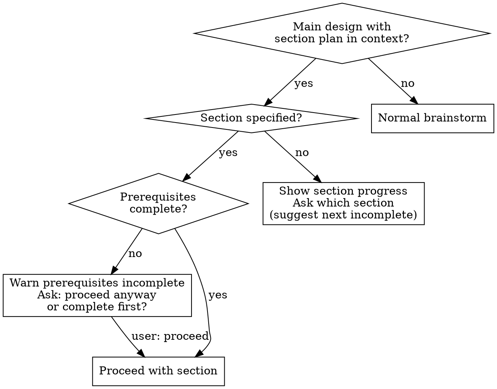
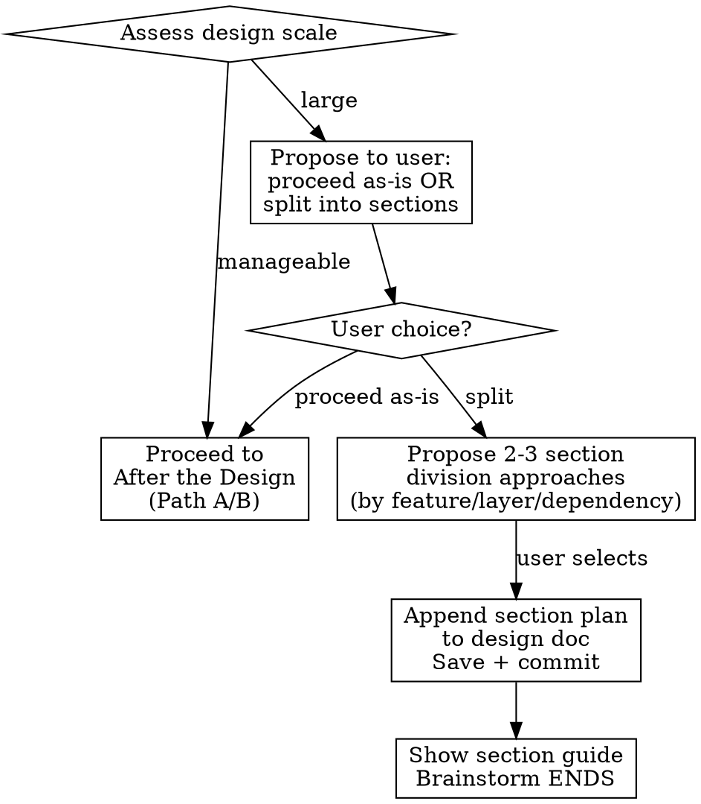

# Brainstorming Ideas Into Designs

## Overview

Help turn ideas into fully formed designs and specs through natural collaborative dialogue.

Start by understanding the current project context, then ask questions one at a time to refine the idea. Once you understand what you're building, present the design in small sections (200-300 words), checking after each section whether it looks right so far.

## The Process

**Understanding the idea:**
- Check out the current project state first (files, docs, recent commits). For deeper codebase exploration, consider using `sd-explore`.
- Ask questions one at a time to refine the idea
- Prefer multiple choice questions when possible, but open-ended is fine too
- Only one question per message - if a topic needs more exploration, break it into multiple questions
- Focus on understanding: purpose, constraints, success criteria

**When a main design document is provided as context:**



When proceeding with a section:

1. **Read the main design** — understand goals, overall structure, and the target section's scope
2. **Read actual code** — check the current codebase state for what previous sections have built. Reference the **actual code**, NOT previous section design documents. Code may have diverged from earlier designs during implementation.
3. **Scope the brainstorm** — limit questions, gap review, approaches, and design presentation to the target section only. Do not re-question decisions already established in the main design.
4. **Conflict detection** — if the main design's direction conflicts with the actual code state, alert the user and ask for direction before proceeding.
5. After the design is complete, save as `docs/plans/YYYY-MM-DD-<topic>-section-N-design.md`
6. Update the main design document: mark the section `[ ]` → `[x]` in the section plan
7. Commit both files, then proceed to the normal **Next Steps Guide** (Path A/B)

**Gap review loop:**

When you think you've asked enough, **STOP and run a gap review before moving on.**

Tell the user you're running a gap review, then check ALL categories. For each ✅, you MUST **cite specific evidence** (which Q&A, code reference, or explicit user requirement). "I already know" is not evidence.

| Category | Check for... |
|----------|-------------|
| Scope | What's in? What's explicitly out? |
| User flows | All inputs, outputs, feedback, navigation |
| Edge cases | Empty states, errors, limits, concurrency, undo |
| Data | Shape, validation, persistence, migration, relationships |
| Integration | How does this connect to existing code/systems? |
| Non-functional | Performance, accessibility, security, i18n |
| Assumptions | Anything you assumed but never confirmed |

Output format — cite evidence for each:
- `✅ Scope — [Q2: user confirmed X / code at file:line / requirement doc says Y]`
- `❓ Edge cases — gap: [what's missing]`

If evidence is vague ("obvious", "I already know", "common sense") → mark as ❓, not ✅.

- If ANY ❓ exists → ask about it. After the user answers, **run the full checklist again from scratch**.
- Only when ALL categories show ✅ with cited evidence → proceed to exploring approaches.

**All-✅ on first run is PROHIBITED — not "suspicious", prohibited.**
If your first gap review shows all ✅:
1. You are rubber-stamping. Prior investigation ≠ complete design exploration.
2. Pick the 2 weakest categories (thinnest evidence).
3. Write one concrete unasked question per category.
4. Ask those questions, then re-run the full checklist from scratch.

| Excuse | Reality |
|--------|---------|
| "Requirements are already clear" | Clear requirements ≠ complete design. Edge cases, error states, integration points still need exploration. |
| "I already investigated the code" | Code investigation reveals what IS. Design exploration asks what SHOULD BE. Different activities. |
| "It's just a bug fix" | Bug fixes have edge cases: error states, concurrent access, timing changes, consumer compatibility. |
| "User is frustrated/in a hurry" | Rushing causes exactly the mistakes brainstorming prevents. Slow down. |

**Rules:**
- You MUST show the checklist to the user every time you run it. No silent/internal-only checks.
- Each run must re-examine ALL categories from zero — do not carry over previous results.
- When in doubt, ask. One extra question costs less than a flawed design.

**Exploring approaches:**
- Propose 2-3 different approaches with trade-offs
- Present options conversationally with your recommendation and reasoning
- Lead with your recommended option and explain why

**Presenting the design:**
- Once you believe you understand what you're building, present the design
- Break it into sections of 200-300 words
- Ask after each section whether it looks right so far
- Cover: architecture, components, data flow, error handling, testing
- Be ready to go back and clarify if something doesn't make sense

**Scale assessment:**

After the design presentation is complete, assess scale (file count, logic complexity, number of distinct subsystems, scope of impact):



**How to present the split proposal:**

When proposing the split to the user, you MUST clearly explain what "section split" means:

- **Section split** = the design document is divided into sections, and each section goes through its own **separate brainstorm → plan → plan-dev → check → commit cycle**.
- This is NOT about implementation phasing (doing some changes before others). It's about breaking the design work itself into independently deliverable chunks.
- Explain: "Splitting into sections means each section goes through its own brainstorm → plan → plan-dev cycle. Complete and commit one section before moving to the next."
- Contrast with: "Proceeding as-is means this single design document goes straight to plan → plan-dev."

**Section plan format** (append to existing design content as-is):

```markdown
---

## Section Plan

- [ ] Section 1: <name> — <scope summary>
- [ ] Section 2: <name> — <scope summary> (after section 1)
- [ ] Section 3: <name> — <scope summary> (after section 1, 2)
```

**Section guide** (shown instead of Path A/B, in user's configured language):

```
Design has been split into sections.

Main design: docs/plans/YYYY-MM-DD-<topic>-design.md

Section progress:
- [ ] Section 1: <name>
- [ ] Section 2: <name> (after section 1)
- [ ] Section 3: <name> (after section 1, 2)

Run each section in order:
  sd-brainstorm docs/plans/YYYY-MM-DD-<topic>-design.md section 1

After each section's brainstorm completes, you can choose Path A/B
to run plan → plan-dev → check → commit.
```

Do NOT auto-proceed to any section.

## After the Design

**Documentation:**
- Write the validated design to `docs/plans/YYYY-MM-DD-<topic>-design.md`
- Commit the design document to git

**Next Steps Guide:**

Present the following two workflow paths so the user can see the full process and choose.
Display the guide in the **user's configured language** (follow the language settings from CLAUDE.md or system instructions).

Before presenting, check git status for uncommitted changes. If there are any uncommitted changes (staged, unstaged, or untracked files), append the warning line (shown below) at the end of the guide block.

```
Design complete! Here's how to proceed:

--- Path A: With branch isolation (recommended for features/large changes) ---

1. /sd-worktree add <name>  — Create a worktree branch
2. /sd-plan                 — Break into detailed tasks
3. /sd-plan-dev             — Execute tasks in parallel (includes TDD + review)
4. /sd-check                — Verify (modified + dependents)
5. /sd-commit               — Commit
6. /sd-worktree merge       — Merge back to main
7. /sd-worktree clean       — Remove worktree

--- Path B: Direct on current branch (quick fixes/small changes) ---

1. /sd-plan                 — Break into detailed tasks
2. /sd-plan-dev             — Execute tasks in parallel (includes TDD + review)
3. /sd-check                — Verify (modified + dependents)
4. /sd-commit               — Commit

You can start from any step or skip steps as needed.

💡 "Path A: yolo" or "Path B: yolo" to auto-run all steps

⚠️ You have uncommitted changes. To use Path A, run `/sd-commit all` first.
```

- The last `⚠️` line is only shown when uncommitted changes exist. Omit it when working tree is clean.
- If the design does NOT involve code modifications, omit the `/sd-check` step from both paths.

- After presenting both paths, **recommend one** based on the design's scope:
   - Path A recommended: new features, multi-file changes, architectural changes, anything that benefits from isolation
   - Path B recommended: small bug fixes, single-file changes, config tweaks, minor adjustments
   - Briefly explain why (1 sentence)
- Do NOT auto-proceed to any step. Present the overview with recommendation and wait for the user's choice.
- **Yolo mode**: If the user responds with "Path A: yolo" or "Path B: yolo" (or similar intent like "A yolo", "B auto"), execute all steps of the chosen path sequentially without stopping between steps.
- **Yolo sd-check — include dependents**: NEVER check only modified packages. Also check all packages that depend on them:
   1. Identify modified packages from `git diff --name-only`
   2. Trace reverse dependencies (packages that import from modified packages) using `package.json` or project dependency graph
   3. Include integration/e2e tests that cover the modified packages
   4. Run `/sd-check` with all affected paths, or `/sd-check` without path (whole project) when changes are widespread

## Key Principles

- **One question at a time** - Don't overwhelm with multiple questions
- **Multiple choice preferred** - Easier to answer than open-ended when possible
- **YAGNI ruthlessly** - Remove unnecessary features from all designs
- **Explore alternatives** - Always propose 2-3 approaches before settling
- **Incremental validation** - Present design in sections, validate each
- **Be flexible** - Go back and clarify when something doesn't make sense
