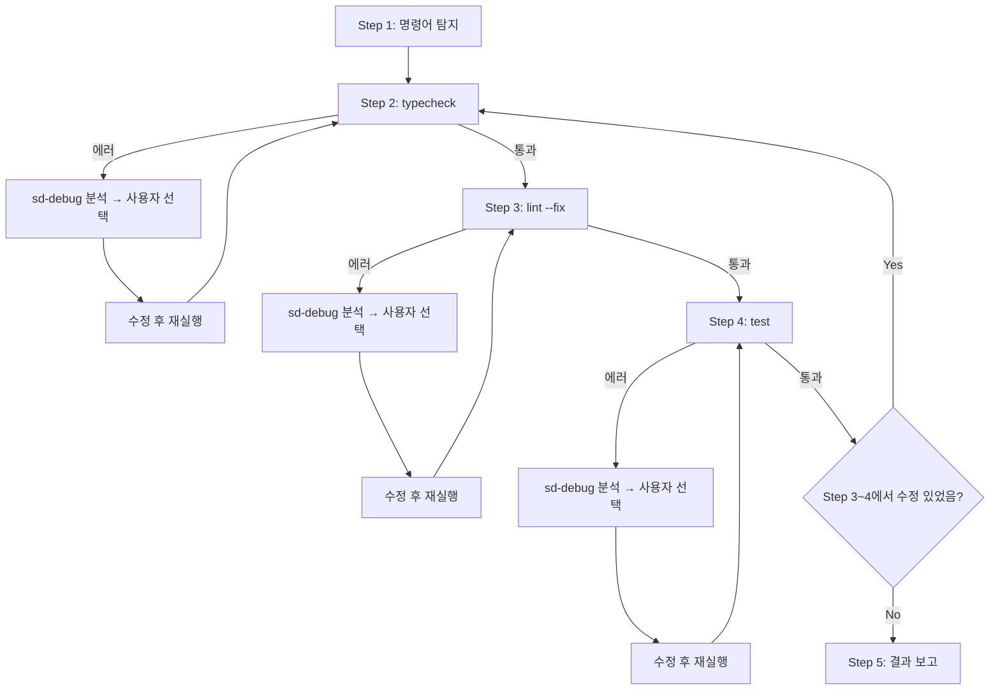

# sd-check: Check 실행 & 에러 수정

## 사용법

```
/sd-check [패키지경로]
```

- 패키지경로: 해당 디렉토리의 package.json 기준으로 실행. 생략 시 프로젝트 루트.

## 프로세스 흐름

아래 다이어그램이 전체 프로세스의 흐름이다. 각 노드의 상세 설명은 이후 섹션에서 기술한다.



- **내부 루프**: 각 Step(2, 3, 4)은 통과될 때까지 에러 분석 → 사용자 선택 → 수정 → 재실행
- **외부 루프**: Step 3~4에서 코드 수정이 있었으면 Step 2부터 다시

## Step 1: 명령어 탐지

### 1-1. 패키지 매니저 감지

프로젝트 루트에서 lock 파일로 패키지 매니저를 결정한다:

| lock 파일 | 실행 명령어 |
|-----------|------------|
| `pnpm-lock.yaml` | `pnpm run` |
| `yarn.lock` | `yarn run` |
| `bun.lock` 또는 `bun.lockb` | `bun run` |
| 그 외 | `npm run` |

### 1-2. 스크립트 탐지

1. **Read 도구**로 대상 디렉토리의 `package.json`을 읽는다
2. `scripts` 객체의 키 목록을 추출한다
3. 아래 패턴 테이블과 대조하여 각 카테고리에 매칭되는 스크립트 이름을 찾는다

| Step | 스크립트 이름 패턴 | 카테고리 |
|------|-------------------|----------|
| 2 | typecheck, type-check, tsc | 타입 체크 |
| 3 | lint, eslint | 린트 |
| 4 | test, jest, vitest, mocha | 테스트 |

### 1-3. 탐지 결과 표시

```
탐지된 check 스크립트:
1. typecheck → pnpm run typecheck
2. lint → pnpm run lint
3. test → pnpm run test
```

탐지된 스크립트가 없으면 사용자에게 실행할 명령어를 질문한다.

## Step 2: typecheck

typecheck 명령어를 실행한다. 통과하면 Step 3으로 진행한다. 실패하면 "에러 수정 규칙"에 따라 수정하고 재실행한다.

## Step 3: lint --fix

`--fix` 플래그를 붙여 린트를 실행한다 (예: `pnpm run lint -- --fix`). 자동 수정 후 남은 에러가 있으면 "에러 수정 규칙"에 따라 수정하고 재실행한다.

## Step 4: test

테스트 명령어를 실행한다. 실패하면 "에러 수정 규칙"에 따라 수정하고 재실행한다.

통과 후, Step 3(린트)~Step 4(테스트)에서 코드 수정이 있었으면 Step 2(typecheck)부터 다시 시작한다. 수정이 없었으면 Step 5로 진행한다.

## Step 5: 결과 보고

```markdown
## sd-check 결과

| Check | 상태 | 반복 횟수 |
|-------|------|-----------|
| typecheck | PASS | 2 |
| lint | PASS | 1 |
| test | PASS | 0 |

### 수정된 파일
- src/calc.ts
- src/utils.ts
```

남은 에러가 있으면 에러 메시지 목록을 함께 표시한다.

## 에러 수정 규칙

1. 에러 출력에서 파일 경로, 라인 번호, 에러 메시지를 파악한다
2. **`.claude/skills/sd-debug/SKILL.md`를 Read 도구로 읽고, 2~5단계를 수행한다.** 단, 문서 기록(6단계)은 수행하지 않는다.
3. 사용자가 선택한 방안에 따라 코드를 수정한다
