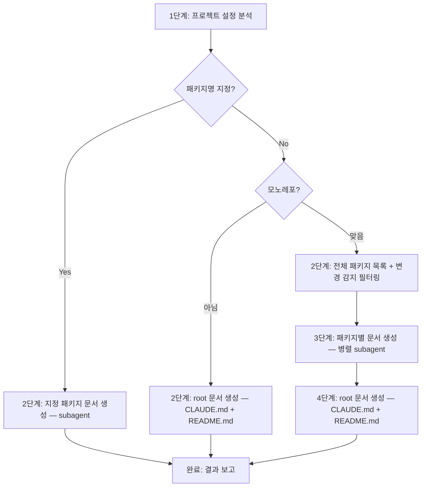

# sd-claude-docs: CLAUDE.md + README/docs 통합 생성

프로젝트를 분석하여 CLAUDE.md(LLM 컨텍스트)와 README.md/docs/(API 문서)를 한 번에 생성한다.
설정 파일, 스크립트, 소스 코드에서 검증 가능한 사실만 추출한다. 기존 문서가 있으면 섹션 단위로 병합한다.

## 사용법

```
/sd-claude-docs              ← 전체 패키지 대상
/sd-claude-docs angular      ← packages/angular 만
```

## 프로세스 흐름



## 1단계: 프로젝트 설정 분석

### 1-1. 패키지 매니저 감지

프로젝트 루트의 lock 파일로 식별한다:

1. `pnpm-lock.yaml` → pnpm
2. `yarn.lock` → yarn
3. `bun.lock` 또는 `bun.lockb` → bun
4. 그 외 → npm

### 1-2. 스크립트 분석

루트 `package.json`의 `scripts` 섹션을 읽고 각 스크립트의 CLI 도구를 분석한다.

- **잘 알려진 도구** (`tsc`, `vitest`, `eslint`, `prettier`, `playwright` 등): 명령어를 그대로 기록
- **커스텀 CLI 또는 프로젝트 내부 스크립트** (예: `tsx packages/.../cli.ts`): Bash에서 `--help`를 먼저 실행한다(5초 타임아웃). `--help`로 하위 명령어와 주요 옵션을 파악할 수 있으면 그 결과를 사용한다. `--help`가 실패하거나 유용한 정보가 없을 때에만 소스 코드를 Read로 분석한다

### 1-3. 코딩 규칙 추출

프로젝트 루트에서 아래 설정 파일을 찾아 읽는다 (없는 파일은 건너뛴다):

- ESLint: `eslint.config.*`, `.eslintrc.*`
- Prettier: `.prettierrc*`, `prettier.config.*`
- EditorConfig: `.editorconfig`
- TypeScript: `tsconfig.json` → `compilerOptions`
- Stylelint: `.stylelintrc*`, `stylelint.config.*`

아래 기준으로 규칙을 선별한다:

- 도구의 기본값과 다른 설정 (예: TypeScript `verbatimModuleSyntax: true`, Prettier `printWidth: 100`)
- error 수준의 비표준 규칙 (예: `no-console: error`)
- 특정 API를 금지하거나 요구하는 규칙 (예: `Buffer` 금지 → `Uint8Array` 사용)

### 1-4. .claude/rules/ 스캔

`.claude/rules/` 디렉토리가 존재하면 모든 `.md` 파일을 읽는다. 이미 다루고 있는 주제를 목록화한다. 해당 주제는 **CLAUDE.md에서 제외**한다 — 파일 간 규칙 중복은 LLM이 고유한 지침 대신 중복 컨텍스트를 처리하게 되어 지침의 효과를 약화시킨다.

## 2단계: 분기

### 패키지명 지정 시

`packages/{패키지명}/package.json`이 존재하는지 확인한다. 없으면 사용자에게 알린다.
존재하면 해당 패키지에 대해 subagent 1개를 실행한다 (3단계의 subagent 프롬프트와 동일).
root 문서는 생성·변경하지 않는다.

### 전체 실행 — 단일 패키지 프로젝트

`workspaces` 필드가 없고 `pnpm-workspace.yaml`도 없으면 단일 패키지다.
패키지별 CLAUDE.md는 생성하지 않는다. 바로 4단계로 진행하여 root 문서를 생성한다.
단, root README.md 생성 시 엔트리포인트 기반 API 문서화도 수행한다 — `package-doc-gen.md` 참조 파일의 Step 2~5를 root에 직접 적용한다.

### 전체 실행 — 모노레포

`packages/` 하위의 모든 패키지를 탐색한다.

#### 변경 감지 필터링

git 저장소인 경우, 문서 최종 커밋 이후 변경이 없는 패키지를 스킵한다. git 저장소가 아니면 모든 패키지를 처리 대상으로 한다.

각 패키지에 대해:
1. `packages/{name}/CLAUDE.md`, `README.md`, `docs/`가 마지막으로 수정된 커밋(`DOC_COMMIT`)을 찾는다
2. `DOC_COMMIT`이 없으면 (문서 미생성) → **처리 대상**
3. `DOC_COMMIT`의 부모부터 working tree까지, 문서 파일을 제외한 패키지 내 변경을 확인한다:
   ```bash
   git diff --quiet {DOC_COMMIT}~1 -- packages/{name}/ \
     ':!packages/{name}/CLAUDE.md' ':!packages/{name}/README.md' ':!packages/{name}/docs/'
   ```
   - 변경 있음 → **처리 대상**
   - 변경 없음 → **스킵**
4. `DOC_COMMIT`이 root 커밋(부모 없음)이면 → **처리 대상**

필터링 결과를 표시한다:

```
대상 패키지:
1. @simplysm/core-common (src 35파일) — 스킵 (변경 없음)
2. @simplysm/angular (src 126파일) — 처리 (변경 감지)
3. @simplysm/utils (src 8파일) — 처리 (문서 미존재)

처리 대상: 2개 / 스킵: 1개
```

처리 대상 패키지가 있으면 3단계로 진행한다. 전체 스킵이면 4단계(root 문서)로 진행한다.

## 3단계: 패키지별 문서 생성 (모노레포)

각 패키지에 대해 **Agent 도구로 subagent를 병렬 실행**한다. 하나의 메시지에서 모든 패키지의 Agent 호출을 동시에 보낸다.

### subagent 프롬프트

```
{패키지 경로}의 CLAUDE.md와 README.md를 생성한다.

## CLAUDE.md 생성

`.claude/skills/sd-claude-docs/references/package-claudemd.md`를 읽고 그 지침을 따른다.

루트 수준 설정 (이 내용과 동일한 정보는 패키지 CLAUDE.md에 반복하지 않는다):
{1단계에서 추출한 코딩 규칙 및 컴파일러 설정 목록}

## README.md 생성

`.claude/skills/sd-claude-docs/references/package-doc-gen.md`를 읽고 그 지침을 따른다.
{private: true인 경우} 이 패키지는 private이므로 README.md는 생성하지 않는다.
```

각 subagent는 소스 코드를 한 번 분석하여 CLAUDE.md(Key Patterns)와 README.md(API 문서) 모두에 활용한다.

### subagent 반환 정보

- CLAUDE.md 생성 여부
- README.md 생성 여부 + 문서 구조 (README 단독 / README + docs/)
- API 항목 수
- 생성된 파일 목록
- package.json files 변경 여부

## 4단계: root 문서 생성

### root CLAUDE.md

1단계의 정보를 조합하여 루트 CLAUDE.md 콘텐츠를 생성한다. `.claude/rules/`에서 이미 다루고 있는 주제(1-4단계에서 감지)는 제외한다.

**모노레포인 경우**: 3단계에서 생성된 각 패키지의 `CLAUDE.md`를 Read하여 참고한다. 패키지별 CLAUDE.md에 이미 기술된 상세 내용(아키텍처, 패턴 등)은 루트에 중복 기술하지 않고, 아키텍처 섹션에서 패키지 간 의존 관계와 역할 요약만 포함한다.

#### 포함할 섹션

- **프로젝트 정보**: `package.json`의 `name`과 `description`, 패키지 매니저
- **모노레포 구조**: `workspaces` 필드 또는 `pnpm-workspace.yaml`이 있으면 워크스페이스 경로를 나열하고 각 패키지를 간략히 설명 (패키지당 10단어 이내)
- **기술 스택**: `dependencies`/`devDependencies`의 주요 라이브러리 — 프레임워크, 번들러, 테스트 도구 (최대 10개)
- **명령어**: 1-2단계의 스크립트를 bash 코드 블록으로 포매팅하고 인라인 주석 추가, 카테고리별 그룹화
- **아키텍처**: 모노레포인 경우 패키지별 CLAUDE.md에서 역할을 읽어 패키지 간 의존 관계를 요약한다
- **코딩 규칙**: 1-3단계에서 선별한 규칙을 불릿 리스트로 포매팅

실질적 내용이 없는 섹션은 생략한다. 프로젝트에 필요하면 위 목록에 없는 섹션도 추가한다 (예: 통합 테스트).

#### 병합

- **기존 파일이 없는 경우**: 바로 저장
- **기존 파일이 있는 경우**:
  1. 기존 파일을 읽는다
  2. 새 콘텐츠와 기존 콘텐츠를 섹션(`##` 제목) 단위로 비교한다
  3. 병합 규칙:
     - 생성된 섹션과 동일한 주제의 기존 섹션 → 새 콘텐츠로 **대체**
     - 생성된 대응 섹션이 없는 기존 섹션 → 그대로 **보존**
     - 기존 섹션의 위치를 보존한다. 새로 생성된 섹션은 반드시 마지막 기존 섹션 뒤에 추가한다

#### 참고 예시

아래의 **섹션 구조와 포매팅 스타일**을 따른다. **CLAUDE.md는 반드시 대화언어로 작성한다.**

````markdown
# Simplysm

pnpm 모노레포. 패키지 경로: `packages/*`, 테스트: `tests/*`

## 명령어

모든 명령어는 내부적으로 `pnpm sd-cli <command>`를 실행한다.

### 개발

```bash
pnpm dev [targets..]                     # 서버 패키지를 개발 모드로 실행
pnpm watch [targets..]                   # 라이브러리 패키지를 watch 빌드
```

### 코드 품질

```bash
pnpm check [targets..]                   # 전체 검사 (typecheck + lint + test 병렬)
pnpm typecheck [targets..]               # TypeScript 타입 체크
```

## 아키텍처

의존 방향: 위 → 아래. `core-common`은 내부 의존성 없는 리프 패키지이다.

```
UI:       angular (Angular)
서비스:   service-server (Fastify) / service-client / service-common
코어:     core-common (중립) / core-browser / core-node
```

## 코딩 규칙

- `import type` 필수 (`verbatimModuleSyntax`), `#private` 금지 → `private` 키워드 사용
- `console.*` 금지, `Buffer` 금지 → `Uint8Array`
````

### root README.md

모노레포인 경우 패키지 목록 테이블을 생성한다. `private: true`인 패키지는 제외한다.

```markdown
# {monorepo 프로젝트명}

{루트 package.json의 description. 없으면 monorepo의 패키지 구성에서 추론하여 한 줄 요약}

## Packages

| Package | Description |
|---------|-------------|
| [`@simplysm/{name}`](./packages/{name}) | {package.json의 description} |
```

단일 패키지인 경우 `package-doc-gen.md`의 README 형식을 root에 직접 적용한다.

## 완료: 결과 보고

```markdown
## sd-claude-docs 결과

| 패키지 | 상태 | CLAUDE.md | README.md | 구조 | API 항목 수 |
|--------|------|-----------|-----------|------|-------------|
| root | — | 생성 | 생성 | — | — |
| @simplysm/core-common | 스킵 | — | — | — | — |
| @simplysm/angular | 처리 | 갱신 | 갱신 | README + docs/ | 126 |
| @simplysm/storage | 처리 | 생성 | 생성 | README 단독 | 8 |
| @simplysm/internal | 처리 | 생성 | — (private) | — | — |

### 생성된 파일 목록
- CLAUDE.md (root)
- README.md (root)
- packages/core-common/CLAUDE.md
- packages/core-common/README.md
- packages/core-common/docs/types.md
- ...
```
