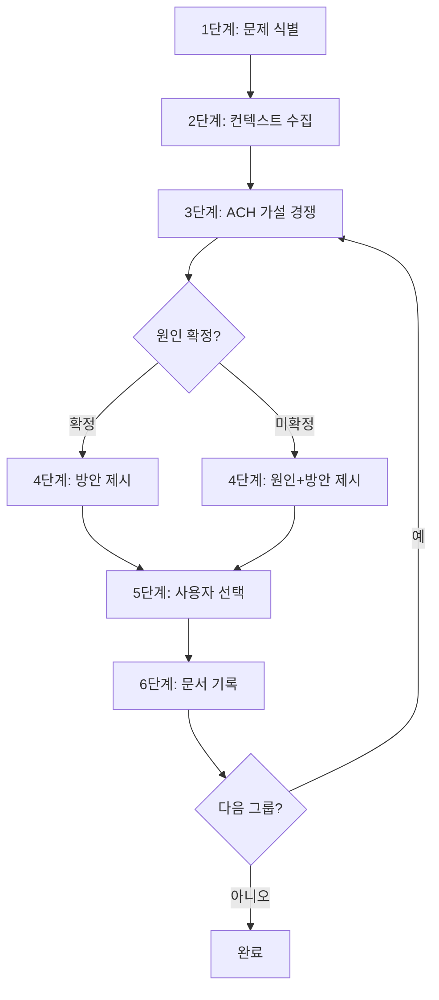
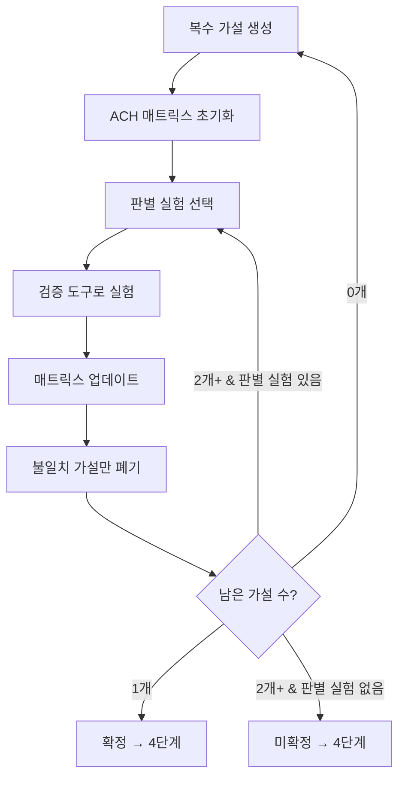

# sd-debug: 근본 원인 디버깅

## 프로세스 흐름



## 1단계: 문제 식별

사용자 입력에서 다음을 추출한다:

- **에러 메시지** — 있으면 원문 그대로 인용
- **위치** — 파일 경로, 라인 번호
- **재현 조건** — 에러가 언제/어떻게 발생하는지

정보가 부족하면 `AskUserQuestion`으로 질문한다. 절대 추측하지 않는다.

## 2단계: 컨텍스트 수집

에러 관련 코드를 읽고 이해를 구축한다:

- 에러가 발생하는 파일 읽기
- 호출 체인 추적 — 해당 함수의 호출자와 피호출자
- 관련 타입 정의, 설정 파일 확인

에러가 여러 개인 경우, 근본 원인이 같은 에러끼리 그룹으로 묶는다. (에러가 1개이면 그룹핑 생략)

그룹핑 기준:
- 동일한 코드 경로에서 발생하는 에러
- 같은 변수/프로퍼티 참조에서 파생된 에러
- 하나를 수정하면 나머지도 해결되는 에러

그룹핑 결과를 사용자에게 표시한 뒤, 각 그룹에 대해 3~6단계를 수행한다.

```
에러 그룹핑 결과:
- 그룹 1 ({N}개): {공통 원인 요약}
  - 에러 1: {메시지}
  - 에러 2: {메시지}
- 그룹 2 ({N}개): {공통 원인 요약}
  - 에러 3: {메시지}
```

## 3단계: 근본 원인 추적 (ACH)



### 초기화

**복수 가설 생성:** 수집된 컨텍스트로부터 원인 가설을 **2개 이상** 세운다. 다음 카테고리를 고려하여 다양한 가설을 확보한다:

- 입력/데이터 문제
- 상태 관리 문제
- 타이밍/순서 문제
- 타입/형변환 문제
- 환경/설정 문제
- 최근 변경에 의한 회귀

**ACH 매트릭스 초기화:** 가설 x 증거 매트릭스를 구성한다. 현재까지 수집된 증거(에러 메시지, 재현 조건, 코드 분석 결과)를 초기 증거로 등록한다.

각 셀은 다음 중 하나:

- **C (Consistent):** 증거가 가설과 일치
- **I (Inconsistent):** 증거가 가설과 불일치 — 코드에서 직접 관찰 가능한 모순이 있을 때만 표시. 추론/추측에 의한 I 표시 금지.
- **N (Neutral):** 증거가 가설과 무관

### 반복: 실험 → 업데이트 → 폐기

**판별 실험 선택:** 가설을 가장 많이 구분할 수 있는 검증 도구를 선택하여 실험한다.

| 검증 도구 | 적용 조건 |
|---|---|
| **역추적** | 스택 트레이스가 있거나 에러 발현 지점이 명확할 때 |
| **데이터 흐름 추적** | 잘못된 값이 출력되거나 변환 파이프라인을 거칠 때 |
| **변경 이력 분석** | "이전엔 됐는데 안 됨", 회귀가 의심될 때 |
| **제약 조건 추론** | 간헐적이거나 특정 환경/입력에서만 발생할 때 |

**매트릭스 업데이트:** 실험 결과를 새 증거로 추가하고, 각 가설에 대해 C/I/N을 표시한다.

**가설 폐기:** I(불일치)가 있는 가설만 폐기한다.

### 분석 한계 명시

런타임 데이터(API 응답, DB 결과 등)를 직접 확인할 수 없는 경우, 그 한계를 ACH 결과에 명시한다 — "실제 데이터를 확인하지 못했으므로 추정에 기반한 판정"임을 밝힌다.

### 종료 조건

- **남은 가설 1개** → 확정 → 4단계 (방안만 경쟁)
- **남은 가설 2개 이상 & 추가 판별 실험 없음** → 미확정 → 4단계 (원인+방안 경쟁)
- **남은 가설 0개** → 가설 생성 단계로 회귀 (누락된 원인 존재)

### 검증 도구 상세

#### 역추적 (Backward Reasoning)

에러 발현 지점에서 출발하여 원인 방향으로 거슬러 올라간다:

1. 에러 발생 라인의 변수 상태 확인
2. 해당 변수의 마지막 할당(definition) 위치 추적
3. 잘못된 값이 최초로 유입된 지점까지 반복

#### 데이터 흐름 추적 (Data Flow Tracing)

데이터의 생명주기를 따라가며 불일치 지점을 찾는다:

1. Input 지점 식별 (API 요청, DB 읽기, 사용자 입력 등)
2. Transform 체인을 순서대로 나열 (함수 호출, 매핑, 직렬화 등)
3. 각 단계의 기대값 vs 실제값 비교
4. 최초 불일치 지점 = 버그 위치

#### 변경 이력 분석 (Change History Analysis)

최근 변경과 버그의 상관관계를 분석한다:

1. 버그 발생 시점 전후의 코드 변경 조회 (`git log`, `git diff`)
2. 에러 관련 파일과 변경된 파일의 교집합 분석
3. 변경 내용의 의미적 분석 (리팩토링 vs 로직 변경 vs API 계약 변경)

#### 제약 조건 추론 (Constraint-based Reasoning)

발생/비발생 조건을 체계적으로 좁혀간다:

1. 발생 조건 수집: 어떤 입력/환경/순서에서 발생하는가?
2. 비발생 조건 수집: 어떤 경우 발생하지 않는가?
3. 차이 분석: 발생/비발생 조건의 차이가 원인을 가리킴

### 출력 형식

```
[가설]
H1: {가설1}
H2: {가설2}
H3: {가설3}

[ACH 매트릭스]
|    | 증거1: ... | 증거2: ... | 증거3: ... |
|----|-----------|-----------|-----------|
| H1 | C         | C         | N         |
| H2 | N         | C         | I → 폐기   |
| H3 | I → 폐기   | N         | N         |

[결과]
확정: H1 — {근본 원인 설명}
또는
미확정: H1, H2 — 판별 불가, 4단계에서 사용자 판단 요청
```

## 4단계: 방안 제시

`.claude/rules/sd-option-scoring.md`의 규칙을 따른다.

### 원인 확정 시 (후보 1개)

근본 원인에 대해 **최소 2개** 이상의 해결 방안을 선택지로 제시한다.

| 항목 | 설명 |
|------|------|
| 이름 | 간결한 한 줄 요약 |
| 설명 | 코드 예시를 포함한 구현 방향 |
| 장점 | 이 접근법의 강점 |
| 반론 | 이 접근법의 약점/리스크를 적극적으로 공격 |
| 점수 | `.claude/rules/sd-option-scoring.md` 기준 |

### 원인 미확정 시 (후보 2개 이상)

원인별 해결 방안을 묶어 선택지로 제시한다. 각 "원인X.방안Y"가 하나의 선택지이다.

```
원인 1: {원인 요약}
  반론: {이 원인이 아닐 수 있는 이유}
  - 1.1 {해결방안}: {설명}
    장점: ... / 반론: ...
    점수: {관점별} → 평균 {N}/10
  - 1.2 {해결방안}: {설명}
    장점: ... / 반론: ...
    점수: {관점별} → 평균 {N}/10

원인 2: {원인 요약}
  반론: {이 원인이 아닐 수 있는 이유}
  - 2.1 {해결방안}: {설명}
    장점: ... / 반론: ...
    점수: {관점별} → 평균 {N}/10
```

### 공통 규칙

- **모든 선택지에 반론 필수** — 반론이 없는 선택지는 검증되지 않은 것이다
- **동점 금지** — 평균이 같으면 근본성 관점으로 결정
- **최고 점수 선택지를 명시적으로 추천** — 추천 사유를 한 줄로 요약

## 5단계: 사용자 선택

방안 제시 결과를 텍스트로 출력한 뒤 `---` 구분선을 출력하고, `AskUserQuestion`으로 사용자에게 선택을 요청한다.

- **원인 확정 시:** 해결 방안을 선택 (예: "방안 A", "방안 B")
- **원인 미확정 시:** 원인.방안을 선택 (예: "1.1", "1.2", "2.1")

## 6단계: 문서 기록

사용자가 방안을 선택한 후, 전체 분석과 선택 결과를 문서에 기록한다.

### 출력 경로

`.tasks/{yyMMddHHmmss}_debug-{topic}/debug.md`

- `{yyMMddHHmmss}` — Bash `date +%y%m%d%H%M%S`로 취득. LLM이 생성한 타임스탬프 금지
- `{topic}` — 에러/이슈의 핵심을 나타내는 간결한 키워드 (예: `null-ref`, `race-condition`, `async-init`)

### debug.md 형식

```markdown
# 디버그: {에러 한 줄 요약}

## 에러 증상

- **에러 메시지:** `{원문}`
- **위치:** `{file_path:line_number}`
- **재현:** {설명}

## 근본 원인 추적 (ACH)

### ACH 매트릭스

|    | 증거1: ... | 증거2: ... | ... |
|----|-----------|-----------|-----|
| H1: {가설} | C/I/N | ... | ... |
| H2: {가설} | C/I/N | ... | ... |

### 결과: {확정 — H1 / 미확정 — H1, H2}

## 해결 방안

<!-- 확정 시: 방안만 나열 -->
### 방안 A: {이름}
- **설명:** {구현 방향, 코드 예시 포함}
- **장점:** {강점}
- **반론:** {약점/리스크}
- **점수:** {관점별 N}/10 → **평균 {N}/10**

<!-- 미확정 시: 원인+방안 묶음 -->
### 원인 1: {원인 요약}
- **반론:** {이 원인이 아닐 수 있는 이유}
- 1.1 {해결방안}: 장점 / 반론 / 점수
- 1.2 {해결방안}: 장점 / 반론 / 점수

### 원인 2: {원인 요약}
- **반론:** {이 원인이 아닐 수 있는 이유}
- 2.1 {해결방안}: 장점 / 반론 / 점수

## 선택 결과

**{방안 A 또는 1.1}** (평균 {N}/10)

{선택 사유 또는 사용자 코멘트}
```

## 완료 후 출력

대화에 다음을 표시한다:

- 근본 원인 한 줄 요약
- 선택된 방안과 평균 점수
- `debug.md` 파일 경로
- 수정이 필요하면 `/sd-dev`로 개발을 진행할 수 있다는 안내
