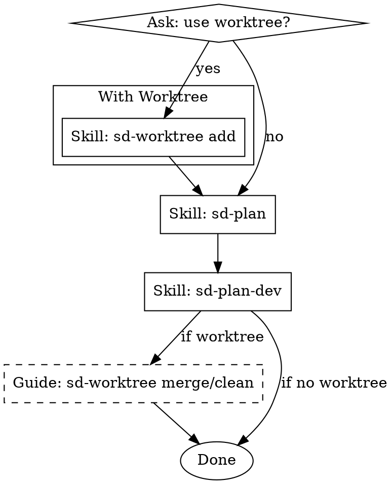

# Design to Development Pipeline

## Overview

Orchestrate the full design-to-development pipeline after sd-brainstorm. Asks about branch isolation, then chains the right skills automatically.

## The Process

### Step 1: Ask about worktree

Ask the user (via AskUserQuestion):

> "Worktree로 브랜치를 분리할까요?"
> - Yes (Recommended) — 별도 브랜치에서 작업 후 merge
> - No — 현재 브랜치에서 직접 작업

### Step 2: Worktree setup (if yes)

Invoke `/sd-worktree` with `add` and the feature name derived from the brainstorm context.

After worktree is created, continue to Step 3 (do NOT stop).

### Step 3: Plan

Invoke `/sd-plan` — creates the implementation plan from the design.

After plan is saved and user approves, continue to Step 4 (do NOT stop).

### Step 4: Execute

Invoke `/sd-plan-dev` — executes the plan task-by-task with parallel agents and reviews.

### Step 5: Post-completion guide (worktree only)

If a worktree was created in Step 2, inform the user:

> "구현이 완료되었습니다. 다음 명령으로 merge 및 정리를 진행하세요:"
> 1. `/sd-worktree merge` — worktree 브랜치를 main에 merge
> 2. `/sd-worktree clean <name>` — worktree 제거 및 브랜치 삭제

Do NOT execute merge/clean automatically.

## Key Rules

- Each skill invocation follows that skill's own process completely
- Do NOT skip any skill in the chain
- If any skill asks for user input, wait for the answer before proceeding
- After sd-plan-dev completes, do NOT auto-merge — guide only
