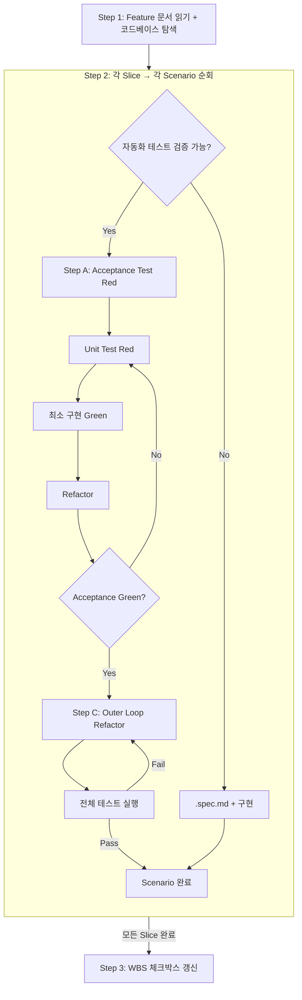

# sd-dev-tdd: TDD 개발

Feature 문서(요구명세 + 구현계획)를 기반으로, Double Loop TDD로 코드를 구현한다.

개발 프로세스:
- 분해 (`/sd-wbs`) — 선택적 전 단계
- 요구명세 (`/sd-dev-spec`) → 구현계획 (`/sd-dev-plan`) → **TDD 개발** (`/sd-dev-tdd`) ← 현재 — 이 3단계는 `/sd-dev`로 순차 실행

## 입력과 산출물

- **입력:** Feature 문서 (요구명세 + 구현계획) + 코드베이스
- **산출물:** 테스트된 코드 + 수동 테스트 문서 (`.spec.md`, 해당 시) + WBS 체크박스 갱신 (`[x]`)

## 프로세스 흐름

아래 다이어그램이 전체 프로세스의 흐름이다. 각 노드의 상세 설명은 이후 섹션에서 기술한다.



## Step 1: Feature 문서 읽기 + 코드베이스 탐색

### Feature 문서 읽기

Feature 문서 경로를 다음 우선순위로 결정한다:
1. 사용자가 경로를 지정했으면 그것을 사용한다
2. 대화 맥락에서 경로를 알 수 있으면 그것을 사용한다
3. 둘 다 없으면 AskUserQuestion으로 사용자에게 물어본다 (`.claude/rules/sd-option-scoring.md`의 규칙을 따른다)

Feature 문서에는 다음 두 섹션이 **전제 조건**으로 필요하다:
- `## 요구명세` — Gherkin Scenarios
- `## 구현계획` — Tech Design Doc + Vertical Slices

Feature 문서의 `## 참조 자료` 하위에 `### 설계 결정` 섹션이 있으면 반드시 함께 읽는다. 이전 단계(sd-dev-spec, sd-dev-plan)에서 결정된 사항과 그 근거가 기록되어 있으므로, 구현 시 이 결정들을 준수해야 한다.

Feature 문서에 `## 참조 자료` 섹션이 있으면 함께 읽는다. wbs.md 링크가 있으면 해당 wbs.md의 참조 자료 섹션을 Read 도구로 읽는다. 참조 자료의 구체적 정보(업무 규칙, 데이터 형식, 기술 제약 등)를 구현에 반영한다.

둘 중 하나라도 없으면 즉시 중단한다 — 누락 사실을 알리고 `/sd-dev-spec` 또는 `/sd-dev-plan` 실행을 안내한 뒤 종료한다. 구현계획을 자동 생성하거나 생략하는 것은 금지다 — 반드시 `/sd-dev-plan`에서 사용자 확인을 거쳐야 한다.

### 코드베이스 탐색

**코드가 source of truth이다.** 문서와 코드가 다르면 코드를 기준으로 한다.

탐색 대상:
- 구현계획에서 언급된 파일/모듈/엔티티
- 기존 테스트 구조와 컨벤션 (테스트 프레임워크, 파일 위치, 네이밍 패턴)
- 관련 의존성과 설정

### 현재 상태 확인

Slice 목록과 각 Slice에 매핑된 Scenario를 사용자에게 표시한다. 이미 구현된 부분이 있으면 현재 진행 상태를 파악하여 알린다.

### 문서 정합성 확인

요구명세의 각 Scenario에서 참조하는 기능·메서드를 구현계획과 대조한다. 구현계획에 누락된 기능이 있으면 역방향 피드백으로 구현계획을 수정한 뒤 TDD를 시작한다.

## Step 2: Double Loop TDD

구현계획의 Slice 순서대로 진행한다. 각 Slice 내에서 Scenario를 하나씩 처리한다. Scenario를 자동화 테스트로 검증할 수 있으면 Double Loop TDD(Step A → B → C)로, 불가능하면 `.spec.md` 수동 테스트 문서로 처리한다.

### Step A. Acceptance Test 작성 (Red)

Gherkin Scenario의 Given/When/Then을 프로젝트 테스트 프레임워크의 Acceptance Test로 변환한다. Gherkin은 스펙 문서용이다 — Cucumber 등 BDD 러너를 사용하지 않고, 프로젝트의 일반 테스트 프레임워크로 작성한다. Scenario 하나를 하나의 test 함수로 변환하되, Scenario 내 여러 When/Then이 있으면 하나의 test 함수 안에서 순차 검증한다(통합 수준). 테스트를 실행하여 실패(Red)를 확인한다.

**CRITICAL: 테스트는 대상 코드를 import하여 실제로 호출·실행해야 한다.** 소스 파일을 `readFileSync`로 읽어 문자열 포함 여부(`toContain`/`toMatch`)만 확인하는 것은 테스트가 아니다 — 그것은 grep이다. 프레임워크 의존성(Angular TestBed, jsdom 등)이 필요하면 세팅한다. 설정 파일(package.json, tsconfig.json 등)의 값 검증만 예외로 허용한다.

### Step B. Inner Loop: Unit TDD (Red-Green-Refactor 반복)

Acceptance Test를 통과시키기 위해 **반드시 Unit Test를 먼저 작성한다** — 내부 루프를 최소 1회 수행해야 한다. 한 번에 하나의 Unit Test만 추가하고 큰 도약을 하지 않는다.

- Acceptance Test가 통합 수준(Scenario 전체 흐름)이면, Unit Test는 각 개별 메서드/동작을 별도 test로 분리한다
- **단일 메서드 호출이더라도 Inner Loop를 생략하지 않는다** — Acceptance Test에 없는 추가 케이스(경계값, 에러, 빈 입력 등)를 최소 1개 작성한다

- **Unit Test 작성 (Red)** — Acceptance Test와 별개의 도구 호출(Write/Edit)로 작성한다
- **최소 구현 (Green)** — Unit Test를 통과시키는 최소한의 코드를 작성한다
- **Refactor** — 방금 작성한 코드 범위에서 ~1분 스케일로: 중복 제거, 하드코딩 제거(Fake It → 실제 구현), 네이밍 개선, Extract Variable/Method. 모듈·아키텍처 수준 정리는 여기서 하지 않는다 — 그것은 Step C의 영역이다.

Acceptance Test가 아직 실패하면 다시 Unit Test 작성으로 돌아간다. Acceptance Test가 통과하면 Step C로 진행한다.

### Step C. Outer Loop Refactor

Acceptance Test가 안전망이므로 프로덕션 코드와 테스트 코드를 안전하게 정리할 수 있다. Inner Loop Refactor가 방금 작성한 코드의 ~1분 스케일 정리라면, Outer Loop Refactor는 Scenario 단위의 설계 개선이다.

#### 제약 규칙

- **한 번에 하나의 리팩토링만** — 각 변경은 작고 기계적이어야 한다
- **매 리팩토링 후 테스트 실행** — 실패하면 방금 변경한 부분에 문제가 있다
- **기능 추가 금지 (Two Hats)** — 리팩토링 중 새 기능·새 테스트를 추가하지 않는다
- **이번 Scenario에 필요한 만큼만** — 과도한 리팩토링도 낭비다 (Beck, Canon TDD)
- **Rule of Three** — 코드가 3회 반복되면 추상화한다 — 2회까지는 미룬다. 성급한 추상화를 방지한다

#### 프로덕션 코드 점검

Code Smell을 트리거로 판단하고, 대응하는 기법을 적용한다:

| Code Smell | 리팩토링 기법 |
|---|---|
| Long Method / 복잡한 분기 | Extract Method |
| 하나의 클래스가 여러 책임 (SRP 위반) | Extract Class |
| 다른 클래스의 데이터를 과도하게 사용 (Feature Envy) | Move Method |
| 중복 코드 (3회 이상 반복) | Extract Method 후 공유 |
| Primitive Obsession | Replace Primitive with Object |
| 네이밍이 의도를 드러내지 않음 | Rename |

해당하는 smell이 없으면 "정리 대상 없음"으로 기록한다.

#### 테스트 코드 점검

- **소스 텍스트 매칭 테스트 전환/삭제** — Step A의 CRITICAL 규칙 위반 테스트를 실제 import/호출 방식으로 전환한다. 설정 파일 값 검증만 예외
- **Scaffolding test 삭제** — 클래스/메서드 존재 확인 등 기대 동작을 인코딩하지 않는 테스트
- **중복 Unit Test 삭제** — Acceptance Test와 동일한 검증을 중복하는 Unit Test
- **구현 결합 테스트 전환/삭제** — 내부 상태 값, 메서드 호출 횟수 등 구현 세부사항을 검증하는 테스트
- **공통 setup 추출** — 중복되는 arrange 코드를 헬퍼/beforeEach로
- **테스트 네이밍 개선** — 검증하는 동작을 문장처럼 읽히게

점검 결과(수정 내용 또는 "정리 대상 없음")를 출력에 기록한다. 정리 후 전체 테스트를 실행한다. 실패하면 수정하고 재테스트한다. 전체 Pass 후 다음 Scenario로 진행한다.

### 수동 테스트 문서 (.spec.md)

실제 하드웨어에서만 동작을 확인할 수 있어 mock이 무의미한 Scenario(USB, NFC, 하드웨어 버튼 등)는 `.spec.md` 파일로 수동 테스트 절차를 문서화하고, 구현 코드를 작성한다.

```markdown
# {Scenario 제목}

## 전제 조건
- {테스트 전 필요한 상태/환경}

## 수행 절차
1. {사용자가 수행할 단계}
2. ...

## 기대 결과
- {관찰되어야 하는 결과}
```

### Slice 완료

Slice의 모든 Scenario가 완료(Step A → B → C 또는 .spec.md)되면:
1. 전체 테스트 스위트를 실행하여 회귀가 없는지 확인한다
2. Feature 문서 `## 구현계획`에서 해당 Slice의 체크박스를 `[x]`로 갱신한다

## Step 3: Feature 완료

모든 Slice가 완료되면:
1. 전체 테스트 스위트를 최종 실행한다
2. WBS 파일(`wbs.md`)에서 해당 Feature의 `[ ]`를 `[x]`로 갱신한다

### 체크박스 갱신 시점 정리

| 시점 | 갱신 대상 | 내용 |
|------|-----------|------|
| Slice 완료 | Feature 문서 `## 구현계획` | 해당 Slice `[ ]` → `[x]` |
| Feature 완료 | `wbs.md` | 해당 Feature `[ ]` → `[x]` |

## 역방향 피드백

TDD 진행 중 변경·발견된 모든 사항은, 영향받는 모든 문서(wbs.md, Feature 문서의 요구명세·구현계획·설계 결정)에 빠짐없이 반영한다. 발견한 누락·불일치는 "사소하다" "매핑은 맞다" 등의 이유로 수정을 생략하지 않는다 — 문서 간 정합성을 항상 유지한다. 이 스킬 내에서 직접 수정한다 — 별도 `/sd-dev-spec`이나 `/sd-dev-plan` 재실행은 불필요하다. 단, 섹션 자체의 신규 작성은 이전 단계의 영역이다. 변경 내용과 사유를 사용자에게 명확히 알린다.
역방향 피드백의 주요 목적은, 새로운 세션에서 다른 작업을 수행할때 이 세션의 결정사항을 잊지 않고 이어서 하기 위함이다.
