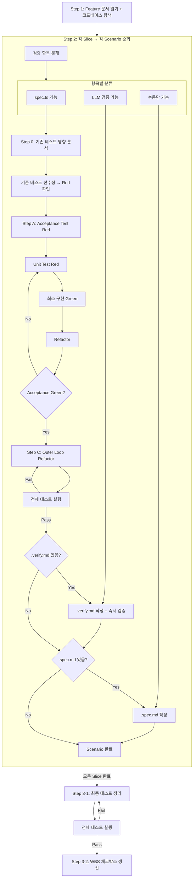

# sd-dev-tdd: TDD 개발

Feature 문서(요구명세 + 구현계획)를 기반으로, Double Loop TDD로 코드를 구현한다.

개발 프로세스:
- 분해 (`/sd-wbs`) — 선택적 전 단계
- 요구명세 (`/sd-dev-spec`) → 구현계획 (`/sd-dev-plan`) → **TDD 개발** (`/sd-dev-tdd`) ← 현재 — 이 3단계는 `/sd-dev`로 순차 실행

## 입력과 산출물

- **입력:** Feature 문서 (요구명세 + 구현계획) + 코드베이스
- **산출물:** 테스트된 코드 + 검증 문서 (`.verify.md`, `.spec.md`, 해당 시) + WBS 체크박스 갱신 (`[x]`)

## 프로세스 흐름

아래 다이어그램이 전체 프로세스의 흐름이다. 각 노드의 상세 설명은 이후 섹션에서 기술한다.


```mermaid
flowchart TD
    S1[Step 1: Feature 문서 읽기 + 코드베이스 탐색] --> S2

    subgraph S2[Step 2: 각 Slice → 각 Scenario 순회]
        direction TB
        DECOMP[검증 항목 분해] --> CLASSIFY

        subgraph CLASSIFY[항목별 분류]
            direction LR
            AUTO[spec.ts 가능]
            LLM_V[LLM 검증 가능]
            MANUAL[수동만 가능]
        end

        AUTO --> S0[Step 0: 기존 테스트 영향 분석]
        S0 --> S0RED[기존 테스트 선수정 → Red 확인]
        S0RED --> A[Step A: Acceptance Test Red]
        A --> UT[Unit Test Red]
        UT --> IMPL[최소 구현 Green]
        IMPL --> IREF[Refactor]
        IREF --> ACHK{Acceptance Green?}
        ACHK -->|No| UT

        ACHK -->|Yes| C[Step C: Outer Loop Refactor]
        C --> CRUN[전체 테스트 실행]
        CRUN -->|Fail| C
        CRUN -->|Pass| VER_CHK{.verify.md 있음?}

        LLM_V --> VERIFY[.verify.md 작성 + 즉시 검증]
        MANUAL --> SPECMD[.spec.md 작성]

        VER_CHK -->|Yes| VERIFY
        VER_CHK -->|No| SPECMD_CHK{.spec.md 있음?}
        VERIFY --> SPECMD_CHK
        SPECMD_CHK -->|Yes| SPECMD
        SPECMD_CHK -->|No| DONE[Scenario 완료]
        SPECMD --> DONE
    end

    S2 -->|모든 Slice 완료| S3_1[Step 3-1: 최종 테스트 정리]
    S3_1 --> S3_1RUN[전체 테스트 실행]
    S3_1RUN -->|Fail| S3_1
    S3_1RUN -->|Pass| S3_2[Step 3-2: WBS 체크박스 갱신]
```

## Step 1: Feature 문서 읽기 + 코드베이스 탐색

### Feature 문서 읽기

Feature 문서 경로를 다음 우선순위로 결정한다:
1. 사용자가 경로를 지정했으면 그것을 사용한다
2. 대화 맥락에서 경로를 알 수 있으면 그것을 사용한다
3. 둘 다 없으면 AskUserQuestion으로 사용자에게 물어본다 (`.claude/rules/sd-option-scoring.md`의 규칙을 따른다)

Feature 문서에는 다음 두 섹션이 **전제 조건**으로 필요하다:
- `## 요구명세` — Gherkin Scenarios
- `## 구현계획` — Tech Design Doc + Vertical Slices

Feature 문서의 `## 참조 자료` 하위에 `### 설계 결정` 섹션이 있으면 반드시 함께 읽는다. 이전 단계(sd-dev-spec, sd-dev-plan)에서 결정된 사항과 그 근거가 기록되어 있으므로, 구현 시 이 결정들을 준수해야 한다.

**CRITICAL: 설계 결정은 사용자가 확정한 구속력 있는 결정이다. 구현 중 기술적 어려움이 발견되더라도 설계 결정을 임의로 변경·축소·제외하는 것은 절대 금지다. 기술적 어려움으로 설계 결정을 그대로 구현할 수 없는 경우, 해당 Slice의 구현을 중단하고 역방향 피드백으로 사용자에게 돌아가야 한다. 사용자만이 설계 결정을 변경할 수 있다.**

Feature 문서에 `## 참조 자료` 섹션이 있으면 함께 읽는다. wbs.md 링크가 있으면 해당 wbs.md의 참조 자료 섹션을 Read 도구로 읽는다. 참조 자료의 구체적 정보(업무 규칙, 데이터 형식, 기술 제약 등)를 구현에 반영한다.

둘 중 하나라도 없으면 즉시 중단한다 — 누락 사실을 알리고 `/sd-dev-spec` 또는 `/sd-dev-plan` 실행을 안내한 뒤 종료한다. 구현계획을 자동 생성하거나 생략하는 것은 금지다 — 반드시 `/sd-dev-plan`에서 사용자 확인을 거쳐야 한다.

### 코드베이스 탐색

**코드가 source of truth이다.** 문서와 코드가 다르면 코드를 기준으로 한다.

탐색 대상:
- 구현계획에서 언급된 파일/모듈/엔티티
- 기존 테스트 구조와 컨벤션 (테스트 프레임워크, 파일 위치, 네이밍 패턴)
- 관련 의존성과 설정

### 현재 상태 확인

Slice 목록과 각 Slice에 매핑된 Scenario를 사용자에게 표시한다. 이미 구현된 부분이 있으면 현재 진행 상태를 파악하여 알린다.

### 문서 정합성 확인

요구명세의 각 Scenario에서 참조하는 기능·메서드를 구현계획과 대조한다. 구현계획에 누락된 기능이 있으면 역방향 피드백으로 구현계획을 수정한 뒤 TDD를 시작한다.

## Step 2: Double Loop TDD

구현계획의 Slice 순서대로 진행한다. 각 Slice 내에서 Scenario를 하나씩 처리한다.

**CRITICAL: 판단 단위는 Scenario가 아니라 검증 항목이다.** Scenario에 하드웨어 의존이 하나라도 있다고 Scenario 전체를 수동 테스트로 분류하는 것은 금지다. 먼저 Scenario의 검증 항목을 분해하고, 각 항목별로 분류한다:

| 분류 | 기준 | 산출물 |
|------|------|--------|
| **자동 테스트** | import하여 호출·실행·단언 가능 (순수 함수, 상태 변경, 분기 로직 등) | `.spec.ts` → TDD |
| **LLM 검증** | 자동 테스트는 불가하지만 LLM이 코드 읽기·명령 실행·설정 확인으로 검증 가능 | `.verify.md` → 즉시 수행 |
| **수동 검증** | 실제 하드웨어·물리적 UI 조작 등 LLM이 절대 수행할 수 없는 항목 | `.spec.md` → 문서화 |

하나의 Scenario에서 3종류가 모두 나올 수 있다. 각 분류에 해당하는 항목이 없으면 해당 파일은 생성하지 않는다.

### 테스트 파일 네이밍 및 배치

- **CRITICAL: Slice/Scenario 번호를 파일명에 사용하지 않는다** — `3.1-bootstrap.spec.ts` (X), `bootstrap.spec.ts` (O)
- 파일명은 테스트 대상 모듈/클래스/함수 이름을 기반으로 한다
- 기존 테스트 디렉토리 구조를 따른다 — 프로젝트에 `tests/` 디렉토리가 있으면 그 하위에 소스 구조를 미러링한다 (예: `packages/{pkg}/tests/{category}/{대상}.spec.ts`)
- 새 패키지라 기존 테스트가 없으면, 같은 모노레포의 다른 패키지 테스트 구조를 참고한다
- Acceptance Test: `{대상}.acc.spec.ts`, Unit Test: `{대상}.spec.ts`

### Step 0. 기존 테스트 영향 분석 + 선수정

각 Slice 시작 시, 구현 전에 기존 테스트부터 점검한다.

**CRITICAL: 여러 Slice를 한번에 구현하는 것은 금지다.** 반드시 한 Slice씩 Step 0 → A → B → C 사이클을 완료한 뒤 다음 Slice로 진행한다.

#### 절차

1. **영향 범위 탐색** — 이번 Slice에서 변경·추가·삭제할 코드(함수, 클래스, 타입, 인터페이스)를 구현계획에서 식별한다
2. **기존 테스트 탐색** — 해당 코드를 import하거나 호출하는 기존 테스트 파일을 Grep/Glob으로 찾는다
3. **영향 판정** — 찾은 테스트 중, 이번 Slice의 변경으로 인해 기대값·시그니처·동작이 달라져야 하는 테스트를 식별한다
4. **기존 테스트 선수정** — 영향받는 테스트의 기대값을 새 스펙에 맞게 수정한다 (구현은 아직 변경하지 않는다)
5. **Red 확인** — 수정된 기존 테스트를 실행하여 실패(Red)를 확인한다. 아직 구현이 변경되지 않았으므로 실패해야 한다. 만약 이미 통과하면 테스트 수정이 잘못된 것이므로 재점검한다
6. 영향받는 기존 테스트가 없으면 "영향받는 기존 테스트 없음"을 기록하고 Step A로 진행한다

이후 Step B에서 구현을 변경하면, 기존 테스트와 새 테스트가 함께 Green이 되어야 한다.

### Step A. Acceptance Test 작성 (Red)

Gherkin Scenario의 Given/When/Then을 프로젝트 테스트 프레임워크의 Acceptance Test로 변환한다. Gherkin은 스펙 문서용이다 — Cucumber 등 BDD 러너를 사용하지 않고, 프로젝트의 일반 테스트 프레임워크로 작성한다. Scenario 하나를 하나의 test 함수로 변환하되, Scenario 내 여러 When/Then이 있으면 하나의 test 함수 안에서 순차 검증한다(통합 수준). 테스트를 실행하여 실패(Red)를 확인한다.

**CRITICAL: 테스트는 대상 코드를 import하여 실제로 호출·실행해야 한다.** 소스 파일을 `readFileSync`로 읽어 문자열 포함 여부(`toContain`/`toMatch`)만 확인하는 것은 테스트가 아니다 — 그것은 grep이다. 프레임워크 의존성(Angular TestBed, jsdom 등)이 필요하면 세팅한다. 설정 파일(package.json, tsconfig.json 등)의 값 검증만 예외로 허용한다.

### Step B. Inner Loop: Unit TDD (Red-Green-Refactor 반복)

Acceptance Test를 통과시키기 위해 **반드시 Unit Test를 먼저 작성한다** — 내부 루프를 최소 1회 수행해야 한다. 한 번에 하나의 Unit Test만 추가하고 큰 도약을 하지 않는다.

- Acceptance Test가 통합 수준(Scenario 전체 흐름)이면, Unit Test는 각 개별 메서드/동작을 별도 test로 분리한다
- **단일 메서드 호출이더라도 Inner Loop를 생략하지 않는다** — Acceptance Test에 없는 추가 케이스(경계값, 에러, 빈 입력 등)를 최소 1개 작성한다

- **Unit Test 작성 (Red)** — Acceptance Test와 별개의 도구 호출(Write/Edit)로 작성한다
- **최소 구현 (Green)** — Unit Test를 통과시키는 최소한의 코드를 작성한다
- **Refactor** — 방금 작성한 코드 범위에서 ~1분 스케일로: 중복 제거, 하드코딩 제거(Fake It → 실제 구현), 네이밍 개선, Extract Variable/Method. 모듈·아키텍처 수준 정리는 여기서 하지 않는다 — 그것은 Step C의 영역이다.

Acceptance Test가 아직 실패하면 다시 Unit Test 작성으로 돌아간다. Acceptance Test가 통과하면 Step C로 진행한다.

### Step C. Outer Loop Refactor

Acceptance Test가 안전망이므로 프로덕션 코드와 테스트 코드를 안전하게 정리할 수 있다. Inner Loop Refactor가 방금 작성한 코드의 ~1분 스케일 정리라면, Outer Loop Refactor는 Scenario 단위의 설계 개선이다.

#### 제약 규칙

- **한 번에 하나의 리팩토링만** — 각 변경은 작고 기계적이어야 한다
- **매 리팩토링 후 테스트 실행** — 실패하면 방금 변경한 부분에 문제가 있다
- **기능 추가 금지 (Two Hats)** — 리팩토링 중 새 기능·새 테스트를 추가하지 않는다
- **이번 Scenario에 필요한 만큼만** — 과도한 리팩토링도 낭비다 (Beck, Canon TDD)
- **Rule of Three** — 코드가 3회 반복되면 추상화한다 — 2회까지는 미룬다. 성급한 추상화를 방지한다

#### 프로덕션 코드 점검

Code Smell을 트리거로 판단하고, 대응하는 기법을 적용한다:

| Code Smell | 리팩토링 기법 |
|---|---|
| Long Method / 복잡한 분기 | Extract Method |
| 하나의 클래스가 여러 책임 (SRP 위반) | Extract Class |
| 다른 클래스의 데이터를 과도하게 사용 (Feature Envy) | Move Method |
| 중복 코드 (3회 이상 반복) | Extract Method 후 공유 |
| Primitive Obsession | Replace Primitive with Object |
| 네이밍이 의도를 드러내지 않음 | Rename |

해당하는 smell이 없으면 "정리 대상 없음"으로 기록한다.

#### 테스트 오류 교정

Step C에서는 명백한 오류만 즉시 교정한다. 가치 판단이 필요한 테스트 정리(중복, 구현 결합, 네이밍 등)는 Feature 완료 시점(Step 3)에서 전체를 보고 수행한다 — Scenario 단위로는 판단이 불완전하기 때문이다.

- **소스 텍스트 매칭 테스트 전환/삭제** — Step A의 CRITICAL 규칙 위반 테스트를 실제 import/호출 방식으로 전환한다. 설정 파일 값 검증만 예외
- **Scaffolding test 삭제** — 클래스/메서드 존재 확인 등 기대 동작을 인코딩하지 않는 테스트

점검 결과(수정 내용 또는 "정리 대상 없음")를 출력에 기록한다. 정리 후 전체 테스트를 실행한다. 실패하면 수정하고 재테스트한다. 전체 Pass 후 다음 Scenario로 진행한다.

### LLM 검증 문서 (.verify.md)

자동 테스트(`.spec.ts`)로는 검증할 수 없지만, LLM이 코드 읽기·명령 실행·설정 확인 등으로 직접 검증할 수 있는 항목을 다룬다. 콜백 등록 코드의 정확성, 설정 파일 값, 에러 핸들링 경로 존재 여부, 타입 정합성 등이 해당한다.

**CRITICAL: `.verify.md`는 작성만으로 끝나지 않는다. 작성 후 각 항목을 즉시 수행하고 결과를 기록해야 한다.**

#### 프로세스

1. 검증 항목 중 "LLM 검증" 분류 항목을 `.verify.md`에 체크리스트로 작성한다
2. 각 항목을 순회하며 **즉시 검증을 수행한다** — 코드를 읽고, 명령을 실행하고, 결과를 확인한다
3. 검증 결과를 체크리스트에 기록한다 — 통과하면 `[x]`, 문제 발견 시 `[!]`와 함께 내용을 기록하고 코드를 수정한다

```markdown
# {Scenario 제목} — LLM 검증

## 검증 항목
- [x] {항목}: {수행한 검증 내용과 결과}
- [x] {항목}: {수행한 검증 내용과 결과}
- [!] {항목}: {발견된 문제} → {수정 내용}
```

### 수동 테스트 문서 (.spec.md)

실제 하드웨어 연결, 물리적 UI 조작 등 LLM이 절대 수행할 수 없는 항목만 포함한다. **LLM이 코드를 읽거나 명령을 실행하여 확인할 수 있는 항목은 `.spec.md`가 아니라 `.verify.md`에 넣는다.**

```markdown
# {Scenario 제목} — 수동 검증

## 전제 조건
- {테스트 전 필요한 상태/환경}

## 수행 절차
1. {사용자가 수행할 단계}
2. ...

## 기대 결과
- {관찰되어야 하는 결과}
```

### Slice 완료

Slice의 모든 Scenario가 완료(`.spec.ts` TDD + `.verify.md` 검증 + `.spec.md` 문서화)되면:
1. 전체 테스트 스위트를 실행하여 회귀가 없는지 확인한다
2. Feature 문서 `## 구현계획`에서 해당 Slice의 체크박스를 `[x]`로 갱신한다

## Step 3: Feature 완료

모든 Slice가 완료되면:

### 3-1. 최종 테스트 정리

Feature 전체의 테스트 코드를 "지속적 회귀 테스트로 남길 가치가 있는가?" 관점에서 정리한다. Step C에서는 명백한 오류만 교정했으므로, 여기서 Feature 전체를 보고 가치 판단을 수행한다.

- **중복 Unit Test 삭제** — Acceptance Test와 동일한 검증을 중복하는 Unit Test, Scenario 간 중복 포함
- **구현 결합 테스트 전환/삭제** — 내부 상태 값, 메서드 호출 횟수 등 구현 세부사항을 검증하는 테스트
- **공통 setup 추출** — 중복되는 arrange 코드를 헬퍼/beforeEach로
- **테스트 네이밍 개선** — 검증하는 동작을 문장처럼 읽히게

정리 후 전체 테스트를 실행하여 회귀가 없는지 확인한다.

### 3-2. WBS 갱신

WBS 파일(`wbs.md`)에서 해당 Feature의 `[ ]`를 `[x]`로 갱신한다

### 체크박스 갱신 시점 정리

| 시점 | 갱신 대상 | 내용 |
|------|-----------|------|
| Slice 완료 | Feature 문서 `## 구현계획` | 해당 Slice `[ ]` → `[x]` |
| Feature 완료 (Step 3-2) | `wbs.md` | 해당 Feature `[ ]` → `[x]` |

## 기술적 장벽 처리

구현 중 설계 결정을 그대로 구현할 수 없는 기술적 어려움을 발견하면, **해당 Slice 구현을 중단**하고 사용자에게 다음을 보여준다:
1. 어떤 설계 결정이 문제인지
2. 구체적인 기술적 장벽
3. 가능한 대안 후보

대안 제시 시 `.claude/rules/sd-option-scoring.md`의 규칙을 따른다. 사용자가 결정하면:
1. 해당 결정을 Feature 문서의 `### 설계 결정` 섹션에 역방향 피드백으로 기록한다
2. 결정에 따라 구현계획을 갱신한다
3. 갱신된 Feature 문서로 TDD를 재개한다

설계 결정의 변경은 사용자만이 할 수 있다. sd-dev-tdd는 설계를 그대로 구현하는 역할이므로, 문서(요구명세·구현계획·설계 결정)를 사용자 결정 없이 독자적으로 변경하지 않는다.
