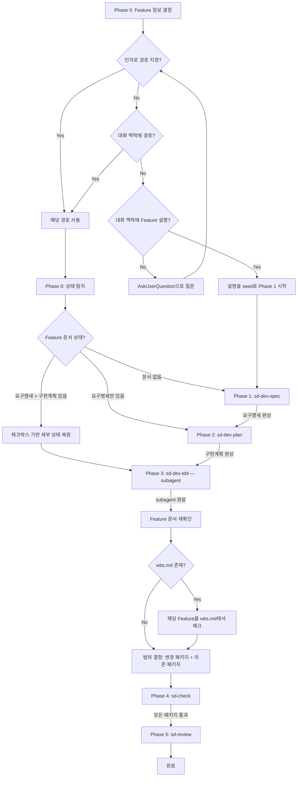

# sd-dev: 통합 개발 프로세스

sd-dev-spec → sd-dev-plan → sd-dev-tdd → sd-check → sd-review를 순차 진행하는 오케스트레이터. Phase 3(sd-dev-tdd)는 subagent에 위임하고, 나머지 Phase는 해당 스킬의 SKILL.md를 Read 도구로 읽고 그대로 따른다.

## 프로세스 흐름

아래 다이어그램이 전체 프로세스의 흐름이다. 각 노드의 상세 설명은 이후 섹션에서 기술한다.



## Phase 0: Feature 정보 결정

Feature 정보를 다음 우선순위로 결정한다:

1. **인자 지정:** 사용자가 인자로 경로(Feature 문서 또는 wbs.md)를 지정했으면 그것을 사용한다
2. **대화 맥락 — 경로:** 대화에서 Feature 문서 경로를 알 수 있으면 그것을 사용한다
3. **대화 맥락 — Feature 설명:** 대화에서 Feature에 대한 논의(기능 설명, 요구사항 등)가 있으면 Phase 1(sd-dev-spec)을 시작하되, 해당 논의 내용을 sd-dev-spec의 seed로 전달한다. Feature가 무엇인지 다시 물어보지 않는다
4. **위 모두 없으면:** AskUserQuestion으로 사용자에게 물어본다 (`.claude/rules/sd-option-scoring.md`의 규칙을 따른다)

## Phase 0: 상태 탐지

경로가 결정된 경우, Feature 문서를 읽어 현재 상태를 파악하고, 탐지 결과를 사용자에게 보여준 뒤 바로 다음 Phase로 진행한다.

### Feature 문서 기반 Phase 탐지

| 상태 | 시작 Phase | 읽을 SKILL.md |
|------|-----------|---------------|
| Feature 문서 없음 | Phase 1 (sd-dev-spec) | `.claude/skills/sd-dev-spec/SKILL.md` |
| `## 요구명세`만 있음 | Phase 2 (sd-dev-plan) | `.claude/skills/sd-dev-plan/SKILL.md` |
| `## 요구명세` + `## 구현계획` 있음 | Phase 3 (sd-dev-tdd) | `.claude/skills/sd-dev-tdd/SKILL.md` (subagent) |

### 구현계획 체크박스 기반 세부 상태 복원

Phase 3(sd-dev-tdd)에서 `## 구현계획`의 Slice 체크박스(`[x]`/`[ ]`)를 확인하여 세부 진행 상태를 복원한다. 예를 들어 Slice 2까지 `[x]`이면 Slice 3부터 재개한다.

## Phase 1: sd-dev-spec

`.claude/skills/sd-dev-spec/SKILL.md`를 Read 도구로 읽고 그대로 따른다.

## Phase 2: sd-dev-plan

`.claude/skills/sd-dev-plan/SKILL.md`를 Read 도구로 읽고 그대로 따른다.

## Phase 3: sd-dev-tdd (subagent)

Context 분리를 위해 Agent 도구로 subagent를 생성하여 위임한다. 메인 오케스트레이터에서 직접 수행하지 않는다.

### subagent 호출

Agent 도구를 다음과 같이 호출한다:
- `description`: Feature 이름 포함 (예: "TDD 개발: 로그인 기능")
- `prompt`에 포함할 내용:
  1. `.claude/skills/sd-dev-tdd/SKILL.md`를 Read 도구로 읽고 그대로 따를 것
  2. Feature 문서 경로
  3. 완료 후 결과 메시지에 다음을 포함할 것: 수정/생성된 파일 목록, 역방향 피드백으로 변경된 문서 내용 요약, 전체 테스트 실행 결과

### subagent 완료 후

Feature 문서를 다시 읽어 역방향 피드백 변경사항을 파악한 뒤 다음 Phase로 진행한다.

## 범위 결정: 변경 패키지 + 의존 패키지

Phase 3(sd-dev-tdd) 완료 후, Phase 4·5의 대상 범위를 결정한다.

### 변경 패키지 식별

Feature 문서의 `## 구현계획`에서 각 Slice가 다루는 파일/모듈 경로를 수집하고, 각 파일이 속한 패키지(가장 가까운 `package.json`의 디렉토리)를 식별하여 중복을 제거한다.

### 의존 패키지 식별

프로젝트 루트의 워크스페이스 설정(`package.json`의 `workspaces` 또는 `pnpm-workspace.yaml`)에서 전체 패키지 목록을 얻고, 각 패키지의 `package.json`에서 `dependencies`와 `devDependencies`를 확인하여, 변경 패키지를 의존하는 패키지를 수집한다.

### 범위 목록 출력

```
check/review 대상 패키지:
- packages/core (변경)
- packages/core-common (변경)
- packages/app (의존 → core, core-common)
```

이 목록을 Phase 4·5에서 공유한다.

## Phase 4: sd-check

`.claude/skills/sd-check/SKILL.md`를 Read 도구로 읽고, 범위 결정에서 식별된 각 패키지에 대해 sd-check를 실행한다. 패키지 순서는 의존 그래프의 리프(변경 패키지)부터 시작하여 의존 패키지 순으로 진행한다.

## Phase 5: sd-review

`.claude/skills/sd-review/SKILL.md`를 Read 도구로 읽고, 범위 결정에서 식별된 각 패키지 경로를 대상으로 sd-review를 실행한다. 여러 패키지를 하나의 리포트로 통합한다. **단, 리포트 파일(review.md)을 생성하지 않고 대화에 직접 보고한다.** 분석 절차와 체크리스트는 sd-review/SKILL.md를 그대로 따르되, Step 4의 파일 작성만 생략하고 결과를 대화 출력으로 대체한다.

## Phase 전환

각 Phase 완료 시 즉시 다음 Phase로 진행한다. 사용자에게 진행 여부를 묻지 않는다.

| 전환 | 조건 | 동작 |
|------|------|------|
| Phase 1 → 2 | `## 요구명세` 완성 (Gherkin 포함) | 즉시 Phase 2 시작 |
| Phase 2 → 3 | `## 구현계획` 완성 | 즉시 Phase 3 시작 |
| Phase 3 → 4 | subagent 완료 | Feature 문서 재확인 → `wbs.md` 갱신 후, 범위 결정 → 즉시 Phase 4 시작 |
| Phase 4 → 5 | 모든 패키지 check 통과 | 즉시 Phase 5 시작 |
| Phase 5 완료 | 분석 완료 | 이슈를 대화에 직접 보고 |

Phase 전환과 Slice 완료는 Feature 문서의 `## 구현계획` 체크박스로 추적한다. 별도의 progress 파일은 사용하지 않는다.
