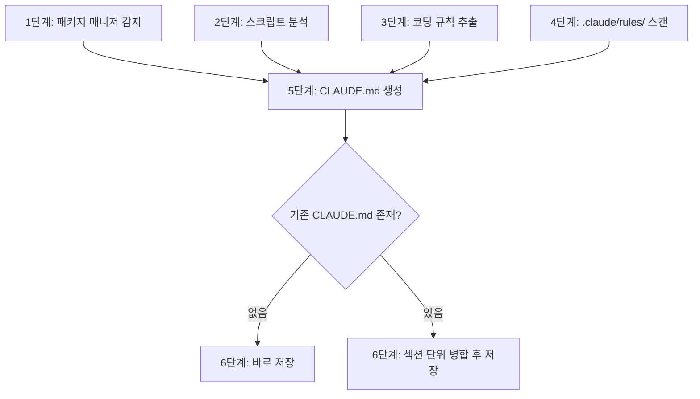

# sd-init: CLAUDE.md 생성기

프로젝트를 분석하여 루트 `CLAUDE.md`를 생성한다. 설정 파일, 스크립트, 코딩 규칙에서 검증 가능한 사실만 추출한다. 기존 `CLAUDE.md`가 있으면 섹션 단위로 병합한다.

## 프로세스 흐름

아래 다이어그램이 전체 프로세스의 흐름이다. 각 노드의 상세 설명은 이후 섹션에서 기술한다.



## 1단계: 패키지 매니저 감지

프로젝트 루트의 lock 파일로 패키지 매니저를 식별한다:

1. `pnpm-lock.yaml` → pnpm
2. `yarn.lock` → yarn
3. `bun.lock` 또는 `bun.lockb` → bun
4. 그 외 → npm

## 2단계: 스크립트 분석

루트 `package.json`의 `scripts` 섹션을 읽고 각 스크립트의 CLI 도구를 분석한다.

- **잘 알려진 도구** (`tsc`, `vitest`, `eslint`, `prettier`, `playwright` 등): 명령어를 그대로 기록
- **커스텀 CLI 또는 프로젝트 내부 스크립트** (예: `tsx packages/.../cli.ts`): Bash에서 `--help`를 먼저 실행한다(5초 타임아웃). `--help`로 하위 명령어와 주요 옵션을 파악할 수 있으면 그 결과를 사용한다. `--help`가 실패하거나 유용한 정보가 없을 때에만 소스 코드를 Read로 분석한다

이 단계에서는 정보 수집만 한다. 최종 포매팅은 5단계에서 수행한다.

## 3단계: 코딩 규칙 추출

프로젝트 루트에서 아래 설정 파일을 찾아 읽는다 (없는 파일은 건너뛴다):

- ESLint: `eslint.config.*`, `.eslintrc.*`
- Prettier: `.prettierrc*`, `prettier.config.*`
- EditorConfig: `.editorconfig`
- TypeScript: `tsconfig.json` → `compilerOptions`
- Stylelint: `.stylelintrc*`, `stylelint.config.*`

아래 기준으로 규칙을 선별한다 — Prettier를 포함한 모든 도구에 적용:

- 도구의 기본값과 다른 설정 (예: TypeScript `verbatimModuleSyntax: true`, Prettier `printWidth: 100` (기본값 80), Prettier `singleQuote: true` (기본값 false))
- error 수준의 비표준 규칙 (예: `no-console: error`)
- 특정 API를 금지하거나 요구하는 규칙 (예: `Buffer` 금지 → `Uint8Array` 사용)

## 4단계: .claude/rules/ 스캔

`.claude/rules/` 디렉토리가 존재하면 모든 `.md` 파일을 읽는다. 이미 다루고 있는 주제를 목록화한다. 해당 주제는 **CLAUDE.md에서 제외**한다 — 파일 간 규칙 중복은 LLM이 고유한 지침 대신 중복 컨텍스트를 처리하게 되어 지침의 효과를 약화시킨다.

## 5단계: CLAUDE.md 생성

1~4단계의 정보를 조합하여 CLAUDE.md 콘텐츠를 생성한다. `.claude/rules/`에서 이미 다루고 있는 주제(4단계에서 감지)는 제외한다.

### 포함할 섹션

- **프로젝트 정보**: `package.json`의 `name`과 `description`, 패키지 매니저
- **모노레포 구조**: `workspaces` 필드 또는 `pnpm-workspace.yaml`이 있으면 워크스페이스 경로를 나열하고 각 패키지를 간략히 설명 (패키지당 10단어 이내)
- **기술 스택**: `dependencies`/`devDependencies`의 주요 라이브러리 — 프레임워크, 번들러, 테스트 도구 (최대 10개)
- **명령어**: 2단계의 스크립트를 bash 코드 블록으로 포매팅하고 인라인 주석 추가, 카테고리별 그룹화
- **코딩 규칙**: 3단계에서 선별한 규칙을 불릿 리스트로 포매팅

실질적 내용이 없는 섹션은 생략한다. 프로젝트에 필요하면 위 목록에 없는 섹션도 추가한다 (예: 아키텍처, 통합 테스트).

### 참고 예시

아래의 **섹션 구조와 포매팅 스타일**을 따른다 (bash 코드 블록, 인라인 주석, 불릿 리스트). 대상 프로젝트에 맞게 내용을 조정한다. **CLAUDE.md는 반드시 한국어로 작성한다.**

````markdown
# Simplysm

pnpm 모노레포. 패키지 경로: `packages/*`, 테스트: `tests/*`

## 명령어

모든 명령어는 내부적으로 `pnpm sd-cli <command>`를 실행한다. `--debug` 플래그는 모든 명령어에서 사용 가능하다.
`[targets..]`를 생략하면 `sd.config.ts`에 정의된 모든 패키지를 대상으로 한다.
대상은 패키지 경로로 지정한다 (예: `packages/core-common`, `tests/orm`).

### 개발

```bash
pnpm dev [targets..]                     # 클라이언트+서버 패키지를 개발 모드로 실행
pnpm dev packages/solid-demo             # 특정 패키지를 개발 모드로 실행
pnpm dev -o key=value                    # sd.config.ts에 옵션 전달

pnpm watch [targets..]                   # 라이브러리 패키지를 watch 빌드
pnpm watch packages/core-common          # 특정 패키지를 watch
```

### 빌드 & 배포

```bash
pnpm build [targets..]                   # 프로덕션 빌드
pnpm build packages/solid                # 특정 패키지 빌드

pnpm pub [targets..]                     # 빌드 후 배포 (npm/sftp)
pnpm pub --no-build                      # 빌드 없이 배포만
pnpm pub --dry-run                       # 실제 배포 없이 시뮬레이션
```

### 코드 품질

```bash
pnpm typecheck [targets..]               # TypeScript 타입 체크
pnpm lint [targets..]                    # ESLint + Stylelint
pnpm lint:fix [targets..]               # 린트 자동 수정 (--fix)
pnpm check [targets..]                   # 전체 검사 (typecheck + lint + test 병렬)
pnpm vitest [targets..]                  # vitest watch 모드
pnpm vitest run [targets..]              # 테스트 1회 실행
```

## 아키텍처

의존 방향: 위 → 아래. `core-common`은 내부 의존성 없는 리프 패키지이다.

```
앱:       solid-demo (클라이언트) / solid-demo-server (서버)
UI:       solid (SolidJS + Tailwind)
서비스:   service-server (Fastify) / service-client / service-common
ORM:      orm-node (MySQL/PostgreSQL/MSSQL) / orm-common
코어:     core-common (중립) / core-browser / core-node
도구:     sd-cli, lint, excel, storage, sd-claude
```

## 통합 테스트

`tests/`에 위치. `pnpm vitest run tests/orm` 등으로 실행한다.

- `tests/orm` — DB 연결, DbContext, escape 테스트 (MySQL, PostgreSQL, MSSQL). Docker 필요.
- `tests/service` — 서비스 클라이언트-서버 통신 테스트.

## 코딩 규칙

- `import type` 필수 (`verbatimModuleSyntax`), `#private` 금지 → `private` 키워드 사용
- `console.*` 금지, `if (str)` 금지 → 명시적 비교 `str !== ""` 사용 (nullable boolean/object는 허용)
- `Buffer` 금지 → `Uint8Array`, `events` 금지 → `@simplysm/core-common`의 `EventEmitter`
- SolidJS: props 구조분해 금지, `.map()` 대신 `<For>`, `className` 대신 `class`
````

## 6단계: 기존 CLAUDE.md와 병합

- **기존 파일이 없는 경우**: 5단계 결과를 바로 저장
- **기존 파일이 있는 경우**:
  1. 기존 파일을 읽는다
  2. 새 콘텐츠와 기존 콘텐츠를 섹션(`##` 제목) 단위로 비교한다
  3. 병합 규칙:
     - 생성된 섹션과 동일한 주제의 기존 섹션 → 새 콘텐츠로 **대체**
     - 생성된 대응 섹션이 없는 기존 섹션 → 그대로 **보존**
     - 중요: 기존 섹션의 위치를 보존한다. 새로 생성된 섹션은 반드시 마지막 기존 섹션 뒤에 추가한다. 예: 원본에 `## Custom Rules`가 첫 번째 섹션이면, 병합 결과에서도 `## Custom Rules`를 첫 번째로 유지하고 `## Commands`, `## Tech Stack` 등을 그 뒤에 추가한다

저장 후 파일 경로를 출력한다.
