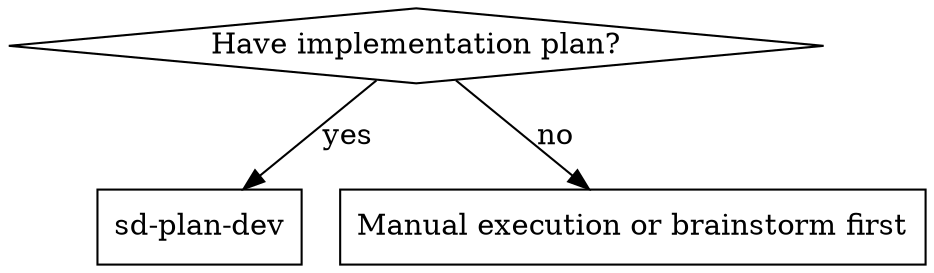
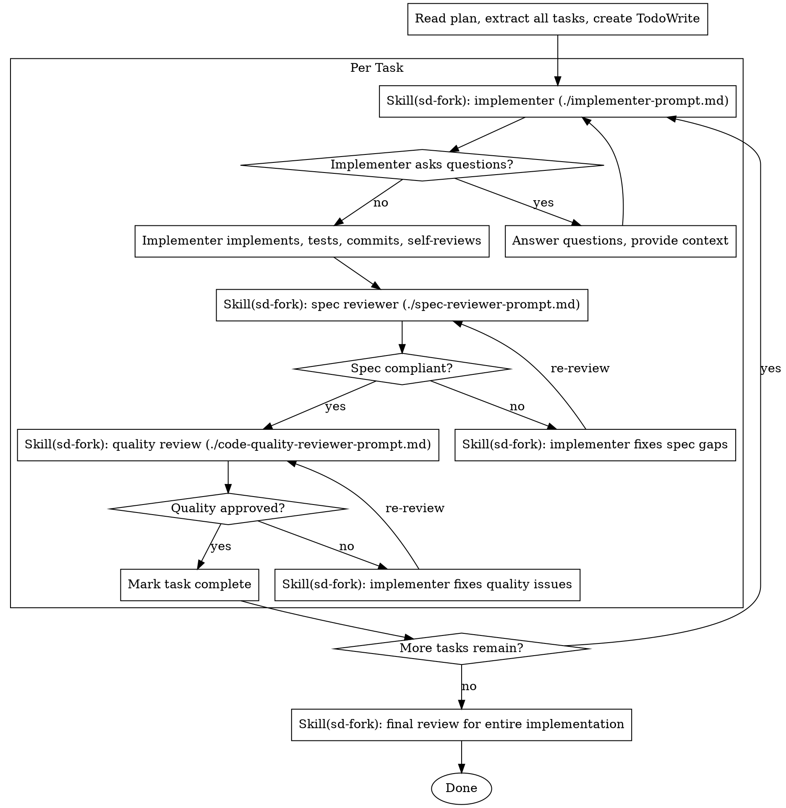

# Fork-Driven Plan Execution

Execute each task from the plan via context fork, with two-stage review (spec compliance → code quality) after each.

**Core principle:** Fresh fork per task + two-stage review = high quality, fast iteration

## When to Use



## Fork Method

All execution is done via `Skill(sd-fork)` which runs in an isolated context.

- **implementer**: `Skill(sd-fork, <prompt>)` — implement / test / commit / self-review
- **spec reviewer**: `Skill(sd-fork, <prompt>)` — verify spec compliance
- **code quality reviewer**: `Skill(sd-fork, <prompt>)` — verify code quality (using code-quality-reviewer-prompt.md)

Each fork runs in an isolated context with no context pollution.

## The Process



## Prompt Templates

- `./implementer-prompt.md` — implementer fork prompt
- `./spec-reviewer-prompt.md` — spec compliance review fork prompt
- `./code-quality-reviewer-prompt.md` — code quality review fork prompt

## Example Workflow

```
You: Using sd-plan-dev to execute this plan.

[Read plan file: docs/plans/feature-plan.md]
[Extract all 5 tasks with full text + create TodoWrite]

Task 1: Hook installation script

[Skill(sd-fork) — send implementer-prompt.md based prompt]

Implementer: "Should the hook be installed at user or system level?"

You: "User level"

[Skill(sd-fork) — fork again with answer included]
Implementer:
  - Implemented install-hook, tests 5/5 pass, committed
  - Self-review: missed --force flag, added it

[Skill(sd-fork) — spec-reviewer-prompt.md based]
Spec reviewer: ✅ Spec compliant

[Skill(sd-fork) — code-quality-reviewer-prompt.md based]
Code reviewer: ✅ Approved

[Task 1 complete]

Task 2: Recovery modes

[Skill(sd-fork) — implementer]
Implementer: verify/repair modes implemented, 8/8 pass, committed

[Skill(sd-fork) — spec reviewer]
Spec reviewer: ❌ Progress reporting missing, --json flag not requested

[Skill(sd-fork) — implementer fixes]
Implementer: Removed --json, added progress reporting

[Skill(sd-fork) — spec reviewer re-review]
Spec reviewer: ✅ Spec compliant

[Skill(sd-fork) — quality review]
Code reviewer: Issues (Important): Magic number (100)

[Skill(sd-fork) — implementer fixes]
Implementer: Extracted PROGRESS_INTERVAL constant

[Skill(sd-fork) — quality re-review]
Code reviewer: ✅ Approved

[Task 2 complete]

...

[After all tasks]
[Skill(sd-fork) — final review for entire implementation]
Final reviewer: All requirements met, ready to merge

Done!
```

## Red Flags

**Never:**
- Start implementation on main/master without explicit user consent
- Skip reviews (spec compliance OR code quality)
- Proceed with unfixed issues
- Run multiple implementer forks in parallel (conflict risk)
- Make fork read plan file directly (provide full text instead)
- Skip scene-setting context
- Ignore fork questions
- Accept "close enough" on spec compliance
- Skip review loops (issue found → fix → re-review)
- **Start code quality review before spec compliance is ✅**
- Move to next task while either review has open issues

**If fork asks questions:**
- Answer clearly and completely
- Provide additional context if needed

**If reviewer finds issues:**
- Implementer fork fixes them
- Reviewer fork re-reviews
- Repeat until approved

**If fork fails a task:**
- Dispatch a separate fix fork
- Don't fix manually (context pollution)

## Integration

**Related skills:**
- **sd-plan** — creates the plan this skill executes
- **sd-fork** — isolated context fork for execution
- **sd-tdd** — forks follow TDD
