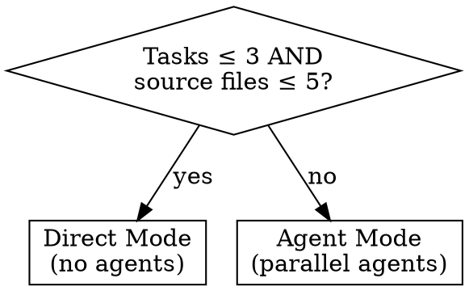
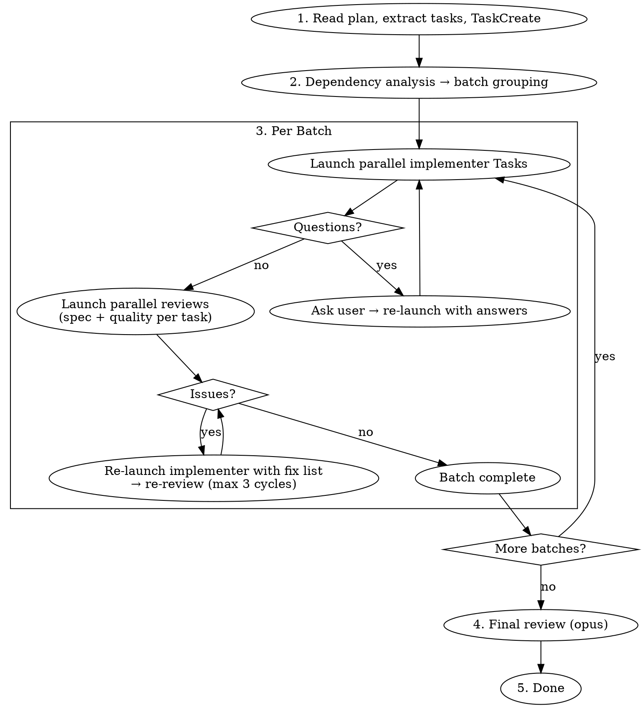

# Plan Execution

Execute plan tasks with the right-sized process: direct for small plans, parallel agents for large plans.

**Core principle:** Right-size the process to the plan. Small plans get direct execution; large plans get parallel agents with formal reviews.

## When to Use

Have an implementation plan (from sd-plan or similar)? Use this skill.
No plan? Use sd-plan or sd-brainstorm first.

## Mode Selection



Count **source files** only (test files excluded) that will be created or modified across all tasks.

---

## Direct Mode

No agents, no batching -- implement directly in main context.

1. Read plan, understand all tasks
2. Implement in dependency order. For each task:
   - Implement exactly what the spec says
   - Write tests and run them
   - Ensure new public APIs are exported in the package's `index.ts`
   - Self-review: spec complete? overbuilt? clean?
   - Fix issues found
3. After all tasks: `pnpm typecheck` + `pnpm lint` + `pnpm vitest` on affected packages
4. Done

**Escalation:** If complexity grows beyond expectations during execution, switch to Agent Mode.

---

## Agent Mode

Dependency-aware batching with parallel Task agents and formal reviews.

### Architecture

| Role | How | Model | Job |
|------|-----|-------|-----|
| Orchestrator | (you) | sonnet | Deps, prompts, lifecycle |
| Implementer | `Task(general-purpose)` | default | Implement one task |
| Spec reviewer | `Task(general-purpose)` | opus | Verify spec match |
| Quality reviewer | `Task(general-purpose)` | opus | Verify code quality |
| Final reviewer | `Task(general-purpose)` | opus | Cross-task integration |

### Process



### Dependency Analysis

1. Per task: identify files created/modified
2. File overlap → dependent (same batch is prohibited)
3. Logical dependency (B uses what A creates) → dependent
4. No dependencies between each other → same batch (parallel)

```
Example: Task 1 creates types.ts, Task 2 uses types.ts, Task 3 independent
  Batch 1: [Task 1, Task 3]    ← parallel
  Batch 2: [Task 2]            ← depends on Task 1
```

### Prompt Construction

**Implementer:** Use `./implementer-prompt.md` template. Fill in:
- Task name and full description (paste full text, NOT file reference)
- Context: where it fits, what depends on it
- Cross-batch context (for batch 2+): what previous batches produced, files created
- Working directory

**Reviews:** After **all** implementers in the batch report back (including question resolution), launch in parallel:
- Spec review: `./spec-reviewer-prompt.md` -- fill in requirements + implementer report
- Quality review: `./code-quality-reviewer-prompt.md` -- fill in report + changed files
- Launch both in a single message (2 Task calls per completed task)

**Final review:** `./final-review-prompt.md` -- fill in full plan + all task results

### Fix-Review Cycle

When reviewers find issues:
1. Compile all issues from both reviewers
2. Re-launch the implementer Task with original prompt + fix list
3. Re-review only failed aspects (re-launch only the reviewer that found issues)
4. **Max 3 cycles.** After that, report remaining issues to user for decision.

### Question Handling

If an implementer returns questions (output contains `## Questions`):
1. Present questions to the user
2. Re-launch that implementer Task with original prompt + answers appended
3. Other completed tasks in the batch are unaffected

### Commit Strategy

- Agents work on filesystem directly -- no commits during implementation
- After final review passes, commit (use sd-commit or manual)
- Do NOT commit between batches

## Red Flags

- Skip reviews in Agent Mode
- Put file-overlapping tasks in same parallel batch
- Skip dependency analysis
- Send plan file path to agents instead of full text
- Accept "close enough" on spec compliance
- Exceed 3 fix-review cycles without user input
- Proceed to next batch before current batch fully passes

## Error Handling

- Implementer fails completely → retry once, then report to user
- Reviewer crashes → re-launch once
- Fix-review loop at max → report to user for decision
- File conflicts between parallel agents → stop batch, report to user

## Example (Agent Mode)

```
[Read plan: 5 tasks]
[Dep analysis → Batch 1: [T1, T2], Batch 2: [T3, T4, T5]]

--- Batch 1 ---
[2 parallel implementer Tasks]
  T1: implemented, tests pass → report
  T2: "Should this use JWT?" → questions returned

[2 parallel reviews for T1]
  Spec ✅, Quality ⚠️ magic number → CHANGES_NEEDED

[Ask user T2's question → "JWT"]
[Re-launch T2 with answer] → implemented → report
[Fix T1 magic number → re-review quality] → ✅
[2 parallel reviews for T2] → Spec ✅, Quality ✅

--- Batch 2 (with batch 1 context) ---
[3 parallel implementer Tasks] → all pass
[6 parallel reviews] → all pass

--- Final review (opus) ---
Integration check ✅ → Done!
```

## After Completion

When all tasks and final review pass:
- If in a worktree (`.worktrees/`) → guide user to `/sd-worktree merge`

## Integration

- **sd-plan** -- creates the plan this skill executes
- **sd-tdd** -- implementers follow TDD when plan specifies it
- **sd-worktree** -- branch isolation for worktree-based workflows
