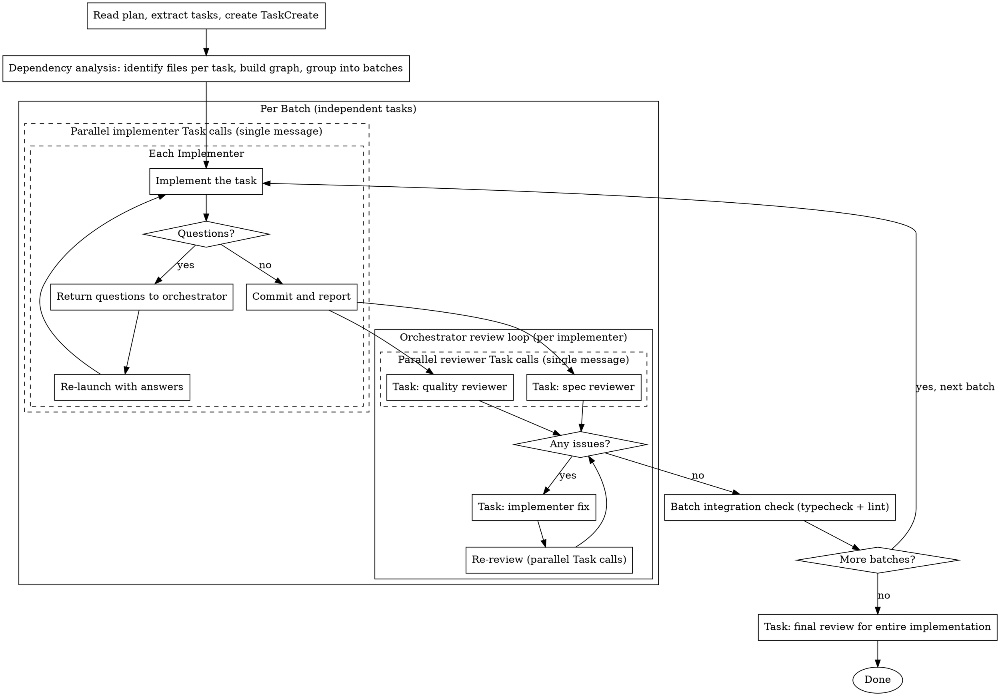

# Parallel Plan Execution

Execute plan tasks via parallel implementers with dependency-aware scheduling.

**Core principle:** Dependency analysis + parallel implementers + orchestrator-managed reviews = maximum throughput

## When to Use


## Execution Method

All execution uses `Task(general-purpose)` for parallel execution.

- **implementer**: `Task(general-purpose, model: min(sonnet, current))` — implements one task, commits, reports
- **spec reviewer**: `Task(general-purpose)` — dispatched by orchestrator after implementer completes (read-only)
- **quality reviewer**: `Task(general-purpose)` — dispatched by orchestrator in parallel with spec reviewer (read-only)
- **final reviewer**: `Task(general-purpose)` — dispatched by orchestrator after all batches complete (read-only)

**Model selection:**
- **implementer**: use `min(sonnet, current model)`. If the user's current model is haiku, use haiku. Otherwise use sonnet.
- **All other agents**: inherit current model (no explicit `model` parameter).

Independent tasks run as **parallel Task calls in a single message**. After implementers complete, spec and quality reviews run as **parallel Task calls**.

**CRITICAL: Do NOT use `run_in_background: true`** — achieve parallelism by making multiple Task calls in a single message (foreground parallel). This ensures the orchestrator waits for all tasks to complete before proceeding to the next batch, and prevents Stop hooks from firing prematurely.

## The Process



## Dependency Analysis

Before launching tasks, analyze the plan to build a dependency graph:

1. **For each task**: identify which files/modules it will create or modify
2. **Find overlaps**: tasks touching the same files depend on each other
3. **Respect logical dependencies**: if task B uses what task A creates, B depends on A
4. **Group into batches**: tasks with no dependencies between them form one batch

```
Example: 5 tasks
  Task 1: creates utils/validator.ts
  Task 2: creates hooks/useAuth.ts
  Task 3: creates components/Login.tsx (uses hooks/useAuth.ts)
  Task 4: modifies utils/validator.ts
  Task 5: creates api/endpoints.ts

  Batch 1: [Task 1, Task 2, Task 5] — independent, parallel
  Batch 2: [Task 3] — depends on Task 2
  Batch 3: [Task 4] — depends on Task 1
```

## Implementer Prompt

Each implementer receives a prompt based on `./implementer-prompt.md`. Fill in all `[bracketed]` sections before dispatching.

## Reviewer Dispatch

After an implementer completes and reports, the orchestrator dispatches reviewers:

1. Record the implementer's commit SHA and files changed from its report
2. Dispatch TWO parallel Task calls (single message):
   - spec reviewer — fill `./spec-reviewer-prompt.md` with task requirements + implementer report
   - quality reviewer — fill `./code-quality-reviewer-prompt.md` with implementer report + BASE_SHA/HEAD_SHA
3. If either reviewer returns CHANGES_NEEDED:
   - Re-dispatch implementer with fix instructions (all issues from both reviewers combined)
   - After fix, re-dispatch only the failed reviewers (parallel Task calls)
   - Repeat until both approve
4. Proceed to next task or batch

## Prompt Templates

- `./implementer-prompt.md` — implementer instructions
- `./spec-reviewer-prompt.md` — spec compliance review prompt
- `./code-quality-reviewer-prompt.md` — code quality review prompt
- `./final-review-prompt.md` — final integration review prompt

## Example Workflow

```
You: Using sd-plan-dev to execute this plan.

[Read plan file: docs/plans/feature-plan.md]
[Extract all 5 tasks with full text + create TaskCreate]

[Dependency analysis]
  Task 1 (validator): no deps
  Task 2 (auth hook): no deps
  Task 3 (login component): depends on Task 2
  Task 4 (validator update): depends on Task 1
  Task 5 (api endpoints): no deps

  Batch 1: [Task 1, Task 2, Task 5]
  Batch 2: [Task 3, Task 4]

--- Batch 1: parallel implementers ---

[3 parallel implementer Task calls in single message]

  Implementer 1: Implemented validator, tests 5/5 pass → committed
  Implementer 2: "Should auth use JWT or session?" (question returned)
  Implementer 5: Implemented endpoints, tests 3/3 pass → committed

[Answer Implementer 2 question: "JWT"]
[Re-launch Implementer 2 with answer]
  Implementer 2: Implemented auth hook with JWT, tests 4/4 pass → committed

[Orchestrator dispatches reviewers for each completed implementer]

  Task 1 reviews: [parallel] spec ✅, quality ✅ → Done
  Task 2 reviews: [parallel] spec ✅, quality ✅ → Done
  Task 5 reviews: [parallel] spec ✅, quality ❌ (magic number)
    → Re-dispatch Implementer 5 to fix → committed
    → Re-review quality ✅ → Done

[Batch 1 complete → integration check]

--- Batch 2: parallel implementers ---

[2 parallel implementer Task calls in single message]

  Implementer 3: Implemented login component → committed
  Implementer 4: Updated validator → committed

[Orchestrator dispatches reviewers]

  Task 3 reviews: [parallel] spec ❌ (missing error state), quality ✅
    → Re-dispatch Implementer 3 to fix → committed
    → Re-review spec ✅ → Done
  Task 4 reviews: [parallel] spec ✅, quality ✅ → Done

[Batch 2 complete → integration check]

--- Final ---

[Task: final review for entire implementation]
Final reviewer: All requirements met, ready to merge

Done!
```

## Batch Integration Check

Between batches, run targeted verification on affected packages before starting the next batch:

```bash
npm run typecheck [affected packages]
npm run lint [affected packages]
```

This catches cross-task integration issues early — especially when the next batch depends on the current batch's output. Do NOT skip this even if individual task reviews passed.

## Red Flags

**Never:**

- Start implementation on main/master without explicit user consent
- Skip reviews (spec compliance OR code quality)
- Proceed with unfixed issues
- Put tasks with file overlap in the same parallel batch
- Skip dependency analysis
- Make implementer read plan file directly (provide full text instead)
- Skip scene-setting context
- Accept "close enough" on spec compliance
- Skip review loops (issue found → fix → re-review)
- Skip batch integration checks between batches
- Use `run_in_background: true` on Task calls (use foreground parallel instead)

**If implementer returns questions:**

- Answer clearly and completely
- Re-launch that implementer with answers included
- Other parallel implementers continue unaffected

**If reviewers find issues:**

- Orchestrator re-dispatches implementer with all issues from both reviewers combined
- After fix, re-dispatch only the failed reviewers (parallel Task calls)
- Repeat until both approved

**If implementer fails or times out:**

- Do NOT silently proceed — the affected files may be in an indeterminate state
- Check if other tasks in the same batch depend on the failed task's output
- Independent tasks' results still stand
- Escalate to user with specific error details before proceeding
- Do NOT re-launch on potentially partially-modified files without inspection

## Integration

**Related skills:**

- **sd-plan** — creates the plan this skill executes
- **sd-tdd** — implementers follow TDD
- **sd-worktree** — branch isolation for worktree-based workflows
