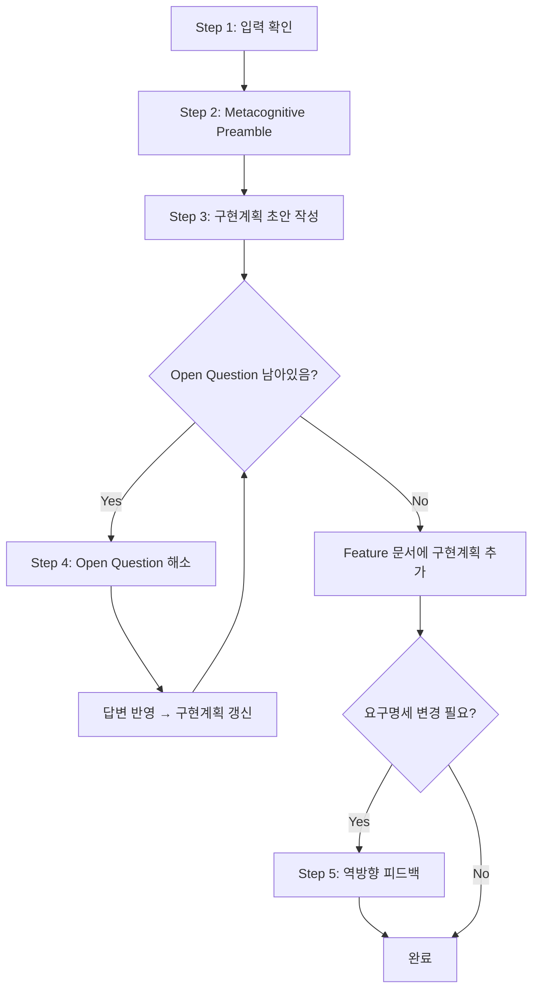

# sd-plan: 구현계획 (3단계)

2단계에서 작성된 Gherkin Scenarios를 기반으로, 코드베이스를 탐색하고 구현계획을 수립한다. 요구명세(What)를 구현계획(How)으로 전환하되, 불확실한 사항은 추측하지 않고 사용자와 함께 해소한다.

## 입력과 산출물

- **입력:** Feature 문서의 요구명세 섹션 (2단계 산출물) + 기존 코드베이스
- **산출물:** 같은 Feature 문서에 `## 구현계획` 섹션 추가

## 프로세스 흐름

아래 다이어그램이 전체 프로세스의 흐름이다. 각 노드의 상세 설명은 이후 섹션에서 기술한다.



## Step 1. 입력 확인

### Feature 문서 읽기

Feature 문서 경로를 다음 우선순위로 결정한다:
1. 사용자가 경로를 지정했으면 그것을 사용한다
2. 대화 맥락에서 경로를 알 수 있으면 그것을 사용한다
3. 둘 다 없으면 AskUserQuestion으로 사용자에게 물어본다

Feature 문서에는 2단계에서 작성된 `## 요구명세` 섹션과 Gherkin Scenarios가 있다. 이 시나리오들이 구현계획의 기반이 된다.

Feature 문서에 `## 참조 자료` 섹션이 있으면 함께 읽는다. wbs.md 링크가 있으면 해당 wbs.md의 참조 자료 섹션을 Read 도구로 읽는다. 참조 자료의 구체적 정보(업무 규칙, 데이터 형식, 기술 제약 등)를 설계에 반영한다.

### 코드베이스 탐색

**코드가 source of truth이다.** 사용자가 프로세스 외적으로 직접 수정한 코드도 있을 수 있으므로, 문서가 아닌 실제 코드를 기준으로 파악한다.

탐색 대상:
- 관련 엔티티/모델 구조
- 기존 API 엔드포인트 및 패턴
- 사용 중인 프레임워크와 아키텍처 패턴
- 관련 테스트 구조

탐색 결과는 구현계획 설계에 참조하되, 코드 자체를 문서에 복사하지 않는다.

## Step 2. Metacognitive Preamble

요구명세와 코드베이스 탐색 결과를 바탕으로 세 가지를 분리한다. 모르는 것을 명확히 인식해야 올바른 Open Question을 도출할 수 있다.

| 구분 | 레벨 | 설명 |
|------|------|------|
| **아는 것** (VERIFIED) | — | 요구명세에 명시되었거나 코드에서 확인된 것 |
| **추론 가능한 것** (INFERRED) | **High** | **현재 작업 대상(타겟) 코드베이스**에서 동일 패턴을 확인했거나 공식 문서에 근거가 있는 추론. INFERRED로 유지 |
| | **Medium** | 일반적 도메인 관행이나 유사 사례에 기반한 추론. **→ ASSUMED로 자동 격상**. 마이그레이션 원본, 이전 버전, 외부 프로젝트의 패턴은 "유사 사례"에 해당한다 |
| | **Low** | 약한 유추나 제한적 근거에 기반한 추론. **→ ASSUMED로 자동 격상** |
| **모르는 것** (ASSUMED) | — | 추측에 해당 — 반드시 Open Question으로 전환 |

이 분리 결과를 사용자에게 보여준 뒤, 확인을 묻지 않고 즉시 구현계획 초안으로 진행한다.

## Step 3. 구현계획 초안 작성

### Tech Design Doc

아래 구조로 기술 설계 문서를 작성한다. 기존 코드베이스의 패턴과 컨벤션을 따르고, 새로운 기술/패턴 도입이 필요하면 대안 검토에서 비교한다.

```markdown
### 배경
(이 Feature를 구현하는 기술적 맥락. 기존 코드의 관련 구조 간단히 언급)

### 목표
(이 구현계획에서 달성할 기술적 목표)

### 비목표
(이 구현계획에서 의도적으로 제외하는 것)

### 설계
(API, 엔티티, 검증 규칙, UI 구조 등 구체적인 설계)

### 대안 검토
(고려했으나 선택하지 않은 접근 방식과 그 이유)
```

### Vertical Slicing

Gherkin Scenarios를 구현 가능한 단위(Slice)로 분할한다.

#### 분할 기준
- **구현 무게 기준** — Gherkin Rule과 1:1 대응이 아니다. 구현 관점에서 자연스러운 단위로 묶는다
- **각 Slice에 해당 Gherkin Scenario 목록을 매핑** — 1:N 관계 (하나의 Scenario는 하나의 Slice에만 속함)
- **Slice 간 의존 관계에 따라 순서 결정** — 앞선 Slice가 완료되어야 다음 Slice를 진행할 수 있도록

#### Slice 형식

```markdown
#### Slice 1: (제목)
- **구현 내용:** (이 Slice에서 구현할 것의 요약)
- **Scenarios:**
  - Scenario: (시나리오 제목 1)
  - Scenario: (시나리오 제목 2)

#### Slice 2: (제목)
- **구현 내용:** (요약)
- **의존:** Slice 1
- **Scenarios:**
  - Scenario: (시나리오 제목 3)
```

## Step 4. Open Question 해소

### Open Question 대상
- 기술 선택 (라이브러리, 프레임워크 옵션 등)
- 기존 시스템 연동 방식
- 성능/보안 제약
- Step 2에서 ASSUMED로 태그된 모든 항목

### 질문 방식
- `.claude/rules/sd-option-scoring.md`의 규칙을 따른다

### 완료 시 문서 저장

모든 Open Question이 해소되면:
1. Feature 문서의 `### 설계 결정` 섹션(`## 참조 자료` 하위)에 Open Question 해소 결과를 추가한다. 컬럼은 `# / 결정사항 / 선택 / 근거` 형식이다. sd-spec에서 이미 작성된 항목(D1, D2, ...)에 이어서 번호를 부여한다. 다른 세션에서 이 Feature를 이어받을 때, 기술 선택의 근거를 알 수 있어야 하기 때문이다.
2. Feature 문서의 `## 요구명세` 섹션 아래에 `## 구현계획` 섹션을 추가한다.

## Step 5. 역방향 피드백

구현계획 작성 과정에서 변경·발견된 모든 사항은, 영향받는 모든 문서(wbs.md, Feature 문서의 요구명세·구현계획·설계 결정)에 빠짐없이 반영한다. 발견한 누락·불일치는 "사소하다" "매핑은 맞다" 등의 이유로 수정을 생략하지 않는다 — 문서 간 정합성을 항상 유지한다. 이 스킬 내에서 직접 수정한다 — 별도로 sd-spec을 재실행할 필요 없다. 변경 내용과 사유를 사용자에게 명확히 알린다.

## 산출물 예시

```markdown
# Feature 1.1 업무 생성/편집

## 참조 자료

- [wbs.md](./wbs.md)

### 설계 결정

| # | 결정사항 | 선택 | 근거 |
|---|---------|------|------|
| D1 | 담당자 저장 방식 | 별도 테이블 (N:M) | N:M 관계 지원, 확장성 |
| D2 | 첨부파일 제한 | 파일당 50MB, 총 5개 | 서버 스토리지 제약 |

## 요구명세

(2단계에서 작성된 Gherkin — 생략)

## 구현계획

### 배경

업무 관리 시스템의 핵심 CRUD 기능이다. 기존 코드베이스에 `Task` 엔티티와 REST API 패턴이 존재하며, 이를 확장한다.

### 목표

- 업무 생성/편집 API 및 UI 구현
- 담당자 지정, 첨부파일 기능 포함

### 비목표

- 업무 템플릿 (Feature 1.3에서 별도 구현)
- 알림 연동 (Feature 2.3에서 별도 구현)

### 설계

#### 엔티티

- `Task`: title(필수), description, dueDate, status, assignees(N), attachments(N)
- `Attachment`: fileName, filePath, fileSize, uploadedAt

#### API

| Method | Endpoint | 설명 |
|--------|----------|------|
| POST | /api/tasks | 업무 생성 |
| PUT | /api/tasks/:id | 업무 편집 |
| GET | /api/tasks/:id | 업무 조회 |

#### 검증 규칙

- title: 필수, 1~200자
- assignees: 0~10명
- attachments: 파일당 최대 50MB, 총 5개

### 대안 검토

| 접근 방식 | 선택 여부 | 이유 |
|-----------|-----------|------|
| 담당자를 별도 테이블로 관리 | 채택 | N:M 관계 지원, 확장성 |
| 담당자를 JSON 컬럼으로 저장 | 미채택 | 검색/필터 어려움 |

### Vertical Slices

#### Slice 1: 업무 CRUD 기본
- **구현 내용:** Task 엔티티, 생성/편집 API, 기본 UI
- **Scenarios:**
  - Scenario: 제목을 입력하여 업무 생성 성공
  - Scenario: 제목 없이 업무 생성 실패
  - Scenario: 기존 업무의 제목 수정

#### Slice 2: 담당자 지정
- **구현 내용:** Assignee 연관관계, 담당자 선택 UI
- **의존:** Slice 1
- **Scenarios:**
  - Scenario: 담당자 1명 지정
  - Scenario: 담당자 여러 명 지정

#### Slice 3: 첨부파일
- **구현 내용:** Attachment 엔티티, 파일 업로드 API 및 UI
- **의존:** Slice 1
- **Scenarios:**
  - Scenario: 첨부파일 1개 추가
```
