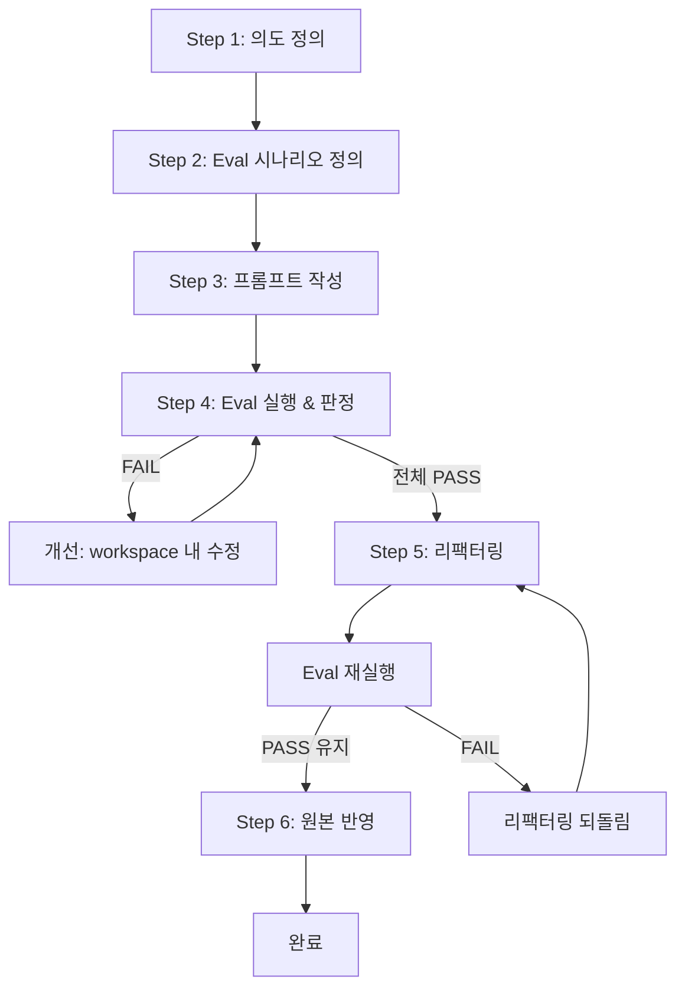

# sd-prompt: Eval-Driven Prompt Development

스킬(SKILL.md)이나 프롬프트 파일(.md)을 **Eval-Driven**으로 작성하고 개선하는 단일 루프 스킬이다. 산출물 자체가 자연어 프롬프트이므로, 반복적 Eval로 품질을 검증한다.

프롬프트 파일이란 룰(.claude/rules/*.md), 시스템 프롬프트, 커스텀 지시 등 스킬이 아닌 모든 .md 프롬프트를 포함한다.

## 프로세스 개요



## 산출물 파일 구조

```
룰인 경우:
  .claude/rules/{name}.md             ← 룰 프롬프트 (산출물)
  .claude/evals/{name}.md             ← 룰의 Eval 시나리오

나머지 경우 (스킬, 프롬프트 등):
  대상 파일 옆에 {대상파일명}.eval.md 로 생성
  예시:
    .claude/skills/{name}/SKILL.md    → .claude/skills/{name}/SKILL.eval.md
    {경로}/{name}.md                  → {경로}/{name}.eval.md
```

Eval 파일은 코드의 테스트 코드처럼 **영구 보존**한다. 스킬/프롬프트 수정 시 regression check에 사용한다.

## Step 0: 상태 탐지 & 진입점 결정

스킬/프롬프트 이름과 대상 경로를 확인한 뒤, 기존 파일 존재 여부를 탐색한다.

**탐지 항목:**
1. 스킬: `.claude/skills/{name}/SKILL.md` 존재 여부
2. 프롬프트: 사용자가 지정한 경로의 .md 파일 존재 여부
3. Eval: 룰이면 `.claude/evals/{name}.md`, 나머지는 `{대상파일}.eval.md` 존재 여부

**진입점:**

| 상태 | 시작 Step |
|------|-----------|
| 아무것도 없음 (신규) | Step 1 (의도 정의) |
| 프롬프트만 있고 Eval 없음 | Step 2 (Eval 시나리오 정의) |
| 프롬프트 + Eval 모두 있음 (개선) | Step 4 (Eval 실행) |

탐지 결과와 시작 Step을 사용자에게 보여준 뒤 바로 진행한다.

## Step 1: 의도 정의 (Intent)

스킬/프롬프트의 목적, 트리거 조건, 입출력, 품질 기준을 명확히 한다.

### 1-1. 확인 사항

| 항목 | 설명 |
|------|------|
| **스킬 vs 프롬프트** | 특정 명령/맥락에서 트리거 → 스킬. 항상 적용되거나 특정 상황에서 참조 → 프롬프트 |
| **트리거 조건** | 어떤 사용자 발화/상황에서 발동하는가 (스킬인 경우) |
| **입력** | 스킬/프롬프트가 받는 것 (사용자 입력, 파일, 코드베이스 등) |
| **출력** | 스킬/프롬프트가 내놓는 것 (파일, 메시지, 코드 변경 등) |
| **품질 기준** | 무엇이 "잘 된" 출력인가 (구체적, 객관적으로) |
| **기존 스킬/프롬프트 관계** | 충돌하는가, 보완하는가, 독립인가 |

### 1-2. Metacognitive Preamble

프롬프트 작성 전에 세 가지를 분리한다:

| 구분 | 설명 |
|------|------|
| **아는 것** (VERIFIED) | 사용자가 직접 말했거나 문서에 명시된 것 |
| **추론 가능한 것** (INFERRED) | 논리적으로 도출 가능한 것 |
| **모르는 것** (ASSUMED) | 사용자가 명시하지 않은 내용·범위·형식·수준은 모두 이에 해당한다 — 반드시 Question으로 전환 |

### 1-3. Question 루프

선택지 제시 시 `.claude/rules/sd-option-scoring.md`의 규칙을 따른다.

1. ASSUMED 항목을 사용자에게 질문한다
2. 답변을 반영하여 VERIFIED/INFERRED로 변경한다
3. 새 Question이 발생하면 추가한다
4. Question이 모두 해소될 때까지 반복한다

### 1-4. 기존 스킬/프롬프트 탐색

`.claude/skills/` 및 `.claude/rules/`를 Glob으로 탐색하여 기존 목록을 파악한다. 새로 만들 스킬/프롬프트가 기존 것과 충돌하거나 중복되는지 확인하고, 결과를 사용자에게 알린다.

## Step 2: Eval 시나리오 정의 (Test-First)

프롬프트 작성 전에 "무엇이 성공인가"를 먼저 정의한다.

### Eval 유형

| Eval 유형 | 설명 | 판정 방식 |
|-----------|------|-----------|
| **행동 Eval** | 이 입력에서 출력이 충족해야 할 체크리스트 | 객관적 항목 + LLM 판단 |
| **안티패턴 Eval** | 출력에 나타나면 안 되는 것들 | 도구 호출 이력 + LLM 판단 |

### 체크리스트 작성 원칙

Judge의 정확도는 체크리스트의 객관성에 달려있다. 주관적 기준을 객관적 기준으로 변환한다:

```
(X) "프롬프트 내용이 좋은가"
(O) "모호한 표현('적절한', '필요시', '경우에 따라' 등)이 없는가"

(X) "스킬이 잘 작동하는가"
(O) "Question 루프를 1회 이상 수행했는가"
(O) "생성된 파일이 지정된 경로에 있는가"
```

### Eval 파일 형식

룰은 `.claude/evals/{name}.md`, 나머지(스킬, 프롬프트)는 `{대상파일}.eval.md`에 저장한다.

**입력 작성 원칙:**
- **스킬:** 실제 호출 방식인 `/{skill-name}`(슬래시 커맨드)을 입력으로 사용한다
- **프롬프트:** 프롬프트가 적용되어야 하는 상황의 자연어 발화를 입력으로 사용한다

```markdown
# Eval: {skill-or-prompt-name}

## 행동 Eval

### 시나리오 1: {이름}
- 입력: "/{skill-name}" (스킬) 또는 "{자연어 발화}" (프롬프트)
- 체크리스트:
  - [ ] {객관적 판정 기준 1}
  - [ ] {객관적 판정 기준 2}
  - [ ] {객관적 판정 기준 3}

### 시나리오 2: {이름}
- 입력: "{사용자 입력}"
- 체크리스트:
  - [ ] {객관적 판정 기준 1}
  - [ ] {객관적 판정 기준 2}

## 안티패턴 Eval

- [ ] {하면 안 되는 행동 1}
- [ ] {하면 안 되는 행동 2}
```

Eval 파일을 사용자에게 보여주고 확인받은 뒤 Step 3으로 진행한다.

## Step 3: 프롬프트 작성 (Author)

### 스킬인 경우: SKILL.md 구조

```markdown
---
name: {skill-name}
description: |
  {스킬 설명. 트리거 조건을 포함하여 작성.}
---

# {skill-name}: {제목}

{스킬의 목적과 동작 요약}

## 프로세스

{단계별 지시사항}

## 형식

{출력 형식/템플릿}

## 산출물 예시

{구체적인 예시}
```

### 프롬프트인 경우: .md 구조

```markdown
# {프롬프트 제목}

{지시사항. 명확하고 모호하지 않게 작성.}

## 규칙

{구체적인 규칙 목록}
```

### 작성 원칙

- **Why를 설명한다** — "MUST/NEVER" 단독 사용 대신, 왜 그렇게 해야 하는지를 설명하면 LLM이 맥락을 이해하고 더 잘 따른다
- **규칙은 명령형, 맥락은 서술형** — 규칙/제약은 명령형으로(`import type`을 사용한다), 맥락/설명은 서술형으로(`core-common`은 내부 의존성이 없는 leaf 패키지다)
- **금지에는 대안을 함께 제시한다** — "`Buffer` 사용 금지"만으로는 불충분. "`Buffer` 금지 — `Uint8Array`를 사용한다"로 작성한다
- **강도 키워드를 구분한다** — 강한 규칙: `MUST`, `NEVER`, `ALWAYS`, `CRITICAL`, `IMPORTANT`, `required`, `prohibited`. 약한 가이드: `prefer`, `recommended`, `when possible`, `by default`. IMPORTANT/CRITICAL은 진짜 중요한 규칙에만 사용한다 — 남발하면 효과가 희석된다
- **모호한 표현을 제거한다** — "적절하게", "필요시", "경우에 따라" 등은 LLM이 추측하게 만든다. 구체적인 조건과 행동으로 바꾼다
- **코드 식별자는 백틱으로 감싼다** — `import type`, `Uint8Array`, `console.*`, `== null`
- **예시를 포함한다** — 입력 → 출력 예시가 있으면 추상적 지시보다 강력하다
- **간결하게 유지한다** — SKILL.md는 500줄 이하를 목표로 한다
- **기존 스킬 패턴을 참고한다** — 같은 프로젝트의 다른 sd-* 스킬과 일관된 스타일을 유지한다

프롬프트 초안을 작성한 뒤 바로 Step 4로 진행한다.

## Step 4: Eval 실행 & 개선 (Run & Refine)

### 4-1. Eval 품질 평가 (Pre-flight)

Eval 실행 전에 SKILL.md(또는 대상 프롬프트)와 Eval 파일을 함께 읽고, Eval의 품질을 평가한다:

#### 정합성
- **누락**: SKILL.md에 추가/변경된 지시가 있는데 Eval 체크리스트에 대응 항목이 없음
- **유령 참조**: Eval 체크리스트가 SKILL.md에서 이미 삭제/변경된 지시를 참조함
- **이름 불일치**: SKILL.md의 Step/섹션 이름이 변경되었는데 Eval 시나리오가 옛 이름을 사용함

#### 객관성
- 체크리스트에 주관적 표현("적절한", "필요시", "경우에 따라", "잘 작성된" 등)이 없는가

#### 커버리지
- SKILL.md의 주요 Step/분기를 Eval 시나리오가 충분히 커버하는가

#### 중복
- 같은 내용을 다른 표현으로 반복 체크하는 항목이 없는가

#### 입력 현실성
- Eval 입력이 실제 사용자 발화 패턴을 반영하는가

#### 안티패턴 존재
- 안티패턴 Eval 섹션이 비어있지 않은가

문제 발견 시 사용자에게 AskUserQuestion으로 확인한다: Eval을 수정할지, SKILL.md를 수정할지, 그대로 진행할지.

문제가 없으면 바로 다음 단계로 진행한다.

### 4-2. Eval 실행 구조

각 시나리오를 `claude -p`로 실행하고, Judge subagent가 판정한다.

### 4-3. Eval workspace 준비

각 Eval 실행마다 격리된 workspace를 생성한다:

```
/tmp/{yyMMddHHmmss}_eval-{스킬명}/       ← {yyMMddHHmmss}는 반드시 Bash `date +%y%m%d%H%M%S`로 얻는다
  _history/              ← org(diff3 base) + v1,v2,...(Contrastive 분석용)
  {시나리오명}/          ← 시나리오별 작업 디렉토리
    .claude/             ← 프로젝트 루트의 .claude/ 전체를 복사
    {사전 조건 파일들}   ← 시나리오별 추가 파일
```

**workspace 준비 순서:**
1. 프로젝트 루트의 `.claude/` 폴더를 workspace에 **통째로 복사**한다.
2. 시나리오의 사전 조건에 따라 추가 파일을 복사하거나 생성한다.
3. `_history/` 디렉토리를 생성하고, 개발 중인 스킬의 SKILL.md를 `_history/org.md`로, SKILL.eval.md를 `_history/org.eval.md`로 복사한다 — diff3 병합의 base(불변). 개선 루프에서 생성되는 `v1.md`, `v2.md`, ...와 구분된다.

### 4-4. 실행: `claude -p`

각 시나리오마다 해당 workspace 디렉토리에서 `claude -p`를 실행한다:

```bash
(cd "/tmp/{yyMMddHHmmss}_eval-{스킬명}/{시나리오명}" && \
MSYS_NO_PATHCONV=1 claude -p "{eval 시나리오의 입력}" \
  --output-format stream-json \
  --verbose \
  --dangerously-skip-permissions \
  --append-system-prompt "이것은 Eval 테스트 환경이다. CRITICAL: 현재 작업 디렉토리 외부의 파일을 절대 수정하지 않는다 — eval workspace 오염 방지를 위해 절대 경로로 다른 프로젝트의 파일에 접근하지 않는다. AskUserQuestion 도구를 사용하지 말고, 해당 질문 내용을 텍스트로 출력 후, 합리적인 기본값을 자동 선택하여 선택한 것을 출력후 계속 진행하라. (절대 질문 자체를 생략하지 말것)" \
  > run-output.json 2>&1)
```

- 여러 시나리오는 병렬로 실행할 수 있다

### 4-5. Judge subagent

실행 완료 후, Judge subagent에 workspace 경로와 체크리스트를 전달한다. subagent가 직접 파일을 읽어 판정한다:

```
다음 Eval 실행 결과를 평가하라:

## workspace 경로
{/tmp/{yyMMddHHmmss}_eval-{스킬명}/{시나리오명}/}

## 평가 대상 파일
- `run-output.json`: claude -p 실행 출력
- workspace 내 생성된 파일들

## 체크리스트
{Eval 시나리오의 체크리스트 항목들}

## 안티패턴 체크리스트
{안티패턴 Eval 항목들}

## 판정 원칙
- 체크리스트 문구를 **문자 그대로** 판정하라. 체크리스트에 명시되지 않은 추가 요건을 유추하지 않는다.
- 이 eval은 AskUserQuestion 도구 사용이 금지된 환경에서 실행되었다. AskUserQuestion은 텍스트로 출력되는 환경이므로, 질문에 대한 판단은 출력 여부해야한다.
- **Eval 환경이 곧 정답 환경이다.** Eval은 프롬프트를 검증하기 위해 설계된 환경이므로, "테스트 환경이라서 FAIL"은 논리적으로 성립하지 않는다. FAIL의 원인은 오직 두 가지뿐이다: (1) 프롬프트가 부족하거나, (2) Eval 체크리스트가 부정확하거나. 체크리스트 항목을 충족하지 못했으면 FAIL이다.

위 파일들을 Read 도구로 읽고, 각 체크리스트 항목에 대해:
1. PASS 또는 FAIL을 판정하라
2. 판정의 근거(evidence)를 구체적으로 기술하라

결과를 아래 형식으로 출력하라:

| 항목 | 판정 | 근거 |
|------|------|------|
| {항목} | PASS/FAIL | {근거} |

통과율: N/M
```

### 4-6. 결과 표시 & 개선 루프

Judge 결과를 사용자에게 다음 형식으로 표시한다:

```markdown
## Eval 결과

### 시나리오 1: {이름} — {통과율}

| 항목 | 판정 | 근거 |
|------|------|------|
| ... | PASS/FAIL | ... |

### 시나리오 2: {이름} — {통과율}
...

### 안티패턴 Eval — {통과율}
...

## 전체 통과율: N/M
```

### 4-7. 개선 루프

**게이트 규칙: FAIL이 1개라도 있으면 Step 5로 진행할 수 없다.**

**FAIL 합리화 금지 — 다음 패턴은 전부 금지한다:**
- "테스트 환경의 한계이므로 넘어간다"
- "실제 환경에서는 동작할 것이므로 무시한다"
- "사소한 차이이므로 넘어간다"
- "의도는 충족했으므로 넘어간다"
- "이 FAIL은 ~때문이므로 진행한다"
- "Judge 편차/불일치이므로 실제로는 PASS이다"
- "다른 시나리오에서는 PASS였으므로 이 FAIL은 무시한다"
- "실제 스킬 동작에는 변화가 없으므로 넘어간다"
- 기타 FAIL을 인정하면서 수정 없이 다음 단계로 넘어가는 모든 발화

**FAIL이 존재할 때 허용되는 행동은 딱 두 가지뿐이다:**
1. **(A) 프롬프트를 수정**하고 Eval을 재실행한다
2. **(B) Eval 체크리스트를 수정**하고 Eval을 재실행한다

그 외의 행동(넘어가기, 무시하기, 다음 단계 진행)은 존재하지 않는다.

**절차:**

#### (1) FAIL 원인 판별

FAIL 항목을 분석하여 원인을 판별한다: **(A) 프롬프트가 부족** 또는 **(B) Eval 체크리스트가 부정확**

#### (2) Contrastive 분석

`_history/`에 이전 버전이 2개 이상 있으면, 최근 2~3개 버전과 현재 프롬프트를 대조 분석한다:

- 각 버전 간 변경점을 식별한다
- 어떤 변경이 특정 체크리스트 항목의 PASS/FAIL에 영향을 미쳤는지 패턴을 추출한다
- 분석 결과를 사용자에게 표시한다

```
Contrastive 분석 결과:
- v1→v2: "{변경 내용}" → 시나리오1 항목2가 FAIL→PASS
- v2→v3: "{변경 내용}" → 시나리오2 항목1이 PASS→FAIL (회귀)
- 추출 패턴: "{효과적인 표현 패턴 요약}"
```

이전 버전이 1개 이하이면 이 단계를 건너뛴다.

#### (3-A) Meta-Prompting 개선안 생성 (원인이 A인 경우)

FAIL 항목, Judge 근거, Contrastive 분석 결과(있는 경우)를 종합하여 프롬프트 개선안 3개를 생성한다:

```
## 개선 후보

### Candidate A: {변경 요약}
- 변경: {구체적 변경 내용}
- 기대 효과: {어떤 FAIL을 해결하는가}

### Candidate B: {변경 요약}
- 변경: {구체적 변경 내용}
- 기대 효과: {어떤 FAIL을 해결하는가}

### Candidate C: {변경 요약}
- 변경: {구체적 변경 내용}
- 기대 효과: {어떤 FAIL을 해결하는가}
```

사용자에게 후보를 보여주고 승인/거부/수정을 요청한다. 승인된 candidate로 eval workspace 내의 프롬프트 복사본을 수정한다. **CRITICAL: 개선 루프에서 수정할 파일은 반드시 eval workspace 경로(`/tmp/{timestamp}_eval-{name}/{시나리오}/`)의 복사본이다. 메인 프로젝트의 원본(`.claude/skills/...`)을 절대 수정하지 않는다.** 수정 전 프롬프트를 `_history/v{N}.md`에 백업한다.

#### (3-B) Eval 체크리스트 수정 (원인이 B인 경우)

Eval 체크리스트의 문제점을 사용자에게 보여주고 확인받은 뒤, Eval을 수정한다.

#### (4) Eval 재실행

수정 후 Eval을 재실행한다. **전체 PASS(FAIL 0개)** 달성 시에만 Step 5로 진행한다. FAIL이 남아있으면 (1)로 돌아간다.

### 개선 원칙

Step 3의 작성 원칙(Why 설명, 예시 포함)을 FAIL 항목에 집중 적용한다. 단, **과적합을 방지한다** — 특정 Eval 시나리오에만 맞추지 말고, 일반적으로 통하는 표현으로 개선한다.

## Step 5: 프롬프트 리팩터링 (Refactor)

전체 Eval PASS 후, 프롬프트의 구조적 품질을 개선한다. 개선 루프에서 누적된 패치를 정리하여, 원하는 결과를 달성하는 최소한의 프롬프트를 찾는다.

### 5-1. Prompt Smell 탐지

프롬프트를 읽으며 다음 냄새를 찾는다:

| Prompt Smell | 설명 |
|---|---|
| **중복 지시** | 같은 내용이 다른 표현으로 반복됨 |
| **투기적 지시** | 관찰된 실패가 아닌 "혹시 모르니까" 추가된 것 |
| **고아 지시** | 대응하는 Eval이 없는 지시 |
| **잔재 지시** | 이전 개선 루프에서 남은 불필요한 지시 |
| **장황한 표현** | 더 간결하게 쓸 수 있는 긴 설명 |
| **용어 불일치** | 같은 개념을 다른 단어로 지칭 |
| **구조 산만** | 관련 지시가 여러 섹션에 흩어져 있음 |

### 5-2. 리팩터링 연산

탐지된 Prompt Smell에 대해 다음 연산을 적용한다:

| 연산 | 설명 |
|---|---|
| **중복 통합** | 같은 내용의 다른 표현을 하나로 합친다 |
| **투기적 지시 제거** | Eval에서 검증되지 않는 "혹시" 지시를 삭제한다 |
| **장황한 표현 압축** | 의미를 유지하면서 간결하게 재작성한다 |
| **섹션 구조 재배치** | 관련 지시를 모아 논리적 흐름으로 재구성한다 |
| **용어 통일** | 같은 개념에 같은 단어를 사용한다 |

### 5-3. Regression Guard

리팩터링 후 반드시 Eval을 재실행하여 전체 PASS를 확인한다. TDD에서 Refactor 후 테스트를 돌리는 것과 동일하다. FAIL이 발생하면 해당 리팩터링을 되돌린다.

### 5-4. 완료 기준

- Prompt Smell이 해소되었다
- Eval 전체 PASS가 유지된다

## Step 6: 원본 반영 (Merge)

전체 프로세스(Step 4 개선 루프 + Step 5 리팩터링)가 완료되면, eval workspace의 변경사항을 메인 프로젝트 원본에 반영한다.

### 6-1. 반영 대상

**개발 중인 스킬의 파일만 반영한다.** eval 실행 중 수정된 대상 스킬(sd-wbs, sd-dummy 등)은 테스트 부산물이므로 반영하지 않고 버린다.

| 반영 | 파일 |
|------|------|
| **O** | 개발 중인 스킬의 `SKILL.md` |
| **O** | 개발 중인 스킬의 `SKILL.eval.md` |
| **X** | eval 시나리오에서 수정된 대상 스킬 (테스트 부산물) |
| **X** | eval workspace의 기타 파일 |

### 6-2. 3-way 병합

eval 진행 중 메인 프로젝트의 원본이 독립적으로 변경되었을 수 있다. `_history/org.md`(base)를 기준으로 3-way 병합한다:

```bash
# SKILL.md 병합
diff3 -m \
  "{workspace}/dev-skill/SKILL.md" \
  "{workspace}/_history/org.md" \
  "{main-project}/dev-skill/SKILL.md" \
  > merged.md

# SKILL.eval.md 병합
diff3 -m \
  "{workspace}/dev-skill/SKILL.eval.md" \
  "{workspace}/_history/org.eval.md" \
  "{main-project}/dev-skill/SKILL.eval.md" \
  > merged.eval.md
```

- **자동 병합 성공** (exit code 0): 병합 결과를 `Edit` 도구로 원본에 반영한다
- **충돌 발생** (exit code 1): 충돌 내용을 사용자에게 표시하고 수동 해결을 요청한다
- **병합 불필요** (org.md와 현재 메인이 동일): workspace 파일을 그대로 원본에 반영한다
