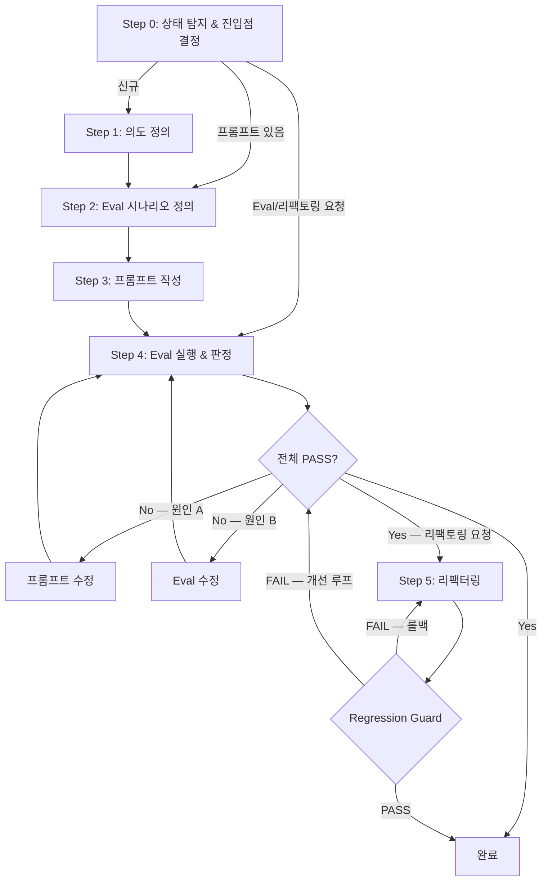

# sd-prompt: Eval-Driven Prompt Development

프롬프트 파일이란 룰(.claude/rules/*.md), 시스템 프롬프트, 커스텀 지시 등 모든 .md 프롬프트를 포함한다.

## 산출물 파일 구조

```
룰인 경우:
  .claude/rules/{name}.md             ← 룰 프롬프트 (산출물)
  .claude/evals/{name}.md             ← 룰의 Eval 시나리오

나머지 경우 (스킬, 프롬프트 등):
  대상 파일 옆에 {대상파일명}.eval.md 로 생성
  예시:
    .claude/skills/{name}/SKILL.md    → .claude/skills/{name}/SKILL.eval.md
    {경로}/{name}.md                  → {경로}/{name}.eval.md
```

Eval 파일은 코드의 테스트 코드처럼 **영구 보존**한다. 스킬/프롬프트 수정 시 regression check에 사용한다.

## 프로세스 흐름

아래 다이어그램이 전체 프로세스의 흐름이다. 각 노드의 상세 설명은 이후 섹션에서 기술한다.



## Step 0: 상태 탐지 & 진입점 결정

스킬/프롬프트 이름과 대상 경로를 확인한 뒤, 기존 파일 존재 여부를 탐색한다.

### 탐지 항목
1. 스킬: `.claude/skills/{name}/SKILL.md` 존재 여부
2. 프롬프트: 사용자가 지정한 경로의 .md 파일 존재 여부
3. Eval: 룰이면 `.claude/evals/{name}.md`, 나머지는 `{대상파일}.eval.md` 존재 여부
4. 기존 스킬/프롬프트: `.claude/skills/` 및 `.claude/rules/`를 Glob으로 탐색하여 충돌·중복 여부 확인

### 진입점

| 상태 | 시작 Step |
|------|-----------|
| 아무것도 없음 (신규) | Step 1 (의도 정의) |
| 프롬프트 있음 (Eval 없음 또는 개선) | Step 2 (Eval 시나리오 정의) |
| 프롬프트 + Eval 있음 (Eval 실행 또는 리팩토링 요청) | Step 4 (Eval 실행 & 판정) |

탐지 결과와 시작 Step을 사용자에게 보여준 뒤 바로 진행한다.

### 원본 백업

기존 프롬프트가 있는 경우(개선/Eval 요청/리팩토링), Step 0에서 대상 파일의 현재 내용을 읽어 컨텍스트에 보존한다 — 이후 Step 4 실행 절차에서 `_history/org.md`로 기록한다.

## Step 1: 의도 정의 (Intent)

스킬/프롬프트의 목적, 트리거 조건, 입출력, 품질 기준을 명확히 한다.

### 1-1. 확인 사항

| 항목 | 설명 |
|------|------|
| **스킬 vs 프롬프트** | 특정 명령/맥락에서 트리거 → 스킬. 항상 적용되거나 특정 상황에서 참조 → 프롬프트 |
| **트리거 조건** | 어떤 사용자 발화/상황에서 발동하는가 (스킬인 경우) |
| **입력** | 스킬/프롬프트가 받는 것 (사용자 입력, 파일, 코드베이스 등) |
| **출력** | 스킬/프롬프트가 내놓는 것 (파일, 메시지, 코드 변경 등) |
| **품질 기준** | 무엇이 "잘 된" 출력인가 (구체적, 객관적으로) |
| **기존 스킬/프롬프트 관계** | 충돌하는가, 보완하는가, 독립인가 |

### 1-2. 확인/추측 분류

프롬프트 작성 전에 두 가지를 분리한다:

| 구분 | 설명 | 행동 |
|------|------|------|
| **확인된 것** | 사용자가 직접 말했거나, 현재 코드베이스에서 동일 패턴을 확인한 것 | 그대로 진행 |
| **추측인 것** | 위에 해당하지 않는 모든 것 — 사용자가 명시하지 않은 내용·범위·형식·수준 | Question으로 전환 |

### 1-3. Question 루프

선택지 제시 시 `.claude/rules/sd-option-scoring.md`의 규칙을 따른다.

1. 추측 항목을 사용자에게 질문한다
2. 답변을 반영하여 확인으로 변경한다
3. 새 Question이 발생하면 추가한다
4. Question이 모두 해소될 때까지 반복한다

## Step 2: Eval 시나리오 정의 (Test-First)

프롬프트 작성 전에 "무엇이 성공인가"를 먼저 정의한다.

### Eval 유형

| Eval 유형 | 설명 | 판정 방식 |
|-----------|------|-----------|
| **행동 Eval** | 이 입력에서 출력이 충족해야 할 체크리스트 | 객관적 항목 + LLM 판단 |
| **안티패턴 Eval** | 출력에 나타나면 안 되는 것들 | 행동/결과 확인 + LLM 판단 |

### 체크리스트 작성 원칙

Judge의 정확도는 체크리스트의 품질에 달려있다. 다음 원칙을 따른다:

#### 1) 행동/결과 중심 — 도구명을 사용하지 않는다

Eval은 비대화형(`claude -p`)으로 실행되므로, 특정 도구에 의존하면 환경에 따라 판정이 달라진다. "무엇을 했는가/무엇이 출력되었는가"를 기술한다:

```
(X) "AskUserQuestion 도구를 호출했다"
(O) "모호한 요구사항에 대해 명확화 질문이 출력에 포함되었다"

(X) "Read 도구로 파일을 읽었다"
(O) "출력이 해당 파일의 내용에 기반한 분석을 포함한다"

(X) "Glob으로 탐색했다"
(O) "기존 스킬 목록이 출력에 반영되어 있다"
```

#### 2) 객관적 기준 — 주관적 표현을 제거한다

```
(X) "프롬프트 내용이 좋은가"
(O) "모호한 표현('적절한', '필요시', '경우에 따라' 등)이 없는가"
```

#### 3) 단일 기준 — 하나의 항목은 하나만 평가한다

```
(X) "파일을 읽고 올바른 분석을 출력했다"
(O) "출력에 해당 파일 기반 분석이 포함되었다"
(O) "분석 결과가 사실에 부합한다"
```

#### 4) 프로세스 중심 — 추론 결과가 아닌 규칙 적용 여부를 평가한다

LLM이 특정 형태의 결과를 출력했는지가 아니라, 프로세스/규칙을 따랐는지를 기준으로 작성한다:

```
(X) "기존 스킬/룰 목록이 출력에 포함되었다"  — 특정 출력 형태를 기대
(O) "기존 스킬/룰과의 충돌·중복 여부를 확인했다" — 규칙 적용 여부를 평가

(X) "3개의 개선안이 출력에 포함되었다"       — 추론 결과의 수량을 기대
(O) "FAIL 원인을 분석하고 개선안을 제시했다"  — 프로세스 수행 여부를 평가
```

### Eval 파일 형식

Eval 파일 경로는 "산출물 파일 구조" 섹션을 따른다.

#### 입력 작성 원칙
- **스킬:** 실제 호출 방식인 `/{skill-name}`(슬래시 커맨드)을 입력으로 사용한다
- **프롬프트:** 프롬프트가 적용되어야 하는 상황의 자연어 발화를 입력으로 사용한다

```markdown
# Eval: {skill-or-prompt-name}

## 행동 Eval

### 시나리오 1: {이름}
- 입력: "/{skill-name}" (스킬) 또는 "{자연어 발화}" (프롬프트)
- 체크리스트:
  - [ ] {객관적 판정 기준 1}
  - [ ] {객관적 판정 기준 2}
  - [ ] {객관적 판정 기준 3}

### 시나리오 2: {이름}
- 입력: "{사용자 입력}"
- 체크리스트:
  - [ ] {객관적 판정 기준 1}
  - [ ] {객관적 판정 기준 2}

## 안티패턴 Eval

- [ ] {하면 안 되는 행동 1}
- [ ] {하면 안 되는 행동 2}
```

Eval 시나리오 전문(체크리스트, 안티패턴 포함)을 텍스트로 출력하여 사용자에게 보여준다.

작성 후 SKILL.md(또는 대상 프롬프트)와 Eval 체크리스트 간 정합성을 확인한다 — 유령 참조(삭제/변경된 지시를 참조)나 이름 불일치가 있으면 즉시 수정한다.

## Step 3: 프롬프트 작성 (Author)

### 스킬인 경우: SKILL.md 구조

```markdown
---
name: {skill-name}
description: |
  {스킬 설명. 트리거 조건을 포함하여 작성.}
---

# {skill-name}: {제목}

{스킬의 목적과 동작 요약}

## 프로세스

{단계별 지시사항}

## 형식

{출력 형식/템플릿}

## 산출물 예시

{구체적인 예시}
```

### 프롬프트인 경우: .md 구조

```markdown
# {프롬프트 제목}

{지시사항. 명확하고 모호하지 않게 작성.}

## 규칙

{구체적인 규칙 목록}
```

### 작성 원칙

- **Why를 설명한다** — "MUST/NEVER" 단독 사용 대신, 왜 그렇게 해야 하는지를 설명하면 LLM이 맥락을 이해하고 더 잘 따른다
- **규칙은 명령형, 맥락은 서술형** — 규칙/제약은 명령형으로(`import type`을 사용한다), 맥락/설명은 서술형으로(`core-common`은 내부 의존성이 없는 leaf 패키지다)
- **금지에는 대안을 함께 제시한다** — "`Buffer` 사용 금지"만으로는 불충분. "`Buffer` 금지 — `Uint8Array`를 사용한다"로 작성한다
- **강도 키워드를 구분한다** — 강한 규칙: `MUST`, `NEVER`, `ALWAYS`, `CRITICAL`, `IMPORTANT`, `required`, `prohibited`. 약한 가이드: `prefer`, `recommended`, `when possible`, `by default`. IMPORTANT/CRITICAL은 진짜 중요한 규칙에만 사용한다 — 남발하면 효과가 희석된다
- **모호한 표현을 제거한다** — "적절하게", "필요시", "경우에 따라" 등은 LLM이 추측하게 만든다. 구체적인 조건과 행동으로 바꾼다
- **코드 식별자는 백틱으로 감싼다** — `import type`, `Uint8Array`, `console.*`, `== null`
- **예시를 포함한다** — 입력 → 출력 예시가 있으면 추상적 지시보다 강력하다
- **간결하게 유지한다** — SKILL.md는 500줄 이하를 목표로 한다
- **기존 스킬 패턴을 참고한다** — 같은 프로젝트의 다른 sd-* 스킬과 일관된 스타일을 유지한다

프롬프트를 작성/수정한 뒤, 변경 내용(무엇을 어떻게 변경했는지)을 사용자에게 출력한다.

## Step 4: Eval 실행 & 판정

### 실행 절차

`.claude/skills/sd-prompt/references/eval-runner.md`를 읽고 절차에 따라 Eval을 실행한다.

### 개선 루프

#### 게이트 규칙

FAIL이 1개라도 있으면 Step 5로 진행할 수 없다.

#### FAIL 처리 규칙

FAIL이 존재할 때 허용되는 행동은 두 가지뿐이다 — 이유를 불문하고 수정 없이 다음 단계로 넘어가는 것은 금지한다:
1. **(A) 프롬프트를 수정**하고 Eval을 재실행한다
2. **(B) Eval 체크리스트를 수정**하고 Eval을 재실행한다

#### FAIL 원인 확인

Judge 보고서의 "FAIL 상세 분석"에서 각 FAIL 항목의 원인 판별(A/B)과 실제 행동 인용을 확인한다.
Judge의 판별에 동의하지 않으면 재판별하되, Judge가 인용한 "실제 행동"을 근거로 판단한다.

#### 원인 A — 프롬프트 개선안 생성

FAIL 항목과 Judge 근거를 종합하여 프롬프트 개선안을 1개 이상 생성한다:

```
## 개선 후보

### Candidate A: {변경 요약}
- 변경: {구체적 변경 내용}
- 기대 효과: {어떤 FAIL을 해결하는가}
```

사용자에게 후보를 보여주고 승인/거부/수정을 요청한다. 승인된 candidate로 **메인 프로젝트의 원본**을 수정한다. 수정 전 현재 프롬프트를 workspace의 `_history/v{N}.md`에 백업한다. 수정 후 workspace를 재구성하여 Eval을 재실행한다.

#### 원인 B — Eval 체크리스트 수정

Eval 체크리스트의 문제점을 사용자에게 보여주고 확인받은 뒤, **메인의 Eval 파일**을 수정한다.

#### 개선 원칙

Step 3의 작성 원칙(Why 설명, 예시 포함)을 FAIL 항목에 집중 적용한다. 단, **과적합을 방지한다** — 특정 Eval 시나리오에만 맞추지 말고, 일반적으로 통하는 표현으로 개선한다.

## Step 5: 프롬프트 리팩터링 (Refactor)

전체 Eval PASS 후, 개선 루프에서 누적된 패치를 정리하여 최소한의 프롬프트를 찾는다.

### Prompt Smell 탐지

| Smell | 연산 |
|---|---|
| **중복 지시** — 같은 내용이 다른 표현으로 반복 | 통합 |
| **투기적 지시** — 관찰된 실패 없이 추가된 것 | 삭제 |
| **고아 지시** — Eval이 없는 지시 | 삭제 또는 Eval 추가 |
| **잔재 지시** — 이전 개선 루프에서 남은 것 | 삭제 |
| **장황한 표현** | 의미 유지하며 압축 |
| **용어 불일치** — 같은 개념을 다른 단어로 지칭 | 통일 |
| **상충 지시** — 서로 모순/충돌 | 우선순위 결정 후 통합 또는 삭제 |
| **구조 산만** — 관련 지시가 흩어져 있음 | 재배치 |

### Regression Guard

리팩터링 후 Eval을 재실행한다. FAIL 시 **(A) 롤백** 또는 **(B) 개선 루프**로 수정한다. Eval 전체 PASS가 유지되면 완료.
