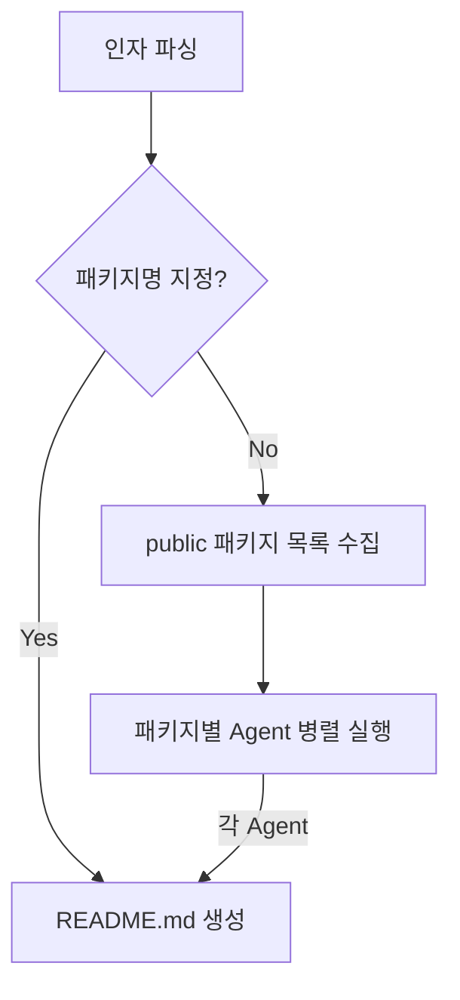

# SD Readme — 모노레포 패키지 README 문서 생성기

모노레포의 각 패키지에 대해 README.md 문서를 자동 생성한다. 패키지 규모에 따라 단일 README.md 또는 README.md + docs/*.md 구조로 점진적 공개(Progressive Disclosure) 원칙을 적용한다.

ARGUMENTS: 패키지명 (선택). 지정하면 해당 패키지만 처리, 미지정 시 전체 패키지 병렬 처리.

## 작업 방법



### A. 인자 파싱

스킬 호출 시 전달된 ARGUMENTS에서 패키지명을 추출하라.

- **패키지명 지정됨** → `packages/` 하위에서 해당 디렉토리를 찾아 바로 **C. README.md 생성**으로 이동.
- **패키지명 미지정** → **D. public 패키지 목록 수집**으로 이동.

### C. README.md 생성

대상 패키지 하나에 대해 아래를 수행하라.

#### C-1. package.json 분석

`packages/<name>/package.json`을 읽어라:

1. `name` 및 `description`을 확인하라.
2. `"private": true`이면 해당 패키지를 **건너뛰어라**.
3. 패키지 진입점 소스코드가 무엇인지 확인하라.

#### C-2. 소스 코드 분석

1. 진입점 파일 및 export를 재귀적으로 모두 읽어, 모든 public API를 수집하라.
2. JSDoc 주석이 있으면 각 항목의 설명으로 활용하라.

#### C-3. 문서 구조 결정 및 생성

소스 코드의 규모와 논리적 카테고리 수를 보고, 아래 두 가지 중 적절한 구조를 **자율적으로** 판단하라:

- **단일 README.md**: 패키지가 작고 API가 적어 카테고리 분류가 불필요한 경우
- **README.md + docs/*.md**: 패키지가 크거나 논리적 카테고리가 여러 개인 경우

기존 README.md 또는 docs/가 있으면 기존 내용을 기반으로 **변경된 부분만 수정**하라. 기존 문서가 없으면 새로 생성하라.
구조가 변경되는 경우(B→A) 불필요해진 `docs/` 디렉토리를 삭제하라.
**영어**로 작성하라.

#### C-4. package.json files 필드 관리

`docs/` 디렉토리 생성·삭제 시 `package.json`의 `files` 배열을 함께 업데이트하라:

- **구조 B 적용 시**: `files`에 `"docs"` 항목이 없으면 추가하라.
- **구조 A 적용 시**: `files`에 `"docs"` 항목이 있으면 제거하라.

---

##### 구조 A: 단일 README.md (소규모 패키지)

`packages/<name>/README.md` 파일을 생성하라:

```markdown
# <package-name from package.json>

> <description from package.json>

<패키지의 주요 기능과 목적에 대한 상세 설명을 영어로 작성>

## API Reference

### <exportedName>

```typescript
<export 시그니처 코드>
```

<해당 API에 대한 설명>

---

(... 모든 exported 항목에 대해 반복 ...)

## Usage Examples

```typescript
import { ... } from "<package-name>";

// 주요 사용 예제 코드
```
```

---

##### 구조 B: README.md + docs/*.md (대규모 패키지)

**README.md** — `packages/<name>/README.md` 파일을 생성하라:

```markdown
# <package-name from package.json>

> <description from package.json>

<패키지의 주요 기능과 목적에 대한 상세 설명을 영어로 작성>

## Documentation

| Category | Description |
|----------|-------------|
| [<Category1>](docs/<category1>.md) | <카테고리 설명 및 주요 항목 나열> |
| [<Category2>](docs/<category2>.md) | <카테고리 설명 및 주요 항목 나열> |
| ... | ... |
```

**docs/*.md** — 각 카테고리별로 `packages/<name>/docs/<category>.md` 파일을 생성하라:

```markdown
# <Category Name>

## <exportedName>

```typescript
<export 시그니처 코드>
```

<해당 API에 대한 설명>

---

(... 이 카테고리의 모든 exported 항목에 대해 반복 ...)

## Usage Examples

```typescript
import { ... } from "<package-name>";

// 이 카테고리의 주요 사용 예제 코드
```
```

카테고리명과 분류는 소스 코드의 디렉토리 구조, 기능적 유사성 등을 고려하여 자율적으로 결정하라.

---

### D. public 패키지 목록 수집

`packages/*/package.json`을 Glob으로 탐색하되, `private: true`인 패키지는 제외하라.

---

### E. 패키지별 Agent 병렬 실행

남은 각 패키지에 대해 Agent 도구를 사용하여 **병렬로** 다음 프롬프트를 전달하라:
```
/sd-readme <패키지명>
```

모든 subagent가 완료되면 종료.
