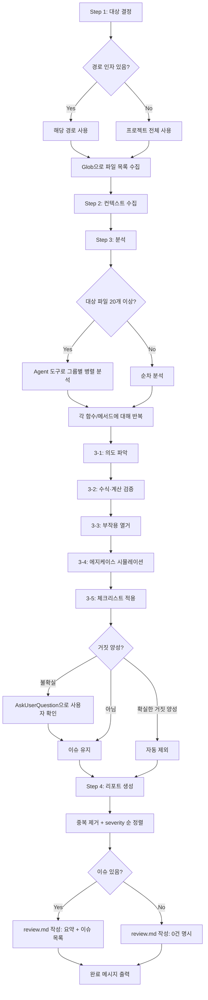

# sd-review: 코드 리뷰

코드베이스에서 **타입체커·린터가 잡지 못하는 이슈**를 탐지하여 `.tasks/{yyMMddHHmmss}_review-{topic}/review.md`에 리포트를 생성한다.
`{yyMMddHHmmss}`는 **반드시 Bash 도구로 `date +%y%m%d%H%M%S`를 실행하여 얻는다.** LLM이 직접 생성하면 시분초가 누락되므로 금지한다.
코드를 직접 수정하지 않는다. 수정은 사용자가 리포트를 확인한 후 별도로 요청한다.

## 프로세스 흐름

아래 다이어그램이 전체 프로세스의 흐름이다. 각 노드의 상세 설명은 이후 섹션에서 기술한다.



## Step 1: 대상 결정

인자로 경로가 지정되면 해당 경로, 미지정이면 프로젝트 전체를 분석한다.

- `/sd-review src/services` → `src/services` 하위만
- `/sd-review` → 프로젝트 루트 전체

### 대상 파일

소스 코드 (`.ts`, `.tsx`, `.js`, `.jsx`, `.vue`, `.py`, `.java`, `.go` 등)

### 제외 대상
- `node_modules/`, `dist/`, `build/`, `.`으로 시작하는 모든 폴더
- 자동 생성 파일 (`.d.ts`, `*.generated.*`)
- 테스트 파일 (`*.spec.*`, `*.test.*`)

Glob으로 대상 파일 목록을 수집하고, 파일 수를 사용자에게 보여준다.

## Step 2: 컨텍스트 수집

프로젝트의 기술 스택과 컨벤션을 파악한다.

확인 대상:
- `package.json` — 기술 스택, 의존성
- `tsconfig.json` — TypeScript 설정
- `.eslintrc.*` / `eslint.config.*` — 린터가 이미 처리하는 규칙 파악
- 프로젝트 디렉토리 구조

## Step 3: 분석

대상 파일을 읽고, 4가지 관점으로 이슈를 탐지한다.

### 3-1: 의도 파악

함수명, 변수명, 주석에서 "이 함수가 하려는 것"을 기술한다.

### 3-2: 수식·계산 검증

코드에 수식이 있으면 구체적 숫자를 대입하여 중간 결과를 추적한다. 각 연산의 피연산자가 의도에 맞는지 확인한다 (예: 할인은 어떤 금액에 적용되는가?).

### 3-3: 부작용 열거

이 함수가 수행하는 모든 부작용(DB 쓰기, API 호출, 이벤트 발행 등)을 나열한다. 함수의 의도상 있어야 하지만 코드에 없는 부작용을 찾는다.

### 3-4: 에지케이스 시뮬레이션

빈 값, 경계값, 이례적 입력에서 어떤 결과가 나오는지 추적한다.

### 3-5: 체크리스트 적용

아래 관점별 체크리스트로 이슈를 식별한다.

#### 로직 버그 (LOGIC)

실행은 되지만 결과가 틀린 이슈:

- 의도-구현 불일치: 함수명/주석이 암시하는 동작과 실제 구현이 다른 경우 (예: 합산해야 하는데 덮어쓰기)
- 비즈니스 로직 오류: 잘못된 계산 순서, 잘못된 조건, 잘못된 수식 (예: 할인 후 세금 vs 세금 후 할인)
- 누락된 단계: 프로세스에 반드시 있어야 하는 단계가 빠짐. 함수가 하는 일의 부작용(side effect)을 나열하고, 빠진 부작용이 없는지 확인한다 (예: 주문 생성 → DB 삽입은 있지만 재고 차감/결제 처리가 없음)
- 상태 전이 오류: 허용되지 않아야 하는 상태 변경이 가능 (예: 배송 완료된 주문 취소 가능)
- 데이터 정합성: 한쪽은 업데이트하고 다른 쪽은 안 하는 부분 업데이트
- 에지케이스 논리 오류: 도메인 수준의 경계값 처리 누락 (예: 생일 지남 여부를 고려하지 않는 나이 계산)

#### 보안 (SEC)
- SQL Injection: 문자열 연결로 쿼리 생성
- XSS: innerHTML, 사용자 입력 미이스케이프
- 하드코딩된 시크릿/패스워드/API 키
- 입력 검증 누락: 사용자 입력을 검증 없이 DB/파일시스템/외부 API에 전달
- 안전하지 않은 코드 실행: eval, Function constructor

#### 성능 (PERF)
- O(n^2) 이상의 중첩 루프 (같은 컬렉션을 반복 순회)
- N+1 쿼리 패턴 (루프 내 DB/API 호출)
- 불필요한 직렬 await (Promise.all로 병렬화 가능한 독립 호출)

#### 설계 (DESIGN)
- 함수명/변수명과 실제 동작의 괴리 (의미론적 네이밍 문제)
- 한 함수가 너무 많은 책임 (단일 책임 원칙 위반)
- 에러 발생 가능한 호출(DB, 네트워크, JSON.parse 등)에 에러 처리 없음
- 에러 삼킴 (빈 catch 블록)
- 리소스 미해제 (이벤트 리스너, 스트림, DB 커넥션)

### 거짓 양성 판정

이슈가 의도된 설계인지 불확실하면, 스스로 필터링하지 말고 AskUserQuestion으로 사용자에게 확인한다. (`.claude/rules/sd-option-scoring.md`의 규칙을 따른다) 확실한 거짓 양성(프레임워크 패턴, 프로젝트 컨벤션)만 자동 제외한다.

### 보고하지 않는 것

sd-review는 sd-check(타입체커/린터)이 이미 잡는 이슈를 보고하지 않는다:
- 타입 누락, 타입 불일치, `any` 사용, 파라미터 타입 미지정
- `var` 사용, `==` vs `===`, 미사용 변수/import, 코드 스타일
- 들여쓰기, 세미콜론, 줄바꿈, 따옴표

또한 확신할 수 없는 영역(실제 런타임 성능 수치, race condition, 메모리 릭)은 확정적으로 단정하지 않는다.

### Severity 기준

| Severity | 기준 | 예시 |
|----------|------|------|
| **Critical** | 보안 취약점, 데이터 손실/손상, 잘못된 비즈니스 결과 | SQL Injection, 합산 대신 덮어쓰기 |
| **Medium** | 특정 조건에서 잘못된 동작, 누락된 처리 | 상태 체크 누락, 에러 처리 부재 |
| **Low** | 개선하면 좋지만 당장 오동작하지는 않음 | 성능 비효율, 설계 개선 제안 |

### 이슈 형식

```
id: {카테고리약자}-{순번} (예: SEC-001, LOGIC-002)
severity: Critical | Medium | Low
category: 로직 | 보안 | 성능 | 설계
location: {파일경로}:{라인번호}
title: {한 줄 요약}
description: {왜 문제인지 — 의도와 실제 동작의 차이를 설명}
suggestion: {개선 방향}
```

## Step 4: 리포트 생성

분석 결과를 위에서 정의한 경로(`review.md`)에 작성한다.

- **중복 제거**: 같은 위치의 같은 이슈를 합친다
- **severity 순 정렬**: Critical → Medium → Low
- **review.md 작성**: 요약 테이블(분석 대상, 일시, 파일 수, 이슈 수) + severity별 이슈 목록

이슈가 없으면 "발견 이슈: 0건"과 "분석 결과 보고할 이슈가 없습니다."를 명시한다.

### 완료 후 출력

대화에 다음을 표시한다:
- 발견 이슈 수 (severity별)
- review.md 파일 경로
- 수정이 필요하면 `/sd-dev`로 개발을 진행할 수 있다는 안내
- 수정 후 `/sd-check`로 검증할 수 있다는 안내
