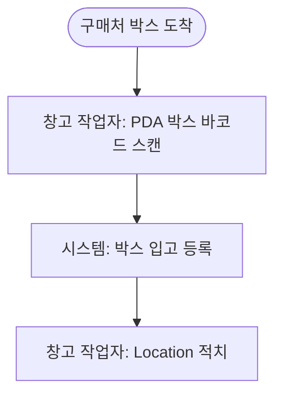

# 재고관리 요구 분석서

## 1. 개요

### 1.1 핵심 목적 [확정: 2026-05-20]

박스 단위 입고와 품목별 재고 관리

### 1.2 주요 목표 [확정: 2026-05-20]

- 창고 작업자가 박스를 입고 등록한다
- 운영자가 품목 마스터를 관리한다

### 1.3 최종 사용자/이해관계자 [확정: 2026-05-20]

- 창고 작업자
- 시스템 운영자

### 1.4 환경/장치 [확정: 2026-05-20]

#### 구성도

```
┌──────────────┐    ┌──────────────┐
│ PC 클라이언트 │───→│     서버      │
└──────────────┘    └──────────────┘
```

#### 장치 목록

- PC: Chrome 최신
- 서버: Node 20

## 2. 업무 프로세스

### 2.1 박스 입고 [확정: 2026-05-20]



- 박스에는 품목코드·수량·박스번호 합성 바코드가 부착되어 도착
- 스캔 시 박스 정보가 시스템에 등록됨

관련 섹션: [화면.품목 관리], [모델.품목]

## 3. 기타 요구사항

### 3.1 품목 마스터 관리 [확정: 2026-05-20]

운영자가 품목 코드·품목명·규격을 등록·수정한다.

관련 섹션: [화면.품목 관리], [모델.품목]

## 4. 화면

| §   | 분류     | 화면      | 유형   | 장치 |
| --- | -------- | --------- | ------ | ---- |
| 4.1 | 기준정보 | 품목 관리 | 마스터 | PC   |

### 4.1 품목 관리 (PC) [OPEN: 2026-05-20]

분석 방법: §3.1 품목 마스터 관리 본문 + [모델.품목] 필드 기반으로 마스터 화면(목록 시트 + 등록·편집)을 명세. 마스터 화면 표준(ID 편집 버튼·선택 체크박스·시트 상단 버튼바) 적용.

## 5. 자동 처리

## 6. 공통·기반 기능

## 7. 공통 정의

## 8. 도메인 모델

### 8.1 품목 [확정: 2026-05-20]

필드:

| 필드     | 타입   | 필수 | 비고                   |
| -------- | ------ | ---- | ---------------------- |
| ID       | 숫자   | Y    | 자동 부여              |
| 품목코드 | 문자열 | Y    | 비즈니스 키. 영문·숫자 |
| 품목명   | 문자열 | Y    |                        |
| 규격     | 문자열 | N    | 예: 100ml              |
| 활성여부 | 불리언 | Y    | 소프트 삭제 플래그     |

키/제약:

- 식별 키: ID
- 비즈니스 키: 품목코드

## 9. 외부 인터페이스

## 10. 본문 외 확정 사항
