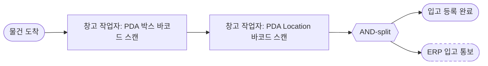

# WMS 요구 분석서 (예시)

> sd-spec 스킬이 산출하는 `spec.md` 의 풀 example.
> 가상의 WMS 시나리오 — 박스 단위 Location 관리 + ERP 단방향 통보.
> 시나리오 일자 = 2026-04-01 (사용자 확정 시작일 가정).

## 1. 개요

### 1.1 핵심 목적 [확정: 2026-04-01]

박스 단위로 Location 추적, 입출고 발생을 ERP 와 연동하는 WMS

### 1.2 주요 목표 [확정: 2026-04-01]

- 박스 입고 처리
- 박스 출고 처리
- 입출고에 의한 재고 확인
- 입출고 정보 ERP 동기화

### 1.3 최종 사용자/이해관계자 [확정: 2026-04-01]

- 창고 작업자: 현장에서 PDA를 들고 실제로 물건을 옮기는 작업을 하는 사람
- 창고 관리자: 사무실에서 PC로 전반적인 관리나 일상 업무를 하는 사람

### 1.4 환경/장치 [확정: 2026-04-01]

```
   ┌─────────┐              ┌─────────┐
   │   PC    │              │   PDA   │
   └────┬────┘              └────┬────┘
        │                        │
        └───────────┬────────────┘
                    ▼
              ┌───────────┐   통보(단방향)   ┌───────┐
              │ WMS 서버  │ ───────────────► │  ERP  │
              └─────┬─────┘                  └───────┘
                    │
            ┌───────┴────────┐
            ▼                ▼
      ┌───────────┐   ┌───────────────┐
      │ A4 Printer│   │ Label Printer │
      └───────────┘   └───────────────┘
```

- PC — 창고 관리자가 마스터·출고지시서·재고 화면에 사용
  - OS: Windows 11
  - Browser: Chrome 최신
  - 해상도: 1920 x 1080
- PDA — 창고 작업자가 박스·Location 스캔에 사용
  - Model: DS60S
  - OS: Android 9
  - 해상도: 360 x 568
- A4 Printer — 출고지시서 출력, Location 바코드 전체 출력(A4 다중)
  - 스펙: 일반 시중의 모든 프린터
- Label Printer — Location 라벨 1매씩 출력
  - Model: [OPEN]

## 2. 공통 정의

### 2.1 용어 사전 [확정: 2026-04-01]

- 박스: 외부에서 이미 바코드(품목+수량+박스번호)가 부착된 입고 단위
- Location: 창고 내 적치 위치 ([공통 정의.Location 라벨])
- ERP 통보: 입출고 발생 시 WMS → ERP 단방향 알림
- 활성 여부: 마스터 데이터의 소프트 삭제 플래그 (true = 정상, false = 삭제 처리됨). UI 의 "삭제/복구" 액션과 매핑. 마스터에 완전 삭제(DB 레코드 제거) 없음.

### 2.2 박스 바코드 형식 [OPEN: 2026-04-01]

- 구조: `<품목코드>-<수량>-<박스번호>`
  - 품목코드: 영문 대문자 + 숫자, 최대 8자
  - 수량: 숫자 4자리 (좌측 0 패딩)
  - 박스번호: `yyMMdd` + 3자리 일련번호 (총 9자리, 숫자)
- 심볼로지: Code128
- 예: `ABC12345-0024-260401017` (구매처에서 2026-04-01 에 출고한 17번째 박스)

### 2.3 Location 라벨 [확정: 2026-04-01]

```
┌────────────────────────────────┐
│                                │
│   [Code128 바코드: A-01-03]    │
│                                │
│            A-01-03             │
│                                │
└────────────────────────────────┘
```

- 표시 항목: 바코드 + Location 코드 텍스트
- 심볼로지: Code128
- 라벨 크기: 100 × 50 mm
- 라벨 재질: 유포지, 흰색 무지

## 3. 도메인 모델

### 3.1 품목 [확정: 2026-04-01]

필드:

| 필드      | 타입    | 필수 | 비고             |
| --------- | ------- | ---- | ---------------- |
| ID        | 숫자    | O    | 자동 부여        |
| 코드      | 문자    | O    | 자유 형식, 수정 가능 |
| 명칭      | 문자    | O    |                  |
| 활성 여부 | boolean | O    |                  |

키/제약:

- 식별 키: ID (자동 부여)
- 비즈니스 키: 코드 (사용자 부여, 수정 가능)
- 유일성: 활성 품목 내 코드, 명칭 각각 유일

### 3.2 박스 [확정: 2026-04-01]

필드:

| 필드     | 타입        | 필수 | 비고                                     |
| -------- | ----------- | ---- | ---------------------------------------- |
| ID       | 숫자        | O    | 자동 부여                                |
| 박스번호 | 문자        | O    | [공통 정의.박스 바코드] 의 박스번호 부분 |
| 품목     | 참조 - 품목 | O    | 박스 바코드 파싱 결과                    |
| 수량     | 숫자        | O    | 박스 바코드 파싱 결과                    |

키/제약:

- 식별 키: ID (자동 부여)
- 비즈니스 키: 박스번호
- 박스 1개 = 단일 품목
- 유일성: 박스번호 유일

### 3.3 Location [확정: 2026-04-01]

필드:

| 필드      | 타입    | 필수 | 비고                                                                |
| --------- | ------- | ---- | ------------------------------------------------------------------- |
| ID        | 숫자    | O    | 자동 부여                                                           |
| 코드      | 문자    | O    | 영문 대문자/숫자/하이픈. 수정 가능. 예 `A-01-03`, `ZONE1-RACK7-LV2` |
| 활성 여부 | boolean | O    |                                                                     |

키/제약:

- 식별 키: ID (자동 부여)
- 비즈니스 키: 코드 (사용자 부여, 수정 가능)
- 유일성: 활성 Location 내 코드 유일

### 3.4 재고 [확정: 2026-04-01]

필드:

| 필드     | 타입            | 필수 | 비고      |
| -------- | --------------- | ---- | --------- |
| ID       | 숫자            | O    | 자동 부여 |
| 박스     | 참조 - 박스     | O    |           |
| Location | 참조 - Location | O    |           |

키/제약:

- 식별 키: ID (자동 부여)
- 박스 1개는 동시에 1개 Location 에만 존재 (= 박스-재고 1:1)
- Location 1개에 박스 다중 가능

### 3.5 재고 스냅샷 [확정: 2026-04-01]

필드:

| 필드     | 타입            | 필수 | 비고      |
| -------- | --------------- | ---- | --------- |
| ID       | 숫자            | O    | 자동 부여 |
| 날짜     | 날짜            | O    | 스냅샷 일자 |
| 박스     | 참조 - 박스     | O    |           |
| Location | 참조 - Location | O    |           |

키/제약:

- 식별 키: ID (자동 부여)
- 비즈니스 키: (날짜, 박스) 조합 유일

## 4. 업무 프로세스

### 4.1 입고 [확정: 2026-04-01]



관련 섹션: [화면.입고 스캔], [화면.품목 관리], [화면.Location 관리], [화면.재고 확인], [외부인터페이스.ERP 입고 통보]

### 4.2 출고 [OPEN: 2026-04-01]

보류 — 입고 프로세스 구현 완료 후 진행 예정

## 5. 기타 요구사항

### 5.1 직원 관리 컬럼 추가 [OPEN: 2026-04-01]

보류 — 입고 프로세스 구현 완료 후 진행 예정

(요청 메모: 기존 직원 관리 화면에 사원번호 컬럼 추가, WMS 입출고 작업자 식별 용도)

### 5.2 재고 과거 조회 [확정: 2026-04-01]

특정 일자의 재고 상태를 조회할 수 있어야 함.

구현:

- [화면.재고 확인] 의 기준일 필터
- [자동 처리.재고 스냅샷] 으로 일자별 스냅샷 데이터 보관

## 6. 화면

| §   | 화면               | 구분     | 장치 |
| --- | ------------------ | -------- | ---- |
| 6.1 | 품목 관리          | 마스터   | PC   |
| 6.2 | 품목 등록·편집     | 마스터   | PC   |
| 6.3 | Location 관리      | 마스터   | PC   |
| 6.4 | Location 등록·편집 | 마스터   | PC   |
| 6.5 | 입고 스캔          | 트랜잭션 | PDA  |
| 6.6 | 재고 확인          | 조회     | PC   |

### 6.1 품목 관리 (PC) [확정: 2026-04-01]

Actor: 창고 관리자
관련 프로세스: [프로세스.입고]

기능 개요:

- 품목 마스터 CRUD (등록 / 편집 / 삭제·복구 / 엑셀 업·다운로드)

텍스트 와이어프레임:

```
┌──────────────────────────────────────────────────────────────────────────┐
│ 품목 관리                                                                │
│ [조회]  검색: [____________]                                             │
├──────────────────────────────────────────────────────────────────────────┤
│ [등록] [선택 삭제] [선택 복구] [엑셀 업로드] [엑셀 다운로드]             │
│ ──────────────────────────────────────────────────────────────────────── │
│ [ ] │  ID    │ 코드     || 명칭                                          │
│ ────────────────────────++────────────────────────────────────────────── │
│ [ ] │ [E 3]  │ ABC12345 || 음료수 500ml                                  │
│ [ ] │ [E 2]  │ XYZ00007 || 종이박스                                      │
│ [ ] │ [E 1]  │ DEF99999 || 비누            (비활성: 행 전체 취소선)     │
│ ...                                                                      │
└──────────────────────────────────────────────────────────────────────────┘
   || = fixed 경계 (왼쪽: [ ]/ID/코드 고정, 오른쪽: 가로 스크롤)
   [E N] = 편집 버튼 (E = Edit 아이콘, N = ID). 클릭 시 편집 모달
   비활성 행은 텍스트 취소선 + 회색 처리
```

항목:

**필터**

| 항목 | 종류   | 필수 | 비고                     |
| ---- | ------ | ---- | ------------------------ |
| 검색 | 텍스트 | X    | 코드 또는 명칭 부분 일치 |

**시트 컬럼** (코드까지 fixed)

| 컬럼  | 종류             | 비고                                |
| ----- | ---------------- | ----------------------------------- |
| `[ ]` | 선택 체크박스    |                                     |
| ID    | 숫자 + 편집 버튼 | 클릭 시 편집 모달                   |
| 코드  | 문자             |                                     |
| 명칭  | 문자             | 비활성 시 행 전체 취소선·회색       |

동작:

- `[조회]` 클릭: 검색 필터 조건으로 목록 갱신
- `[등록]` 클릭: [화면.품목 등록·편집] 을 빈 폼으로 모달 띄움
- ID 버튼 클릭: [화면.품목 등록·편집] 을 해당 행 데이터로 모달 띄움
- `[선택 삭제]` 클릭: 선택된 행들의 활성 여부 false 전환 (입출고 불가)
- `[선택 복구]` 클릭: 선택된 행들의 활성 여부 true 전환
- `[엑셀 업로드]` 클릭: 엑셀 파일 선택 → 코드 기준 일괄 등록/수정
- `[엑셀 다운로드]` 클릭: 현재 검색 필터 적용된 목록을 엑셀로 내보내기

### 6.2 품목 등록·편집 (PC) [확정: 2026-04-01]

Actor: 창고 관리자
관련 프로세스: [프로세스.입고]

기능 개요:

- 품목 신규 등록 또는 기존 품목 편집 (호출하는 쪽에서 빈 폼/기존 데이터로 모달 띄움)

텍스트 와이어프레임:

```
┌──────────────────────────────────────┐
│ 품목 등록·편집                       │
├──────────────────────────────────────┤
│                                      │
│  코드:  [__________________]         │
│                                      │
│  명칭:  [__________________]         │
│                                      │
├──────────────────────────────────────┤
│             [저장]  [취소]           │
└──────────────────────────────────────┘
```

항목:

| 항목 | 종류        | 필수 | 비고 |
| ---- | ----------- | ---- | ---- |
| 코드 | 텍스트 입력 | O    |      |
| 명칭 | 텍스트 입력 | O    |      |

동작:

- `[저장]` 클릭: 활성 품목 내 코드·명칭 유일성 검증 → 저장 → 모달 닫음
- `[취소]` 클릭: 변경 사항 폐기 → 모달 닫음

### 6.3 Location 관리 (PC) [확정: 2026-04-01]

Actor: 창고 관리자
관련 프로세스: [프로세스.입고]

기능 개요:

- Location 마스터 CRUD (등록 / 편집 / 삭제·복구 / 엑셀 업·다운로드)
- 두 가지 바코드 출력: A4 다중 + 라벨프린터 1매씩

텍스트 와이어프레임:

```
┌────────────────────────────────────────────────────────────────────────────────────┐
│ Location 관리                                                                      │
│ [조회]  검색: [____________]                                                       │
├────────────────────────────────────────────────────────────────────────────────────┤
│ [등록] [선택 삭제] [선택 복구] [엑셀 업로드] [엑셀 다운로드] [A4 출력] [선택 라벨 출력]│
│ ────────────────────────────────────────────────────────────────────────────────── │
│ [ ] │  ID    │ 코드             ||                                                 │
│ ────────────────────────────────++──────────────────────────────────────────────── │
│ [ ] │ [E 3]  │ A-01-04          ||                                                 │
│ [ ] │ [E 2]  │ A-01-03          ||                                                 │
│ [ ] │ [E 1]  │ ZONE1-RACK7-LV2  || (비활성: 행 전체 취소선)                        │
│ ...                                                                                │
└────────────────────────────────────────────────────────────────────────────────────┘
   || = fixed 경계 (왼쪽: [ ]/ID/코드 고정, 오른쪽: 가로 스크롤)
   [E N] = 편집 버튼 (E = Edit 아이콘, N = ID). 클릭 시 편집 모달
   비활성 행은 텍스트 취소선 + 회색 처리
```

항목:

**필터**

| 항목 | 종류   | 필수 | 비고           |
| ---- | ------ | ---- | -------------- |
| 검색 | 텍스트 | X    | 코드 부분 일치 |

**시트 컬럼** (코드까지 fixed)

| 컬럼  | 종류             | 비고                          |
| ----- | ---------------- | ----------------------------- |
| `[ ]` | 선택 체크박스    |                               |
| ID    | 숫자 + 편집 버튼 | 클릭 시 편집 모달             |
| 코드  | 문자             | 비활성 시 행 전체 취소선·회색 |

동작:

- `[조회]` 클릭: 검색 필터 조건으로 목록 갱신
- `[등록]` 클릭: [화면.Location 등록·편집] 을 빈 폼으로 모달 띄움
- ID 버튼 클릭: [화면.Location 등록·편집] 을 해당 행 데이터로 모달 띄움
- `[선택 삭제]` 클릭: 선택된 행들의 활성 여부 false 전환
- `[선택 복구]` 클릭: 선택된 행들의 활성 여부 true 전환
- `[엑셀 업로드]` 클릭: 엑셀 파일 선택 → 코드 기준 일괄 등록/수정
- `[엑셀 다운로드]` 클릭: 현재 필터 적용된 목록을 엑셀로 다운로드
- `[A4 출력]` 클릭 (A4 다중):
  - 절차:
    1. 선택된 Location 목록을 A4 1매에 그리드로 배치
    2. 각 칸에 [공통 정의.Location 라벨] 의 표시 항목을 인쇄
    3. PDF 다운로드 또는 직접 인쇄
  - [OPEN] A4 1매당 그리드 행/열
- `[선택 라벨 출력]` 클릭 (라벨프린터):
  - 절차:
    1. 선택된 Location 을 [공통 정의.Location 라벨] 규격으로 라벨프린터 1매씩 출력
    2. 다중 선택 시 선택 수만큼 연속 출력

### 6.4 Location 등록·편집 (PC) [확정: 2026-04-01]

Actor: 창고 관리자
관련 프로세스: [프로세스.입고]

기능 개요:

- Location 신규 등록 또는 기존 Location 편집 (호출하는 쪽에서 빈 폼/기존 데이터로 모달 띄움)

텍스트 와이어프레임:

```
┌──────────────────────────────────────┐
│ Location 등록·편집                   │
├──────────────────────────────────────┤
│                                      │
│  코드:  [__________________]         │
│                                      │
├──────────────────────────────────────┤
│             [저장]  [취소]           │
└──────────────────────────────────────┘
```

항목:

| 항목 | 종류        | 필수 | 비고                          |
| ---- | ----------- | ---- | ----------------------------- |
| 코드 | 텍스트 입력 | O    | 영문 대문자/숫자/하이픈       |

동작:

- `[저장]` 클릭: 활성 Location 내 코드 유일성 검증 → 저장 → 모달 닫음
- `[취소]` 클릭: 변경 사항 폐기 → 모달 닫음

### 6.5 입고 스캔 (PDA) [확정: 2026-04-01]

Actor: 창고 작업자
관련 프로세스: [프로세스.입고]

기능 개요:

- 박스 → Location 순서로 스캔하여 재고 등록

텍스트 와이어프레임:

```
┌────────────────────────┐
│   입고 스캔            │
├────────────────────────┤
│ 박스 바코드            │
│ [____________________] │
│                        │
│ Location               │
│ [____________________] │
│                        │
│       [ 등록 ]         │
└────────────────────────┘
       (360 × 568)
```

항목:

| 항목        | 종류        | 필수 | 비고                                               |
| ----------- | ----------- | ---- | -------------------------------------------------- |
| 박스 바코드 | 텍스트 입력 | O    | PDA 스캐너 입력. 파싱 = 품목코드 + 수량 + 박스번호 |
| Location    | 텍스트 입력 | O    | PDA 스캐너 입력                                    |

동작:

- `[등록]` 클릭:
  - 절차:
    1. 박스 바코드 파싱 (품목코드 / 수량 / 박스번호)
    2. 모델 존재 검증 (품목 활성 / Location 활성 / 박스번호 미중복)
    3. [모델.재고] 생성
    4. [외부인터페이스.ERP 입고 통보] 호출

### 6.6 재고 확인 (PC) [확정: 2026-04-01]

Actor: 창고 관리자
관련 프로세스: [프로세스.입고]
관련 자동 처리: [자동 처리.재고 스냅샷]

기능 개요:

- 현재 재고: Location 별 적치된 박스 + 품목·수량 조회
- 과거 시점 재고: 특정 날짜의 스냅샷 조회

텍스트 와이어프레임:

```
┌──────────────────────────────────────────────────────────────────────────┐
│ 재고 확인                                                                │
│ [조회]  기준일: [____-__-__]  품목: [_______]  Location: [_______]       │
├──────────────────────────────────────────────────────────────────────────┤
│ [엑셀 다운로드]                                                          │
│ ──────────────────────────────────────────────────────────────────────── │
│  Location   │ 박스번호    │ 품목      │ 수량                             │
│ ──────────────────────────────────────────────────────────────────────── │
│  A-01-03    │ 260401017   │ ABC12345  │ 0024                             │
│  A-01-03    │ 260401018   │ ABC12345  │ 0024                             │
│  A-01-04    │ 260401001   │ XYZ00007  │ 0010                             │
│  ...                                                                     │
└──────────────────────────────────────────────────────────────────────────┘
```

항목:

**필터**

| 항목          | 종류   | 필수 | 비고                                         |
| ------------- | ------ | ---- | -------------------------------------------- |
| 기준일        | 날짜   | X    | 비우면 현재. 과거 일자 입력 시 스냅샷 조회   |
| 품목 필터     | 텍스트 | X    | 코드 부분 일치                               |
| Location 필터 | 텍스트 | X    | 코드 부분 일치                               |

**시트 컬럼**

| 컬럼     | 종류 | 비고           |
| -------- | ---- | -------------- |
| Location | 문자 |                |
| 박스번호 | 문자 |                |
| 품목     | 문자 | 품목 코드 표시 |
| 수량     | 숫자 |                |

동작:

- `[조회]` 클릭:
  - 기준일 비어있음: 현재 [모델.재고] 조회
  - 기준일 입력됨: [모델.재고 스냅샷] 에서 해당 날짜 분 조회
  - 필터 조건 적용 → 결과 표시
- `[엑셀 다운로드]` 클릭: 현재 조회 결과를 엑셀로 다운로드

## 7. 자동 처리

### 7.1 재고 스냅샷 [확정: 2026-04-01]


목적:

- 과거 시점 재고 조회 지원

트리거:

- 매일 0시 정각

처리:

- [모델.재고] 전체를 [모델.재고 스냅샷] 에 날짜별로 저장

예외 처리:

- 스냅샷 생성 실패 시:
  - 위험: 당일 분 누락 시 해당 날짜의 과거 시점 조회 불가
  - 대처: 관리자 알림. 동일 일자 재실행 시 (날짜, 박스) 유일성 검증으로 중복 생성 방지
  - 재시도 한계: 별도 재시도 없음 (다음 날 0시 정상 동작)

관련 화면: [화면.재고 확인]

## 8. 외부 인터페이스

### 8.1 ERP 입고 통보 [확정: 2026-04-01]

- 상대 시스템: ERP
- 방향: WMS → ERP
- 전송 방식: REST API (POST)

자료 매핑:

| ERP 필드 | WMS 출처              |
| -------- | --------------------- |
| 품목코드 | [모델.박스.품목.코드] |
| 수량     | [모델.박스.수량]      |
| 박스번호 | [모델.박스.박스번호]  |
| 발생시각 | 입고 등록 시각        |

예외 처리:

- 호출 실패 (네트워크 오류, ERP 서버 일시 다운 등):
  - 위험: 단순 재시도 시 ERP 에 같은 박스가 2번 입고 등록될 수 있음 (첫 호출이 실제로는 ERP 에 도달했는데 응답만 못 받은 경우 등)
  - 방지 전제: ERP 가 박스번호를 키로 사용해 이미 받은 통보는 무시하도록 구성되어야 함
  - 대처: 위 전제 하에 지수 백오프로 재시도, 최대 5회
  - 재시도 한계 초과: 관리자 알림 (이후 수동 확인 필요)

## 9. 본문 외 결정사항

## 10. 변경 이력

- 2026-04-01: 초안 작성 — 입고 분석 완료 (§1~§4.1, §6, §7, §8). 출고(§4.2)·직원 관리(§5.1) 보류.
- 2026-04-01: 재고 과거 조회 요구(§5.2) 식별 → §3.5 재고 스냅샷, §7.1 자동 처리, §6.6 기준일 필터 반영.
