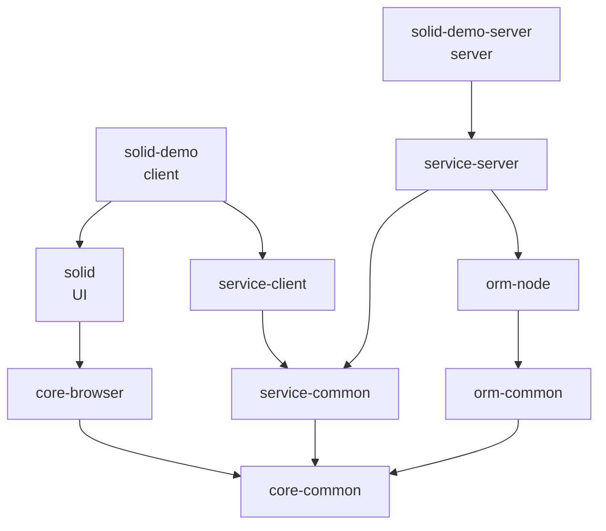

# 아키텍처 관련 추가 섹션

요구사항에 아키텍처/패키지 구조 변경이 포함된 경우, 기본 섹션에 아래 양식을 추가한다.

## 패키지 의존성 다이어그램

패키지 간 의존성을 Mermaid로 표현한다.

**양식:**
````markdown
## 패키지 의존성

```mermaid
graph TD
    A[{패키지A}] --> B[{패키지B}]
    A --> C[{패키지C}]
    B --> D[{공통 패키지}]
    C --> D
```

**의존성 설명:**
| 패키지 | 의존 대상 | 관계 설명 |
|-------|----------|----------|
| {패키지} | {의존 패키지} | {이유/용도} |
````

**예시:**
````markdown
## 패키지 의존성



**의존성 설명:**
| 패키지 | 의존 대상 | 관계 설명 |
|-------|----------|----------|
| solid-demo | solid | SolidJS UI 컴포넌트 사용 |
| solid-demo | service-client | API 클라이언트 사용 |
| service-server | orm-node | DB 접근 |
| orm-node | orm-common | ORM 공통 타입/인터페이스 |
````

## 모듈 구조

신규 또는 변경되는 모듈의 내부 구조를 기술한다.

**양식:**
````markdown
## 모듈 구조

### {패키지명}

```
{패키지명}/src/
  index.ts              — 공개 API (export)
  {모듈}/
    {파일}.ts           — {역할}
```

**공개 API:**
| export | 타입 | 설명 |
|--------|------|------|
| {이름} | {class/function/type/...} | {설명} |
````

**예시:**
````markdown
## 모듈 구조

### orm-common

```
orm-common/src/
  index.ts              — 공개 API
  decorators/
    Column.ts           — @Column 데코레이터
    Table.ts            — @Table 데코레이터
  types/
    ColumnType.ts       — 컬럼 타입 정의
    QueryDef.ts         — 쿼리 정의 타입
  utils/
    QueryBuilder.ts     — 쿼리 빌더 유틸리티
```

**공개 API:**
| export | 타입 | 설명 |
|--------|------|------|
| Column | decorator | 컬럼 매핑 데코레이터 |
| Table | decorator | 테이블 매핑 데코레이터 |
| IQueryBuilder | interface | 쿼리 빌더 인터페이스 |
| ColumnType | type | 지원 컬럼 타입 열거 |
````
