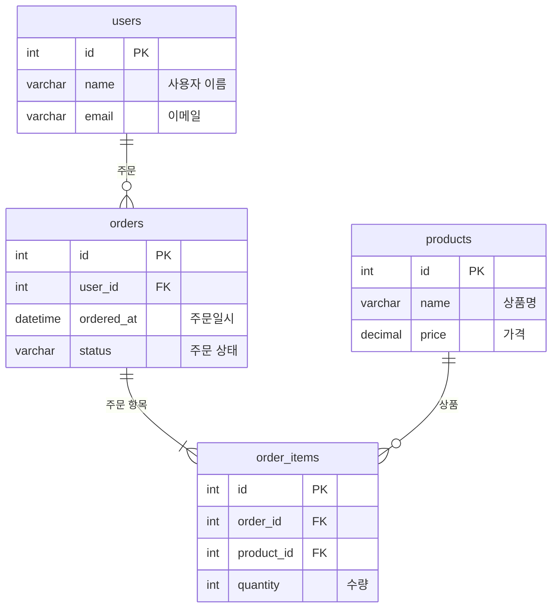

# DB 관련 추가 섹션

요구사항에 DB/테이블/스키마가 포함된 경우, 기본 섹션에 아래 양식을 추가한다.

## 테이블 스키마

테이블의 컬럼과 제약조건을 정의한다.

**양식:**
```markdown
## 테이블 스키마

### {테이블명}

| 컬럼 | 타입 | NULL | 기본값 | 설명 |
|------|------|------|-------|------|
| {컬럼명} | {타입} | {Y/N} | {기본값} | {설명} |

**인덱스:**
- {인덱스명}: {컬럼 목록} ({UNIQUE/일반})

**외래키:**
- {컬럼} → {참조테이블}.{참조컬럼}
```

**예시:**
```markdown
## 테이블 스키마

### users

| 컬럼 | 타입 | NULL | 기본값 | 설명 |
|------|------|------|-------|------|
| id | INT | N | AUTO_INCREMENT | PK |
| name | VARCHAR(100) | N | | 사용자 이름 |
| email | VARCHAR(255) | N | | 이메일 주소 |
| role | ENUM('admin','user','viewer') | N | 'user' | 역할 |
| created_at | DATETIME | N | CURRENT_TIMESTAMP | 생성일시 |
| deleted_at | DATETIME | Y | NULL | 삭제일시 (soft delete) |

**인덱스:**
- idx_users_email: email (UNIQUE)
- idx_users_role: role (일반)

**외래키:**
- 없음
```

## ERD (Mermaid)

테이블 간 관계를 Mermaid ERD로 표현한다.

**양식:**
````markdown
## ERD

```mermaid
erDiagram
    {테이블A} ||--o{ {테이블B} : "{관계 설명}"
    {테이블A} {
        type column_name "설명"
    }
```
````

**예시:**
````markdown
## ERD


````
