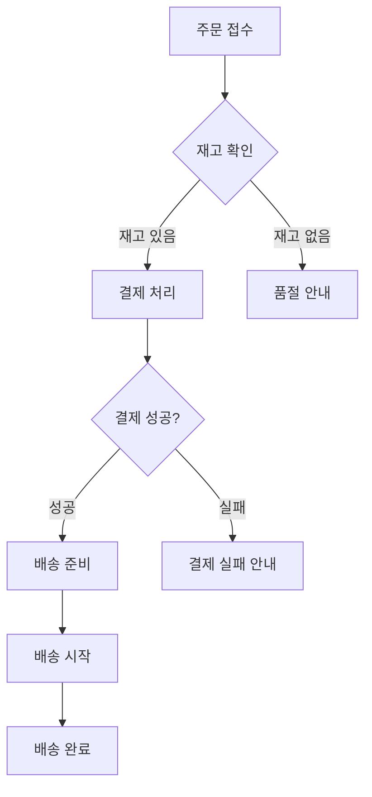
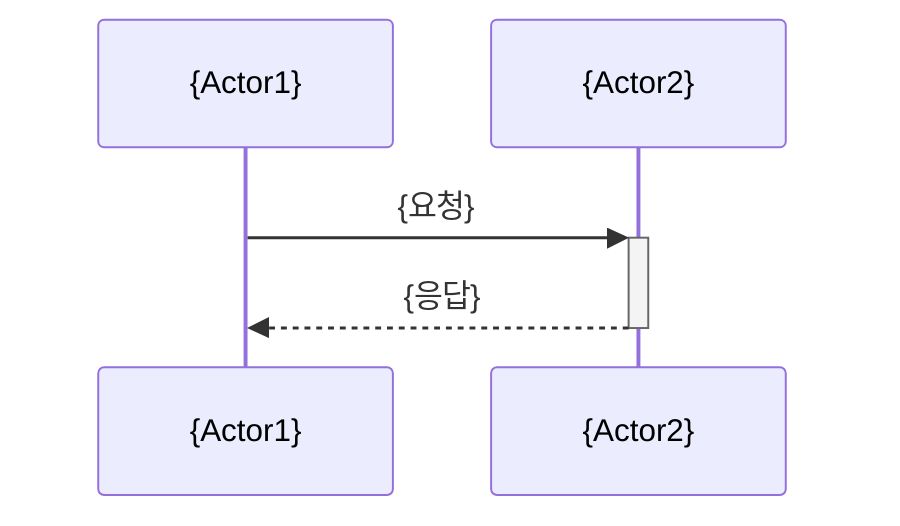
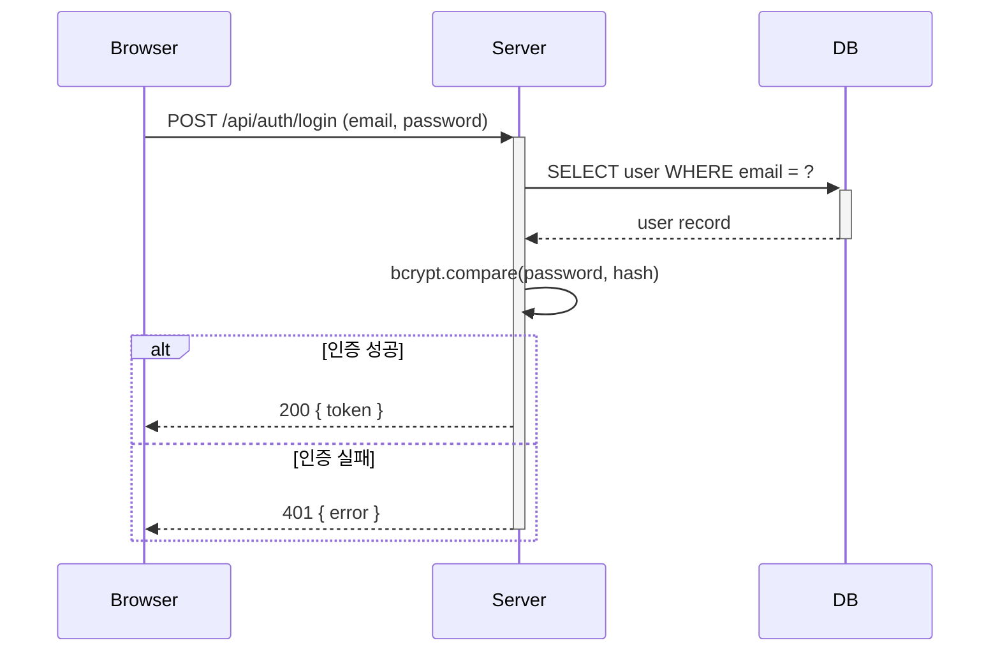

# 프로세스 관련 추가 섹션

요구사항에 프로세스/흐름이 포함된 경우, 기본 섹션에 아래 양식을 추가한다.

## 프로세스 플로우차트

업무 프로세스나 기능 흐름을 Mermaid 플로우차트로 표현한다.

**양식:**
````markdown
## 프로세스 흐름

### {프로세스명}

```mermaid
flowchart TD
    A[{시작}] --> B{조건}
    B -->|{Yes}| C[{처리}]
    B -->|{No}| D[{처리}]
    C --> E[{종료}]
    D --> E
```

**단계 설명:**
| 단계 | 설명 | 담당 |
|------|------|------|
| {단계명} | {상세 설명} | {시스템/사용자} |
````

**예시:**
````markdown
## 프로세스 흐름

### 주문 처리



**단계 설명:**
| 단계 | 설명 | 담당 |
|------|------|------|
| 주문 접수 | 사용자가 장바구니에서 주문 확정 | 사용자 |
| 재고 확인 | 주문 상품의 재고 수량 확인 | 시스템 |
| 결제 처리 | PG사 연동 결제 수행 | 시스템 |
| 배송 준비 | 포장 및 송장 생성 | 시스템 |
````

## 시퀀스 다이어그램

시스템 간 또는 컴포넌트 간 상호작용을 Mermaid 시퀀스 다이어그램으로 표현한다.

**양식:**
````markdown
## 시퀀스 다이어그램

### {상호작용명}


````

**예시:**
````markdown
## 시퀀스 다이어그램

### 사용자 로그인


````
