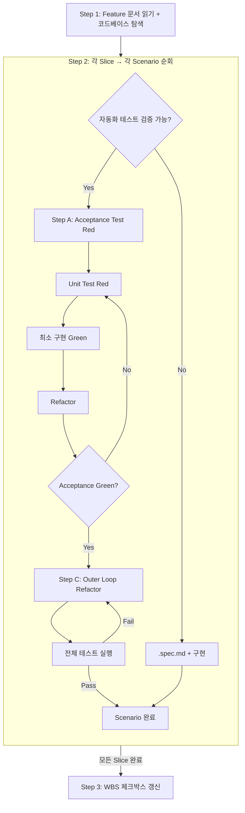

# sd-tdd: TDD 개발

Feature 문서(요구명세 + 구현계획)를 기반으로, Double Loop TDD로 코드를 구현한다.

개발 프로세스:
- 분해 (`/sd-wbs`) — 선택적 전 단계
- 요구명세 (`/sd-spec`) → 구현계획 (`/sd-plan`) → **TDD 개발** (`/sd-tdd`) ← 현재 — 이 3단계는 `/sd-dev`로 순차 실행

## 입력과 산출물

- **입력:** Feature 문서 (요구명세 + 구현계획) + 코드베이스
- **산출물:** 테스트된 코드 + 수동 테스트 문서 (`.spec.md`, 해당 시) + WBS 체크박스 갱신 (`[x]`)

## 프로세스 흐름

아래 다이어그램이 전체 프로세스의 흐름이다. 각 노드의 상세 설명은 이후 섹션에서 기술한다.



## Step 1: Feature 문서 읽기 + 코드베이스 탐색

### Feature 문서 읽기

Feature 문서 경로를 다음 우선순위로 결정한다:
1. 사용자가 경로를 지정했으면 그것을 사용한다
2. 대화 맥락에서 경로를 알 수 있으면 그것을 사용한다
3. 둘 다 없으면 AskUserQuestion으로 사용자에게 물어본다 (`.claude/rules/sd-option-scoring.md`의 규칙을 따른다)

Feature 문서에는 다음 두 섹션이 **전제 조건**으로 필요하다:
- `## 요구명세` — Gherkin Scenarios
- `## 구현계획` — Tech Design Doc + Vertical Slices

Feature 문서에 `## 참조 자료` 섹션이 있으면 함께 읽는다. wbs.md 링크가 있으면 해당 wbs.md의 참조 자료 섹션을 Read 도구로 읽는다. 참조 자료의 구체적 정보(업무 규칙, 데이터 형식, 기술 제약 등)를 구현에 반영한다.

둘 중 하나라도 섹션 자체가 없으면 **즉시 중단한다 — 이것은 우회할 수 없는 하드 스톱이다.** 누락 사실을 사용자에게 알리고 이전 단계(`/sd-spec` 또는 `/sd-plan`) 실행을 안내한 뒤 종료한다. 구현계획을 자동 생성하거나 "간단히 만들고 진행"하는 것은 금지다 — 구현계획은 반드시 `/sd-plan` 단계에서 사용자 확인을 거쳐 만들어야 한다. 섹션이 통째로 없는 것은 "역방향 피드백"의 대상이 아니다 — 이전 단계에서 만들어야 할 산출물이기 때문이다.

### 코드베이스 탐색

**코드가 source of truth이다.** 문서와 코드가 다르면 코드를 기준으로 한다.

탐색 대상:
- 구현계획에서 언급된 파일/모듈/엔티티
- 기존 테스트 구조와 컨벤션 (테스트 프레임워크, 파일 위치, 네이밍 패턴)
- 관련 의존성과 설정

### 현재 상태 확인

Slice 목록과 각 Slice에 매핑된 Scenario를 사용자에게 표시한다. 이미 구현된 부분이 있으면 현재 진행 상태를 파악하여 알린다.

## Step 2: Double Loop TDD

구현계획의 Slice 순서대로 진행한다. 각 Slice 내에서 Scenario를 하나씩 처리한다. Scenario를 자동화 테스트로 검증할 수 있으면 Double Loop TDD(Step A → B → C)로, 불가능하면 `.spec.md` 수동 테스트 문서로 처리한다.

### Step A. Acceptance Test 작성 (Red)

Gherkin Scenario의 Given/When/Then을 프로젝트 테스트 프레임워크의 Acceptance Test로 변환한다. Gherkin은 스펙 문서용이다 — Cucumber 등 BDD 러너를 사용하지 않고, 프로젝트의 일반 테스트 프레임워크로 작성한다. 테스트를 실행하여 실패(Red)를 확인한다.

### Step B. Inner Loop: Unit TDD (Red-Green-Refactor 반복)

Acceptance Test를 통과시키기 위해 **반드시 Unit Test를 별도로 작성한다.** Acceptance Test가 아무리 단순해 보여도, 내부 루프를 최소 1회 수행해야 한다. Unit Test를 작성하지 않고 곧바로 구현하는 것은 Double Loop TDD가 아니다.

- **Unit Test 작성 (Red)** — Acceptance Test와 별개의 도구 호출(Write/Edit)로 작성한다
- **최소 구현 (Green)** — Unit Test를 통과시키는 최소한의 코드를 작성한다
- **Refactor** — 방금 작성한 코드 범위에서 ~1분 스케일로: 중복 제거, 하드코딩 제거(Fake It → 실제 구현), 네이밍 개선, Extract Variable/Method. 모듈·아키텍처 수준 정리는 여기서 하지 않는다 — 그것은 Step C의 영역이다.

Acceptance Test가 아직 실패하면 다시 Unit Test 작성으로 돌아간다. Acceptance Test가 통과하면 Step C로 진행한다.

### Step C. Outer Loop Refactor

Acceptance Test가 안전망이므로 프로덕션 코드와 테스트 코드를 안전하게 정리할 수 있다. Inner Loop Refactor가 방금 작성한 코드의 ~1분 스케일 정리라면, Outer Loop Refactor는 Scenario 단위의 설계 개선이다.

#### 제약 규칙

- **한 번에 하나의 리팩토링만** — 각 변경은 작고 기계적이어야 한다
- **매 리팩토링 후 테스트 실행** — 실패하면 방금 변경한 부분에 문제가 있다
- **기능 추가 금지 (Two Hats)** — 리팩토링 중 새 기능·새 테스트를 추가하지 않는다
- **이번 Scenario에 필요한 만큼만** — 과도한 리팩토링도 낭비다 (Beck, Canon TDD)
- **Rule of Three** — 코드가 3회 반복될 때까지 추상화를 미룬다. 성급한 추상화를 방지한다

#### 프로덕션 코드 점검

Code Smell을 트리거로 판단하고, 대응하는 기법을 적용한다:

| Code Smell | 리팩토링 기법 |
|---|---|
| Long Method / 복잡한 분기 | Extract Method |
| 하나의 클래스가 여러 책임 (SRP 위반) | Extract Class |
| 다른 클래스의 데이터를 과도하게 사용 (Feature Envy) | Move Method |
| 중복 코드 (3회 이상 반복) | Extract Method 후 공유 |
| Primitive Obsession | Replace Primitive with Object |
| 네이밍이 의도를 드러내지 않음 | Rename |

해당하는 smell이 없으면 "정리 대상 없음"으로 기록한다.

#### 테스트 코드 점검

- **Scaffolding test 삭제** — 클래스/메서드 존재 확인 등 기대 동작을 인코딩하지 않는 테스트
- **중복 Unit Test 삭제** — Acceptance Test와 동일한 검증을 중복하는 Unit Test
- **구현 결합 테스트 전환/삭제** — 내부 상태 값, 메서드 호출 횟수 등 구현 세부사항을 검증하는 테스트
- **공통 setup 추출** — 중복되는 arrange 코드를 헬퍼/beforeEach로
- **테스트 네이밍 개선** — 검증하는 동작을 문장처럼 읽히게

점검 결과(수정 내용 또는 "정리 대상 없음")를 출력에 기록한다. 정리 후 전체 테스트를 실행한다. 실패하면 수정하고 재테스트한다. 전체 Pass 후 다음 Scenario로 진행한다.

### 수동 테스트 문서 (.spec.md)

실제 하드웨어에서만 동작을 확인할 수 있어 mock이 무의미한 Scenario(USB, NFC, 하드웨어 버튼 등)는 `.spec.md` 파일로 수동 테스트 절차를 문서화하고, 구현 코드를 작성한다.

```markdown
# {Scenario 제목}

## 전제 조건
- {테스트 전 필요한 상태/환경}

## 수행 절차
1. {사용자가 수행할 단계}
2. ...

## 기대 결과
- {관찰되어야 하는 결과}
```

### Slice 완료

Slice의 모든 Scenario가 완료(Step A → B → C 또는 .spec.md)되면:
1. 전체 테스트 스위트를 실행하여 회귀가 없는지 확인한다
2. Feature 문서 `## 구현계획`에서 해당 Slice의 체크박스를 `[x]`로 갱신한다

## Step 3: Feature 완료

모든 Slice가 완료되면:
1. 전체 테스트 스위트를 최종 실행한다
2. WBS 파일(`wbs.md`)에서 해당 Feature의 `[ ]`를 `[x]`로 갱신한다

## 역방향 피드백

TDD 진행 중 **이미 존재하는** 요구명세나 구현계획의 내용에 누락·오류를 발견하면, 반드시 수정한다:
1. 같은 Feature 문서의 해당 섹션을 직접 수정한다
2. 변경 내용과 사유를 사용자에게 알린다

다른 문서에 영향을 주는 변경이 발생하면, 반드시 해당 문서도 함께 수정한다.
- Feature 범위 조정으로 WBS의 해당 Feature 설명이 달라지면, wbs.md를 수정한다
- 항목을 다른 Feature로 이동하기로 결정하면, wbs.md의 양쪽 Feature를 모두 수정한다. 대상 Feature 문서가 이미 존재하면 그 문서도 수정한다

별도로 `/sd-spec`이나 `/sd-plan`을 재실행할 필요 없이, 이 스킬 내에서 직접 수정한다.

역방향 피드백은 기존 섹션의 **보완/수정**이다. `## 요구명세`나 `## 구현계획` 섹션 자체를 새로 작성하는 것은 역방향 피드백이 아니다 — 그것은 이전 단계(`/sd-spec`, `/sd-plan`)의 산출물이다.

## 핵심 원칙

1. **테스트 먼저** — 구현 코드보다 테스트를 항상 먼저 작성한다. 테스트 없이 코드를 작성하지 않는다.
2. **최소 구현** — 테스트를 통과시키는 최소한의 코드만 작성한다. 미래 요구사항을 미리 구현하지 않는다 (YAGNI).
3. **작은 단계** — 한 번에 하나의 Unit Test만 추가한다. 큰 도약을 하지 않는다.
4. **리팩토링은 Green일 때** — 모든 테스트가 통과하는 상태에서만 리팩토링한다.
5. **기존 컨벤션 준수** — 프로젝트의 기존 테스트 패턴, 파일 구조, 코딩 스타일을 따른다.
6. **코드가 source of truth** — 문서에 구현 상세를 중복 기록하지 않는다.
