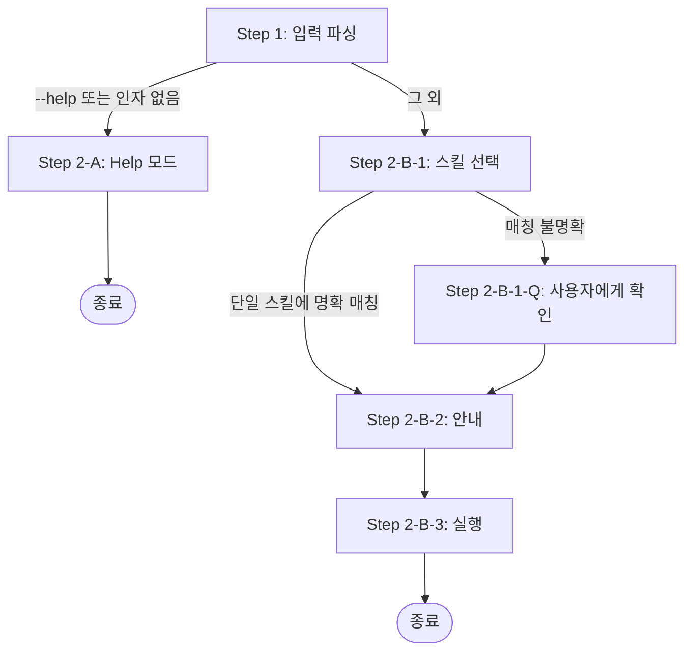

# sd-use: SD 스킬 라우터

사용자의 요청을 적절한 sd-* 스킬로 라우팅한다. 개별 sd-* 스킬에 익숙하지 않은 사용자가 원하는 작업을 자연어로 설명하면, sd-use가 가장 적합한 스킬을 선택하여 실행한다.

## 인자

| 인자 | 설명 |
|------|------|
| `{request}` | 사용자가 원하는 작업의 자연어 설명 |
| `--help` | 워크플로우 개요 및 스킬 카탈로그 표시 |

## 프로세스 흐름

아래 다이어그램이 전체 프로세스의 흐름이다. 각 노드의 상세 설명은 이후 섹션에서 기술한다.



## Step 1: 입력 파싱

- 인자가 없거나 `--help`이면 → Step 2-A
- 그 외 → Step 2-B-1

## Step 2-A: Help 모드

아래 코드 블록을 그대로 출력한 후 종료한다. Skill 도구를 호출하지 않는다.
마크다운 표나 리스트로 변환하지 않는다. 반드시 단일 코드 블록(``` 안)으로 출력한다.

````
sd-use — SD 스킬 라우터

USAGE
  /sd-use <request>       자연어 요청을 적절한 스킬로 라우팅
  /sd-use --help          이 도움말 표시

FLOWS
  진입점                             개발 파이프라인
  sd-wbs    프로젝트 → Feature 분해 ─┐
  sd-review 코드 리뷰 → 리포트 생성  ├→ sd-dev-spec → sd-dev-plan → sd-dev-tdd
  sd-debug  에러 → 근본 원인 분석    │  │           │           │
  (없음)    바로 개발 시작          ─┘  └───────────┴───────────┘
                                           sd-dev (이 3단계를 순차 실행)

SKILLS
  개발
    sd-dev              Feature 전체 개발 (spec → plan → TDD)
    sd-wbs              프로젝트 → Feature 분해 (WBS)
    sd-dev-spec         단일 Feature 요구명세 작성
    sd-dev-plan         요구명세 → 구현 계획 작성
    sd-dev-tdd          구현 계획 → TDD 코드 구현

  품질
    sd-check            typecheck / lint / test 실행 및 에러 수정
    sd-review           로직 버그, 보안, 성능, 설계 이슈 리뷰
    sd-debug            버그/에러 근본 원인 분석

  Git
    sd-commit           변경사항 스테이징 및 구조화된 커밋 생성

  문서
    sd-readme           패키지 README.md 생성
    sd-doc-extract      문서에서 텍스트/이미지 추출

  도구
    sd-prompt           스킬/프롬프트 파일 생성·개선
    sd-init             프로젝트 CLAUDE.md 생성
    sd-apk-decompile    APK 디컴파일
````

## Step 2-B-1: 스킬 선택

사용자의 요청을 정확히 하나의 sd-* 스킬에 매칭한다. Help 모드의 스킬 카탈로그를 라우팅 참조로 사용한다. 의미론적 이해를 기반으로 사용자의 요청을 가장 적합한 스킬에 매칭한다.

## Step 2-B-1-Q: 사용자에게 확인

요청이 단일 스킬에 명확하게 매칭되지 않으면, AskUserQuestion을 사용하여 사용자에게 확인한다. 후보 스킬들을 선택지로 제시한다. (`.claude/rules/sd-option-scoring.md`의 규칙을 따른다)

## Step 2-B-2: 안내

선택된 스킬을 사용자에게 알리는 텍스트 메시지를 출력한다. 예시: `> **sd-commit** 스킬을 실행합니다.`

이 단계는 필수이다. Skill 도구 호출 전에 반드시 수행한다.

## Step 2-B-3: 실행

안내 메시지를 출력한 후에만 Skill 도구를 호출한다. 선택된 스킬 이름과 함께 사용자의 원래 요청을 `args`로 전달한다.
