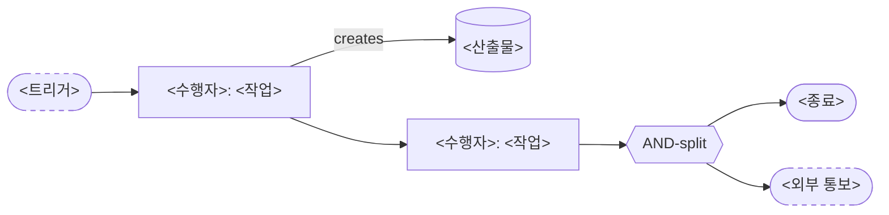
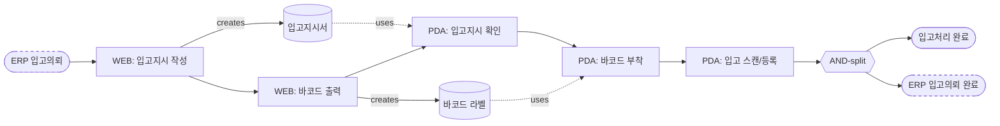

# story-map.md 템플릿

`.story-maps/{yyMMddHHmmss}_{slug}/story-map.md`

## 템플릿

````markdown
# Story Map {yyMMddHHmmss}_{slug}

## 메타
- 생성일: YYYY-MM-DD HH:MM
- Requirement Source: <경로>

## Frame
- Persona: <단일이면 한 줄, 복수면 list>
- Outcome: <Persona 가 이 Mapping 으로 얻는 결과>
  - 근거: 사용자 답변 (YYYY-MM-DD)
- [ ] **Open Question**: <확인 필요 사항>

## Business Flow (업무 프로세스(다중 actor·분기·트리거·데이터 흐름)일 때만 작성.)



**부수효과**
- T1: <외부 시스템 상태 변경 / 객체 생성·소멸 / 재고 변동 등>

**예외**
- T1: <조건> → <대응 (오류·중단·메시지)>

**불변 제약** (특정 단계에서 일괄 검증)
- ...

**상태 머신** (대상 객체)
- `대기` → `진행` → `완료`

## Backbone

| # | Activity | Outcome |
|---|---|---|
| A1 | <이름> | <Outcome 1줄> |
| A2 | <이름> | <Outcome> |

## Walking Skeleton

### A1. <Activity 이름>

| 순서 | Task | 한 줄 요약 |
|---|---|---|
| 1 | TASK-001-<slug> | <요약> |
| 2 | TASK-002-<slug> | <요약> |

### A2. <Activity 이름>

| 순서 | Task | 한 줄 요약 |
|---|---|---|
| 1 | TASK-003-<slug> | <요약> |
| 2 | TASK-004-<slug> | <요약> |
````

## Business Flow 작성 규칙

- **시점**: 최종 사용자(business actor) 관점의 end-to-end 흐름. 시스템 내부 로직(데이터 변환·CRUD·검증 분기·서버 처리 등)은 쓰지 않음.
- **단위**: 한 프로세스 = 한 업무 단위(도메인 그룹·직무 흐름). 단위 작업(파일 1건·화면 1건·버튼 1개 등)을 별개 프로세스로 쪼개지 말 것.
- **구성**: Mermaid 다이어그램 + 4슬롯(부수효과·예외·불변제약·상태머신). 다이어그램이 담을 수 있는 정보는 슬롯에 중복 작성 금지.

### Mermaid 표기 규칙

- 노드 라벨 prefix `[<수행자>: <동작>]` (수행자는 Frame Persona/이해관계자에 정의된 역할)
- `[(...)]` = 데이터 객체, 점선 `-.uses.->` = 데이터 사용
- `{{AND-split}}` / `{{AND-join}}` = 병렬 게이트웨이
- `{XOR-split}` / `{XOR-join}` = 배타 게이트웨이 (조건 라벨 동반)
- `:::msg` 클래스 = 메시지 이벤트 (외부 시스템 송수신)

### 예시 (입고)

````


**부수효과**
- T1 작성완료: ERP 의뢰 → lock, 입고지시서(상태=대기) 생성
- T5 완료: 재고 반영, 입고지시서 상태 → 완료

**불변 제약** (T1 일괄 검증)
- 한 선반에 한 가지 B/L일자만 입고
- 한 선반에 한 가지 LOT번호만 입고
- 한 선반 최대적재수량 초과 불가
````
