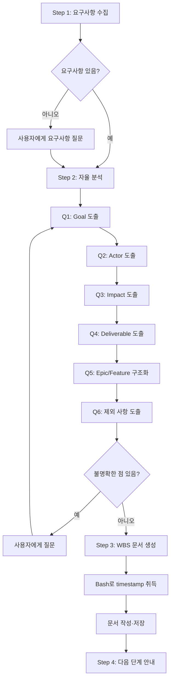

# sd-wbs: 프로젝트 분해 (WBS)

프로젝트 요구사항을 **Impact Mapping**과 **Feature Breakdown**으로 분해하여 `.tasks/{yyMMddHHmmss}_{topic}/wbs.md`를 생성한다.

개발 프로세스의 선택적 전 단계:
- **분해 (WBS)** ← 현재 (선택적)
- 요구명세 (`/sd-spec`) → 구현계획 (`/sd-plan`) → TDD 개발 (`/sd-tdd`) — 이 3단계는 `/sd-dev`로 순차 실행

## 프로세스 흐름

아래 다이어그램이 전체 프로세스의 흐름이다. 각 노드의 상세 설명은 이후 섹션에서 기술한다.



## Step 1: 요구사항 수집

사용자가 요구사항을 제공하면 분석을 시작한다. 요구사항이 없으면 "어떤 시스템/프로젝트를 만들려고 하시나요?"로 시작한다.

## Step 2: 자율 분석

Impact Mapping 트리를 구축한다. 불명확한 점은 반드시 사용자에게 질문한다 — 절대 추측하지 않는다. 선택지 제시 시 `.claude/rules/sd-option-scoring.md`의 규칙을 따른다.

### 질문 항목

| 질문 | 도출 요소 |
|------|-----------|
| Q1. "왜 만드나?" 반복 | Goal (측정 가능하게) |
| Q2. "누가 쓰나? 누가 영향받나?" | Actor |
| Q3. "그 사람 행동이 어떻게 바뀌어야?" | Impact (행동 변화) |
| Q4. "가장 단순하게 뭘 만들면?" | Deliverable |
| Q5. (구조화 — SPIDR·INVEST로 크기 검증) | Epic/Feature |
| Q6. "뭘 빼나?" | 제외 사항 |

## Step 3: WBS 문서 생성

산출물 경로: `.tasks/{yyMMddHHmmss}_{topic}/wbs.md`
- `{yyMMddHHmmss}`: **반드시 Bash 도구로 `date +%y%m%d%H%M%S`를 실행하여 얻는다.** LLM이 직접 생성하면 시분초가 누락되므로 금지한다.
- `{topic}`: 프로젝트 주제를 영어 kebab-case로 (예: `task-management`)

### 문서 템플릿

```markdown
# WBS

## Impact Mapping

- **Goal:** [측정 가능한 목표]
  - **Actor:** [이해관계자]
    - **Impact:** [행동 변화]
      - **Deliverable:** [산출물]

## Feature Breakdown

> 각 Feature의 범위 힌트(`-` 불릿)는 대표 예시이며 전체 목록이 아니다. 정식 분해는 `/sd-spec`에서 수행한다.

### Epic 1. [Epic 이름]

- [ ] Feature 1.1 [Feature 이름]
  - [기능적 범위 — What만, How 금지, 구체 열거 금지]
  - [기능적 범위]

## 참조 자료

[대화에서 수집한 구체적 정보를 여기에 기록한다]

## 제외 사항

- [제외 항목]
```

### Impact Mapping 규칙
- 모든 Feature가 Goal까지 역추적 가능해야 한다 — Goal에 연결되지 않는 기능은 제외 사항으로 보낸다
- Goal은 측정 가능하게 기술한다. "효율화"(X) → "처리 시간 30% 단축"(O)
- Impact는 기능이 아닌 **행동 변화**를 기술한다. "대시보드를 본다"(X) → "업무 상태를 빠르게 파악한다"(O)

### Feature Breakdown 규칙
- **의존성 순서로 정렬한다.** Feature 번호 순서 = 구현 순서. 앞선 Feature가 뒤의 Feature의 기반이 되도록 배치한다
- 범위 힌트는 `-` 불릿으로 나열한다 — 정식 분해가 아닌 seed. 정식 분해는 `/sd-spec`에서 수행한다
- **범위 힌트 작성 규칙:**
  - **기능적 역할(What)만 기술한다.** 기술명/라이브러리명/구현방법(How)을 포함하지 않는다
    - `yargs 기반 CLI 파서` (X) → `CLI 명령어 파싱` (O)
    - `esbuild 번들링` (X) → `JavaScript 번들링` (O)
  - **구체적 항목을 열거하지 않는다.** 범주만 기술한다. 열거하면 LLM이 전체 목록으로 인식하여 누락된 항목을 영영 발견하지 못한다
    - `배포 방식: npm, local-directory, FTP/FTPS, SFTP` (X) → `여러 배포 방식 지원` (O)
    - `MySQL, MSSQL, PostgreSQL dialect` (X) → `다중 SQL dialect 지원` (O)
  - 구체적 열거가 필요한 정보(기술 맥락, 원본 항목 목록 등)는 `## 참조 자료` 섹션에 기록한다
- `[ ]` 체크박스로 진행을 추적한다 — `/sd-tdd` 완료 시 `[x]`로 갱신
- MoSCoW 우선순위(Must/Should/Could/Won't)를 사용하지 않는다 — 순서 정렬이면 충분하다
- Feature가 너무 크면 SPIDR(Spike, Path, Interface, Data, Rule) 축으로 분할한다
- INVEST(Independent, Negotiable, Valuable, Estimable, Small, Testable)로 적정성을 검증한다

### 참조 자료

다음 단계(`/sd-spec`)가 별도 세션에서 실행되어도 정보가 유실되지 않도록, 대화에서 수집한 구체적 정보를 기록한다 — 업무 규칙, 데이터 형식, 유효성 조건, 기술 제약(연동, 프로토콜), 화면/UI 요구사항, 참조 파일 경로 등. Feature별로 그룹화하지 않고 주제별로 자유롭게 기록하며, 범위 힌트에 담기지 않는 구체적 세부사항만 기록한다.

### 제외 사항

현재 범위에서 명시적으로 제외하는 항목과, Impact Mapping에서 Goal에 연결되지 않는 기능을 나열한다.

## Step 4: 다음 단계 안내

WBS 완료 후, Feature Breakdown의 위에서부터 순서대로 Feature를 선택하여 `/sd-spec`(2단계)으로 진행한다.
