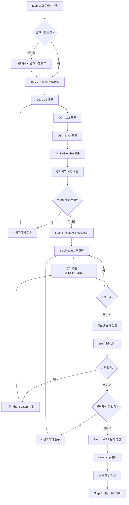

# sd-wbs: 프로젝트 분해 (WBS)

## 프로세스 흐름

아래 다이어그램이 전체 프로세스의 흐름이다. 각 노드의 상세 설명은 이후 섹션에서 기술한다.



## Step 1: 요구사항 수집

사용자가 요구사항을 제공하면 분석을 시작한다. 요구사항이 없으면 "어떤 시스템/프로젝트를 만들려고 하시나요?"로 시작한다.

## Step 2: Impact Mapping

Impact Mapping 트리(Goal → Actor → Impact → Deliverable)를 구축한다.
- 불명확한 점은 반드시 사용자에게 질문한다. **절대** 추측하지 않는다.
- 선택지 제시 시 `.claude/rules/sd-option-scoring.md`의 규칙을 따른다.

### What/How 경계

질문은 **비즈니스 요구사항(What)이 불명확할 때만** 한다. 기술적 구현 방법(How) — 인증 방식, 통신 프로토콜, 프레임워크, 아키텍처 패턴 등 — 에 대한 결정은 분석 단계에서 하지 않는다. How는 이후 단계(`/sd-dev-spec`, `/sd-dev-plan`)에서 결정한다.

- `인증 방식을 SSO로 할지 자체 인증으로 할지?` → 질문 불필요. 범위 힌트에는 "사용자 인증"만 기술
- `어떤 DB를 사용할지?` → 질문 불필요. 분석 단계의 범위가 아님
- `어떤 사용자가 시스템을 쓰는지?` → 질문 필요. 비즈니스 요구사항(What)에 해당

### 질문 항목

| 질문 | 도출 요소 |
|------|-----------|
| Q1. "왜 만드나?" 반복 | Goal (측정 가능하게) |
| Q2. "누가 쓰나? 누가 영향받나?" | Actor |
| Q3. "그 사람 행동이 어떻게 바뀌어야?" | Impact (행동 변화) |
| Q4. "가장 단순하게 뭘 만들면?" | Deliverable |
| Q5. "뭘 빼나?" | 제외 사항 |

### Impact Mapping 규칙

- 모든 Feature가 Goal까지 역추적 가능해야 한다 — Goal에 연결되지 않는 기능은 제외 사항으로 보낸다
- Goal은 측정 가능하게 기술한다. "효율화"(X) → "처리 시간 30% 단축"(O)
- Impact는 기능이 아닌 **행동 변화**를 기술한다. "대시보드를 본다"(X) → "업무 상태를 빠르게 파악한다"(O)

## Step 3: Feature Breakdown

Deliverable을 Epic → Feature로 구조화한다. 불명확한 점은 사용자에게 질문한다. 선택지 제시 시 `.claude/rules/sd-option-scoring.md`의 규칙을 따른다.

### Feature 정의

**Feature = 밀접 결합 모듈 단위.** 두 가지 유형이 있다:

1. **기능 단위**: 사용자에게 가치를 전달하는 기능 (예: 바코드 스캔 대출)
2. **수직 슬라이스**: 새 유틸리티 도입 시, 유틸리티 + **첫 번째 소비 모듈**을 함께 포함한다. 같은 유틸리티의 다른 소비 모듈은 별도 Feature다 (예: event-bus + Modal = 1 Feature, Toast = 별도 Feature)

단독으로 의미가 없는 파일들(컴포넌트 + 전용 서비스, 컨테이너 + 아이템)은 하나의 Feature로 묶는다. 독립적으로 동작하는 모듈은 별도 Feature로 분리한다. 같은 유틸리티에 의존한다는 것은 밀접 결합이 아니다 — 밀접 결합은 A 없이 B가 단독 동작하지 않는 관계를 의미한다.

### 분해 원칙

#### 순서

- **CRITICAL: Feature 번호 순서 = 구현 순서.** 의존성 순서로 정렬한다. 앞선 Feature가 뒤의 Feature의 기반이 되도록 배치한다. wbs.md를 위에서 아래로 읽었을 때의 Feature 순서가 곧 구현 순서여야 한다
- **각 Feature는 이전 Feature만 완료된 상태에서 독립적으로 구현·테스트 가능해야 한다** — 불가능하면 순서를 재배치하거나 Feature를 분할한다
- **의존성 순서는 Epic 그룹핑보다 우선한다** — 의존 관계가 Epic 경계를 넘으면 Epic을 분리하거나 Feature를 교차 배치하여 번호 순서를 맞춘다. 예: Epic 3의 Feature가 Epic 2의 Feature보다 먼저 구현되어야 하면, Epic 3 섹션을 Epic 2 앞에 배치한다

#### 독립성

- 같은 유틸리티를 공유한다는 이유만으로 독립 모듈을 하나의 Feature로 묶지 않는다. 공유 유틸리티는 첫 번째 사용 Feature에 수직 슬라이스로 포함하고, 이후 Feature는 그에 의존한다

#### 크기

- **Feature는 `/sd-dev` 1회 실행 단위이다.** sd-dev가 Feature 하나를 spec → plan → TDD → check → review로 처리하므로, 한 세션에서 끝낼 수 있는 크기여야 한다 — Feature가 크면 Gherkin scenario가 폭발하고 TDD 세션이 비대해진다
- **크기 검증**: Feature의 Gherkin scenario를 머릿속으로 열거했을 때 Rule이 5개를 넘으면 Feature가 너무 크다 — 분할한다
- 분할 시 SPIDR(Spike, Path, Interface, Data, Rule) 축을 사용한다
- INVEST(Independent, Negotiable, Valuable, Estimable, Small, Testable)로 적정성을 검증한다

### 안티패턴

| 안티패턴 | 올바른 방식 |
|----------|-------------|
| 기술 레이어로 분해 — "모든 디렉티브", "모든 유틸리티", "모든 서비스" | 각 Feature가 필요한 레이어를 수직으로 포함 |
| 기능 범주로 분해 — "오버레이", "네비게이션", "폼 입력" | 범주는 Epic, 개별 기능(모달, 토스트, 드롭다운)이 Feature |
| MoSCoW 우선순위(Must/Should/Could/Won't) 부여 | 의존성 순서 정렬이면 충분 |

### 범위 힌트 작성 규칙

범위 힌트(`-` 불릿)는 대표 예시이며 전체 목록이 아니다. 정식 분해는 `/sd-dev-spec`에서 수행한다.

- **기능적 역할(What)만 기술한다.** 기술명/라이브러리명/구현방법(How)을 포함하지 않는다
  - `yargs 기반 CLI 파서` (X) → `CLI 명령어 파싱` (O)
  - `esbuild 번들링` (X) → `JavaScript 번들링` (O)
- **구체적 항목을 열거하지 않는다.** 범주만 기술한다 — 열거하면 LLM이 전체 목록으로 인식하여 누락된 항목을 발견하지 못한다
  - `배포 방식: npm, local-directory, FTP/FTPS, SFTP` (X) → `여러 배포 방식 지원` (O)
  - `MySQL, MSSQL, PostgreSQL dialect` (X) → `다중 SQL dialect 지원` (O)
- 구체적 열거가 필요한 정보는 `## 참조 자료` 섹션에 기록한다

### 의존성 검증

Feature Breakdown을 완성한 뒤, 다음을 검증한다.

#### 독립성 검증

각 Feature에 대해: **"이전 Feature들만 완료된 상태에서 이 Feature를 독립적으로 구현·테스트할 수 있는가?"** 를 확인한다. 불가능하면 Feature 순서를 재배치하거나 Feature를 분할한다.

#### 순환 의존 탐지

Feature 간 의존 관계에서 순환(A→B→A 또는 A→B→C→A)이 없는지 확인한다. 단순히 "순환 없음"으로 넘어가지 않고, 다음 절차를 따른다:

1. **의미적 겹침 식별**: 범위가 의미적으로 겹치는 Feature 쌍(예: "사용자 관리(RBAC 포함)"과 "권한 관리")을 고위험군으로 표시한다
2. **양방향 의존 검토**: 각 고위험 쌍에 대해 "A가 B를 필요로 하는가? B가 A를 필요로 하는가?"를 명시적으로 검토한다
3. **검토 결과 출력**: 검토 과정(어떤 쌍을 검토했고, 왜 순환이 있거나 없는지)을 사용자에게 출력한다. 고위험 쌍이 없으면 그 판단 근거도 출력한다. 순환을 방지하기 위해 Feature를 분할하거나 기능을 재배치한 경우, 그 방법과 근거도 함께 설명한다

순환이 발견되면 다음 기법으로 해소한다:

1. **공통 추출**: A↔B 순환 시, 공유 부분을 새 Feature C로 추출 → A→C, B→C
2. **시간축 분해**: A를 A-v1(B 없이 동작하는 최소 버전)과 A-v2(B 의존 확장)로 분리
3. **인터페이스 분리**: A가 B의 구현이 아닌 인터페이스/계약에만 의존하도록 분리

순환 해소로 Feature가 추가/분할되면, 사용자에게 변경 내용과 근거를 보여주고 확인한다. 선택지 제시 시 `.claude/rules/sd-option-scoring.md`의 규칙을 따른다.

## Step 4: WBS 문서 생성

산출물 경로: `.tasks/{yyMMddHHmmss}_{topic}/wbs.md`
- `{yyMMddHHmmss}`: **반드시 Bash 도구로 `date +%y%m%d%H%M%S`를 실행하여 얻는다.** LLM이 직접 생성하면 시분초가 누락되므로 금지한다.
- `{topic}`: 프로젝트 주제를 영어 kebab-case로 (예: `task-management`)

### 문서 템플릿

```markdown
# WBS

## Impact Mapping

- **Goal:** [측정 가능한 목표]
  - **Actor:** [이해관계자]
    - **Impact:** [행동 변화]
      - **Deliverable:** [산출물]

## Feature Breakdown

> 각 Feature의 범위 힌트(`-` 불릿)는 대표 예시이며 전체 목록이 아니다. 정식 분해는 `/sd-dev-spec`에서 수행한다.

### Epic 1. [Epic 이름]

- [ ] Feature 1.1 [Feature 이름]
  - [기능적 범위 — What만, How 금지, 구체 열거 금지]
  - [기능적 범위]

## 참조 자료

### {주제}
- {구체적 정보}

### 참조 파일
- `{경로}` — {목적: 이 파일에서 무엇을 확인해야 하는지}

## 제외 사항

- [제외 항목]
```

`[ ]` 체크박스로 진행을 추적한다 — `/sd-dev-tdd` 완료 시 `[x]`로 갱신한다.

### 참조 자료

이후 프로세스(`/sd-dev-spec`, `/sd-dev-plan`, `/sd-dev-tdd`)가 별도 세션에서 실행되어도 정보가 유실되지 않도록, 대화에서 수집한 구체적 정보를 기록한다. 후속 프로세스는 참조 자료를 다음과 같이 소비한다:

- `/sd-dev-spec`: 참조 파일을 읽어 범위 힌트에 누락된 항목을 발굴하고, 구체적 정보를 Example Mapping의 seed로 활용한다
- `/sd-dev-plan`: 업무 규칙, 데이터 형식, 기술 제약을 설계에 반영한다
- `/sd-dev-tdd`: 참조 자료와 설계 결정을 읽어 구현에 반영한다

Feature별로 그룹화하지 않고 주제별로 자유롭게 기록한다.

#### 범위 힌트 vs 참조 자료 분류 기준

범위 힌트는 기능적 역할(What)을 범주 수준으로 기술하고, 구체적 항목을 열거하지 않는다. 다음에 해당하는 정보는 범위 힌트가 아닌 참조 자료에 기록한다:

| 정보 유형 | 범위 힌트 (범주만) | 참조 자료 (구체적 정보) |
|-----------|-------------------|----------------------|
| 열거 가능한 항목 (바코드 종류, 프로토콜, 데이터 필드) | "바코드 스캔 지원" | "바코드: Code128, QR" |
| 수치적 제약/조건 (허용 오차, 최대값, 타임아웃) | "중량 검증" | "입고 중량 오차 허용: ±2%" |
| 외부 연동 정보 (연동 대상, API 방식) | "외부 시스템 연동" | "SAP ERP, REST API" |
| 플랫폼/디바이스 정보 (대상 OS, 디바이스 종류) | "모바일 지원" | "현장 PDA: Android 기반" |
| 업무 규칙/정책 (검증 조건, 승인 절차, 상태 전이) | "입고 검증" | "입고량이 발주량의 ±2% 초과 시 보류 처리" |
| 화면/UI 요구사항 (레이아웃, 표시 항목) | "대시보드" | "대시보드에 금일 입출고 건수, 보류 건수 표시" |

Impact Mapping 대화(Q1~Q5, 사용자 답변) 중 위 유형에 해당하는 정보가 나오면, 해당 정보를 참조 자료에 기록한다.

#### 참조 파일 기록 형식

파일/디렉토리 경로를 기록할 때는 **목적**(이 파일에서 무엇을 확인해야 하는지)을 반드시 함께 기록한다 — `/sd-dev-spec`이 파일을 읽을 때 무엇에 주목해야 하는지 알 수 있어야 한다.

```markdown
### 참조 파일
- `legacy-wms/` — 마이그레이션 원본 코드. 기존 입출고 로직과 데이터 모델을 확인한다
- `docs/sap-api-spec.pdf` — SAP ERP 연동 API 스펙. 요청/응답 형식을 확인한다
```

#### 수집 체크리스트

참조 자료 작성 후, 다음을 검토하여 누락을 방지한다:

- 대화에서 나온 **구체적 열거 항목**(코드값, 종류, 단위, 형식 등)이 모두 기록되었는가?
- 대화에서 나온 **수치적 제약**(허용 범위, 최대값, 비율 등)이 모두 기록되었는가?
- 대화에서 나온 **외부 연동/기술 제약**이 모두 기록되었는가?
- 대화에서 나온 **플랫폼/디바이스 정보**가 모두 기록되었는가?
- 언급된 **파일/코드 경로**에 목적이 함께 기록되었는가?
- 기록한 정보가 범위 힌트와 중복되지 않는가? (범위 힌트에는 기능적 역할만, 참조 자료에 구체 내용)

### 제외 사항

현재 범위에서 명시적으로 제외하는 항목과, Impact Mapping에서 Goal에 연결되지 않는 기능을 나열한다.

## Step 5: 다음 단계 안내

WBS 완료 후, Feature Breakdown의 위에서부터 순서대로 Feature를 선택하여 `/sd-dev-spec`(요구명세)으로 진행한다. 또는 `/sd-dev`로 전체 개발 프로세스를 시작한다.
