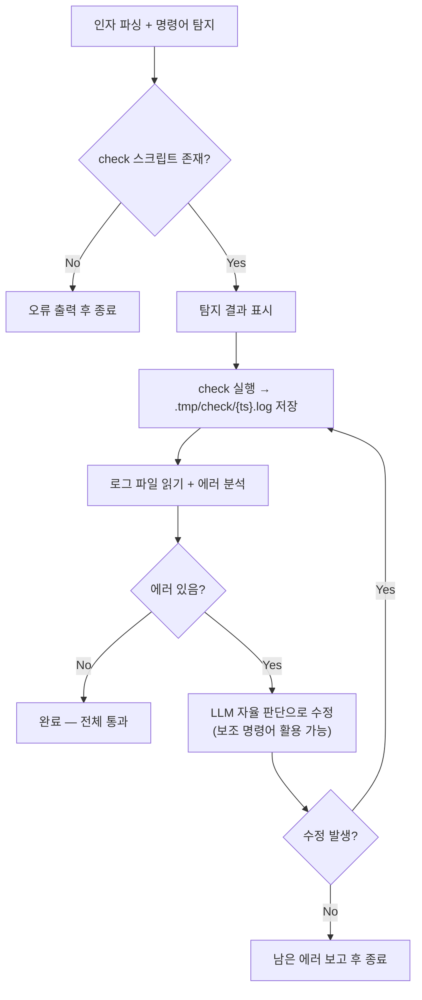

# 요구분석서: sd-check 스킬 개선 및 작업 디렉토리 통일

## 개요

sd-check 스킬의 경직된 이중 루프 구조(외부 3회 x 내부 3회, Phase 순차 강제)를 제거하고, `check` 명령어 기반의 단순한 "실행 → 로그 → 분석 → 수정 → 재실행" 구조로 변경한다. 개별 명령어(typecheck, lint, lint:fix, test)는 선택적으로 탐지하되, 수정 후 부분 검증이나 lint:fix 선행 등의 판단은 LLM에 위임한다.

동시에, 모든 스킬의 작업 산출물 경로를 `.plans/` → `.tasks/`로 통일한다.

## 현재 상태

- **스킬 파일**: `.claude/skills/sd-check/SKILL.md` (158줄)
- **현재 구조**: 이중 루프 — 외부 루프(전체 사이클 최대 3회) x 내부 루프(Phase별 수정-재검사 최대 3회)
  - Phase 1: typecheck → Phase 2: lint:fix + lint → Phase 3: test 순차 실행
  - 명령어 탐지: CLAUDE.md → package.json 순으로 4개 명령어를 개별 탐지
  - targets 지원 여부도 CLAUDE.md 기술 형식으로 판단
- **sd-cli check 구현**: `packages/sd-cli/src/commands/check.ts` — typecheck, lint, test를 `Promise.allSettled()`로 병렬 실행 후 결과 리포팅
- **package.json scripts**: `check`, `typecheck`, `lint`, `lint:fix`, `vitest` 모두 존재
- `.tmp/` 디렉토리: 존재하며 `.gitignore`에 포함됨
- **작업 산출물 경로**: 현재 `.plans/` 사용 (sd-spec, sd-plan, sd-audit, sd-debug, sd-test), `.tmp/plans/` 사용 (sd-plan-dev fallback)

### 문제점

1. **과도한 절차 강제**: LLM이 상황에 맞게 판단할 수 있는 부분(수정 후 부분 재검사, lint:fix 선행 등)을 경직된 루프로 강제
2. **복잡한 명령어 탐지**: 4개 Phase 각각에 대해 CLAUDE.md 키워드 + package.json 키워드 + targets 지원 판단까지 수행
3. **공용 스킬로 부적합**: 현재 구조는 typecheck/lint/test가 모두 있는 프로젝트를 전제. `check` 스크립트만 있는 프로젝트에서는 대부분의 Phase가 건너뛰어짐
4. **산출물 경로 분산**: `.plans/`와 `.tmp/`에 산출물이 분산되어 있고, "plans"라는 이름이 spec/audit/debug 등 비계획 산출물을 포괄하기 어색

## 요구사항

### R1. sd-check 스킬을 "check 필수 + 자율 판단" 구조로 전면 개편

**필수 전제조건 검사:**

- 프로젝트 루트 `package.json`의 `scripts`에 `check`이 있는지 확인
- 없으면 오류 메시지 출력 후 종료

**패키지 매니저 탐지:**

- lock 파일로 판단: `pnpm-lock.yaml` → pnpm, `yarn.lock` → yarn, `package-lock.json` → npm
- 탐지 실패 시 `npm`을 기본값으로 사용

**보조 명령어 탐지 (선택적):**

- CLAUDE.md와 package.json에서 다음 명령어를 탐지한다. 없어도 오류가 아니다
  - typecheck (typecheck, type-check, tsc)
  - lint (lint)
  - lint:fix (lint:fix, 또는 lint 명령에 --fix 추가)
  - test (test, vitest, jest)
- targets 지원 여부: CLAUDE.md에서 해당 명령어 설명에 `[targets..]` 등 인자 형식이 기술되어 있으면 지원으로 판단
- 탐지 결과를 사용자에게 표시

**실행 흐름:**

1. `{PM} check {targets}` 실행, 출력을 `.tmp/check/{yyMMddHHmmss}.log`에 저장
2. 로그 파일을 읽고 에러를 분석
3. 에러가 없으면 → 완료
4. 에러가 있으면 → 코드를 수정하되, 수정 과정에서 보조 명령어를 자율적으로 활용
   - 예: lint 에러 → lint:fix가 있으면 먼저 실행해보고 lint로 확인
   - 예: typecheck 에러 → 수정 후 typecheck만 재실행하여 부분 검증
   - 예: 보조 명령어가 없으면 → 코드만 수정하고 다음 전체 check에서 확인
5. 수정한 것이 있으면 → 1번으로 돌아가 전체 check 재수행
6. 수정한 것이 없으면 (더 이상 수정 불가) → 남은 에러를 보고하고 종료

**수정 원칙 — 편법/우회방법 절대 금지:**

이 원칙은 현재 스킬에서 그대로 유지한다.

- 절대 하지 말 것: `@ts-ignore`, `eslint-disable`, `as any`, 테스트 `.skip`, 기대값을 실제 결과에 맞추기 등
- 올바른 방향: 타입 정의 수정, 코딩 규칙에 맞게 구조 변경, 구현 로직 수정

**완료 출력:**

- 전체 check 실행 횟수, 최종 상태(전체 통과/미해결 에러), 수정된 파일 목록, 미해결 에러(있는 경우)

**sd-check의 작업 디렉토리:**

- `.tasks/{yyMMddHHmmss}_check/check.log` — 일반 check
- `.tasks/{yyMMddHHmmss}_check-{요청제목}/check.log` — 특정 대상 check (요청제목은 kebab-case)

**모든 스킬의 `.plans/` → `.tasks/` 경로 변경:**

`.tasks/{yyMMddHHmmss}_{topic}/` 형식으로 통일한다. 변경 대상:

| 스킬 | 현재 경로 | 변경 후 경로 |
|------|----------|------------|
| sd-spec | `.plans/{ts}_{topic}/spec.md` | `.tasks/{ts}_{topic}/spec.md` |
| sd-plan | `.plans/{ts}_{topic}/plan.md` | `.tasks/{ts}_{topic}/plan.md` |
| sd-plan-dev | `.tmp/plans/` (fallback) | `.tasks/` (fallback) |
| sd-audit | `.plans/{ts}_{topic}/audit.md` | `.tasks/{ts}_{topic}/audit.md` |
| sd-debug | `.plans/{ts}_{topic}/debug.md` | `.tasks/{ts}_{topic}/debug.md` |
| sd-test | `.plans/{ts}_{topic}/test.md` | `.tasks/{ts}_{topic}/test.md` |
| sd-use | `.plans/...` 예시 경로 | `.tasks/...` 예시 경로 |
| .gitignore | `.plans` | `.tasks` |

## 프로세스 흐름

### sd-check 실행 흐름

**단계 설명:**

| 단계 | 설명 | 담당 |
|------|------|------|
| 인자 파싱 + 명령어 탐지 | targets 파싱, PM 탐지, check 필수 확인, 보조 명령어 선택 탐지 | LLM |
| check 실행 | `{PM} check {targets}` 실행, stdout+stderr를 로그 파일에 저장 | Bash |
| 로그 분석 | 로그 파일을 Read하여 에러 메시지, 파일 경로, 라인 번호 파싱 | LLM |
| 자율 수정 | 에러 원인을 분석하고 코드를 수정. 보조 명령어로 부분 검증 가능 | LLM |
| check 재수행 | 수정 후 새 타임스탬프로 전체 check 재실행 | Bash |

## 영향 범위

| 경로 | 변경 내용 |
|------|----------|
| `.claude/skills/sd-check/SKILL.md` | 전면 재작성 — 이중 루프 → check 기반 자율 판단 구조 |
| `.claude/skills/sd-spec/SKILL.md` | `.plans/` → `.tasks/` 경로 치환 |
| `.claude/skills/sd-plan/SKILL.md` | `.plans/` → `.tasks/` 경로 치환 |
| `.claude/skills/sd-plan-dev/SKILL.md` | `.tmp/plans/` → `.tasks/` 경로 치환 |
| `.claude/skills/sd-audit/SKILL.md` | `.plans/` → `.tasks/` 경로 치환 |
| `.claude/skills/sd-debug/SKILL.md` | `.plans/` → `.tasks/` 경로 치환 |
| `.claude/skills/sd-test/SKILL.md` | `.plans/` → `.tasks/` 경로 치환 |
| `.claude/skills/sd-use/SKILL.md` | `.plans/` → `.tasks/` 예시 경로 치환 |
| `.gitignore` | `.plans` → `.tasks` 치환 |
