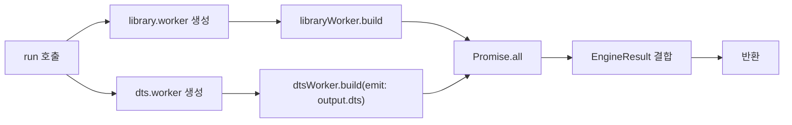
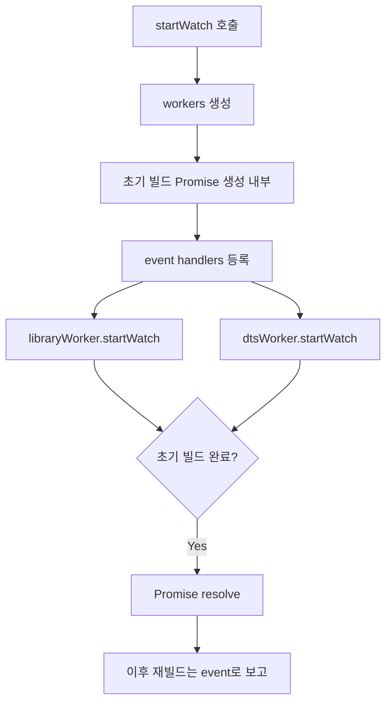

# Feature 1.3 BuildEngine 추상화 레이어

## 참조 자료

- [wbs.md](wbs.md)

### 설계 결정

| # | 결정사항 | 선택 | 근거 |
|---|---------|------|------|
| D1 | Server BuildEngine 적용 시점 | Feature 1.5에서 적용 (1.3은 Library 전용) | Feature 1.5 범위에 "빌드 엔진 인터페이스 적용" 명시. Library(bundle:false)와 Server(bundle:true)의 esbuild 설정 차이로 분리 개발이 안정적 |
| D2 | BuildOrchestrator Library 부분 전환 | Feature 1.3에서 함께 전환 | Library 빌드 경로 통일(watch + production). BuildEngine의 run()과 startWatch() 모두 검증 가능 |

## 요구명세

```gherkin
Feature: 1.3 BuildEngine 추상화 레이어

  Background:
    Given monorepo에 Library 패키지(node/browser/neutral)와 Server 패키지가 있다
    And 각 패키지에 tsconfig.json이 존재한다

  Rule: BuildEngine 인터페이스가 빌드 엔진의 공통 계약을 정의한다

    Scenario: run()으로 production build 실행
      Given BuildEngine 인스턴스가 Library 패키지에 대해 생성되어 있다
      When run(output)을 호출한다
      Then output 플래그에 따라 빌드를 실행한다
      And BuildResult를 반환한다 (success, diagnostics 포함)

    Scenario: startWatch()로 watch mode 시작
      Given BuildEngine 인스턴스가 Library 패키지에 대해 생성되어 있다
      When startWatch(output)을 호출한다
      Then 초기 빌드가 완료되면 Promise가 resolve된다
      And 이후 파일 변경 시 자동으로 재빌드된다

    Scenario: stop()으로 리소스 정리
      Given BuildEngine이 watch mode로 실행 중이다
      When stop()을 호출한다
      Then 내부 Worker 스레드가 종료된다
      And esbuild context가 dispose된다

  Rule: output 플래그에 따라 적절한 출력물을 생성한다

    Scenario: Full build (js + dts)
      Given EsbuildEngine 인스턴스가 Library 패키지에 대해 생성되어 있다
      When run({ js: true, dts: true })를 호출한다
      Then esbuild로 JS 파일을 생성한다
      And tsc로 .d.ts 파일을 생성한다
      And diagnostics를 수집하여 반환한다

    Scenario: JS only build
      Given EsbuildEngine 인스턴스가 Library 패키지에 대해 생성되어 있다
      When run({ js: true, dts: false })를 호출한다
      Then esbuild로 JS 파일을 생성한다
      And .d.ts 파일은 생성하지 않는다
      And diagnostics를 수집하여 반환한다

    Scenario: DTS only build
      Given EsbuildEngine 인스턴스가 Library 패키지에 대해 생성되어 있다
      When run({ js: false, dts: true })를 호출한다
      Then JS 파일은 생성하지 않는다
      And tsc로 .d.ts 파일을 생성한다
      And diagnostics를 수집하여 반환한다

    Scenario: Typecheck only
      Given EsbuildEngine 인스턴스가 Library 패키지에 대해 생성되어 있다
      When run({ js: false, dts: false })를 호출한다
      Then JS 파일도 .d.ts 파일도 생성하지 않는다
      And diagnostics만 수집하여 반환한다

  Rule: typecheck(diagnostics)는 output 옵션과 무관하게 항상 실행된다

    Scenario: JS only build에서도 typecheck 수행
      Given EsbuildEngine 인스턴스가 Library 패키지에 대해 생성되어 있다
      When run({ js: true, dts: false })를 호출한다
      Then tsc 스레드가 noEmit=true로 typecheck를 실행한다
      And 타입 에러가 있으면 diagnostics에 포함된다

    Scenario: watch mode 재빌드 시에도 diagnostics 포함
      Given EsbuildEngine이 watch mode로 실행 중이다
      When 소스 파일이 변경되어 재빌드가 발생한다
      Then 재빌드 결과에 diagnostics가 포함된다

  Rule: 패키지 타입에 따라 적절한 엔진이 선택된다

    Scenario: Library 패키지에 EsbuildEngine 선택
      Given node/browser/neutral 타겟의 비-Angular 패키지가 있다
      When 엔진 선택 로직을 실행한다
      Then EsbuildEngine이 선택된다

    Scenario: Server 패키지는 엔진 선택 대상에서 제외된다
      Given server 타겟 패키지가 있다
      When 엔진 선택 로직을 실행한다
      Then 엔진이 선택되지 않는다
      And 기존 Worker 직접 호출 코드가 유지된다

    Scenario: scripts/client 패키지는 엔진 선택 대상에서 제외된다
      Given scripts 또는 client 타겟 패키지가 있다
      When 엔진 선택 로직을 실행한다
      Then 엔진이 선택되지 않는다

  Rule: 출력물 제어가 BuildEngine 내부에서 tsconfig 옵션으로 통일된다

    Scenario: dts=true 시 declaration 활성화
      Given BuildEngine이 output { dts: true }로 빌드를 실행한다
      When tsc 스레드의 compilerOptions를 확인한다
      Then declaration이 true로 설정되어 있다
      And noEmit은 false이다

    Scenario: dts=false 시 emit 비활성화
      Given BuildEngine이 output { dts: false }로 빌드를 실행한다
      When tsc 스레드의 compilerOptions를 확인한다
      Then noEmit이 true로 설정되어 있다

    Scenario: 호출자가 tsconfig 옵션을 직접 설정하지 않는다
      Given Orchestrator가 BuildEngine을 사용하여 빌드한다
      When Orchestrator가 run() 또는 startWatch()를 호출한다
      Then Orchestrator는 compilerOptions를 직접 조작하지 않는다
      And output { js, dts } 플래그만 전달한다

  Rule: BuildEngine 추상화가 스레딩 모델을 숨긴다

    Scenario: Orchestrator가 내부 스레드 구조를 모른다
      Given Orchestrator가 EsbuildEngine.run()을 호출한다
      When EsbuildEngine이 내부적으로 esbuild 스레드와 tsc 스레드를 병렬 실행한다
      Then Orchestrator는 스레드 수나 동기화 방식을 알지 못한다
      And BuildResult만 수신한다

  Rule: DESIGN-002 해소 — DtsBuilder의 buildResolvers 직접 의존 제거

    Scenario: startWatch()가 초기 빌드 완료를 보장한다
      Given EsbuildEngine.startWatch()를 호출한다
      When 내부적으로 esbuild 스레드와 tsc 스레드의 초기 빌드가 완료된다
      Then startWatch()의 Promise가 resolve된다
      And 외부에서 buildResolvers에 접근하는 코드가 없다

    Scenario: buildResolvers 체이닝 패턴이 제거된다
      Given 기존 DtsBuilder.buildPackage()의 buildResolvers 체이닝 코드가 있었다
      When BuildEngine으로 전환한다
      Then 해당 체이닝 패턴이 코드베이스에서 제거된다

  Rule: 기존 Builder 패턴이 BuildEngine으로 대체된다

    Scenario: Builder 파일 제거
      Given BaseBuilder.ts, LibraryBuilder.ts, DtsBuilder.ts, builders/types.ts가 존재한다
      When Feature 1.3이 완료된다
      Then 해당 파일들이 삭제된다

    Scenario: WatchOrchestrator가 BuildEngine을 사용한다
      Given WatchOrchestrator가 LibraryBuilder+DtsBuilder를 사용 중이었다
      When Feature 1.3으로 전환한다
      Then WatchOrchestrator가 EsbuildEngine.startWatch()를 사용한다
      And LibraryBuilder, DtsBuilder를 import하지 않는다

    Scenario: BuildOrchestrator의 Library 빌드가 BuildEngine을 사용한다
      Given BuildOrchestrator가 Library 패키지에 대해 Worker를 직접 생성하고 호출했다
      When Feature 1.3으로 전환한다
      Then BuildOrchestrator가 EsbuildEngine.run()을 사용한다
      And libraryWorker, dtsWorker를 직접 생성하지 않는다
```

## 구현계획

### 배경

현재 sd-cli의 Library 빌드에 두 가지 패턴이 공존한다:
1. **Builder 패턴** (WatchOrchestrator): `BaseBuilder` 추상 클래스 → `LibraryBuilder` + `DtsBuilder` 구현. DtsBuilder.buildPackage()가 BaseBuilder.buildResolvers를 직접 조작하는 문제(DESIGN-002) 존재
2. **Worker 직접 호출** (BuildOrchestrator): `Worker.create()` → `libraryWorker.build()` + `dtsWorker.build()` 병렬 실행

Feature 1.2에서 패키지별 tsconfig.json이 도입되어, dts.worker가 이미 `emit` 파라미터로 tsconfig 옵션(noEmit, declaration, emitDeclarationOnly)을 제어하고 있다.

### 목표

- BuildEngine 인터페이스로 Library 빌드 추상화 통일
- EsbuildEngine 구현 (library.worker + dts.worker 래핑, 패키지당 1개 엔진)
- 엔진 선택 로직 (Library → EsbuildEngine, Server/Client/scripts → 미적용)
- WatchOrchestrator + BuildOrchestrator(Library 부분) → BuildEngine 전환
- DESIGN-002 해소 (buildResolvers를 엔진 내부로 캡슐화, 외부 접근 제거)
- Builder 패턴(BaseBuilder/LibraryBuilder/DtsBuilder) 파일 제거

### 비목표

- Server BuildEngine 적용 (Feature 1.5)
- Library 엔진 내부 통합 — JS+DTS worker merge (Feature 1.4)
- Angular/Client 엔진 (Features 2.2, 3.1)
- Orchestrator 통합 — 3개→1개 (Feature 1.6)
- library.worker, dts.worker 자체 코드 수정 (Feature 1.4)

### 설계

#### 파일 구조 변경

```
packages/sd-cli/src/
├── engines/                    (NEW)
│   ├── types.ts               (BuildEngine, BuildOutput, BuildResult, PackageInfo 이전)
│   ├── EsbuildEngine.ts       (EsbuildEngine 구현)
│   └── index.ts               (createBuildEngine export)
├── builders/                   (DELETE)
│   ├── BaseBuilder.ts         ← 삭제
│   ├── LibraryBuilder.ts      ← 삭제
│   ├── DtsBuilder.ts          ← 삭제
│   └── types.ts               ← 삭제 (PackageInfo → engines/types.ts)
├── orchestrators/
│   ├── BuildOrchestrator.ts   (수정 — Library 부분 BuildEngine.run() 전환)
│   └── WatchOrchestrator.ts   (수정 — Builder → BuildEngine.startWatch() 전환)
└── (workers/, infra/, utils/ 변경 없음)
```

#### BuildEngine 인터페이스

```typescript
// engines/types.ts

/** 빌드 출력 제어 플래그 */
interface BuildOutput {
  js: boolean;
  dts: boolean;
}

/** BuildEngine.run() 반환값 */
interface EngineResult {
  success: boolean;
  js: { success: boolean; errors: string[]; warnings: string[] };
  dts: { success: boolean; errors: string[]; warnings: string[]; diagnostics: SerializedDiagnostic[] };
}

/** 빌드 엔진 인터페이스 */
interface BuildEngine {
  run(output: BuildOutput): Promise<EngineResult>;
  startWatch(output: BuildOutput): Promise<void>;
  stop(): Promise<void>;
}
```

`EngineResult`는 js/dts 하위 구조를 유지한다 — BuildOrchestrator가 JS/DTS 결과를 구분하여 출력하는 현재 패턴과 호환. Feature 1.4에서 JS+DTS 통합 시 단순화 가능.

`EngineResult`라는 이름을 사용하여 기존 `ResultCollector.BuildResult`(상태 추적용)와 구분한다.

#### EsbuildEngine 구현

```typescript
// engines/EsbuildEngine.ts

class EsbuildEngine implements BuildEngine {
  constructor(options: {
    cwd: string;
    pkg: BuildPackageInfo;
    resultCollector?: ResultCollector;    // watch mode용
    rebuildManager?: RebuildManager;      // watch mode용
  });
}
```

**run() 모드** (production build — BuildOrchestrator용):



1. library.worker + dts.worker 생성 (`Worker.create()`)
2. `output.js=true` → `libraryWorker.build()` 실행
3. `dtsWorker.build({ emit: output.dts })` 실행 (typecheck 항상 포함)
4. `Promise.all`로 병렬 실행
5. 결과를 `EngineResult`로 결합
6. worker 참조 저장 (`stop()`에서 종료)

**startWatch() 모드** (watch build — WatchOrchestrator용):



1. library.worker + dts.worker 생성
2. 초기 빌드 완료 Promise 2개 생성 (library용, dts용) — **엔진 내부에서만 접근, 외부 노출 없음** → DESIGN-002 해소
3. worker event handlers 등록:
   - `buildStart` → `rebuildManager?.registerBuild()` (재빌드 시)
   - `build` → `resultCollector?.add()` + 초기 빌드 resolver 호출
   - `error` → `resultCollector?.add()` + 초기 빌드 resolver 호출
4. `libraryWorker.startWatch()`, `dtsWorker.startWatch()` 시작
5. 두 worker의 초기 빌드 완료까지 `Promise.all` 대기
6. Promise resolve → 호출자에게 반환

**stop():**
- watch mode: `libraryWorker.stopWatch()` → workers terminate
- run mode: workers terminate

#### 엔진 선택 로직

```typescript
// engines/index.ts

function createBuildEngine(
  pkg: BuildPackageInfo,
  options: { cwd: string; resultCollector?: ResultCollector; rebuildManager?: RebuildManager },
): BuildEngine {
  return new EsbuildEngine({ ...options, pkg });
}
```

현재는 모든 Library 패키지에 EsbuildEngine 반환. Feature 2.2에서 Angular 감지 로직 추가.

엔진 선택 대상 결정은 기존 `classifyPackages()` 함수가 담당 — Library(buildPackages) vs Server(serverPackages) 분류는 변경 없음. `createBuildEngine()`은 Library 패키지에 대해서만 호출.

#### Orchestrator 전환

**BuildOrchestrator** — Library 부분만 전환, Server/lint/결과 출력은 변경 없음:

```typescript
// Before (Library 빌드):
const libraryWorker = Worker.create(libraryWorkerPath);
const dtsWorker = Worker.create(dtsWorkerPath);
const [buildResult, dtsResult] = await Promise.all([
  libraryWorker.build({...}),
  dtsWorker.build({...}),
]);
await Promise.all([libraryWorker.terminate(), dtsWorker.terminate()]);

// After:
const engine = createBuildEngine(pkg, { cwd: this._cwd });
try {
  const result = await engine.run({ js: true, dts: true });
  // EngineResult → BuildStepResult 변환하여 기존 출력 로직 유지
} finally {
  await engine.stop();
}
```

**WatchOrchestrator** — Builder → BuildEngine 전환:

```typescript
// Before:
this._libraryBuilder = new LibraryBuilder(builderOptions);
this._dtsBuilder = new DtsBuilder(builderOptions);
await Promise.all([this._libraryBuilder.initialize(), this._dtsBuilder.initialize()]);
void this._libraryBuilder.startWatch();
void this._dtsBuilder.startWatch();
// initialBuildPromises를 수동으로 수집하여 대기

// After:
this._engines = this._packages.map(pkg =>
  createBuildEngine(pkg, { cwd, resultCollector, rebuildManager })
);
await Promise.all(this._engines.map(e => e.startWatch({ js: true, dts: true })));
// startWatch() Promise가 초기 빌드 완료를 직접 보장 — initialBuildPromises 패턴 제거
```

`getInitialBuildPromises()` 패턴 완전 제거 — `startWatch()` 반환이 곧 초기 빌드 완료.

### 대안 검토

| 접근 방식 | 선택 여부 | 이유 |
|-----------|-----------|------|
| ResultCollector/RebuildManager constructor 주입 | 채택 | 현재 BaseBuilder 패턴 유지, watch mode에서 기존 인프라 재사용 |
| EventEmitter 패턴 (engine.on("rebuild", ...)) | 미채택 | 추가 추상화 불필요, constructor 주입으로 충분 |
| 다중 패키지 엔진 (1개 엔진 = N개 패키지) | 미채택 | 패키지별 독립 엔진이 DESIGN-002 해소에 자연스럽고 관리 단순 |
| EngineResult에서 js/dts 구분 제거 | 미채택 | BuildOrchestrator가 js/dts를 구분 출력, Feature 1.4에서 통합 가능 |
| run() 내 workers self-cleanup | 미채택 | stop()으로 일관된 lifecycle (run/watch 모두 stop 호출) |

### Vertical Slices

#### Slice 1: BuildEngine 인터페이스 + EsbuildEngine + 엔진 선택
- [x] `engines/types.ts`: BuildEngine, BuildOutput, EngineResult 인터페이스 정의. PackageInfo, BuildPackageInfo를 `builders/types.ts`에서 이전
- [x] `engines/EsbuildEngine.ts`: run() + startWatch() + stop() 구현. library.worker + dts.worker 래핑
- [x] `engines/index.ts`: createBuildEngine() export
- [x] `tests/engines/esbuild-engine.spec.ts`: run() 4가지 output 조합 테스트, startWatch() 초기 빌드 완료 테스트, stop() 리소스 정리 테스트
- [x] `tests/engines/engine-selection.spec.ts`: Library → EsbuildEngine 반환 테스트
- **구현 내용:** BuildEngine 추상화 레이어 전체. library.worker + dts.worker를 래핑하여 run()/startWatch()/stop() 인터페이스 제공. 패키지당 1개 엔진, 초기 빌드 대기를 내부 Promise로 캡슐화
- **Scenarios:**
  - Scenario: run()으로 production build 실행
  - Scenario: startWatch()로 watch mode 시작
  - Scenario: stop()으로 리소스 정리
  - Scenario: Full build (js + dts)
  - Scenario: JS only build
  - Scenario: DTS only build
  - Scenario: Typecheck only
  - Scenario: JS only build에서도 typecheck 수행
  - Scenario: watch mode 재빌드 시에도 diagnostics 포함
  - Scenario: Library 패키지에 EsbuildEngine 선택
  - Scenario: Server 패키지는 엔진 선택 대상에서 제외된다
  - Scenario: scripts/client 패키지는 엔진 선택 대상에서 제외된다
  - Scenario: dts=true 시 declaration 활성화
  - Scenario: dts=false 시 emit 비활성화
  - Scenario: 호출자가 tsconfig 옵션을 직접 설정하지 않는다
  - Scenario: Orchestrator가 내부 스레드 구조를 모른다
  - Scenario: startWatch()가 초기 빌드 완료를 보장한다
  - Scenario: buildResolvers 체이닝 패턴이 제거된다

#### Slice 2: Orchestrator 전환 + Builder 제거
- [x] `orchestrators/BuildOrchestrator.ts`: Library buildTasks에서 Worker 직접 호출 → `createBuildEngine()` + `engine.run()` 전환. EngineResult → BuildStepResult 변환. Server/lint 부분 변경 없음
- [x] `orchestrators/WatchOrchestrator.ts`: LibraryBuilder+DtsBuilder → `createBuildEngine()` + `engine.startWatch()` 전환. initialBuildPromises/getInitialBuildPromises() 패턴 제거
- [x] `builders/` 디렉토리 삭제 (BaseBuilder.ts, LibraryBuilder.ts, DtsBuilder.ts, types.ts)
- [x] `tests/builders/base-builder.spec.ts` 삭제
- [x] `tests/orchestrators/build-orchestrator.spec.ts` 갱신 (Library 부분 BuildEngine mock 사용)
- [x] `tests/orchestrators/watch-orchestrator.spec.ts` 갱신 (Builder mock → BuildEngine mock)
- **의존:** Slice 1
- **구현 내용:** Builder 패턴의 모든 소비자를 BuildEngine으로 전환하고, Builder 파일 제거. copySrc/replaceDeps 처리는 Orchestrator에 유지
- **Scenarios:**
  - Scenario: Builder 파일 제거
  - Scenario: WatchOrchestrator가 BuildEngine을 사용한다
  - Scenario: BuildOrchestrator의 Library 빌드가 BuildEngine을 사용한다
