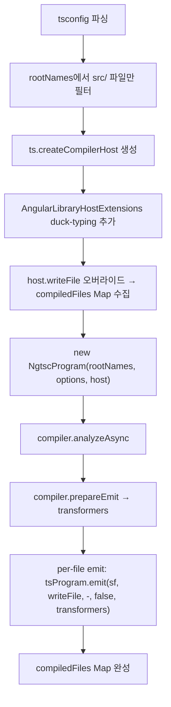

# Feature 2.2 Angular Vitest 플러그인

## 참조 자료

- [wbs.md](wbs.md)

### 설계 결정

| # | 결정사항 | 선택 | 근거 |
|---|---------|------|------|
| D1 | 빌드 API | NgtscProgram | Library 컴파일러로 per-file AOT 컴파일. Feature 2.3(Angular Library 빌드 엔진)과 NgtscProgram/HostExtensions 코드 공유. buildApplicationInternal은 App 빌더(번들링 포함)로 Library 테스트에 과잉 |
| D2 | Vitest 통합 | 자체 Vite 플러그인 구현 | @angular/build private API에 createVitestPlugins/createAngularMemoryPlugin 미포함. 메모리 서빙 로직 자체 구현 필요 |
| D3 | 빌드 대상 | 소스만 NgtscProgram 컴파일, 테스트는 Vite 처리 | 테스트 파일에 Angular 데코레이터 없음. 현재 angularDecoratorPlugin과 동일 범위 |
| D4 | 플러그인 위치 | sd-cli 내부 (`packages/sd-cli/src/vitest-plugin.ts`) | vitest.config.ts에서 상대 경로 import(`./packages/sd-cli/src/vitest-plugin`)로 빌드 의존 회피. angular-build.ts와 동일 패키지. 테스트는 sd-cli/tests/에 배치 |

## 요구명세

```gherkin
Feature: 2.2 Angular Vitest 플러그인

  Background:
    Given vitest.config.ts의 angular 프로젝트에 Angular Vitest 플러그인이 등록되어 있다
    And packages/angular/src에 Angular 데코레이터를 사용하는 소스 파일이 있다

  Rule: Angular 소스를 NgtscProgram으로 AOT 컴파일하여 인메모리에 저장한다

    Scenario: 플러그인 초기화 시 소스 파일 전체를 컴파일한다
      Given packages/angular/src에 @Injectable, @Directive 등 Angular 데코레이터를 사용하는 파일들이 있다
      When Vitest가 시작되어 플러그인이 초기화된다
      Then NgtscProgram이 모든 소스 파일을 분석하고 AOT 컴파일한다
      And 컴파일된 JavaScript가 메모리에 저장된다

    Scenario: @Injectable 데코레이터가 런타임 코드로 변환된다
      Given @Injectable({ providedIn: "root" }) 데코레이터를 가진 서비스가 있다
      When 해당 파일이 컴파일된다
      Then ɵprov 팩토리 함수가 생성된다
      And 원본 데코레이터가 제거된다

    Scenario: @Directive 데코레이터가 런타임 코드로 변환된다
      Given @Directive({ standalone: true }) 데코레이터를 가진 디렉티브가 있다
      When 해당 파일이 컴파일된다
      Then ɵdir 정의가 생성된다

    Scenario: @Component 데코레이터가 AOT 컴파일된다 (향후 확장)
      Given 인라인 템플릿과 스타일을 가진 @Component가 있다
      When 해당 파일이 컴파일된다
      Then 템플릿이 렌더 함수로 변환된다
      And 인라인 SCSS가 CSS로 컴파일된다

  Rule: Vite transform 훅으로 컴파일 결과를 인메모리 서빙한다

    Scenario: Angular 소스 파일 요청 시 컴파일된 결과 반환
      Given NgtscProgram이 소스 파일을 컴파일하여 메모리에 저장했다
      When Vite가 해당 파일에 대한 모듈 요청을 받는다
      Then 메모리의 컴파일된 JavaScript를 반환한다
      And 소스맵이 포함된다

    Scenario: Angular 소스가 아닌 파일은 변환하지 않는다
      Given node_modules 또는 테스트 파일(.spec.ts)이 요청된다
      When Vite가 해당 파일에 대한 모듈 요청을 받는다
      Then 플러그인이 변환하지 않고 Vite 기본 처리에 맡긴다

  Rule: 기존 angularDecoratorPlugin을 대체한다

    Scenario: vitest.config.ts에서 플러그인 교체
      Given vitest.config.ts의 angular 프로젝트에 angularDecoratorPlugin이 등록되어 있다
      When Angular Vitest 플러그인으로 교체한다
      Then esbuild transform 기반 데코레이터 lowering이 제거된다
      And NgtscProgram 기반 AOT 컴파일이 사용된다
      And 기존 테스트가 동일하게 통과한다

  Rule: angular-build.ts 어댑터를 통해서만 Angular API에 접근한다

    Scenario: 플러그인이 어댑터 격리를 준수한다
      Given Angular Vitest 플러그인 소스 코드가 있다
      When @angular/build 또는 @angular/compiler-cli를 직접 import하는 코드를 검색한다
      Then 직접 import가 없다
      And 모든 Angular API 접근이 angular-build.ts를 통한다

  Rule: 기존 Vitest angular 프로젝트 환경과 호환된다

    Scenario: Playwright 브라우저 환경에서 실행된다
      Given angular 프로젝트가 Playwright 브라우저 환경으로 설정되어 있다
      When Angular 테스트를 실행한다
      Then 브라우저 환경에서 테스트가 실행된다

    Scenario: TestBed가 AOT 컴파일된 코드와 동작한다
      Given vitest.setup.ts에 BrowserDynamicTestingModule으로 TestBed가 초기화되어 있다
      And Angular 소스가 AOT 컴파일되어 서빙된다
      When TestBed.configureTestingModule로 서비스/디렉티브를 설정한다
      Then TestBed가 AOT 컴파일된 메타데이터를 인식한다
      And 테스트가 정상 실행된다
```

## 구현계획

### 배경

vitest.config.ts에 `angularDecoratorPlugin`이 임시로 존재한다. Vite 8의 oxc가 TC39 네이티브 데코레이터 lowering을 미지원하여, esbuild의 ES2022 target으로 구문적 lowering하는 방식이다. Angular 데코레이터의 의미론적 AOT 컴파일을 수행하지 않으며, `@Injectable` → `ɵprov`, `@Directive` → `ɵdir` 등의 Angular 런타임 코드 생성은 TestBed의 JIT 컴파일에 의존한다.

Feature 2.1에서 angular-build.ts 어댑터가 완성되어 `NgtscProgram`, `OptimizeFor`, `AngularLibraryHostExtensions`가 re-export되어 있다.

### 목표

- NgtscProgram 기반 AOT 컴파일로 angularDecoratorPlugin 대체
- 빌드 → 인메모리 서빙 → Vitest 실행 구조 구현
- Feature 2.3(Angular Library 빌드 엔진)과 NgtscProgram/Host 설정 코드 공유 기반

### 비목표

- SCSS → CSS 컴파일 (Feature 2.4)
- @Component 완전 지원 — 현재 Angular 소스에 @Component 없음, HostExtensions 기본 골격만 제공
- Watch mode incremental compilation (Vitest의 기본 재실행에 의존)
- Client 빌드 통합 (Feature 3.x)

### 설계

#### 모듈 구조

```
D:\workspaces-14\simplysm\
├── vitest.config.ts                       (수정 — import 변경)
└── packages/sd-cli/
    ├── src/
    │   ├── vitest-plugin.ts               (신규 — Vite 플러그인)
    │   └── utils/
    │       └── angular-build.ts           (기존 — 변경 없음)
    └── tests/
        └── vitest-plugin.spec.ts          (신규 — 테스트)
```

#### 플러그인 API

```typescript
// vitest-angular-plugin.ts
export interface AngularVitestPluginOptions {
  tsconfig: string;  // Angular 패키지의 tsconfig.json 절대 경로
}

export function angularVitestPlugin(options: AngularVitestPluginOptions): Plugin
```

#### 빌드 흐름 (`buildStart` 훅)



1. `ts.readConfigFile` + `ts.parseJsonConfigFileContent`로 Angular tsconfig 파싱
2. rootNames를 `src/` 디렉토리 파일만 필터 (테스트 제외)
3. `ts.createCompilerHost(options)` 생성
4. host에 `AngularLibraryHostExtensions` duck-typing 추가:
   - `readResource`: `ts.sys.readFile`로 파일 읽기
   - `transformResource`: `null` 반환 (SCSS 미지원 — Feature 2.4에서 확장)
5. `host.writeFile` 오버라이드 → `compiledFiles: Map<string, { js: string; map?: string }>` 수집
6. CompilerOptions 오버라이드: `noEmit: false`, `declaration: false`, `sourceMap: true`
7. `new NgtscProgram(rootNames, options, host)`
8. `await program.compiler.analyzeAsync()`
9. `program.compiler.prepareEmit()` → `transformers`
10. 소스 파일별 emit: `tsProgram.emit(sourceFile, writeFile, undefined, false, transformers)`
    - writeFile 콜백에서 `.js` → compiledFiles에 source path 키로 저장
    - `.js.map` → 동일 키의 map 필드에 저장

#### 서빙 흐름 (`transform` 훅)

1. `id`가 `.ts`로 끝나지 않거나 `node_modules`를 포함하면 → `undefined` (통과)
2. `compiledFiles.get(normalizePath(id))` 조회
3. 있으면 `{ code: compiled.js, map: compiled.map }` 반환
4. 없으면 → `undefined` (Vite 기본 처리)

#### vitest.config.ts 변경

```typescript
// Before
import { transform } from "esbuild";
// ...
plugins: [angularDecoratorPlugin()],

// After
import { angularVitestPlugin } from "./packages/sd-cli/src/vitest-plugin";
// ...
plugins: [angularVitestPlugin({ tsconfig: resolve(import.meta.dirname, "packages/angular/tsconfig.json") })],
```

### 대안 검토

| 접근 방식 | 선택 여부 | 이유 |
|-----------|-----------|------|
| NgtscProgram + Vite transform | 채택 | Library에 Library 컴파일러 사용. Feature 2.3과 코드 공유. 어댑터에 이미 export |
| buildApplicationInternal | 미채택 | App 빌더로 Library 테스트에 과잉. 번들링 불필요. ApplicationBuilderOptions 구성 복잡 |
| createAngularCompilation | 미채택 | @angular/build private의 고수준 래퍼이나 esbuild createCompilerPlugin 전용 설계. Vite 환경에 부적합 |
| 루트 레벨 독립 파일 | 미채택 | 루트 디렉토리에 빌드 도구 파일 추가는 관심사 분리 위반. sd-cli 내부 + 상대 경로 import로 동일 효과 |

### Vertical Slices

#### Slice 1: Vite 플러그인 + NgtscProgram AOT 컴파일

- [x] **구현 내용:** `vitest-angular-plugin.ts` 생성. buildStart에서 NgtscProgram 초기화 및 전체 소스 AOT 컴파일 → compiledFiles Map 수집. transform 훅에서 compiledFiles 인메모리 서빙. angular-build.ts 어댑터를 통한 격리 유지.
- **Scenarios:**
  - Scenario: 플러그인 초기화 시 소스 파일 전체를 컴파일한다
  - Scenario: @Injectable 데코레이터가 런타임 코드로 변환된다
  - Scenario: @Directive 데코레이터가 런타임 코드로 변환된다
  - Scenario: @Component 데코레이터가 AOT 컴파일된다 (향후 확장)
  - Scenario: Angular 소스 파일 요청 시 컴파일된 결과 반환
  - Scenario: Angular 소스가 아닌 파일은 변환하지 않는다
  - Scenario: 플러그인이 어댑터 격리를 준수한다

#### Slice 2: vitest.config.ts 통합 및 검증

- [x] **구현 내용:** vitest.config.ts에서 angularDecoratorPlugin → angularVitestPlugin 교체. esbuild import 제거. 기존 Angular 테스트 전체 통과 확인.
- **의존:** Slice 1
- **Scenarios:**
  - Scenario: vitest.config.ts에서 플러그인 교체
  - Scenario: Playwright 브라우저 환경에서 실행된다
  - Scenario: TestBed가 AOT 컴파일된 코드와 동작한다
