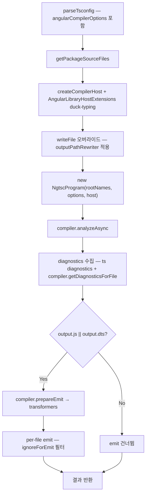

# Feature 2.3 Angular Library 빌드 엔진

## 참조 자료

- [wbs.md](wbs.md)

### 설계 결정

| # | 결정사항 | 선택 | 근거 |
|---|---------|------|------|
| D1 | Angular 패키지 식별 방법 | tsconfig.json `angularCompilerOptions` 자동 감지 | v12 동일 패턴, 설정 중복 없음, `angularCompilerOptions`가 "AOT 컴파일 필요"의 유일한 정확한 신호. package.json dependencies는 false positive 가능 |
| D2 | 인라인 SCSS 기본 컴파일 시점 | Feature 2.4로 이관 | 현재 @Component 없어 실사용 안 됨, sass 의존성 불필요, SCSS 로직을 2.4에 집중. transformResource는 null 반환 |

## 요구명세

```gherkin
Feature: 2.3 Angular Library 빌드 엔진

  Background:
    Given packages/angular에 angularCompilerOptions가 포함된 tsconfig.json이 있다
    And angular-build.ts 어댑터를 통해 NgtscProgram이 사용 가능하다

  Rule: NgtscProgram으로 Angular 소스를 AOT 컴파일한다

    Scenario: @Injectable 데코레이터가 런타임 코드로 변환된다
      Given @Injectable({ providedIn: "root" }) 데코레이터를 가진 서비스가 있다
      When NgtscEngine.run({js: true, dts: false})을 실행한다
      Then ɵprov 팩토리 함수가 생성된 JS가 dist/에 출력된다
      And 원본 데코레이터가 제거된다

    Scenario: @Directive 데코레이터가 런타임 코드로 변환된다
      Given @Directive({ standalone: true }) 데코레이터를 가진 디렉티브가 있다
      When NgtscEngine.run({js: true, dts: false})을 실행한다
      Then ɵdir 정의가 생성된 JS가 dist/에 출력된다

    Scenario: .d.ts 파일이 Angular 메타데이터를 포함하여 출력된다
      Given Angular 데코레이터를 가진 소스 파일이 있다
      When NgtscEngine.run({js: true, dts: true})을 실행한다
      Then .d.ts 파일에 Angular 타입 메타데이터가 포함된다

  Rule: BuildEngine 인터페이스를 구현한다

    Scenario: run()으로 one-time 빌드를 수행한다
      Given Angular Library 패키지가 있다
      When NgtscEngine.run({js: true, dts: true})을 실행한다
      Then JS 파일이 dist/에 출력된다
      And .d.ts 파일이 dist/에 출력된다
      And EngineResult에 js.success, dts.success, dts.diagnostics가 포함된다

    Scenario: run()에서 dts: false면 .d.ts를 생략한다
      Given Angular Library 패키지가 있다
      When NgtscEngine.run({js: true, dts: false})을 실행한다
      Then JS 파일만 dist/에 출력된다
      And .d.ts 파일은 출력되지 않는다

    Scenario: startWatch()로 watch mode를 시작한다
      Given Angular Library 패키지가 있다
      When NgtscEngine.startWatch({js: true, dts: true})을 실행한다
      Then 초기 빌드가 완료된다
      And 파일 변경 시 incremental 재빌드가 수행된다
      And ResultCollector에 재빌드 결과가 보고된다

    Scenario: stop()으로 리소스를 정리한다
      Given NgtscEngine이 실행 중이다
      When stop()을 호출한다
      Then Worker가 종료된다
      And 모든 리소스가 정리된다

  Rule: Angular diagnostics를 항상 수집한다

    Scenario: TypeScript + Angular diagnostics를 통합 수집한다
      Given Angular strict template 옵션이 활성화된 패키지가 있다
      When 빌드를 실행한다
      Then ts.Program의 syntactic/semantic diagnostics가 수집된다
      And NgtscProgram compiler의 Angular-specific diagnostics가 수집된다
      And EngineResult.dts.diagnostics에 모두 포함된다

    Scenario: 타입 에러가 있어도 빌드 결과를 반환한다
      Given 타입 에러가 있는 Angular 소스가 있다
      When 빌드를 실행한다
      Then EngineResult.dts.success가 false이다
      And diagnostics에 에러 정보가 포함된다

  Rule: createBuildEngine 팩토리가 Angular 패키지를 tsconfig으로 자동 감지한다

    Scenario: angularCompilerOptions가 있으면 NgtscEngine을 선택한다
      Given tsconfig.json에 angularCompilerOptions 섹션이 있는 패키지가 있다
      When createBuildEngine()을 호출한다
      Then NgtscEngine 인스턴스가 반환된다

    Scenario: angularCompilerOptions가 없으면 기존 EsbuildEngine을 사용한다
      Given tsconfig.json에 angularCompilerOptions가 없는 browser 패키지가 있다
      When createBuildEngine()을 호출한다
      Then EsbuildEngine 인스턴스가 반환된다

  Rule: angular-build.ts 어댑터를 통해서만 Angular API에 접근한다

    Scenario: NgtscEngine이 어댑터 격리를 준수한다
      Given NgtscEngine 소스 코드가 있다
      When @angular/build 또는 @angular/compiler-cli를 직접 import하는 코드를 검색한다
      Then 직접 import가 없다
      And 모든 Angular API 접근이 angular-build.ts를 통한다
```

## 구현계획

### 배경

BuildEngine 추상화(Feature 1.3)로 통일된 빌드 엔진 인터페이스가 정의되어 있고, EsbuildEngine(Feature 1.4)과 ServerEsbuildEngine(Feature 1.5)이 구현되어 있다. Angular Library는 현재 EsbuildEngine(`target: "browser"`)으로 빌드되지만, esbuild는 Angular 데코레이터의 의미론적 AOT 컴파일을 수행하지 않는다. Feature 2.1에서 angular-build.ts 어댑터가 NgtscProgram API를 격리했고, Feature 2.2에서 vitest-plugin이 NgtscProgram AOT 컴파일 패턴을 검증했다.

### 목표

- NgtscProgram 기반 AOT 컴파일을 수행하는 NgtscEngine 구현
- BuildEngine 인터페이스(run, startWatch, stop) 완전 구현
- createBuildEngine 팩토리에서 Angular 패키지 자동 감지 및 라우팅

### 비목표

- SCSS 컴파일 (Feature 2.4 — transformResource는 null 반환)
- Client 빌드 (Feature 3.x)
- 전역 스타일(scss/styles.scss) 처리

### 설계

#### 모듈 구조

```
packages/sd-cli/src/
├── engines/
│   ├── types.ts                     (기존 — 변경 없음)
│   ├── EsbuildEngine.ts             (기존 — 변경 없음)
│   ├── ServerEsbuildEngine.ts       (기존 — 변경 없음)
│   ├── NgtscEngine.ts              (신규 — BuildEngine 구현)
│   └── index.ts                     (수정 — NgtscEngine 추가, Angular 감지)
├── workers/
│   └── ngtsc-build.worker.ts       (신규 — NgtscProgram 빌드 워커)
└── utils/
    ├── angular-build.ts             (기존 — 변경 없음)
    ├── output-path-rewriter.ts     (신규 — JS/DTS 출력 경로 재작성 일반화)
    └── tsconfig.ts                  (수정 — hasAngularCompilerOptions 추가)
```

#### NgtscEngine ↔ Worker 통신

EsbuildEngine ↔ library-build.worker와 동일한 패턴:

- NgtscEngine: Worker 프록시를 생성하고 build/startWatch/stopWatch 메서드 호출
- ngtsc-build.worker: NgtscProgram 라이프사이클 관리, 빌드 결과 반환(run) 또는 이벤트 발송(watch)

#### Worker 빌드 흐름 (run)



#### CompilerOptions 결정

| BuildOutput | noEmit | declaration | declarationMap | emitDeclarationOnly |
|---|---|---|---|---|
| js:true, dts:true | false | true | true | false |
| js:true, dts:false | false | false | false | false |
| js:false, dts:true | false | true | true | true |
| js:false, dts:false | true | false | false | false |

공통: `sourceMap: false` (Library 빌드에서 JS source map 불필요)

#### 출력 경로 재작성

기존 `dts-path-rewriter.ts`의 로직을 `output-path-rewriter.ts`로 일반화:

- NgtscProgram의 tsc emit은 rootDir 계산(크로스 패키지 참조)으로 인해 중첩 구조(`dist/{pkgName}/src/...`)를 생성
- .js, .d.ts, .d.ts.map 모두 `dist/...`로 평탄화
- 다른 패키지의 출력은 무시(null 반환)
- 기존 dts-path-rewriter의 `.d.ts.map` sources 경로 조정 로직 포함

#### Angular 패키지 감지

`tsconfig.ts`에 `hasAngularCompilerOptions(pkgDir)` 추가. `ts.readConfigFile`로 raw JSON 읽어 `angularCompilerOptions != null` 체크.

#### Watch mode

- FsWatcher로 `src/**/*.ts` 감시
- 파일 변경 시: sourceFile 캐시 무효화, `new NgtscProgram(rootNames, options, host, oldProgram)` — 4번째 인자로 이전 프로그램 전달하여 incremental compilation
- `compiler.incrementalCompilation.safeToSkipEmit(sf)` / `recordSuccessfulEmit(sf)` 활용
- `getModifiedResourceFiles()` 반환하여 Angular 리소스 무효화

### 대안 검토

| 접근 방식 | 선택 여부 | 이유 |
|-----------|-----------|------|
| Worker 1개 + NgtscProgram 단일 실행 | 채택 | NgtscProgram이 emit + typecheck를 단일 프로세스에서 수행, esbuild ‖ tsc 병렬 불필요 |
| buildApplicationInternal | 미채택 | App 빌더(번들링 포함), Library의 per-file unbundled 출력에 부적합 |
| EsbuildEngine에 Angular 변환 추가 | 미채택 | esbuild는 Angular 데코레이터의 의미론적 변환 불가, NgtscProgram 필수 |
| rootDir 명시 설정으로 경로 재작성 회피 | 미채택 | 외부 패키지 참조 시 "File not under rootDir" 에러 발생 가능 |

### Vertical Slices

#### Slice 1: ngtsc-build.worker + NgtscEngine.run()

- [x] **구현 내용:** NgtscProgram AOT 컴파일을 수행하는 `ngtsc-build.worker.ts` 생성. `NgtscEngine` 클래스가 BuildEngine.run() + stop() 구현. `output-path-rewriter.ts`로 출력 경로 재작성. `tsconfig.ts`에 `hasAngularCompilerOptions` 추가.
- **Scenarios:**
  - Scenario: @Injectable 데코레이터가 런타임 코드로 변환된다
  - Scenario: @Directive 데코레이터가 런타임 코드로 변환된다
  - Scenario: .d.ts 파일이 Angular 메타데이터를 포함하여 출력된다
  - Scenario: run()으로 one-time 빌드를 수행한다
  - Scenario: run()에서 dts: false면 .d.ts를 생략한다
  - Scenario: TypeScript + Angular diagnostics를 통합 수집한다
  - Scenario: 타입 에러가 있어도 빌드 결과를 반환한다
  - Scenario: stop()으로 리소스를 정리한다

#### Slice 2: createBuildEngine 팩토리 통합

- [x] **구현 내용:** `createBuildEngine`에서 `hasAngularCompilerOptions` 감지 → NgtscEngine 반환. `engines/index.ts`에 NgtscEngine export 추가. 어댑터 격리 검증.
- **의존:** Slice 1
- **Scenarios:**
  - Scenario: angularCompilerOptions가 있으면 NgtscEngine을 선택한다
  - Scenario: angularCompilerOptions가 없으면 기존 EsbuildEngine을 사용한다
  - Scenario: NgtscEngine이 어댑터 격리를 준수한다

#### Slice 3: Watch mode (startWatch)

- [x] **구현 내용:** Worker에 startWatch/stopWatch 추가. FsWatcher로 파일 변경 감지. NgtscProgram incremental compilation (oldProgram 전달, safeToSkipEmit/recordSuccessfulEmit 활용). NgtscEngine.startWatch() + ResultCollector 이벤트 보고.
- **의존:** Slice 1
- **Scenarios:**
  - Scenario: startWatch()로 watch mode를 시작한다
